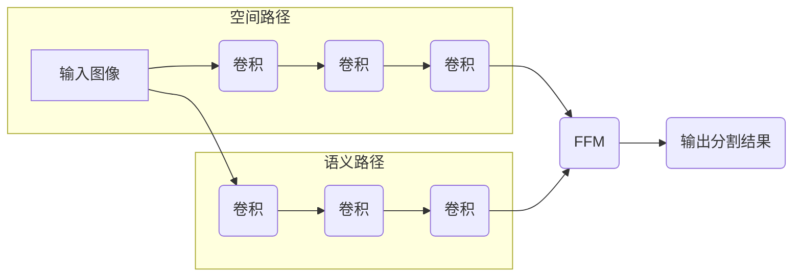

## 1. 背景介绍

### 1.1 语义分割的挑战

语义分割是计算机视觉领域的一项重要任务，其目标是将图像中的每个像素分配到其对应的语义类别。近年来，随着深度学习技术的快速发展，语义分割取得了显著的进展。然而，现有的语义分割方法在速度和精度之间往往存在权衡。一些方法追求高精度，但计算量大，速度慢；另一些方法则注重速度，但精度较低。

### 1.2 BiSeNet的提出

为了解决语义分割中的速度与精度权衡问题，BiSeNet（Bilateral Segmentation Network）被提出。BiSeNet是一种双边分割网络，它包含两个分支：空间路径和语义路径。空间路径旨在捕捉图像的空间细节信息，而语义路径则专注于提取高级语义特征。通过结合这两个分支的输出，BiSeNet能够在保持高精度的同时实现快速推理。

## 2. 核心概念与联系

### 2.1 空间路径

空间路径采用轻量级网络结构，例如 ResNet-18 或 MobileNetV2，以快速提取图像的空间细节信息。为了进一步提高效率，空间路径使用了快速下采样策略，例如步长为 2 的卷积操作，以减少特征图的尺寸。

### 2.2 语义路径

语义路径采用更深层的网络结构，例如 ResNet-101，以提取高级语义特征。为了保留更多的上下文信息，语义路径使用了较小的下采样率，例如步长为 1 的卷积操作，以保持特征图的尺寸。

### 2.3 特征融合模块

为了有效地融合空间路径和语义路径的输出，BiSeNet引入了特征融合模块（Feature Fusion Module，FFM）。FFM使用注意力机制来选择性地融合来自两个路径的特征。具体而言，FFM首先将空间路径和语义路径的特征图连接起来，然后使用全局平均池化操作来生成注意力权重。最后，FFM使用注意力权重对连接后的特征图进行加权求和，得到最终的分割结果。

## 3. 核心算法原理具体操作步骤

### 3.1 网络结构

BiSeNet的网络结构如图 1 所示。



**图 1：BiSeNet网络结构**

### 3.2 训练过程

BiSeNet的训练过程如下：

1. **数据预处理：** 将输入图像调整为固定尺寸，并进行归一化处理。
2. **前向传播：** 将预处理后的图像输入到 BiSeNet 网络中，得到空间路径和语义路径的输出。
3. **特征融合：** 使用 FFM 将空间路径和语义路径的输出融合起来，得到最终的分割结果。
4. **损失计算：** 使用交叉熵损失函数计算预测结果与真实标签之间的差异。
5. **反向传播：** 根据损失函数计算梯度，并使用优化器更新网络参数。

## 4. 数学模型和公式详细讲解举例说明

### 4.1 交叉熵损失函数

交叉熵损失函数用于衡量预测结果与真实标签之间的差异。对于二分类问题，交叉熵损失函数定义如下：

$$
L = -\sum_{i=1}^{N} y_i \log(p_i) + (1-y_i) \log(1-p_i)
$$

其中，$N$ 表示样本数量，$y_i$ 表示第 $i$ 个样本的真实标签，$p_i$ 表示第 $i$ 个样本的预测概率。

### 4.2 注意力机制

FFM 使用注意力机制来选择性地融合来自空间路径和语义路径的特征。注意力权重 $w_i$ 的计算公式如下：

$$
w_i = \frac{\exp(f_i)}{\sum_{j=1}^{C} \exp(f_j)}
$$

其中，$C$ 表示通道数，$f_i$ 表示第 $i$ 个通道的全局平均池化值。

## 5. 项目实践：代码实例和详细解释说明

### 5.1 代码实例

```python
import torch
import torch.nn as nn
import torch.nn.functional as F

class BiSeNet(nn.Module):
    def __init__(self, num_classes):
        super(BiSeNet, self).__init__()

        # 空间路径
        self.spatial_path = nn.Sequential(
            nn.Conv2d(3, 64, kernel_size=3, stride=2, padding=1),
            nn.BatchNorm2d(64),
            nn.ReLU(inplace=True),
            nn.Conv2d(64, 128, kernel_size=3, stride=2, padding=1),
            nn.BatchNorm2d(128),
            nn.ReLU(inplace=True),
            nn.Conv2d(128, 256, kernel_size=3, stride=2, padding=1),
            nn.BatchNorm2d(256),
            nn.ReLU(inplace=True)
        )

        # 语义路径
        self.semantic_path = nn.Sequential(
            nn.Conv2d(3, 64, kernel_size=3, stride=1, padding=1),
            nn.BatchNorm2d(64),
            nn.ReLU(inplace=True),
            nn.Conv2d(64, 128, kernel_size=3, stride=1, padding=1),
            nn.BatchNorm2d(128),
            nn.ReLU(inplace=True),
            nn.Conv2d(128, 256, kernel_size=3, stride=1, padding=1),
            nn.BatchNorm2d(256),
            nn.ReLU(inplace=True)
        )

        # 特征融合模块
        self.ffm = FeatureFusionModule(256, 256)

        # 输出层
        self.output_layer = nn.Conv2d(256, num_classes, kernel_size=1)

    def forward(self, x):
        # 空间路径
        spatial_output = self.spatial_path(x)

        # 语义路径
        semantic_output = self.semantic_path(x)

        # 特征融合
        fused_features = self.ffm(spatial_output, semantic_output)

        # 输出
        output = self.output_layer(fused_features)

        return output

class FeatureFusionModule(nn.Module):
    def __init__(self, in_channels_1, in_channels_2):
        super(FeatureFusionModule, self).__init__()

        # 全局平均池化
        self.global_avg_pool = nn.AdaptiveAvgPool2d((1, 1))

        # 注意力机制
        self.attention = nn.Sequential(
            nn.Conv2d(in_channels_1 + in_channels_2, in_channels_1 + in_channels_2, kernel_size=1),
            nn.BatchNorm2d(in_channels_1 + in_channels_2),
            nn.ReLU(inplace=True),
            nn.Conv2d(in_channels_1 + in_channels_2, 1, kernel_size=1),
            nn.Sigmoid()
        )

    def forward(self, x1, x2):
        # 连接特征图
        x = torch.cat([x1, x2], dim=1)

        # 全局平均池化
        x_gap = self.global_avg_pool(x)

        # 注意力权重
        attention_weights = self.attention(x_gap)

        # 加权求和
        fused_features = x1 * attention_weights + x2 * (1 - attention_weights)

        return fused_features
```

### 5.2 代码解释

* `BiSeNet` 类定义了 BiSeNet 网络的结构，包括空间路径、语义路径、特征融合模块和输出层。
* `FeatureFusionModule` 类定义了特征融合模块的结构，包括全局平均池化和注意力机制。
* `forward` 方法定义了网络的前向传播过程，包括空间路径、语义路径、特征融合和输出。

## 6. 实际应用场景

### 6.1 自动驾驶

BiSeNet 可以用于自动驾驶中的道路分割、车道线检测等任务。其快速推理速度使其能够满足自动驾驶系统的实时性要求。

### 6.2 医学图像分析

BiSeNet 可以用于医学图像分析中的器官分割、病灶检测等任务。其高精度使其能够提供可靠的医学诊断结果。

### 6.3 机器人视觉

BiSeNet 可以用于机器人视觉中的物体识别、场景理解等任务。其轻量级网络结构使其能够在资源受限的机器人平台上运行。

## 7. 工具和资源推荐

### 7.1 PyTorch

PyTorch 是一种流行的深度学习框架，提供了丰富的工具和资源，用于构建和训练 BiSeNet 网络。

### 7.2 Cityscapes 数据集

Cityscapes 数据集是一个大型的城市景观图像数据集，包含 5000 张精细标注的图像，适用于语义分割任务。

### 7.3 BiSeNet 论文

BiSeNet 论文详细介绍了 BiSeNet 网络的结构、原理和实验结果。

## 8. 总结：未来发展趋势与挑战

### 8.1 未来发展趋势

* **实时语义分割：** 随着自动驾驶、机器人视觉等应用的快速发展，对实时语义分割的需求越来越高。未来，研究人员将继续探索更高效、更快速的语义分割方法。
* **轻量级网络结构：** 为了在资源受限的设备上运行语义分割模型，轻量级网络结构的设计将变得越来越重要。
* **多任务学习：** 将语义分割与其他计算机视觉任务（例如目标检测、实例分割）相结合，可以提高模型的效率和性能。

### 8.2 挑战

* **精度与速度的权衡：** 如何在保持高精度的同时实现快速推理仍然是一个挑战。
* **数据标注：** 语义分割需要大量的标注数据，数据标注成本高昂。
* **模型泛化能力：** 如何提高语义分割模型的泛化能力，使其能够适应不同的场景和数据集，也是一个挑战。

## 9. 附录：常见问题与解答

### 9.1 BiSeNet 与其他语义分割方法相比有哪些优势？

BiSeNet 的主要优势在于其能够在保持高精度的同时实现快速推理。与其他语义分割方法相比，BiSeNet 具有以下优点：

* **速度更快：** BiSeNet 使用轻量级网络结构和快速下采样策略，使其推理速度更快。
* **精度更高：** BiSeNet 使用特征融合模块来有效地融合空间路径和语义路径的输出，使其分割精度更高。
* **易于实现：** BiSeNet 的网络结构相对简单，易于实现和训练。

### 9.2 如何选择 BiSeNet 的空间路径和语义路径？

选择 BiSeNet 的空间路径和语义路径需要考虑以下因素：

* **速度要求：** 如果速度要求较高，可以选择更轻量级的网络结构，例如 ResNet-18 或 MobileNetV2。
* **精度要求：** 如果精度要求较高，可以选择更深层的网络结构，例如 ResNet-101。
* **数据集特点：** 不同的数据集可能需要不同的网络结构。

### 9.3 如何提高 BiSeNet 的性能？

可以尝试以下方法来提高 BiSeNet 的性能：

* **使用更深层的网络结构：** 使用更深层的网络结构可以提取更高级的语义特征，提高分割精度。
* **使用更大的输入图像尺寸：** 使用更大的输入图像尺寸可以提供更多的上下文信息，提高分割精度。
* **使用数据增强技术：** 使用数据增强技术可以增加训练数据的多样性，提高模型的泛化能力。
* **调整超参数：** 调整学习率、批大小等超参数可以影响模型的训练效果。
