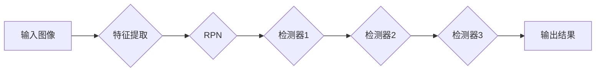

## 1. 背景介绍

### 1.1 目标检测的挑战

目标检测是计算机视觉领域中一个基础且重要的任务，其目标是在图像或视频中识别并定位目标物体。近年来，深度学习的兴起极大地推动了目标检测技术的发展，涌现出许多性能优异的算法，例如 Faster R-CNN、YOLO 和 SSD 等。然而，目标检测仍然面临着一些挑战：

* **尺度变化:** 目标物体在图像中可能呈现出不同的尺寸，这对于检测算法来说是一个挑战，因为需要设计能够适应不同尺度的特征提取器。
* **遮挡:** 目标物体可能被其他物体部分或完全遮挡，这会导致检测算法难以准确识别和定位目标。
* **类别不平衡:** 现实世界中的目标类别分布往往是不平衡的，某些类别出现的频率远高于其他类别，这会导致检测算法对少数类别的识别能力较弱。

### 1.2 Cascade R-CNN的提出

为了解决上述挑战，Cascade R-CNN 算法被提出。Cascade R-CNN 是一种多阶段目标检测算法，它通过级联多个检测器来逐步提高检测精度。每个检测器都使用前一个检测器的输出作为输入，并进一步优化预测结果。这种级联结构可以有效地解决尺度变化、遮挡和类别不平衡等问题。

## 2. 核心概念与联系

### 2.1 级联回归

Cascade R-CNN 的核心思想是级联回归。级联回归是指将多个回归器串联起来，每个回归器都对前一个回归器的输出进行修正，从而逐步提高预测精度。在 Cascade R-CNN 中，每个检测器都是一个回归器，它们级联起来形成一个多阶段的目标检测器。

### 2.2 重采样

为了解决类别不平衡问题，Cascade R-CNN 引入了重采样机制。在训练过程中，每个检测器都会根据前一个检测器的输出对训练样本进行重采样，使得每个检测器都能接收到高质量的训练样本。

### 2.3 IoU阈值

Cascade R-CNN 中的每个检测器都使用不同的 IoU 阈值来筛选候选框。IoU 阈值是指预测框与真实框之间的交并比，它用于衡量预测框的质量。通过使用不同的 IoU 阈值，Cascade R-CNN 可以逐步提高检测器的精度。

## 3. 核心算法原理具体操作步骤

### 3.1 整体框架

Cascade R-CNN 的整体框架如下图所示：



### 3.2 具体步骤

1. **特征提取:** Cascade R-CNN 首先使用一个特征提取器 (例如 ResNet 或 VGG) 从输入图像中提取特征。
2. **区域建议网络 (RPN):** RPN 用于生成候选目标区域。
3. **级联检测器:** Cascade R-CNN 使用多个检测器，每个检测器都使用前一个检测器的输出作为输入。
4. **边界框回归和分类:** 每个检测器都包含一个边界框回归器和一个分类器，用于预测目标的边界框和类别。
5. **重采样:** 在训练过程中，每个检测器都会根据前一个检测器的输出对训练样本进行重采样。

## 4. 数学模型和公式详细讲解举例说明

### 4.1 边界框回归

边界框回归是指预测目标边界框的过程。Cascade R-CNN 中的边界框回归器使用以下公式：

$$
\begin{aligned}
t_x &= (x - x_a) / w_a \\
t_y &= (y - y_a) / h_a \\
t_w &= \log(w / w_a) \\
t_h &= \log(h / h_a)
\end{aligned}
$$

其中：

* $x$, $y$, $w$, $h$ 分别表示预测框的中心坐标、宽度和高度。
* $x_a$, $y_a$, $w_a$, $h_a$ 分别表示锚框的中心坐标、宽度和高度。

### 4.2 分类

分类是指预测目标类别的过程。Cascade R-CNN 中的分类器使用 softmax 函数来计算每个类别的概率。

### 4.3 重采样

重采样是指根据前一个检测器的输出对训练样本进行重新采样的过程。Cascade R-CNN 中的重采样机制使用以下公式：

$$
p_i = \frac{IoU(b_i, b^*)}{\sum_{j=1}^N IoU(b_j, b^*)}
$$

其中：

* $p_i$ 表示第 $i$ 个候选框被选中的概率。
* $b_i$ 表示第 $i$ 个候选框。
* $b^*$ 表示真实框。
* $N$ 表示候选框的数量。

## 5. 项目实践：代码实例和详细解释说明

### 5.1 代码实例

```python
import tensorflow as tf

# 定义 Cascade R-CNN 模型
class CascadeRCNN(tf.keras.Model):
    def __init__(self, num_classes, num_stages=3):
        super(CascadeRCNN, self).__init__()
        self.num_classes = num_classes
        self.num_stages = num_stages

        # 定义特征提取器
        self.feature_extractor = tf.keras.applications.ResNet50(
            include_top=False, weights='imagenet'
        )

        # 定义 RPN
        self.rpn = RegionProposalNetwork()

        # 定义级联检测器
        self.detectors = []
        for i in range(num_stages):
            self.detectors.append(Detector(num_classes))

    def call(self, inputs):
        # 特征提取
        features = self.feature_extractor(inputs)

        # RPN
        rois = self.rpn(features)

        # 级联检测
        for i in range(self.num_stages):
            # 边界框回归和分类
            bbox_reg, cls_scores = self.detectors[i](features, rois)

            # 重采样
            if i < self.num_stages - 1:
                rois = self._resample(rois, bbox_reg, cls_scores)

        # 返回最终结果
        return bbox_reg, cls_scores

    def _resample(self, rois, bbox_reg, cls_scores):
        # 计算 IoU
        ious = calculate_iou(rois, bbox_reg)

        # 计算重采样概率
        probs = tf.math.softmax(ious)

        # 采样新的 ROI
        new_rois = tf.random.categorical(probs, num_samples=rois.shape[0])

        return new_rois

# 定义 RPN
class RegionProposalNetwork(tf.keras.layers.Layer):
    # ...

# 定义检测器
class Detector(tf.keras.layers.Layer):
    # ...
```

### 5.2 代码解释

* `CascadeRCNN` 类定义了 Cascade R-CNN 模型。
* `__init__` 方法初始化模型参数，包括类别数量、级联阶段数、特征提取器、RPN 和级联检测器。
* `call` 方法定义了模型的前向传播过程，包括特征提取、RPN、级联检测、边界框回归和分类，以及重采样。
* `_resample` 方法定义了重采样机制。
* `RegionProposalNetwork` 类定义了 RPN。
* `Detector` 类定义了检测器。

## 6. 实际应用场景

### 6.1 自动驾驶

Cascade R-CNN 可以用于自动驾驶系统中的目标检测，例如识别车辆、行人、交通信号灯等。

### 6.2 视频监控

Cascade R-CNN 可以用于视频监控系统中的目标检测，例如识别可疑人员、车辆等。

### 6.3 医学影像分析

Cascade R-CNN 可以用于医学影像分析中的目标检测，例如识别肿瘤、病变等。

## 7. 工具和资源推荐

### 7.1 TensorFlow

TensorFlow 是一个开源机器学习平台，它提供了丰富的工具和资源用于实现 Cascade R-CNN。

### 7.2 PyTorch

PyTorch 是另一个开源机器学习平台，它也提供了丰富的工具和资源用于实现 Cascade R-CNN。

### 7.3 Detectron2

Detectron2 是 Facebook AI Research 推出的一个目标检测平台，它提供了 Cascade R-CNN 的实现。

## 8. 总结：未来发展趋势与挑战

### 8.1 未来发展趋势

* **更精确的检测:** 研究人员正在努力开发更精确的目标检测算法，以提高检测精度和鲁棒性。
* **更快的检测:** 研究人员也在努力开发更快的目标检测算法，以满足实时应用的需求。
* **更广泛的应用:** 目标检测技术正在被应用于越来越多的领域，例如自动驾驶、视频监控、医学影像分析等。

### 8.2 挑战

* **数据:** 目标检测算法需要大量的训练数据，而获取高质量的标注数据仍然是一个挑战。
* **计算资源:** 训练和运行目标检测算法需要大量的计算资源，这对于一些资源受限的应用来说是一个挑战。

## 9. 附录：常见问题与解答

### 9.1 Cascade R-CNN 与 Faster R-CNN 的区别是什么？

Cascade R-CNN 是 Faster R-CNN 的改进版本，它通过级联多个检测器来逐步提高检测精度。

### 9.2 如何选择 Cascade R-CNN 中的级联阶段数？

级联阶段数是一个超参数，需要根据具体应用进行调整。通常情况下，3 个级联阶段可以获得较好的性能。

### 9.3 Cascade R-CNN 的训练时间长吗？

Cascade R-CNN 的训练时间比 Faster R-CNN 长，因为它需要训练多个检测器。
