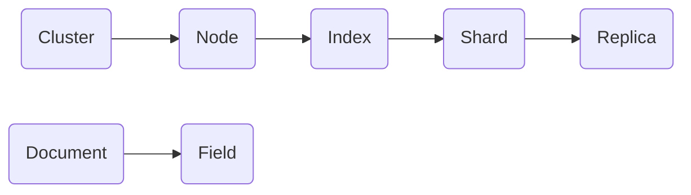

## 1. 背景介绍

### 1.1  搜索引擎的演变与挑战

随着互联网的飞速发展，信息量呈爆炸式增长，如何快速、准确地从海量数据中找到所需信息成为了一项巨大的挑战。传统的数据库搜索方式在面对海量数据时显得力不从心，搜索引擎应运而生。从早期的基于关键词匹配的搜索引擎，到如今融合了自然语言处理、机器学习等技术的智能搜索引擎，搜索技术经历了翻天覆地的变化。

### 1.2 Elasticsearch 的诞生背景

Elasticsearch 正是在这样的背景下诞生的，它是一款开源的分布式搜索和分析引擎，旨在解决海量数据的高效存储、检索和分析问题。Elasticsearch 基于 Lucene 库开发，并在此基础上提供了更加易用、可扩展和高可用的特性。

### 1.3 Elasticsearch 的应用领域

Elasticsearch 凭借其强大的功能和易用性，被广泛应用于各个领域，包括：

* **电商网站:** 商品搜索、推荐系统
* **日志分析:** 实时日志收集、分析和可视化
* **安全监控:**  入侵检测、威胁情报分析
* **商业智能:** 数据分析、报表生成
* **地理空间搜索:** 地图搜索、位置服务

## 2. 核心概念与联系

### 2.1 Elasticsearch 的核心概念

要理解 Elasticsearch 的工作原理，首先需要了解以下几个核心概念：

* **节点（Node）:** Elasticsearch 集群中的一个独立运行的实例。
* **集群（Cluster）:** 由多个节点组成的 Elasticsearch 集群，共同存储和处理数据。
* **索引（Index）:** 类似于关系型数据库中的数据库，用于存储和管理相关联的文档集合。
* **类型（Type）:** 在 Elasticsearch 7.x 版本之前，索引下可以包含多个类型，用于区分不同类型的文档。从 7.x 版本开始，Elasticsearch 不再支持类型，所有文档默认存储在 `_doc` 类型下。
* **文档（Document）:** Elasticsearch 中存储数据的基本单元，类似于关系型数据库中的一行数据。文档以 JSON 格式表示，包含多个字段。
* **字段（Field）:** 文档中的一个属性，类似于关系型数据库中的列。字段可以是多种数据类型，例如文本、数字、日期等。
* **分片（Shard）:** 为了提高 Elasticsearch 的性能和可用性，索引可以被分成多个分片。每个分片都是一个独立的 Lucene 索引，可以分布在不同的节点上。
* **副本（Replica）:** 为了提高 Elasticsearch 的数据可靠性，每个分片可以有多个副本。副本是主分片的完整拷贝，当主分片不可用时，副本可以接管其工作。

### 2.2 核心概念之间的联系

下图展示了 Elasticsearch 核心概念之间的关系：



## 3. 核心算法原理具体操作步骤

### 3.1 倒排索引

Elasticsearch 基于 Lucene 库实现，而 Lucene 的核心数据结构是倒排索引。倒排索引是一种用于快速检索文档的数据结构，它将文档集合中的每个单词（或词语）提取出来，并记录包含该单词的文档列表。

#### 3.1.1 倒排索引的构建过程

构建倒排索引的过程大致如下：

1. **分词:** 将文档集合中的每个文档分解成一个个单词（或词语）。
2. **创建词典:** 将所有不同的单词（或词语）收集起来，并按照字母顺序排序，形成一个词典。
3. **建立倒排列表:** 对于词典中的每个单词，记录包含该单词的文档列表，形成倒排列表。

#### 3.1.2 倒排索引的查询过程

当用户输入一个查询词时，Elasticsearch 会执行以下步骤：

1. **分词:** 将查询词分解成一个个单词（或词语）。
2. **查找词典:** 在词典中查找查询词对应的倒排列表。
3. **合并倒排列表:** 如果查询词包含多个单词，则需要将每个单词对应的倒排列表合并，得到最终的文档列表。

### 3.2 分词器

分词器是 Elasticsearch 中非常重要的一个组件，它负责将文本分解成一个个单词（或词语）。Elasticsearch 内置了多种分词器，例如标准分词器、英文分词器、中文分词器等。用户也可以自定义分词器，以满足特定的需求。

### 3.3 文档评分机制

当 Elasticsearch 接收到一个查询请求时，它会根据查询条件和文档评分机制，对所有匹配的文档进行评分，并将评分最高的文档返回给用户。Elasticsearch 使用 Lucene 的评分算法，该算法考虑了多个因素，例如：

* **词频:** 查询词在文档中出现的频率越高，评分越高。
* **逆文档频率:** 查询词在所有文档中出现的频率越低，评分越高。
* **字段长度:** 查询词所在的字段长度越短，评分越高。

## 4. 数学模型和公式详细讲解举例说明

### 4.1 TF-IDF 算法

TF-IDF 算法是信息检索领域中一种常用的词语权重计算方法，它用于评估一个词语对于一个文档集或语料库中的其中一份文档的重要程度。词语的重要性随着它在文档中出现的次数成正比增加，但同时会随着它在语料库中出现的频率成反比下降。

#### 4.1.1 TF-IDF 公式

TF-IDF 公式如下：

$$
TF-IDF(t, d, D) = TF(t, d) \times IDF(t, D)
$$

其中：

* $TF(t, d)$ 表示词语 $t$ 在文档 $d$ 中的词频。
* $IDF(t, D)$ 表示词语 $t$ 在文档集 $D$ 中的逆文档频率。

#### 4.1.2 TF-IDF 计算示例

假设我们有一个包含以下三个文档的文档集：

* 文档 1: "Elasticsearch is a search engine."
* 文档 2: "Elasticsearch is a distributed search engine."
* 文档 3: "Lucene is a search library."

现在我们要计算词语 "search" 在文档 2 中的 TF-IDF 值。

首先计算词语 "search" 在文档 2 中的词频：

$$
TF("search", 文档 2) = 2 / 6 = 0.333
$$

然后计算词语 "search" 在文档集中的逆文档频率：

$$
IDF("search", D) = log(3 / 3) = 0
$$

最后计算词语 "search" 在文档 2 中的 TF-IDF 值：

$$
TF-IDF("search", 文档 2, D) = 0.333 \times 0 = 0
$$

### 4.2 向量空间模型

向量空间模型是一种将文档和查询表示为向量的方法。在向量空间模型中，每个词语都对应一个维度，文档和查询在每个维度上的值表示该词语在文档或查询中出现的权重。

#### 4.2.1 文档向量计算

假设我们有一个包含 $n$ 个词语的词典，文档 $d$ 可以表示为一个 $n$ 维向量：

$$
\vec{d} = (w_{1,d}, w_{2,d}, ..., w_{n,d})
$$

其中 $w_{i,d}$ 表示词语 $i$ 在文档 $d$ 中的权重，可以使用 TF-IDF 值来表示。

#### 4.2.2 查询向量计算

查询 $q$ 也可以表示为一个 $n$ 维向量：

$$
\vec{q} = (w_{1,q}, w_{2,q}, ..., w_{n,q})
$$

其中 $w_{i,q}$ 表示词语 $i$ 在查询 $q$ 中的权重。

#### 4.2.3 文档评分计算

文档 $d$ 与查询 $q$ 的相似度可以使用余弦相似度来计算：

$$
sim(\vec{d}, \vec{q}) = \frac{\vec{d} \cdot \vec{q}}{||\vec{d}|| \times ||\vec{q}||}
$$

其中：

* $\vec{d} \cdot \vec{q}$ 表示向量 $\vec{d}$ 和 $\vec{q}$ 的点积。
* $||\vec{d}||$ 表示向量 $\vec{d}$ 的模。
* $||\vec{q}||$ 表示向量 $\vec{q}$ 的模。

## 5. 项目实践：代码实例和详细解释说明

### 5.1 安装 Elasticsearch

首先需要安装 Elasticsearch，可以从官网下载对应操作系统的安装包进行安装。

### 5.2 创建索引

使用 Elasticsearch API 创建一个名为 "products" 的索引：

```
PUT /products
{
  "settings": {
    "number_of_shards": 1,
    "number_of_replicas": 0
  }
}
```

### 5.3 创建文档

向 "products" 索引中添加一个文档：

```
PUT /products/_doc/1
{
  "name": "iPhone 13",
  "description": "The latest iPhone with A15 Bionic chip.",
  "price": 999
}
```

### 5.4 查询文档

查询 "products" 索引中所有文档：

```
GET /products/_search
```

查询 "products" 索引中名称包含 "iPhone" 的文档：

```
GET /products/_search
{
  "query": {
    "match": {
      "name": "iPhone"
    }
  }
}
```

## 6. 实际应用场景

### 6.1 电商网站商品搜索

在电商网站中，用户可以使用 Elasticsearch 来搜索商品。例如，用户可以输入商品名称、品牌、描述等关键词，Elasticsearch 会根据用户的查询条件，返回最相关的商品列表。

### 6.2 日志分析

Elasticsearch 可以用于收集、存储和分析日志数据。例如，网站管理员可以使用 Elasticsearch 来收集网站访问日志，并分析用户行为、网站性能等信息。

### 6.3 安全监控

Elasticsearch 可以用于安全监控，例如入侵检测、威胁情报分析等。安全分析师可以使用 Elasticsearch 来收集和分析安全事件数据，识别潜在的安全威胁。

## 7. 工具和资源推荐

### 7.1 Kibana

Kibana 是 Elasticsearch 的可视化工具，它提供了一个友好的界面，用于创建图表、仪表盘和地图，以可