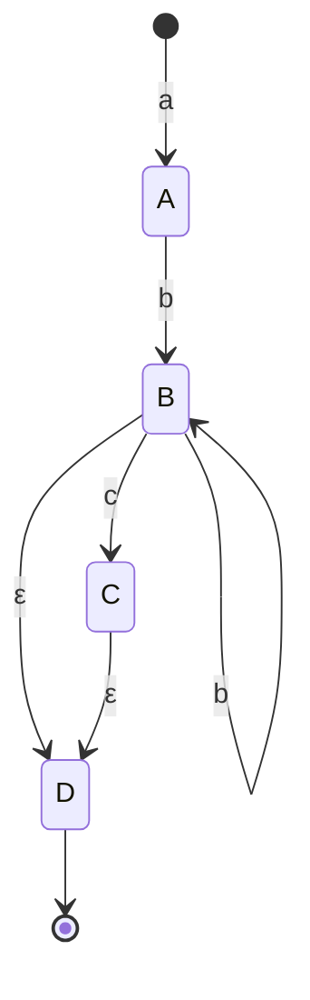

# FlinkCEP代码实例精讲：模式定义与实现

## 1.背景介绍

在当今数据驱动的世界中,实时数据处理和复杂事件处理(CEP)已经成为许多企业和组织的关键技术。Apache Flink是一个开源的分布式流处理框架,它提供了强大的CEP库,可以帮助开发人员有效地检测、过滤和响应复杂的事件模式。

Flink CEP允许用户使用类似SQL的模式语言定义事件模式,并将这些模式应用于实时数据流中。一旦检测到匹配的事件序列,就会触发相应的操作或警报。这种功能在诸如网络安全监控、物联网(IoT)设备监控、金融交易监控等领域都有广泛的应用。

本文将深入探讨Flink CEP的核心概念、模式定义语法、实现细节和实际应用场景。我们将通过丰富的代码示例和详细的解释,帮助读者掌握Flink CEP的使用方法,并能够在实际项目中灵活应用。

## 2.核心概念与联系

在开始学习Flink CEP之前,我们需要先了解一些核心概念:

### 2.1 事件(Event)

事件是CEP处理的基本单元。在Flink中,事件可以是任何类型的数据,例如传感器读数、日志条目、交易记录等。每个事件都包含一个时间戳,用于确定事件的发生顺序。

### 2.2 事件流(Event Stream)

事件流是一个有序的、潜在无限的事件序列。Flink使用源源不断的事件流作为输入数据源。

### 2.3 模式(Pattern)

模式定义了我们想要在事件流中检测的复杂条件或事件序列。模式可以包含各种条件,如事件类型、事件属性、事件顺序等。Flink CEP提供了一种类似SQL的模式语言,用于声明性地定义模式。

### 2.4 模式匹配(Pattern Matching)

模式匹配是指将定义好的模式应用于事件流,并找出与模式相匹配的事件序列。一旦检测到匹配的事件序列,就会触发相应的操作或计算。

这些核心概念相互关联,共同构建了Flink CEP的基础框架。事件流作为输入数据源,模式定义了我们感兴趣的复杂条件,而模式匹配则是将模式应用于事件流并检测匹配的过程。

## 3.核心算法原理具体操作步骤

Flink CEP的核心算法原理基于有限状态自动机(Finite State Machine,FSM)。FSM是一种数学计算模型,可以描述具有有限个状态的系统。在Flink CEP中,FSM用于表示和匹配事件模式。

以下是Flink CEP实现模式匹配的具体操作步骤:

1. **模式解析**: 首先,Flink CEP会将用户定义的模式解析为一个非确定有限自动机(NFA)。这个NFA描述了模式中的所有可能状态转换。

2. **NFA到DFA的转换**: 接下来,Flink CEP会将NFA转换为确定有限自动机(DFA)。DFA相比NFA更加高效,因为在任何给定的状态下,对于每个输入事件,DFA只有一个可能的转换。

3. **状态机执行**: 有了DFA,Flink CEP就可以在事件流上执行模式匹配了。每当有新事件到来,DFA就会根据当前状态和事件的属性进行状态转移。如果到达了接受状态,则表示模式匹配成功。

4. **结果输出**: 一旦检测到模式匹配,Flink CEP就会输出匹配的事件序列,或者执行用户定义的操作(如警报、计算等)。

这种基于有限状态自动机的算法原理使得Flink CEP能够高效地处理复杂的事件模式,并保证了模式匹配的正确性和可预测性。

## 4.数学模型和公式详细讲解举例说明

在上一节中,我们提到了Flink CEP的核心算法原理基于有限状态自动机(FSM)。现在,让我们通过数学模型和公式来深入理解FSM是如何工作的。

### 4.1 有限状态自动机(FSM)

有限状态自动机是一种数学计算模型,由一组有限的状态、一组输入符号、一个转移函数、一个初始状态和一组接受状态组成。我们可以用一个5元组来表示FSM:

$$
M = (Q, \Sigma, \delta, q_0, F)
$$

其中:

- $Q$ 是一个有限的状态集合
- $\Sigma$ 是一个有限的输入符号集合
- $\delta$ 是一个转移函数,将当前状态和输入符号映射到下一个状态,即 $\delta: Q \times \Sigma \rightarrow Q$
- $q_0 \in Q$ 是初始状态
- $F \subseteq Q$ 是一组接受状态

FSM的工作原理是,从初始状态 $q_0$ 开始,根据输入符号序列,按照转移函数 $\delta$ 进行状态转移。如果最终到达了接受状态 $q_f \in F$,则表示输入符号序列被接受;否则被拒绝。

### 4.2 非确定有限自动机(NFA)

在Flink CEP中,模式首先被解析为一个非确定有限自动机(NFA)。NFA与FSM的区别在于,对于同一个当前状态和输入符号,NFA可能有多个可能的下一状态。因此,NFA的转移函数 $\delta$ 可以表示为:

$$
\delta: Q \times \Sigma \rightarrow \mathcal{P}(Q)
$$

其中 $\mathcal{P}(Q)$ 表示 $Q$ 的幂集,即所有可能的下一状态集合。

例如,假设我们有一个模式 `"a b+ c?"`。其中,`b+` 表示一个或多个 `b` 事件,`c?` 表示零个或一个 `c` 事件。该模式的NFA可以用以下状态转移图表示:



在这个NFA中,从初始状态 `[*]` 开始,如果输入事件是 `a`,则转移到状态 `A`。在状态 `A`,如果输入事件是 `b`,则转移到状态 `B`。在状态 `B`,如果输入事件是 `b`,则保留在状态 `B`;如果输入事件是 `c`,则转移到状态 `C`;如果没有输入事件(表示为 $\epsilon$),则转移到状态 `D`。状态 `D` 是接受状态,表示模式匹配成功。

### 4.3 确定有限自动机(DFA)

虽然NFA能够表示复杂的模式,但它在执行时可能会产生较多的状态backtracking,影响效率。因此,Flink CEP会将NFA转换为确定有限自动机(DFA),以提高模式匹配的性能。

DFA与NFA的主要区别在于,对于任何给定的当前状态和输入符号,DFA最多只有一个可能的下一状态。因此,DFA的转移函数可以表示为:

$$
\delta: Q \times \Sigma \rightarrow Q
$$

DFA通常比NFA更加高效,因为它避免了backtracking的开销。然而,从NFA到DFA的转换可能会导致状态空间的指数级增长,这被称为"状态空间爆炸"问题。

以上就是Flink CEP中使用的有限状态自动机的数学模型和公式。理解这些概念有助于我们深入理解CEP的工作原理,并在需要时能够优化模式匹配的性能。

## 4.项目实践:代码实例和详细解释说明

在上一节中,我们学习了Flink CEP的核心算法原理和数学模型。现在,让我们通过实际的代码示例来了解如何在Flink中定义和使用CEP模式。

### 4.1 环境准备

首先,我们需要导入Flink CEP相关的依赖项:

```xml
<dependency>
    <groupId>org.apache.flink</groupId>
    <artifactId>flink-cep_2.12</artifactId>
    <version>1.14.0</version>
</dependency>
```

接下来,我们创建一个简单的数据源,用于模拟事件流:

```scala
import org.apache.flink.streaming.api.scala._

val env = StreamExecutionEnvironment.getExecutionEnvironment
val inputStream = env.fromElements(
  Event("start", 1),
  Event("middle", 2),
  Event("middle", 3),
  Event("middle", 4),
  Event("end", 5),
  Event("start", 6),
  Event("middle", 7),
  Event("end", 8)
)

case class Event(name: String, id: Int)
```

在这个例子中,我们定义了一个简单的 `Event` 案例类,包含事件名称和ID。`inputStream` 是一个模拟的事件流,包含了一些 `start`、`middle` 和 `end` 事件。

### 4.2 定义模式

现在,我们来定义一个简单的模式,用于检测 `start` 事件后紧跟着一个或多个 `middle` 事件,然后是一个 `end` 事件。我们使用Flink CEP提供的模式API来定义这个模式:

```scala
import org.apache.flink.cep.scala.pattern.Pattern

val pattern = Pattern.begin[Event]("start").where(_.name == "start")
  .next("middle").where(_.name == "middle").oneOrMore()
  .followedBy("end").where(_.name == "end")
```

在这个模式中,我们首先使用 `Pattern.begin` 定义了模式的起始条件,即一个 `start` 事件。接下来,我们使用 `next` 指定必须紧跟着一个或多个 `middle` 事件,使用 `oneOrMore` 修饰符。最后,我们使用 `followedBy` 指定必须紧跟着一个 `end` 事件。

`where` 子句用于过滤事件,只有满足条件的事件才会被匹配。在这个例子中,我们根据事件的 `name` 属性进行过滤。

### 4.3 应用模式并处理匹配结果

定义好模式后,我们需要将其应用于事件流,并处理匹配的结果:

```scala
import org.apache.flink.cep.scala.CEP
import org.apache.flink.cep.scala.pattern.Pattern

val patternStream = CEP.pattern(inputStream.keyBy(_.id), pattern)

val result = patternStream.select((pattern: Pattern[Event, _]) => {
  val start = pattern.get("start").get(0)
  val middle = pattern.getFlatMapped("middle").toList
  val end = pattern.get("end").get(0)
  (start, middle, end)
})

result.print()
```

在这段代码中,我们首先使用 `CEP.pattern` 方法将定义好的模式应用于事件流。`keyBy` 操作是为了确保同一个键(即事件ID)的事件被发送到同一个任务槽中进行模式匹配。

接下来,我们使用 `select` transformation来处理匹配的结果。在这个示例中,我们提取了匹配的 `start`、`middle` 和 `end` 事件,并将它们作为一个元组输出。

最后,我们调用 `print()` 方法将匹配结果打印到控制台。

运行这个程序,我们会看到以下输出:

```
(Event(start,1),[Event(middle,2), Event(middle,3), Event(middle,4)],Event(end,5))
(Event(start,6),[Event(middle,7)],Event(end,8))
```

可以看到,程序成功地检测到了两个匹配的事件序列,并正确地输出了 `start`、`middle` 和 `end` 事件。

### 4.4 更复杂的模式示例

上面的示例是一个相对简单的模式,但是Flink CEP支持定义更加复杂的模式。例如,我们可以使用各种逻辑组合符号(如 `or`、`until`、`times` 等)来构建更复杂的模式。

此外,Flink CEP还支持使用时间约束来定义模式,例如指定事件之间的最大时间间隔。这对于检测在特定时间窗口内发生的事件序列非常有用。

```scala
import org.apache.flink.cep.scala.pattern.conditions.IterativeCondition

val pattern = Pattern.begin[Event]("start")
  .next("middle").where(_.name == "middle").oneOrMore()
  .followedBy("end").where(_.name == "end")
  .within(Time.seconds(10)) // 添加时间约束
```

在这个示