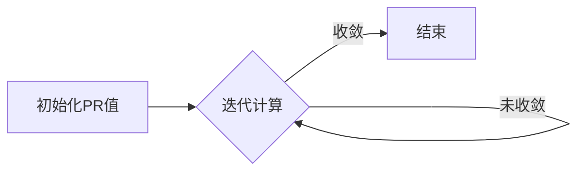

# Graph PageRank算法原理与代码实例讲解

作者：禅与计算机程序设计艺术

## 1. 背景介绍

### 1.1 互联网搜索引擎的挑战

互联网的诞生为人们获取信息提供了极大的便利，但同时也带来了海量信息检索的挑战。早期的搜索引擎主要依赖于关键词匹配，但这种方式存在着明显的缺陷：

* **关键词歧义性:**  相同的关键词可能对应着不同的语义，导致检索结果不准确。
* **网页质量参差不齐:** 难以区分网页的重要性，导致用户难以找到真正有价值的信息。

### 1.2 PageRank算法的诞生

为了解决上述问题，Google的创始人Larry Page和Sergey Brin于1998年提出了PageRank算法。该算法的核心思想是：

* **将互联网看作一张巨大的有向图，网页作为节点，超链接作为边。**
* **一个网页的重要性由链接到它的其他网页的重要性决定。** 
* **链接权重体现了网页之间的推荐关系，权重越高，推荐程度越高。**

PageRank算法的出现，极大地提升了搜索引擎结果的质量和用户体验，成为现代搜索引擎的核心算法之一。

## 2. 核心概念与联系

### 2.1 图论基础

* **有向图:** 由节点和有向边组成的图，边表示节点之间的指向关系。
* **入度:** 指向节点的边的数量。
* **出度:** 节点指向其他节点的边的数量。
* **强连通图:** 图中任意两个节点之间都可以通过边相互到达。

### 2.2 PageRank基本思想

PageRank算法将互联网看作一张巨大的有向图，网页作为节点，超链接作为边。每个网页都有一个PR值，表示该网页的重要性。

* **初始状态下，所有网页的PR值相等。**
* **通过迭代计算，每个网页的PR值会根据链接到它的其他网页的PR值进行更新。**
* **最终，所有网页的PR值会收敛到一个稳定的状态。**

### 2.3 核心概念联系

* **网页的重要性:** 用PR值来衡量，PR值越高，网页越重要。
* **链接关系:**  体现了网页之间的推荐关系，链接权重越高，推荐程度越高。
* **迭代计算:** 通过不断迭代计算，最终得到所有网页的PR值。

## 3. 核心算法原理具体操作步骤

### 3.1 PageRank公式

PageRank算法的核心公式如下：

$$PR(A) = (1-d) + d \sum_{i=1}^{n} \frac{PR(T_i)}{C(T_i)}$$

其中：

* $PR(A)$: 网页A的PageRank值。
* $d$: 阻尼系数，通常设置为0.85。
* $T_i$: 链接到网页A的网页。
* $C(T_i)$: 网页$T_i$的出度，即链接到其他网页的数量。
* $n$: 链接到网页A的网页的数量。

### 3.2 算法流程

1. **初始化:** 为所有网页设置初始PR值，通常设置为1/N，其中N为网页总数。
2. **迭代计算:** 
    * 对于每个网页A，根据公式计算其新的PR值。
    * 将所有网页的新PR值更新到原PR值。
3. **判断收敛:**  判断所有网页的PR值是否收敛，如果收敛则停止迭代，否则继续步骤2。

### 3.3 算法步骤图解



## 4. 数学模型和公式详细讲解举例说明

### 4.1 阻尼系数d的意义

阻尼系数d的取值范围为0到1，它模拟了用户在浏览网页时的行为。

* **d=0:** 用户点击链接后，会随机跳转到其他网页，不会停留在当前网页。
* **d=1:** 用户点击链接后，会一直停留在当前网页，不会跳转到其他网页。

通常情况下，d的取值设置为0.85，表示用户在浏览网页时，有85%的概率会点击当前网页的链接，有15%的概率会随机跳转到其他网页。

### 4.2 公式推导

PageRank算法的公式可以从以下角度进行理解：

* **随机游走模型:**  假设一个用户在互联网上随机点击链接，那么一个网页的PR值就代表着该用户访问到该网页的概率。
* **矩阵运算:**  PageRank算法的公式可以表示为矩阵运算的形式，从而可以使用线性代数的方法进行求解。

### 4.3 实例分析

假设有A、B、C、D四个网页，它们之间的链接关系如下图所示：

```
  A --> B
  ^    / \
  |   /   \
  |  v     v
  D <-- C
```

初始状态下，所有网页的PR值都为0.25。

根据PageRank公式，我们可以计算出每个网页的新PR值：

* **PR(A) = (1-0.85) + 0.85 * (PR(D)/1) = 0.2875**
* **PR(B) = (1-0.85) + 0.85 * (PR(A)/1 + PR(C)/2) = 0.320625**
* **PR(C) = (1-0.85) + 0.85 * (PR(B)/2) = 0.2265625**
* **PR(D) = (1-0.85) + 0.85 * (PR(C)/2) = 0.1653125**

经过多次迭代计算后，所有网页的PR值会收敛到一个稳定的状态：

* **PR(A) = 0.33**
* **PR(B) = 0.38**
* **PR(C) = 0.17**
* **PR(D) = 0.12**

从结果可以看出，网页B的PR值最高，说明它在互联网上最受欢迎。

## 5. 项目实践：代码实例和详细解释说明

### 5.1 Python代码实现

```python
import numpy as np

def pagerank(graph, damping_factor=0.85, max_iterations=100, min_delta=0.00001):
    """
    计算图中每个节点的PageRank值。

    参数：
        graph: 图的邻接矩阵表示。
        damping_factor: 阻尼系数。
        max_iterations: 最大迭代次数。
        min_delta: 收敛阈值。

    返回值：
        一个字典，包含每个节点的PageRank值。
    """

    num_nodes = len(graph)
    # 初始化PR值
    pr = np.ones(num_nodes) / num_nodes
    # 迭代计算
    for _ in range(max_iterations):
        pr_prev = np.copy(pr)
        for i in range(num_nodes):
            # 计算链接到当前节点的节点的PR值之和
            incoming_pr = sum(pr_prev[j] / sum(graph[j]) for j in range(num_nodes) if graph[j, i] == 1)
            # 更新PR值
            pr[i] = (1 - damping_factor) / num_nodes + damping_factor * incoming_pr
        # 判断是否收敛
        if np.sum(np.abs(pr - pr_prev)) < min_delta:
            break
    # 返回PR值
    return {i: pr[i] for i in range(num_nodes)}


# 示例图的邻接矩阵表示
graph = np.array([
    [0, 1, 0, 0],
    [0, 0, 1, 1],
    [0, 1, 0, 0],
    [1, 0, 1, 0],
])

# 计算PageRank值
pr = pagerank(graph)

# 打印结果
print(pr)
```

### 5.2 代码解释

* **`pagerank(graph, damping_factor, max_iterations, min_delta)`:**  该函数用于计算图中每个节点的PageRank值。
    * `graph`: 图的邻接矩阵表示。
    * `damping_factor`: 阻尼系数。
    * `max_iterations`: 最大迭代次数。
    * `min_delta`: 收敛阈值。
* **`num_nodes = len(graph)`:** 获取图中节点的数量。
* **`pr = np.ones(num_nodes) / num_nodes`:** 初始化PR值，所有节点的PR值都设置为1/N。
* **`for _ in range(max_iterations)`:** 迭代计算PR值。
    * `pr_prev = np.copy(pr)`: 保存上一次迭代的PR值。
    * `for i in range(num_nodes)`: 遍历所有节点。
        * `incoming_pr = sum(pr_prev[j] / sum(graph[j]) for j in range(num_nodes) if graph[j, i] == 1)`: 计算链接到当前节点的节点的PR值之和。
        * `pr[i] = (1 - damping_factor) / num_nodes + damping_factor * incoming_pr`: 更新当前节点的PR值。
    * `if np.sum(np.abs(pr - pr_prev)) < min_delta:`: 判断是否收敛。
* **`return {i: pr[i] for i in range(num_nodes)}`:** 返回PR值。

## 6. 实际应用场景

### 6.1 搜索引擎排名

PageRank算法最初是为Google搜索引擎设计的，用于对网页进行排名。

### 6.2 社交网络分析

PageRank算法可以用于分析社交网络中用户的影响力。

### 6.3 推荐系统

PageRank算法可以用于构建推荐系统，为用户推荐感兴趣的内容。

### 6.4 文本摘要

PageRank算法可以用于提取文本中的关键句子，生成文本摘要。

## 7. 总结：未来发展趋势与挑战

### 7.1  PageRank算法的优点

* **简单易懂:**  算法原理简单易懂，便于实现和应用。
* **效果显著:**  PageRank算法能够有效地识别网页的重要性，提升搜索引擎结果的质量。

### 7.2  PageRank算法的局限性

* **对新网页不友好:**  新网页由于缺乏外部链接，PR值会很低，难以获得较好的排名。
* **容易受到链接作弊的影响:**  一些网站会通过制造大量的垃圾链接来提高自己的PR值。

### 7.3 未来发展趋势

* **个性化PageRank:**  根据用户的兴趣和偏好，计算个性化的PageRank值。
* **反作弊算法:**  研究更有效的反作弊算法，防止网站通过作弊手段提高排名。
* **与其他算法结合:** 将PageRank算法与其他算法结合，例如主题模型、深度学习等，进一步提升搜索引擎的性能。

## 8. 附录：常见问题与解答

### 8.1  PageRank值是如何计算的？

PageRank值是通过迭代计算得到的，初始状态下，所有网页的PR值都相等。每次迭代过程中，每个网页的PR值都会根据链接到它的其他网页的PR值进行更新。

### 8.2  阻尼系数d有什么作用？

阻尼系数d模拟了用户在浏览网页时的行为，它控制着用户点击链接后停留在当前网页的概率。

### 8.3  PageRank算法有哪些应用场景？

PageRank算法可以用于搜索引擎排名、社交网络分析、推荐系统、文本摘要等领域。
