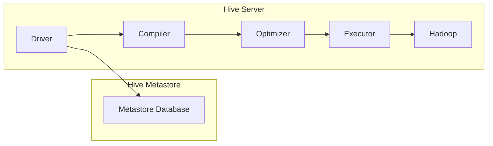

## 1. 背景介绍

### 1.1 电力系统数据分析的挑战

电力系统是国家关键基础设施，其安全稳定运行对社会经济发展至关重要。近年来，随着智能电网技术的快速发展，电力系统中积累了海量的运行数据，如何高效地分析和利用这些数据，已成为电力系统安全稳定运行的关键。

传统的电力系统数据分析方法主要依赖于关系型数据库，但面对海量、高维、非结构化的电力大数据，关系型数据库在数据存储、查询效率和可扩展性等方面存在局限性。

### 1.2 HiveQL：大规模数据处理的利器

HiveQL是一种基于Hadoop的数据仓库工具，它提供了一种类似SQL的查询语言，可以方便地对存储在Hadoop分布式文件系统（HDFS）上的大规模数据进行分析和处理。HiveQL具有以下优势：

* **高可扩展性:** HiveQL可以处理PB級的数据，能够满足电力系统大数据分析的需求。
* **易用性:** HiveQL的语法类似于SQL，易于学习和使用。
* **丰富的功能:** HiveQL支持各种数据格式，并提供丰富的内置函数和用户自定义函数，可以满足各种数据分析需求。

### 1.3 HiveQL在电力系统中的应用

HiveQL可以应用于电力系统的各个环节，例如：

* **电力负荷预测:** 通过分析历史负荷数据，预测未来电力负荷，为电力系统调度提供依据。
* **电网故障诊断:** 通过分析电网运行数据，识别故障原因，提高故障处理效率。
* **电力设备状态评估:** 通过分析电力设备运行数据，评估设备健康状况，提前进行维护和保养。

## 2. 核心概念与联系

### 2.1 HiveQL数据模型

HiveQL使用表结构来组织数据，类似于关系型数据库。每个表由多个列组成，每列具有数据类型，例如：

| 列名 | 数据类型 |
|---|---|
| timestamp | TIMESTAMP |
| voltage | DOUBLE |
| current | DOUBLE |
| power | DOUBLE |

### 2.2 HiveQL数据类型

HiveQL支持各种数据类型，包括：

* **基本类型:** TINYINT, SMALLINT, INT, BIGINT, BOOLEAN, FLOAT, DOUBLE, STRING, BINARY, TIMESTAMP
* **复杂类型:** ARRAY, MAP, STRUCT, UNIONTYPE

### 2.3 HiveQL查询语言

HiveQL查询语言类似于SQL，支持SELECT, FROM, WHERE, GROUP BY, HAVING, ORDER BY等语句。

### 2.4 HiveQL架构



## 3. 核心算法原理具体操作步骤

### 3.1 数据导入

将电力系统数据导入HiveQL，可以使用以下方法：

* **从本地文件导入:** 使用LOAD DATA INPATH语句将本地文件导入HiveQL表。
* **从HDFS导入:** 使用CREATE EXTERNAL TABLE语句创建外部表，将HDFS上的数据映射到HiveQL表。
* **从其他数据源导入:** 使用Sqoop等工具将数据从其他数据源导入HiveQL。

### 3.2 数据清洗

对导入的电力系统数据进行清洗，例如：

* **去除重复数据:** 使用DISTINCT语句去除重复数据。
* **处理缺失值:** 使用COALESCE函数填充缺失值。
* **数据格式转换:** 使用CAST函数转换数据类型。

### 3.3 数据分析

使用HiveQL查询语言对清洗后的数据进行分析，例如：

* **统计分析:** 使用COUNT, SUM, AVG等函数进行统计分析。
* **分组分析:** 使用GROUP BY语句进行分组分析。
* **关联分析:** 使用JOIN语句进行关联分析。

### 3.4 结果导出

将分析结果导出到文件或其他数据源，可以使用以下方法：

* **导出到本地文件:** 使用INSERT OVERWRITE LOCAL DIRECTORY语句将结果导出到本地文件。
* **导出到HDFS:** 使用INSERT OVERWRITE DIRECTORY语句将结果导出到HDFS。
* **导出到其他数据源:** 使用Sqoop等工具将结果导出到其他数据源。

## 4. 数学模型和公式详细讲解举例说明

### 4.1 电力负荷预测

#### 4.1.1 ARIMA模型

ARIMA模型是一种常用的时间序列预测模型，其公式如下：

$$
y_t = c + \phi_1 y_{t-1} + ... + \phi_p y_{t-p} + \theta_1 \epsilon_{t-1} + ... + \theta_q \epsilon_{t-q} + \epsilon_t
$$

其中：

* $y_t$ 是时间 $t$ 的电力负荷
* $c$ 是常数项
* $\phi_i$ 是自回归系数
* $\theta_i$ 是移动平均系数
* $\epsilon_t$ 是白噪声

#### 4.1.2 HiveQL实现

```sql
-- 创建ARIMA模型
CREATE TEMPORARY FUNCTION arima AS 'com.cloudera.hive.udf.UDFARIMA';

-- 预测未来7天的电力负荷
SELECT
    timestamp,
    arima(voltage, current, 7) AS predicted_load
FROM
    power_data
WHERE
    timestamp BETWEEN '2024-05-14 00:00:00' AND '2024-05-20 23:59:59'
ORDER BY
    timestamp;
```

### 4.2 电网故障诊断

#### 4.2.1 决策树模型

决策树模型是一种常用的分类模型，其原理是根据数据的特征，将数据划分到不同的类别中。

#### 4.2.2 HiveQL实现

```sql
-- 创建决策树模型
CREATE TEMPORARY FUNCTION decision_tree AS 'com.cloudera.hive.udf.UDFDecisionTree';

-- 预测故障原因
SELECT
    timestamp,
    decision_tree(voltage, current, power) AS fault_cause
FROM
    power_data
WHERE
    timestamp BETWEEN '2024-05-14 00:00:00' AND '2024-05-20 23:59:59'
ORDER BY
    timestamp;
```

## 5. 项目实践：代码实例和详细解释说明

### 5.1 电力负荷预测案例

#### 5.1.1 数据准备

```sql
-- 创建电力负荷数据表
CREATE TABLE power_data (
    timestamp TIMESTAMP,
    voltage DOUBLE,
    current DOUBLE,
    power DOUBLE
);

-- 导入电力负荷数据
LOAD DATA LOCAL INPATH '/path/to/power_data.csv'
OVERWRITE INTO TABLE power_data;
```

#### 5.1.2 模型训练

```sql
-- 创建ARIMA模型
CREATE TEMPORARY FUNCTION arima AS 'com.cloudera.hive.udf.UDFARIMA';

-- 训练ARIMA模型
SELECT
    arima(voltage, current, 7) AS model
FROM
    power_data
WHERE
    timestamp BETWEEN '2024-05-07 00:00:00' AND '2024-05-13 23:59:59';
```

#### 5.1.3 负荷预测

```sql
-- 预测未来7天的电力负荷
SELECT
    timestamp,
    arima(voltage, current, 7) AS predicted_load
FROM
    power_data
WHERE
    timestamp BETWEEN '2024-05-14 00:00:00' AND '2024-05-20 23:59:59'
ORDER BY
    timestamp;
```

### 5.2 电网故障诊断案例

#### 5.2.1 数据准备

```sql
-- 创建电网故障数据表
CREATE TABLE fault_data (
    timestamp TIMESTAMP,
    voltage DOUBLE,
    current DOUBLE,
    power DOUBLE,
    fault_cause STRING
);

-- 导入电网故障数据
LOAD DATA LOCAL INPATH '/path/to/fault_data.csv'
OVERWRITE INTO TABLE fault_data;
```

#### 5.2.2 模型训练

```sql
-- 创建决策树模型
CREATE TEMPORARY FUNCTION decision_tree AS 'com.cloudera.hive.udf.UDFDecisionTree';

-- 训练决策树模型
SELECT
    decision_tree(voltage, current, power, fault_cause) AS model
FROM
    fault_data
WHERE
    timestamp BETWEEN '2024-05-07 00:00:00' AND '2024-05-13 23:59:59';
```

#### 5.2.3 故障诊断

```sql
-- 预测故障原因
SELECT
    timestamp,
    decision_tree(voltage, current, power) AS fault_cause
FROM
    fault_data
WHERE
    timestamp BETWEEN '2024-05-14 00:00:00' AND '2024-05-20 23:59:59'
ORDER BY
    timestamp;
```

## 6. 实际应用场景

### 6.1 电力负荷预测

* **短期负荷预测:** 预测未来几小时或几天的电力负荷，为电力系统调度提供依据。
* **中期负荷预测:** 预测未来几周或几个月的电力负荷，为电力系统规划提供依据。
* **长期负荷预测:** 预测未来几年或几十年的电力负荷，为电力系统发展提供依据。

### 6.2 电网故障诊断

* **故障定位:** 根据故障数据，确定故障发生的具体位置。
* **故障原因分析:** 分析故障原因，为故障处理提供依据。
* **故障预警:** 通过分析电网运行数据，预测潜在故障，提前采取措施防止故障发生。

### 6.3 电力设备状态评估

* **设备健康状况评估:** 通过分析设备运行数据，评估设备健康状况，提前进行维护和保养。
* **设备寿命预测:** 预测设备剩余寿命，为设备更换提供依据。
* **设备故障预测:** 预测设备潜在故障，提前采取措施防止故障发生。

## 7. 工具和资源推荐

### 7.1 Apache Hive

Apache Hive是Hadoop生态系统中的数据仓库工具，提供HiveQL查询语言，可以方便地对存储在HDFS上的大规模数据进行分析和处理。

* **官方网站:** https://hive.apache.org/
* **文档:** https://cwiki.apache.org/confluence/display/Hive/Home

### 7.2 Cloudera Manager

Cloudera Manager是一款Hadoop集群管理工具，可以方便地部署、管理和监控Hadoop集群。

* **官方网站:** https://www.cloudera.com/products/cloudera-manager.html
* **文档:** https://docs.cloudera.com/documentation/enterprise/latest/topics/cm_mc_intro.html

### 7.3 Apache Spark

Apache Spark是一款快速、通用的大数据处理引擎，可以与HiveQL配合使用，提高数据处理效率。

* **官方网站:** https://spark.apache.org/
* **文档:** https://spark.apache.org/docs/latest/

## 8. 总结：未来发展趋势与挑战

### 8.1 未来发展趋势

* **实时数据分析:** 随着智能电网技术的快速发展，电力系统数据将更加实时化，需要发展实时数据分析技术，及时发现问题并采取措施。
* **人工智能应用:** 人工智能技术可以应用于电力系统的各个环节，例如负荷预测、故障诊断、设备状态评估等，提高电力系统运行效率和安全性。
* **云计算平台:** 云计算平台可以提供强大的计算和存储资源，为电力系统大数据分析提供支撑。

### 8.2 挑战

* **数据质量:** 电力系统数据存在噪声、缺失值等问题，需要发展数据清洗和数据质量评估技术，提高数据质量。
* **数据安全:** 电力系统数据涉及国家关键基础设施，需要加强数据安全防护，防止数据泄露和恶意攻击。
* **人才队伍建设:** 电力系统大数据分析需要专业人才，需要加强人才队伍建设，培养掌握大数据分析技术的专业人才。

## 9. 附录：常见问题与解答

### 9.1 HiveQL与SQL的区别

HiveQL的语法类似于SQL，但也存在一些区别，例如：

* HiveQL不支持事务。
* HiveQL不支持索引。
* HiveQL的执行效率低于SQL。

### 9.2 HiveQL的数据存储格式

HiveQL支持各种数据存储格式，例如：

* **文本格式:** TEXTFILE
* **二进制格式:** SEQUENCEFILE, RCFILE, ORC, PARQUET

### 9.3 HiveQL的优化方法

HiveQL的执行效率可以通过以下方法进行优化：

* **数据分区:** 将数据划分到多个分区，可以减少查询的数据量，提高查询效率。
* **数据压缩:** 使用压缩算法压缩数据，可以减少数据存储空间，提高查询效率。
* **使用Spark:** Spark可以与HiveQL配合使用，提高数据处理效率。