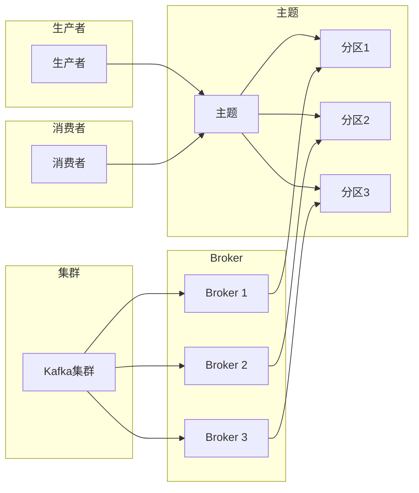

## 1. 背景介绍

### 1.1 消息引擎的演进

在信息化高速发展的今天，海量数据的处理和实时信息的传输成为企业成功的关键。消息引擎作为一种关键的中间件技术，在处理海量数据、解耦系统、构建实时数据管道等方面发挥着至关重要的作用。从早期的点对点消息队列到如今的分布式发布/订阅消息系统，消息引擎经历了不断的演进，以满足日益增长的业务需求。

### 1.2 Kafka的诞生与发展

Kafka最初由LinkedIn开发，旨在解决该公司面临的海量日志收集和处理问题。Kafka的设计目标是高吞吐量、低延迟、持久化、高可用性，以及可扩展性。自开源以来，Kafka迅速 gained popularity，成为大数据生态系统中不可或缺的一部分，被广泛应用于实时数据流处理、日志收集、事件驱动架构等场景。

### 1.3 Kafka的优势

Kafka之所以能够脱颖而出，与其独特的架构设计密不可分。Kafka的优势主要体现在以下几个方面：

* **高吞吐量:** Kafka采用顺序写入磁盘、零拷贝技术、批量处理等优化手段，实现了极高的吞吐量，能够处理每秒百万级的消息。
* **低延迟:** Kafka的消息传递延迟极低，通常在毫秒级别，满足实时数据处理的需求。
* **持久化:** Kafka将消息持久化到磁盘，即使发生故障，数据也不会丢失，保证了数据的可靠性。
* **高可用性:** Kafka采用分布式架构，支持数据复制和故障转移，确保系统的高可用性。
* **可扩展性:** Kafka可以轻松地扩展到数百个节点，处理海量数据。

## 2. 核心概念与联系

### 2.1 主题与分区

在Kafka中，消息以主题(Topic)为单位进行组织。主题可以理解为一个逻辑上的消息类别，例如用户行为日志、订单数据等。为了提高吞吐量和可扩展性，Kafka将每个主题划分为多个分区(Partition)。每个分区都是一个有序的消息队列，消息以追加的方式写入分区，并按顺序读取。

### 2.2 生产者与消费者

生产者(Producer)负责将消息发布到Kafka主题。生产者可以指定消息要发送到哪个主题的哪个分区。消费者(Consumer)负责订阅Kafka主题并消费消息。消费者可以属于不同的消费组(Consumer Group)，同一消费组内的消费者共同消费主题的所有分区，每个分区只会被分配给一个消费者。

### 2.3 Broker与集群

Kafka的服务器被称为Broker。多个Broker组成一个Kafka集群。每个Broker负责管理一部分分区，并处理生产者和消费者的请求。Kafka集群支持数据复制，每个分区有多个副本，分布在不同的Broker上，以确保数据的高可用性。

### 2.4 核心概念联系图



## 3. 核心算法原理具体操作步骤

### 3.1 消息写入流程

1. 生产者将消息发送到指定的主题分区。
2. Broker接收消息，并将其追加到分区末尾。
3. Broker将消息写入磁盘，并更新分区偏移量。
4. Broker将消息复制到其他副本。

### 3.2 消息消费流程

1. 消费者订阅指定的主题。
2. 消费者加入消费组，并从Broker获取分区分配。
3. 消费者从分配的分区读取消息。
4. 消费者提交消费位移，标识已消费的消息。

### 3.3 数据复制机制

Kafka采用数据复制机制来保证数据的高可用性。每个分区有多个副本，其中一个副本是领导者(Leader)，其他副本是追随者(Follower)。生产者将消息发送到领导者副本，领导者副本将消息复制到追随者副本。如果领导者副本发生故障，Kafka会自动选择一个追随者副本作为新的领导者。

## 4. 数学模型和公式详细讲解举例说明

### 4.1 消息吞吐量计算

Kafka的消息吞吐量可以用以下公式计算：

$$
吞吐量 = \frac{消息大小}{消息写入时间}
$$

例如，如果消息大小为1KB，消息写入时间为1ms，则吞吐量为1MB/s。

### 4.2 消息延迟计算

Kafka的消息延迟可以用以下公式计算：

$$
延迟 = 消息写入时间 + 消息复制时间 + 消息消费时间
$$

例如，如果消息写入时间为1ms，消息复制时间为2ms，消息消费时间为3ms，则消息延迟为6ms。

## 5. 项目实践：代码实例和详细解释说明

### 5.1 生产者代码实例

```java
Properties props = new Properties();
props.put("bootstrap.servers", "localhost:9092");
props.put("key.serializer", "org.apache.kafka.common.serialization.StringSerializer");
props.put("value.serializer", "org.apache.kafka.common.serialization.StringSerializer");

Producer<String, String> producer = new KafkaProducer<>(props);

for (int i = 0; i < 100; i++) {
  ProducerRecord<String, String> record = new ProducerRecord<>("my-topic", "key-" + i, "value-" + i);
  producer.send(record);
}

producer.close();
```

**代码解释:**

* 首先，创建`Properties`对象，设置Kafka集群地址、键值序列化器等配置信息。
* 然后，创建`KafkaProducer`对象，用于发送消息。
* 接着，循环发送100条消息到`my-topic`主题。
* 最后，关闭`KafkaProducer`对象。

### 5.2 消费者代码实例

```java
Properties props = new Properties();
props.put("bootstrap.servers", "localhost:9092");
props.put("group.id", "my-group");
props.put("key.deserializer", "org.apache.kafka.common.serialization.StringDeserializer");
props.put("value.deserializer", "org.apache.kafka.common.serialization.StringDeserializer");

Consumer<String, String> consumer = new KafkaConsumer<>(props);
consumer.subscribe(Arrays.asList("my-topic"));

while (true) {
  ConsumerRecords<String, String> records = consumer.poll(Duration.ofMillis(100));
  for (ConsumerRecord<String, String> record : records) {
    System.out.printf("offset = %d, key = %s, value = %s\n", record.offset(), record.key(), record.value());
  }
}
```

**代码解释:**

* 首先，创建`Properties`对象，设置Kafka集群地址、消费组ID、键值反序列化器等配置信息。
* 然后，创建`KafkaConsumer`对象，用于消费消息。
* 接着，订阅`my-topic`主题。
* 然后，循环拉取消息并打印消息内容。

## 6. 实际应用场景

### 6.1 日志收集

Kafka可以用于收集应用程序的日志，并将日志集中存储和处理。例如，可以使用Kafka收集Web服务器的访问日志，并将其发送到Elasticsearch进行索引和分析。

### 6.2 消息队列

Kafka可以用作消息队列，实现系统解耦和异步通信。例如，可以使用Kafka将订单数据发送到订单处理系统，而无需订单系统直接与下单系统交互。

### 6.3 流处理

Kafka可以与流处理框架（例如Apache Flink、Apache Spark Streaming）集成，用于实时数据流处理。例如，可以使用Kafka收集用户行为数据，并使用Flink进行实时分析，以提供个性化推荐服务。

## 7. 工具和资源推荐

### 7.1 Kafka官方文档

Kafka官方文档提供了详细的Kafka介绍、架构说明、API文档等信息。

### 7.2 Kafka书籍

* **Kafka: The Definitive Guide:** 一本全面介绍Kafka的书籍，涵盖了Kafka的架构、API、应用场景等方面。
* **Learning Apache Kafka:** 一本适合Kafka初学者的书籍，介绍了Kafka的基本概念、操作步骤、应用案例等。

### 7.3 Kafka社区

Kafka拥有活跃的社区，可以在社区论坛、邮件列表等平台获取帮助和交流经验。

## 8. 总结：未来发展趋势与挑战

### 8.1 未来发展趋势

* **云原生Kafka:** 随着云计算的普及，Kafka将更加紧密地与云平台集成，提供云原生的Kafka服务。
* **Kafka Streams:** Kafka Streams是一个轻量级的流处理库，将成为Kafka生态系统中越来越重要的组成部分。
* **Kafka Connect:** Kafka Connect是一个用于连接Kafka和其他系统的工具，将继续发展，支持更多的数据源和目标系统。

### 8.2 挑战

* **数据安全:** 随着Kafka应用的普及，数据安全问题越来越重要。Kafka需要提供更强大的安全机制来保护数据。
* **性能优化:** Kafka需要不断优化性能，以满足日益增长的数据量和吞吐量需求。
* **生态系统整合:** Kafka需要与其他大数据技术紧密集成，构建更加完善的大数据生态系统。

## 9. 附录：常见问题与解答

### 9.1 Kafka与其他消息队列的区别

Kafka与其他消息队列（例如RabbitMQ、ActiveMQ）的主要区别在于：

* **架构:** Kafka采用分布式架构，而其他消息队列通常采用集中式架构。
* **吞吐量:** Kafka的吞吐量更高，能够处理每秒百万级的消息。
* **持久化:** Kafka将消息持久化到磁盘，而其他消息队列通常将消息存储在内存中。

### 9.2 如何选择合适的消息队列

选择合适的消息队列需要考虑以下因素：

* **吞吐量需求:** 如果需要处理海量数据，Kafka是一个不错的选择。
* **延迟需求:** 如果需要低延迟的消息传递，Kafka也是一个不错的选择。
* **可靠性需求:** 如果需要高可靠性，Kafka是一个不错的选择。
* **成本:** Kafka是一个开源软件，成本较低。