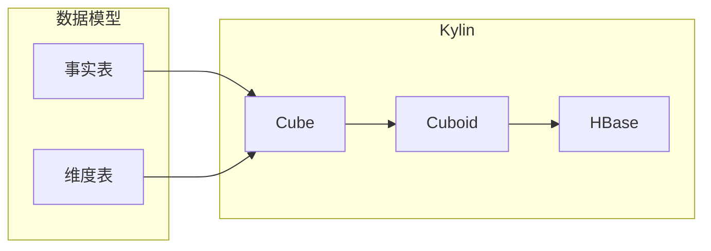

# Kylin原理与代码实例讲解

作者：禅与计算机程序设计艺术

## 1. 背景介绍

### 1.1 大数据时代与OLAP需求

随着互联网、物联网等技术的快速发展，数据规模呈爆炸式增长，如何快速高效地分析海量数据成为了企业面临的巨大挑战。在线分析处理（OLAP）技术应运而生，其核心目标是针对特定维度进行多维分析，快速响应用户的查询需求。

### 1.2 传统OLAP技术的局限性

传统的OLAP技术，如关系型数据库，在处理海量数据时存在以下局限性：

* **查询速度慢：** 关系型数据库需要扫描所有数据才能返回结果，当数据量巨大时，查询速度会变得非常缓慢。
* **数据冗余高：** 为了支持多维分析，关系型数据库需要创建大量的索引和视图，导致数据冗余度高，存储成本增加。
* **扩展性差：** 关系型数据库难以进行水平扩展，难以应对数据量的快速增长。

### 1.3 Kylin的诞生与优势

为了解决传统OLAP技术的局限性，Apache Kylin应运而生。Kylin是一个开源的分布式分析引擎，提供Hadoop/Spark之上的SQL查询接口及多维分析（OLAP）能力以支持超大规模数据集，它的核心思想是**预计算**，即提前将数据按照预设的维度进行聚合，并将聚合结果存储在HBase中，当用户查询时，Kylin可以直接从HBase中获取结果，从而实现亚秒级查询响应。

Kylin的优势在于：

* **极速查询：** 通过预计算技术，Kylin可以实现亚秒级查询响应，即使面对TB级别的数据，也能快速返回结果。
* **高压缩比：** Kylin使用先进的压缩算法，可以将数据压缩到原始数据的1%~10%，大大降低存储成本。
* **高可扩展性：** Kylin支持水平扩展，可以轻松应对数据量的快速增长。
* **易于使用：** Kylin提供标准的SQL接口，用户可以像使用传统数据库一样使用Kylin。

## 2. 核心概念与联系

### 2.1 数据模型

Kylin的数据模型基于星形模型，包含以下核心概念：

* **事实表：** 事实表存储业务数据，例如订单表、交易记录表等，通常包含大量的记录。
* **维度表：** 维度表描述业务数据的属性，例如商品维度表、用户维度表等，通常包含较少的记录。
* **度量：** 度量是基于事实表进行统计计算的指标，例如销售额、订单数量等。

### 2.2 Cube

Cube是Kylin的核心概念，它表示一个多维数据集，包含多个维度和度量。Kylin通过对Cube进行预计算，将聚合结果存储在HBase中，从而实现快速查询。

### 2.3 Cuboid

Cuboid是Cube的子集，它表示Cube的一个维度组合。例如，一个Cube包含三个维度：时间、商品、地区，那么它的Cuboid就包括以下几种组合：

* 时间
* 商品
* 地区
* 时间+商品
* 时间+地区
* 商品+地区
* 时间+商品+地区

Kylin会预计算所有Cuboid的聚合结果，并将其存储在HBase中。

### 2.4 关系图

下面是Kylin核心概念的关系图：



## 3. 核心算法原理具体操作步骤

### 3.1 数据准备

在构建Cube之前，需要先将数据导入到Hadoop集群中，并将其转换为Kylin可识别的格式。

### 3.2 Cube设计

Cube设计是构建Kylin的关键步骤，需要确定以下内容：

* **维度：** 选择哪些维度作为Cube的分析维度。
* **度量：** 选择哪些度量作为Cube的统计指标。
* **分区：** 确定Cube的数据分区方式，例如按时间分区。

### 3.3 Cube构建

Cube构建过程包括以下步骤：

1. **数据分片：** 将数据按照预设的分区方式进行分片。
2. **字典构建：** 为每个维度构建字典，将维度值转换为整数ID，减少存储空间。
3. **Cuboid计算：** 计算所有Cuboid的聚合结果。
4. **结果存储：** 将聚合结果存储在HBase中。

### 3.4 查询执行

当用户提交查询时，Kylin会根据查询条件，从HBase中获取对应的Cuboid数据，并进行聚合计算，最终返回查询结果。

## 4. 数学模型和公式详细讲解举例说明

Kylin的预计算过程可以抽象为以下数学模型：

$$
F(D_1, D_2, ..., D_n) = \sum_{i=1}^{m} f(r_i)
$$

其中：

* $F(D_1, D_2, ..., D_n)$ 表示Cube的聚合函数，例如SUM、COUNT等。
* $D_1, D_2, ..., D_n$ 表示Cube的维度。
* $f(r_i)$ 表示事实表中第 $i$ 条记录的度量值。
* $m$ 表示事实表的记录数。

例如，一个Cube包含三个维度：时间、商品、地区，度量为销售额，那么它的聚合函数可以表示为：

$$
F(时间, 商品, 地区) = \sum_{i=1}^{m} Sales(r_i)
$$

Kylin会预计算所有Cuboid的聚合结果，并将其存储在HBase中。当用户查询时，Kylin会根据查询条件，从HBase中获取对应的Cuboid数据，并进行聚合计算，最终返回查询结果。

## 5. 项目实践：代码实例和详细解释说明

### 5.1 环境准备

* Hadoop集群
* HBase集群
* Kylin安装包

### 5.2 数据准备

假设我们有一个订单表，包含以下字段：

| 字段名 | 数据类型 | 说明 |
|---|---|---|
| order_id | int | 订单ID |
| user_id | int | 用户ID |
| product_id | int | 商品ID |
| order_time | timestamp | 订单时间 |
| price | double | 订单金额 |

将订单数据导入到Hadoop集群中，例如存储在Hive表中。

### 5.3 Cube设计

使用Kylin web界面设计Cube，具体步骤如下：

1. **创建项目：** 创建一个新的Kylin项目。
2. **添加数据源：** 选择Hive作为数据源，并指定订单表所在的数据库和表名。
3. **选择维度：** 选择`user_id`、`product_id`、`order_time`作为维度。
4. **选择度量：** 选择`price`作为度量，并设置聚合函数为SUM。
5. **设置分区：** 按`order_time`进行分区，例如按天分区。
6. **保存Cube：** 保存Cube设计。

### 5.4 Cube构建

点击"Build"按钮，开始构建Cube。构建过程会执行以下步骤：

1. **数据分片：** 将数据按照预设的分区方式进行分片。
2. **字典构建：** 为每个维度构建字典，将维度值转换为整数ID，减少存储空间。
3. **Cuboid计算：** 计算所有Cuboid的聚合结果。
4. **结果存储：** 将聚合结果存储在HBase中。

### 5.5 查询测试

Cube构建完成后，可以使用Kylin web界面或者JDBC/ODBC接口进行查询测试。例如，查询2024年5月20日所有用户的订单总额：

```sql
SELECT SUM(price)
FROM orders
WHERE order_time >= '2024-05-20' AND order_time < '2024-05-21'
```

Kylin会从HBase中获取对应的Cuboid数据，并进行聚合计算，最终返回查询结果。

## 6. 实际应用场景

Kylin广泛应用于以下场景：

* **报表分析：** 为企业提供快速、灵活的报表分析能力，例如销售报表、用户行为分析等。
* **自助式BI：** 为用户提供自助式BI工具，用户可以根据自己的需求创建报表和仪表盘。
* **数据挖掘：** 为数据科学家提供快速的数据分析平台，支持机器学习、深度学习等应用。

## 7. 工具和资源推荐

* **Apache Kylin官方网站：** https://kylin.apache.org/
* **Kylin官方文档：** https://kylin.apache.org/docs/
* **Kylin GitHub仓库：** https://github.com/apache/kylin

## 8. 总结：未来发展趋势与挑战

### 8.1 未来发展趋势

* **云原生化：** Kylin将进一步拥抱云原生技术，提供更便捷的部署和运维体验。
* **实时分析：** Kylin将支持实时数据分析，满足用户对实时数据分析的需求。
* **人工智能：** Kylin将集成人工智能技术，提供更智能的数据分析能力。

### 8.2 面临的挑战

* **数据治理：** 随着数据量的不断增长，数据治理成为了Kylin面临的巨大挑战。
* **性能优化：** Kylin需要不断优化性能，以应对更复杂的查询需求。
* **生态建设：** Kylin需要构建更完善的生态系统，吸引更多开发者和用户。

## 9. 附录：常见问题与解答

### 9.1 Kylin与其他OLAP引擎的比较

| 特性 | Kylin | Druid | ClickHouse |
|---|---|---|---|
| 查询速度 | 极快 | 快 | 极快 |
| 数据规模 | 超大规模 | 大规模 | 超大规模 |
| 数据模型 | 星形模型 | 列式存储 | 列式存储 |
| 压缩比 | 高 | 高 | 高 |
| 可扩展性 | 高 | 高 | 高 |
| 易用性 | 易用 | 较易用 | 较难用 |

### 9.2 Kylin的性能优化技巧

* **合理设计Cube：** 选择合适的维度、度量和分区方式，可以有效提高查询性能。
* **使用预计算：** 预计算所有Cuboid的聚合结果，可以大大减少查询时间。
* **优化HBase参数：** 合理配置HBase参数，可以提高HBase的读写性能。
* **使用数据压缩：** 使用先进的压缩算法，可以减少存储空间和网络传输时间。