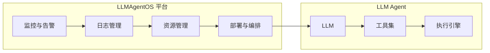

# LLMAgentOS的自动化运维:提高系统的可靠性和效率

作者：禅与计算机程序设计艺术

## 1. 背景介绍

### 1.1  LLM Agent 的兴起与挑战

近年来，大型语言模型 (LLM) 发展迅速，其能力已从简单的文本生成扩展到更复杂的任务，例如代码生成、问题解答和对话交互。LLM Agent 的概念应运而生，它利用 LLM 作为核心控制器，结合外部工具和环境，完成更复杂、更贴近现实世界需求的任务。

然而，随着 LLM Agent 复杂性的增加，其运维也面临着巨大挑战：

* **监控复杂:**  LLM Agent 通常由多个组件构成，包括 LLM、工具集、执行引擎等，每个组件都可能产生大量的日志和指标数据，难以全面监控。
* **调试困难:**  LLM Agent 的行为难以预测，当出现问题时，难以定位问题根源，调试过程复杂耗时。
* **资源管理:**  LLM Agent 通常需要大量的计算资源，如何高效地分配和管理资源，保证 Agent 的性能和稳定性，也是一个难题。

### 1.2  自动化运维的必要性

为了应对上述挑战，自动化运维成为 LLM Agent 不可或缺的一部分。自动化运维可以：

* **提高效率:**  自动化运维可以将重复性任务自动化，例如部署、监控、告警等，从而节省人力成本，提高运维效率。
* **增强可靠性:**  自动化运维可以帮助及时发现和解决问题，避免人为错误，提高系统的可靠性和稳定性。
* **优化资源利用:**  自动化运维可以根据系统负载动态调整资源分配，优化资源利用率，降低成本。

## 2. 核心概念与联系

### 2.1  LLMAgentOS

LLMAgentOS 是一个专门为 LLM Agent 设计的自动化运维平台，它提供了一系列工具和服务，帮助用户轻松构建、部署、监控和管理 LLM Agent。

### 2.2  LLMAgentOS 架构

LLMAgentOS 的核心架构如下：



* **监控与告警:** LLMAgentOS 提供全面的监控指标和灵活的告警机制，帮助用户实时了解 LLM Agent 的运行状态。
* **日志管理:** LLMAgentOS 收集和分析 LLM Agent 各个组件的日志数据，帮助用户快速定位问题。
* **资源管理:** LLMAgentOS 提供资源调度和管理功能，帮助用户优化资源利用，降低成本。
* **部署与编排:** LLMAgentOS 提供自动化部署和编排工具，帮助用户快速部署和更新 LLM Agent。

### 2.3  核心组件

* **Prometheus:**  用于收集和存储 LLM Agent 的监控指标数据。
* **Grafana:**  用于可视化 LLM Agent 的监控指标数据。
* **Alertmanager:**  用于接收 Prometheus 的告警信息，并根据配置发送通知。
* **ELK Stack:**  用于收集、存储和分析 LLM Agent 的日志数据。
* **Kubernetes:**  用于编排和管理 LLM Agent 的容器化部署。

## 3. 核心算法原理具体操作步骤

### 3.1  监控指标收集

LLMAgentOS 使用 Prometheus 收集 LLM Agent 的监控指标数据，包括：

* **LLM 指标:**  例如推理速度、内存占用、GPU 利用率等。
* **工具集指标:**  例如 API 调用次数、响应时间、错误率等。
* **执行引擎指标:**  例如任务执行时间、成功率、错误信息等。

Prometheus 通过 HTTP 协议定期从 LLM Agent 各个组件拉取指标数据，并存储在时序数据库中。

### 3.2  告警规则配置

用户可以根据实际需求配置告警规则，例如：

* 当 LLM 推理速度低于某个阈值时触发告警。
* 当工具集 API 错误率超过某个阈值时触发告警。
* 当执行引擎任务失败率超过某个阈值时触发告警。

Alertmanager 接收 Prometheus 的告警信息，并根据配置发送通知，例如邮件、短信、Slack 等。

### 3.3  日志收集与分析

LLMAgentOS 使用 ELK Stack 收集和分析 LLM Agent 的日志数据，包括：

* **LLM 日志:**  例如推理过程中的调试信息、错误信息等。
* **工具集日志:**  例如 API 调用记录、错误信息等。
* **执行引擎日志:**  例如任务执行过程中的日志信息、错误信息等。

ELK Stack 提供强大的日志搜索和分析功能，帮助用户快速定位问题根源。

## 4. 数学模型和公式详细讲解举例说明

### 4.1  资源利用率

资源利用率是指实际使用的资源占可用资源的比例，可以使用以下公式计算：

$$
\text{资源利用率} = \frac{\text{实际使用的资源}}{\text{可用资源}}
$$

例如，如果一个 LLM Agent 的 GPU 内存为 16GB，当前使用了 8GB，则 GPU 内存利用率为 50%。

### 4.2  响应时间

响应时间是指从发出请求到收到响应之间的时间间隔，可以使用以下公式计算：

$$
\text{响应时间} = \text{收到响应时间} - \text{发出请求时间}
$$

例如，如果一个工具集 API 的请求在 10:00:00 发出，在 10:00:05 收到响应，则响应时间为 5 秒。

### 4.3  错误率

错误率是指错误请求占总请求数的比例，可以使用以下公式计算：

$$
\text{错误率} = \frac{\text{错误请求数}}{\text{总请求数}}
$$

例如，如果一个工具集 API 收到 100 个请求，其中 5 个请求失败，则错误率为 5%。

## 5. 项目实践：代码实例和详细解释说明

### 5.1  监控指标收集代码示例

```python
from prometheus_client import Gauge

# 创建一个 Gauge 指标，用于监控 LLM 推理速度
inference_speed = Gauge('llm_inference_speed', 'LLM inference speed (seconds per token)')

# 在 LLM 推理完成后，更新指标值
inference_speed.set(time_per_token)
```

### 5.2  告警规则配置代码示例

```yaml
groups:
- name: LLM Agent Alerts
  rules:
  - alert: LLMInferenceSpeedLow
    expr: llm_inference_speed < 0.05
    for: 5m
    labels:
      severity: critical
    annotations:
      summary: LLM inference speed is too low
      description: LLM inference speed has been below 0.05 seconds per token for the last 5 minutes.
```

### 5.3  日志收集配置代码示例

```yaml
input {
  beats {
    port => 5044
  }
}

filter {
  grok {
    match => { "message" => "%{TIMESTAMP_ISO8601:timestamp} %{LOGLEVEL:level} %{GREEDYDATA:message}" }
  }
}

output {
  elasticsearch {
    hosts => ["elasticsearch:9200"]
  }
}
```

## 6. 实际应用场景

### 6.1  智能客服机器人

LLM Agent 可以用于构建智能客服机器人，自动化处理用户咨询、投诉等问题，提高客服效率和用户满意度。LLMAgentOS 可以帮助监控机器人性能、及时发现问题、优化资源利用，保证机器人稳定运行。

### 6.2  自动化代码生成

LLM Agent 可以用于自动化代码生成，例如根据用户需求生成代码、修复代码缺陷等，提高开发效率和代码质量。LLMAgentOS 可以帮助监控代码生成过程、及时发现问题、优化资源利用，保证代码生成效率和质量。

### 6.3  智能助手

LLM Agent 可以用于构建智能助手，例如根据用户指令完成任务、提供信息等，提高用户工作效率和生活质量。LLMAgentOS 可以帮助监控助手性能、及时发现问题、优化资源利用，保证助手稳定运行。

## 7. 总结：未来发展趋势与挑战

### 7.1  未来发展趋势

* **更加智能化:**  LLMAgentOS 将集成更先进的 AI 算法，例如机器学习、深度学习等，实现更智能的监控、告警和资源管理。
* **更加自动化:**  LLMAgentOS 将进一步提高自动化程度，例如自动化故障诊断、自动化修复等，降低运维成本，提高运维效率。
* **更加一体化:**  LLMAgentOS 将与其他平台和工具深度集成，例如云平台、CI/CD 平台等，提供更完善的 LLM Agent 运维解决方案。

### 7.2  挑战

* **LLM Agent 的复杂性:**  LLM Agent 的复杂性不断增加，对运维平台提出了更高的要求。
* **数据安全和隐私:**  LLM Agent 通常处理敏感数据，如何保证数据安全和隐私是一个重要挑战。
* **可解释性和可控性:**  LLM Agent 的行为有时难以解释和控制，如何提高其可解释性和可控性是一个重要挑战。

## 8. 附录：常见问题与解答

### 8.1  如何安装 LLMAgentOS？

LLMAgentOS 提供 Docker 镜像和 Kubernetes 部署方式，用户可以根据实际情况选择合适的安装方式。

### 8.2  如何配置 LLMAgentOS 监控指标？

用户可以通过修改 Prometheus 配置文件，添加需要监控的指标和告警规则。

### 8.3  如何查看 LLMAgentOS 日志？

用户可以通过 Kibana 界面查看 LLMAgentOS 收集的日志数据，并进行搜索和分析。
