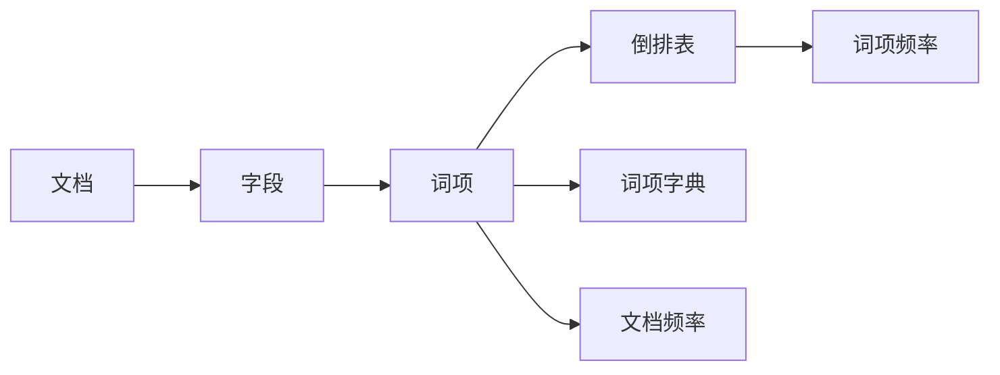

# Lucene索引文件格式：解密底层数据结构

作者：禅与计算机程序设计艺术

## 1. 背景介绍

在信息爆炸的时代，搜索引擎成为了人们获取信息的重要途径。而作为搜索引擎的核心组件，倒排索引技术扮演着至关重要的角色。Lucene，作为一个流行的开源搜索引擎库，其高效的索引和搜索能力得益于其精妙的索引文件格式设计。

本篇文章将深入剖析Lucene索引文件格式的底层数据结构，揭示其高效检索的奥秘。我们将从索引文件的整体结构出发，逐步深入到各个文件的作用和数据组织方式，并结合实际案例分析其工作原理。

### 1.1 倒排索引技术概述

在深入Lucene索引文件格式之前，我们先来回顾一下倒排索引技术的基本概念。

传统的正排索引以文档为中心，记录文档中出现的每个词项及其位置信息。而倒排索引则反其道而行之，以词项为中心，记录每个词项出现在哪些文档中，以及在每个文档中的位置信息。

#### 1.1.1 正排索引

假设我们有以下三个文档：

* 文档1: "The quick brown fox jumps over the lazy dog."
* 文档2: "The lazy cat sleeps under the sun."
* 文档3: "The quick brown rabbit jumps over the lazy frog."

使用正排索引存储这些文档，结构如下：

| 文档ID | 词项列表 |
|---|---|
| 1 | The, quick, brown, fox, jumps, over, the, lazy, dog |
| 2 | The, lazy, cat, sleeps, under, the, sun |
| 3 | The, quick, brown, rabbit, jumps, over, the, lazy, frog |

#### 1.1.2 倒排索引

使用倒排索引存储这些文档，结构如下：

| 词项 | 文档列表 |
|---|---|
| The | 1, 2, 3 |
| quick | 1, 3 |
| brown | 1, 3 |
| fox | 1 |
| jumps | 1, 3 |
| over | 1, 3 |
| lazy | 1, 2, 3 |
| dog | 1 |
| cat | 2 |
| sleeps | 2 |
| under | 2 |
| sun | 2 |
| rabbit | 3 |
| frog | 3 |

### 1.2 Lucene索引文件概述

Lucene索引文件包含多个文件，每个文件负责存储不同的信息。主要文件包括：

* 段文件（Segment files）：存储倒排索引数据、词项字典、词项频率等信息。
* 提交点文件（Commit point files）：记录索引的提交历史，用于数据恢复和版本控制。
* 锁文件（Lock files）：防止多个索引写入器同时修改索引。

## 2. 核心概念与联系

为了更好地理解Lucene索引文件格式，我们需要了解以下核心概念：

### 2.1 文档（Document）

文档是Lucene索引和搜索的基本单位，代表一个独立的信息单元。例如，一封邮件、一篇新闻文章、一个网页都可以视为一个文档。

### 2.2 字段（Field）

字段是文档的属性，用于描述文档的特定方面。例如，一封邮件可以包含主题、发件人、收件人、内容等字段。

### 2.3 词项（Term）

词项是文档中出现的单词或短语，是倒排索引的基本单位。

### 2.4 倒排表（Inverted List）

倒排表是倒排索引的核心数据结构，记录了每个词项出现在哪些文档中，以及在每个文档中的位置信息。

### 2.5 词项字典（Term Dictionary）

词项字典存储了所有词项及其对应的倒排表指针，用于快速定位词项的倒排表。

### 2.6 词项频率（Term Frequency）

词项频率是指某个词项在某个文档中出现的次数。

### 2.7 文档频率（Document Frequency）

文档频率是指包含某个词项的文档数量。

### 2.8 关联关系图



## 3. 核心算法原理具体操作步骤

### 3.1 索引创建过程

1. **文档分析**：将文档分割成词项，并对词项进行预处理，例如去除停用词、词干提取等。
2. **创建倒排索引**：为每个词项创建倒排表，记录包含该词项的文档ID和词项频率。
3. **构建词项字典**：将所有词项及其对应的倒排表指针存储到词项字典中。
4. **写入索引文件**：将倒排索引、词项字典等数据写入索引文件。

### 3.2 搜索过程

1. **查询分析**：将用户查询语句分割成词项，并进行预处理。
2. **查找词项**：在词项字典中查找查询词项对应的倒排表指针。
3. **读取倒排表**：根据倒排表指针读取词项的倒排表。
4. **合并结果**：根据查询条件合并多个词项的倒排表，得到最终的搜索结果。

## 4. 数学模型和公式详细讲解举例说明

### 4.1 TF-IDF模型

TF-IDF（Term Frequency-Inverse Document Frequency）是一种常用的文本权重计算模型，用于衡量一个词项在文档中的重要程度。

#### 4.1.1 词项频率（TF）

词项频率是指某个词项在某个文档中出现的次数，可以使用以下公式计算：

$$
TF_{t,d} = \frac{f_{t,d}}{\sum_{t' \in d} f_{t',d}}
$$

其中，$f_{t,d}$表示词项 $t$ 在文档 $d$ 中出现的次数。

#### 4.1.2 逆文档频率（IDF）

逆文档频率是指包含某个词项的文档数量的倒数的对数，可以使用以下公式计算：

$$
IDF_t = log \frac{N}{df_t}
$$

其中，$N$ 表示文档总数，$df_t$ 表示包含词项 $t$ 的文档数量。

#### 4.1.3 TF-IDF值

TF-IDF值是词项频率和逆文档频率的乘积，可以使用以下公式计算：

$$
TF-IDF_{t,d} = TF_{t,d} \times IDF_t
$$

### 4.2 Lucene评分算法

Lucene使用了一种称为TF-IDF/Similarity的评分算法，该算法是TF-IDF模型的扩展，可以根据词项频率、逆文档频率、文档长度等因素计算文档的相关性得分。

#### 4.2.1 评分公式

$$
score(q,d) = \sum_{t \in q} ( tf(t,d) \times idf(t,q,d) \times boost(t.field) ) \times norm(t,d)
$$

其中：

* $q$ 表示查询语句
* $d$ 表示文档
* $tf(t,d)$ 表示词项 $t$ 在文档 $d$ 中的词项频率
* $idf(t,q,d)$ 表示词项 $t$ 在查询语句 $q$ 和文档 $d$ 中的逆文档频率
* $boost(t.field)$ 表示词项 $t$ 所在字段的权重
* $norm(t,d)$ 表示文档 $d$ 的长度归一化因子

## 5. 项目实践：代码实例和详细解释说明

### 5.1 创建索引

```java
// 创建索引目录
Directory directory = FSDirectory.open(Paths.get("/path/to/index"));

// 创建索引写入器
IndexWriterConfig config = new IndexWriterConfig(new StandardAnalyzer());
IndexWriter writer = new IndexWriter(directory, config);

// 创建文档
Document doc = new Document();
doc.add(new TextField("title", "Lucene Index File Format", Field.Store.YES));
doc.add(new TextField("content", "This article explains the Lucene index file format in detail.", Field.Store.YES));

// 将文档添加到索引
writer.addDocument(doc);

// 关闭索引写入器
writer.close();
```

### 5.2 搜索索引

```java
// 创建索引读取器
IndexReader reader = DirectoryReader.open(directory);
IndexSearcher searcher = new IndexSearcher(reader);

// 创建查询
Query query = new TermQuery(new Term("content", "lucene"));

// 执行查询
TopDocs docs = searcher.search(query, 10);

// 打印搜索结果
for (ScoreDoc scoreDoc : docs.scoreDocs) {
    Document doc = searcher.doc(scoreDoc.doc);
    System.out.println(doc.get("title"));
}

// 关闭索引读取器
reader.close();
```

## 6. 实际应用场景

Lucene索引文件格式被广泛应用于各种搜索引擎和信息检索系统中，例如：

* **电商网站**: 商品搜索、推荐系统
* **新闻网站**: 新闻检索、个性化推荐
* **社交平台**: 用户搜索、内容推荐
* **企业内部搜索**: 文档检索、知识管理

## 7. 总结：未来发展趋势与挑战

随着数据规模的不断增长和搜索需求的不断提高，Lucene索引文件格式也在不断发展和演进。未来发展趋势包括：

* **更高的索引压缩率**: 降低存储成本、提高查询效率
* **更快的查询速度**: 支持更复杂的查询、实时搜索
* **更灵活的索引结构**: 支持动态添加字段、更新索引
* **更智能的搜索体验**: 语义理解、个性化推荐

## 8. 附录：常见问题与解答

### 8.1 问：Lucene索引文件格式有哪些优点？

答：

* **高效的检索性能**: 倒排索引结构可以快速定位包含查询词项的文档。
* **灵活的查询语法**: 支持布尔查询、短语查询、模糊查询等多种查询方式。
* **可扩展性**: 可以处理海量数据、支持分布式索引。
* **开源免费**: Lucene是一个开源项目，可以免费使用和修改。

### 8.2 问：Lucene索引文件格式有哪些缺点？

答：

* **索引创建速度较慢**: 创建索引需要对文档进行分析和处理，比较耗时。
* **索引文件较大**: 倒排索引结构需要存储大量的指针信息，索引文件通常比较大。
* **更新索引比较麻烦**: 更新索引需要重新构建索引文件，比较麻烦。
