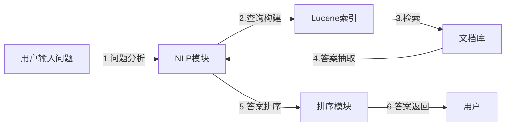

# Lucene结合NLP实现智能问答系统

作者：禅与计算机程序设计艺术

## 1. 背景介绍

### 1.1  问答系统概述
问答系统是信息检索领域的一个重要分支，旨在使用户能够以自然语言的方式提出问题并获得准确、简洁的答案。问答系统的发展经历了基于规则、基于统计和基于深度学习三个阶段，近年来，随着深度学习技术的快速发展，基于深度学习的问答系统在性能上取得了显著的提升。

### 1.2 Lucene简介
Lucene是一个开源的、高性能的全文检索库，它提供了一套完整的API用于创建索引和执行搜索。Lucene的核心是倒排索引，它能够快速地根据关键词找到包含该关键词的文档。

### 1.3 NLP技术在问答系统中的应用
自然语言处理（NLP）技术在问答系统中扮演着至关重要的角色。NLP技术可以用于对用户问题进行语义分析、实体识别、关系抽取等操作，从而更好地理解用户意图并提高答案的准确性。

## 2. 核心概念与联系

### 2.1  Lucene索引结构
Lucene的索引结构主要由以下几个部分组成：
* **倒排索引（Inverted Index）：** 存储每个词项以及包含该词项的文档列表。
* **词项字典（Term Dictionary）：** 存储所有词项的列表，并指向每个词项在倒排索引中的位置。
* **词项频率（Term Frequency）：** 记录每个词项在文档中出现的次数。
* **文档频率（Document Frequency）：** 记录包含某个词项的文档数量。

### 2.2 NLP技术
* **分词（Tokenization）：** 将文本分割成单词或词语。
* **词性标注（Part-of-Speech Tagging）：** 确定每个单词的词性，例如名词、动词、形容词等。
* **命名实体识别（Named Entity Recognition）：** 识别文本中的人名、地名、机构名等实体。
* **句法分析（Syntactic Parsing）：** 分析句子的语法结构。
* **语义分析（Semantic Analysis）：** 理解文本的含义。

### 2.3  Lucene与NLP的联系
Lucene提供了强大的全文检索功能，可以用于快速检索包含特定关键词的文档。NLP技术可以对文本进行深度分析，提取出文本中的关键信息，例如实体、关系、语义等。将Lucene与NLP技术结合起来，可以构建更加智能的问答系统。

## 3. 核心算法原理具体操作步骤

### 3.1  基于Lucene的问答系统架构



### 3.2  具体操作步骤

1. **问题分析：** 使用NLP技术对用户问题进行分析，例如分词、词性标注、命名实体识别、依存句法分析等，理解用户意图并提取关键信息。
2. **查询构建：** 根据问题分析的结果，构建Lucene查询语句。
3. **检索：** 使用Lucene执行查询，从文档库中检索相关文档。
4. **答案抽取：** 对检索到的文档进行分析，使用NLP技术提取候选答案。
5. **答案排序：** 对候选答案进行排序，例如根据答案与问题的相关性、答案的置信度等指标进行排序。
6. **答案返回：** 将排序后的答案返回给用户。

## 4. 数学模型和公式详细讲解举例说明

### 4.1 TF-IDF模型
TF-IDF（Term Frequency-Inverse Document Frequency）是一种常用的文本权重计算方法，它用于衡量一个词项在文档中的重要程度。

**TF (词项频率)**：指某个词项在当前文档中出现的频率。

$$
TF(t, d) = \frac{词项 t 在文档 d 中出现的次数}{文档 d 中所有词项的总数}
$$

**IDF (逆文档频率)**：衡量某个词项在所有文档中的区分能力。

$$
IDF(t) = log(\frac{文档总数}{包含词项 t 的文档数 + 1})
$$

**TF-IDF**：将词项频率和逆文档频率相乘，得到词项在文档中的权重。

$$
TF-IDF(t, d) = TF(t, d) * IDF(t)
$$

**举例说明：**
假设我们有两个文档：

* 文档1：我喜欢吃苹果，苹果很好吃。
* 文档2：我喜欢吃香蕉。

现在我们要计算词项“苹果”在文档1中的TF-IDF值：

* **TF("苹果", 文档1)** = 2 / 6 = 1/3
* **IDF("苹果")** = log(2 / (1 + 1)) = 0
* **TF-IDF("苹果", 文档1)** = (1/3) * 0 = 0

### 4.2  余弦相似度
余弦相似度是一种常用的文本相似度计算方法，它用于衡量两个向量之间的夹角余弦值。

**公式：**

$$
similarity(A, B) = \frac{A \cdot B}{||A|| \cdot ||B||} = \frac{\sum_{i=1}^{n} A_i * B_i}{\sqrt{\sum_{i=1}^{n} A_i^2} * \sqrt{\sum_{i=1}^{n} B_i^2}}
$$

其中，A 和 B 分别表示两个向量，n 表示向量的维度。

**举例说明：**
假设有两个向量：

* A = [1, 2, 0]
* B = [2, 1, 1]

则它们的余弦相似度为：

```
similarity(A, B) = (1 * 2 + 2 * 1 + 0 * 1) / (sqrt(1^2 + 2^2 + 0^2) * sqrt(2^2 + 1^2 + 1^2)) ≈ 0.894
```

## 5. 项目实践：代码实例和详细解释说明

### 5.1  项目环境搭建
* **编程语言：** Java
* **开发工具：** IntelliJ IDEA
* **依赖库：** Lucene、IKAnalyzer、HanLP

### 5.2  代码实例

```java
import java.io.IOException;
import java.util.ArrayList;
import java.util.List;

import org.apache.lucene.analysis.Analyzer;
import org.apache.lucene.analysis.TokenStream;
import org.apache.lucene.analysis.tokenattributes.CharTermAttribute;
import org.apache.lucene.document.Document;
import org.apache.lucene.document.Field;
import org.apache.lucene.document.TextField;
import org.apache.lucene.index.DirectoryReader;
import org.apache.lucene.index.IndexReader;
import org.apache.lucene.index.IndexWriter;
import org.apache.lucene.index.IndexWriterConfig;
import org.apache.lucene.queryparser.classic.ParseException;
import org.apache.lucene.queryparser.classic.QueryParser;
import org.apache.lucene.search.IndexSearcher;
import org.apache.lucene.search.Query;
import org.apache.lucene.search.ScoreDoc;
import org.apache.lucene.search.TopDocs;
import org.apache.lucene.store.Directory;
import org.apache.lucene.store.RAMDirectory;
import org.wltea.analyzer.lucene.IKAnalyzer;

public class LuceneQA {

    public static void main(String[] args) throws IOException, ParseException {
        // 1. 创建索引
        Directory indexDir = new RAMDirectory();
        Analyzer analyzer = new IKAnalyzer();
        IndexWriterConfig config = new IndexWriterConfig(analyzer);
        IndexWriter indexWriter = new IndexWriter(indexDir, config);

        // 创建文档并添加到索引
        Document doc1 = new Document();
        doc1.add(new TextField("content", "我喜欢吃苹果，苹果很好吃。", Field.Store.YES));
        indexWriter.addDocument(doc1);

        Document doc2 = new Document();
        doc2.add(new TextField("content", "我喜欢吃香蕉。", Field.Store.YES));
        indexWriter.addDocument(doc2);

        indexWriter.close();

        // 2. 查询
        String question = "你喜欢吃什么水果？";

        // 使用NLP技术对问题进行分析
        List<String> keywords = analyzeQuestion(question);

        // 构建Lucene查询语句
        StringBuilder queryStr = new StringBuilder();
        for (String keyword : keywords) {
            queryStr.append("content:").append(keyword).append(" ");
        }

        // 创建查询解析器
        QueryParser parser = new QueryParser("content", analyzer);
        Query query = parser.parse(queryStr.toString());

        // 3. 检索
        IndexReader indexReader = DirectoryReader.open(indexDir);
        IndexSearcher searcher = new IndexSearcher(indexReader);
        TopDocs docs = searcher.search(query, 10);

        // 4. 答案抽取
        List<String> answers = new ArrayList<>();
        for (ScoreDoc scoreDoc : docs.scoreDocs) {
            Document doc = searcher.doc(scoreDoc.doc);
            String content = doc.get("content");
            answers.add(content);
        }

        // 5. 答案排序
        // ...

        // 6. 答案返回
        for (String answer : answers) {
            System.out.println(answer);
        }

        indexReader.close();
    }

    // 使用NLP技术对问题进行分析
    private static List<String> analyzeQuestion(String question) {
        // ...
        return null;
    }
}
```

### 5.3 代码解释
* **创建索引：** 首先，我们创建一个内存索引目录 `RAMDirectory`，并使用 `IKAnalyzer` 分词器创建一个索引写入器 `IndexWriter`。然后，我们创建两个文档，分别包含“我喜欢吃苹果，苹果很好吃。”和“我喜欢吃香蕉。”两句话，并将它们添加到索引中。
* **查询：** 接下来，我们定义一个用户问题 "你喜欢吃什么水果？"，并使用 `analyzeQuestion` 方法对问题进行分析，提取关键词。然后，我们使用关键词构建 Lucene 查询语句，并使用 `QueryParser` 解析查询语句。
* **检索：** 我们使用 `IndexSearcher` 创建一个索引搜索器，并执行查询。
* **答案抽取：** 我们遍历搜索结果，提取文档内容作为候选答案。
* **答案排序：**  （代码中省略） 可以根据答案与问题的相关性、答案的置信度等指标对候选答案进行排序。
* **答案返回：** 最后，我们打印所有候选答案。

## 6. 实际应用场景

### 6.1  客服机器人
智能问答系统可以用于构建客服机器人，回答用户关于产品或服务的问题，提供更加高效、便捷的客户服务。

### 6.2  智能搜索
智能问答系统可以用于提升搜索引擎的搜索体验，使用户能够以自然语言的方式提问并获得更加精准的搜索结果。

### 6.3  知识管理
智能问答系统可以用于构建企业内部的知识库，帮助员工快速找到所需信息，提高工作效率。

## 7. 工具和资源推荐

### 7.1  Lucene
* **官网：** https://lucene.apache.org/
* **文档：** https://lucene.apache.org/core/

### 7.2  IKAnalyzer
* **GitHub：** https://github.com/wks/ik-analyzer

### 7.3  HanLP
* **官网：** https://hanlp.hankcs.com/

## 8. 总结：未来发展趋势与挑战

### 8.1  未来发展趋势
* **更加精准的语义理解：** 随着深度学习技术的不断发展，问答系统将能够更加准确地理解用户意图，提供更加精准的答案。
* **多模态问答：** 未来的问答系统将不再局限于文本，而是能够处理图像、语音等多种模态的信息。
* **个性化问答：** 问答系统将能够根据用户的历史行为和偏好，提供更加个性化的答案。

### 8.2  挑战
* **数据稀疏性：** 构建高质量的问答系统需要大量的训练数据，而现实世界中的数据往往是稀疏的。
* **知识表示：** 如何有效地表示和存储知识是问答系统面临的一个重要挑战。
* **可解释性：** 深度学习模型的可解释性较差，如何提高问答系统的可解释性是一个需要解决的问题。

## 9. 附录：常见问题与解答

### 9.1  如何提高问答系统的准确率？

* **使用高质量的训练数据：** 训练数据的质量对问答系统的性能至关重要，应尽量使用人工标注的数据。
* **选择合适的NLP技术：** 不同的NLP技术适用于不同的场景，应根据具体情况选择合适的技术。
* **优化模型参数：** 模型参数对问答系统的性能有很大影响，应根据实验结果进行调整。

### 9.2  Lucene如何处理中文分词？

Lucene本身并不支持中文分词，需要使用第三方中文分词器，例如IKAnalyzer、HanLP等。

### 9.3  如何评估问答系统的性能？

常用的问答系统评估指标包括：

* **准确率（Accuracy）：** 指正确答案的数量占所有答案数量的比例。
* **召回率（Recall）：** 指正确答案的数量占所有相关答案数量的比例。
* **F1值（F1-score）：** 准确率和召回率的调和平均数。