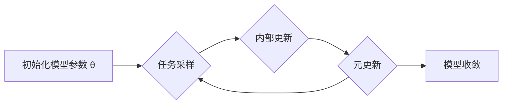

# MAML与迁移学习:知识迁移新路径

作者：禅与计算机程序设计艺术

## 1. 背景介绍

### 1.1. 人工智能与机器学习的局限性

   人工智能(AI)近年来取得了令人瞩目的成就，尤其是在机器学习(ML)领域。然而，传统的机器学习方法通常需要大量的标记数据，并且在面对新任务或领域时泛化能力有限。这种局限性在很大程度上阻碍了人工智能在更广泛场景中的应用。

### 1.2. 迁移学习的兴起

   为了克服传统机器学习的局限性，迁移学习应运而生。迁移学习旨在利用源领域中的知识来提高目标领域中的学习效率。这种知识迁移的方式可以帮助我们解决数据稀缺、泛化能力弱等问题。

### 1.3. 元学习：迈向通用人工智能

   元学习是近年来兴起的一种更高层次的机器学习方法，其目标是让机器学习如何学习。元学习旨在通过学习大量的任务，使模型能够快速适应新的任务，从而实现更强的泛化能力。

### 1.4. MAML：一种高效的元学习算法

   MAML(Model-Agnostic Meta-Learning)是一种简单而有效的元学习算法，它可以在各种不同的模型和任务上实现快速适应。MAML通过学习一个对任务敏感的初始化参数，使得模型能够在少量样本上快速微调，从而实现知识的快速迁移。

## 2. 核心概念与联系

### 2.1. 迁移学习

   * **定义：** 迁移学习是指利用源领域中的知识来提高目标领域中的学习效率。
   * **目标：** 解决目标领域数据稀缺、泛化能力弱等问题。
   * **方法：** 包括基于样本的迁移、基于特征的迁移、基于模型的迁移等。

### 2.2. 元学习

   * **定义：** 元学习是机器学习的一个分支，其目标是让机器学习如何学习。
   * **目标：** 使模型能够快速适应新的任务，从而实现更强的泛化能力。
   * **方法：** 包括基于梯度的元学习、基于度量的元学习、基于模型的元学习等。

### 2.3. MAML

   * **定义：** MAML是一种基于梯度的元学习算法，它通过学习一个对任务敏感的初始化参数，使得模型能够在少量样本上快速微调。
   * **目标：** 实现快速适应和知识迁移。
   * **优势：** 简单、有效、模型无关。

### 2.4. 联系

   * 迁移学习是元学习的目标之一。
   * MAML是一种实现迁移学习的有效方法。
   * 元学习为迁移学习提供了理论基础和技术支持。

## 3. 核心算法原理具体操作步骤

### 3.1. MAML算法流程

   1. **初始化：** 初始化模型参数 $\theta$。
   2. **任务采样：** 从任务分布中随机采样一批任务 $T_i$。
   3. **内部更新：** 对于每个任务 $T_i$，利用该任务的少量样本数据，通过梯度下降更新模型参数 $\theta_i' = \theta - \alpha \nabla_{\theta} L_{T_i}(\theta)$。
   4. **元更新：** 利用所有任务的损失函数的梯度，更新模型参数 $\theta = \theta - \beta \nabla_{\theta} \sum_{i=1}^{N} L_{T_i}(\theta_i')$。
   5. **重复步骤2-4，直到模型收敛。**

### 3.2. 算法解释

   * **内部更新：**  对于每个任务，MAML 首先使用该任务的少量样本数据对模型参数进行更新。这个更新过程类似于传统的梯度下降，但是更新后的参数 $\theta_i'$ 只是针对当前任务的，而不是全局的。
   * **元更新：**  MAML 的关键在于元更新步骤。在元更新中，MAML 使用所有任务的损失函数的梯度来更新模型参数 $\theta$。这样做的目的是找到一个对所有任务都比较好的初始化参数，使得模型能够在面对新任务时快速适应。
   * **任务敏感的初始化参数：**  MAML 学习到的初始化参数 $\theta$ 是对任务敏感的。这意味着，对于不同的任务，模型只需要进行少量的微调就可以适应。

### 3.3. 图示说明




## 4. 数学模型和公式详细讲解举例说明

### 4.1. 目标函数

   MAML 的目标函数是找到一个初始化参数 $\theta$，使得模型能够在面对新任务时，只需利用少量样本数据进行微调，就能获得较好的性能。

   具体而言，MAML 的目标函数可以表示为：

   $$
   \min_{\theta} \mathbb{E}_{T \sim p(T)} [L_T(\theta_T^*)]
   $$

   其中，$p(T)$ 表示任务分布，$T$ 表示从任务分布中采样的一个任务，$L_T(\theta)$ 表示模型在任务 $T$ 上的损失函数，$\theta_T^*$ 表示模型在任务 $T$ 上的最优参数。

### 4.2. 内部更新公式

   MAML 的内部更新公式为：

   $$
   \theta_i' = \theta - \alpha \nabla_{\theta} L_{T_i}(\theta)
   $$

   其中，$\alpha$ 是学习率，$\nabla_{\theta} L_{T_i}(\theta)$ 表示模型在任务 $T_i$ 上的损失函数关于参数 $\theta$ 的梯度。

### 4.3. 元更新公式

   MAML 的元更新公式为：

   $$
   \theta = \theta - \beta \nabla_{\theta} \sum_{i=1}^{N} L_{T_i}(\theta_i')
   $$

   其中，$\beta$ 是元学习率，$\nabla_{\theta} \sum_{i=1}^{N} L_{T_i}(\theta_i')$ 表示所有任务的损失函数关于参数 $\theta$ 的梯度的平均值。

### 4.4. 举例说明

   假设我们要训练一个图像分类模型，可以将每个图像类别视为一个任务。我们可以使用 MAML 来学习一个对不同图像类别都比较好的初始化参数，使得模型能够在面对新的图像类别时，只需利用少量样本数据进行微调，就能获得较好的分类性能。


## 5. 项目实践：代码实例和详细解释说明

```python
import torch
import torch.nn as nn
import torch.optim as optim

# 定义模型
class Model(nn.Module):
    def __init__(self):
        super(Model, self).__init__()
        # 定义模型结构

    def forward(self, x):
        # 定义模型的前向传播过程
        return output

# 定义 MAML 算法
class MAML:
    def __init__(self, model, inner_lr, meta_lr, K):
        self.model = model
        self.inner_lr = inner_lr
        self.meta_lr = meta_lr
        self.K = K
        self.meta_optimizer = optim.Adam(self.model.parameters(), lr=self.meta_lr)

    def inner_loop(self, task_data):
        # 获取任务数据
        support_images, support_labels, query_images, query_labels = task_data

        # 内部更新
        for _ in range(self.K):
            # 前向传播
            support_outputs = self.model(support_images)
            # 计算损失
            loss = nn.CrossEntropyLoss()(support_outputs, support_labels)
            # 反向传播
            grad = torch.autograd.grad(loss, self.model.parameters())
            # 更新模型参数
            for param, grad in zip(self.model.parameters(), grad):
                param -= self.inner_lr * grad

        # 计算查询集上的损失
        query_outputs = self.model(query_images)
        query_loss = nn.CrossEntropyLoss()(query_outputs, query_labels)

        return query_loss

    def meta_update(self, tasks_data):
        # 初始化元梯度
        meta_grad = [torch.zeros_like(param) for param in self.model.parameters()]

        # 遍历所有任务
        for task_data in tasks_
            # 内部更新
            query_loss = self.inner_loop(task_data)

            # 计算元梯度
            grad = torch.autograd.grad(query_loss, self.model.parameters())
            for i, (param, grad) in enumerate(zip(self.model.parameters(), grad)):
                meta_grad[i] += grad

        # 更新模型参数
        for param, grad in zip(self.model.parameters(), meta_grad):
            param -= self.meta_lr * grad / len(tasks_data)
```


## 6. 实际应用场景

### 6.1. 少样本学习

   MAML 可以用于解决少样本学习问题，例如图像分类、文本分类等。在少样本学习中，每个类别只有少量样本数据，传统的机器学习方法很难取得良好的效果。而 MAML 可以通过学习一个对不同类别都比较好的初始化参数，使得模型能够在面对新的类别时，只需利用少量样本数据进行微调，就能获得较好的分类性能。

### 6.2. 强化学习

   MAML 也可以用于强化学习，例如机器人控制、游戏 AI 等。在强化学习中，智能体需要通过与环境交互来学习最优策略。MAML 可以帮助智能体快速适应新的环境，从而提高学习效率。

### 6.3. 领域自适应

   MAML 还可以用于领域自适应，例如将一个模型从一个领域迁移到另一个领域。例如，我们可以使用 MAML 将一个在新闻文本上训练的文本分类模型迁移到微博文本上。


## 7. 工具和资源推荐

* **PyTorch:**  PyTorch 是一个开源的机器学习框架，它提供了丰富的工具和库，可以方便地实现 MAML 算法。
* **TensorFlow:** TensorFlow 是另一个开源的机器学习框架，它也提供了实现 MAML 算法的工具和库。
* **MAML 代码库:**  GitHub 上有许多开源的 MAML 代码库，可以帮助你快速入门 MAML 算法。


## 8. 总结：未来发展趋势与挑战

   MAML 是一种简单而有效的元学习算法，它在迁移学习领域具有广阔的应用前景。未来，MAML 的发展趋势主要包括以下几个方面：

* **提高 MAML 的效率和可扩展性:**  MAML 的计算复杂度较高，尤其是在处理大规模数据集时。未来需要研究如何提高 MAML 的效率和可扩展性，使其能够应用于更广泛的场景。
* **探索 MAML 与其他机器学习方法的结合:**  MAML 可以与其他机器学习方法结合，例如强化学习、对抗学习等，以进一步提高模型的性能。
* **将 MAML 应用于更广泛的领域:**  MAML 目前主要应用于计算机视觉和自然语言处理领域，未来需要探索将其应用于更广泛的领域，例如医疗、金融等。

## 9. 附录：常见问题与解答

### 9.1. MAML 与其他元学习算法的区别？

   MAML 与其他元学习算法的主要区别在于其更新方式。MAML 通过学习一个对任务敏感的初始化参数，使得模型能够在少量样本上快速微调，从而实现知识的快速迁移。而其他元学习算法，例如 Reptile，则是通过直接优化模型在多个任务上的平均性能来实现元学习。


### 9.2. MAML 的优缺点？

   **优点:**

   * 简单有效
   * 模型无关
   * 可以实现快速适应和知识迁移

   **缺点:**

   * 计算复杂度较高
   * 对超参数敏感


### 9.3. 如何选择 MAML 的超参数？

   MAML 的超参数主要包括内部学习率、元学习率和内部更新步数等。选择合适的超参数对于 MAML 的性能至关重要。通常情况下，可以通过网格搜索、随机搜索等方法来寻找最优的超参数。


### 9.4. MAML 的应用场景有哪些？

   MAML 的应用场景非常广泛，例如：

   * 少样本学习
   * 强化学习
   * 领域自适应