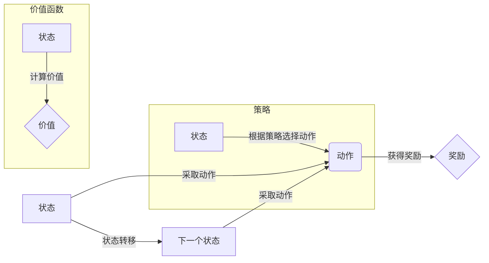

# MDP在游戏AI中的应用

作者：禅与计算机程序设计艺术

## 1. 背景介绍

### 1.1 游戏AI的挑战与机遇

游戏AI，顾名思义，就是赋予游戏中的非玩家角色（NPC）以类似人类玩家的智能，使其能够感知环境、做出决策并采取行动。近年来，随着游戏产业的蓬勃发展和玩家对游戏体验要求的不断提高，游戏AI领域正面临着前所未有的挑战与机遇。

一方面，游戏场景日益复杂，从简单的棋盘游戏到拥有广阔地图和丰富剧情的开放世界游戏，对游戏AI的智能水平提出了更高的要求。传统的基于规则或有限状态机的AI设计方法已经难以满足现代游戏的需求，需要更加灵活、高效、智能的算法来应对复杂多变的游戏环境。

另一方面，人工智能技术，特别是深度学习和强化学习的快速发展为游戏AI带来了新的突破口。AlphaGo、AlphaZero等人工智能程序在围棋、象棋等复杂游戏中的出色表现，极大地鼓舞了游戏开发者探索更加智能的AI算法。

### 1.2 MDP：一种强大的决策框架

马尔可夫决策过程（Markov Decision Process，MDP）作为一种经典的强化学习模型，为解决游戏AI问题提供了一种强大而灵活的框架。MDP的核心思想是将游戏过程建模为一个由状态、动作、奖励和状态转移概率组成的系统，通过学习最优的策略，使得智能体在与环境交互的过程中能够获得最大的累积奖励。

### 1.3 本文目标与结构

本文旨在深入探讨MDP在游戏AI中的应用，帮助读者理解MDP的基本原理、算法实现以及实际应用案例。文章将按照以下结构展开：

- **背景介绍**:  介绍游戏AI的挑战与机遇，以及MDP作为一种强大的决策框架的优势。
- **核心概念与联系**:  详细解释MDP的核心概念，包括状态、动作、奖励、策略、价值函数等，并阐述它们之间的联系。
- **核心算法原理具体操作步骤**:  介绍求解MDP最优策略的常用算法，例如价值迭代、策略迭代、Q-Learning等，并给出具体的算法流程和示例。
- **数学模型和公式详细讲解举例说明**:  使用数学公式和示例，深入浅出地解释MDP的数学模型，并推导相关算法的公式。
- **项目实践：代码实例和详细解释说明**:  使用Python语言和相关库，实现一个简单的游戏AI案例，并给出详细的代码解释和运行结果分析。
- **实际应用场景**:  介绍MDP在不同类型游戏中的应用场景，例如棋盘游戏、角色扮演游戏、即时战略游戏等。
- **工具和资源推荐**:  推荐一些常用的MDP学习资源和工具，包括书籍、论文、开源库等。
- **总结：未来发展趋势与挑战**:  总结MDP在游戏AI中的优势和局限性，并展望未来发展趋势和挑战。
- **附录：常见问题与解答**:  收集整理一些MDP学习过程中常见的问题，并给出解答。


## 2. 核心概念与联系

### 2.1  状态 (State)

在MDP中，状态是指智能体在环境中所处的特定情况。例如，在一个棋盘游戏中，状态可以表示为棋盘上所有棋子的位置和颜色。

### 2.2  动作 (Action)

动作是指智能体可以采取的操作，例如，在一个棋盘游戏中，动作可以表示为将某个棋子移动到另一个位置。

### 2.3  奖励 (Reward)

奖励是环境对智能体采取某个动作后给予的反馈，用于衡量该动作的好坏。例如，在一个棋盘游戏中，如果智能体成功地将对方的将棋将死，则会获得一个正奖励；反之，如果智能体自己的将棋被将死，则会获得一个负奖励。

### 2.4  状态转移概率 (State Transition Probability)

状态转移概率是指智能体在当前状态下采取某个动作后，转移到下一个状态的概率。例如，在一个棋盘游戏中，如果智能体将某个棋子移动到一个新的位置，则该棋子可能会被对方吃掉，也可能不会被吃掉，状态转移概率就表示了这两种情况发生的可能性大小。

### 2.5  策略 (Policy)

策略是指智能体在每个状态下选择动作的规则。例如，一个简单的策略可以是：在每个状态下，都选择能够获得最大奖励的动作。

### 2.6  价值函数 (Value Function)

价值函数用于评估智能体在某个状态下采取某个策略的长期价值。它表示了智能体从当前状态开始，按照某个策略执行动作，直到游戏结束所能获得的累积奖励的期望值。

### 2.7  关系图

下面使用 Mermaid 流程图展示 MDP 核心概念之间的关系：



## 3. 核心算法原理具体操作步骤

### 3.1 价值迭代 (Value Iteration)

价值迭代是一种求解MDP最优策略的经典算法，其基本思想是通过不断迭代计算每个状态的价值函数，直到价值函数收敛到最优价值函数。

#### 3.1.1 算法流程

1. 初始化所有状态的价值函数为0。
2. 对每个状态s，执行以下操作：
   - 对每个动作a，计算采取该动作后所能获得的期望奖励：
     $$Q(s,a) = \sum_{s'} P(s'|s,a) [R(s,a,s') + \gamma V(s')]$$
     其中，$P(s'|s,a)$表示在状态s下采取动作a后转移到状态s'的概率，$R(s,a,s')$表示在状态s下采取动作a转移到状态s'所获得的奖励，$\gamma$是折扣因子，用于控制未来奖励对当前状态价值的影响。
   - 更新状态s的价值函数：
     $$V(s) = \max_a Q(s,a)$$
3. 重复步骤2，直到所有状态的价值函数都收敛。

#### 3.1.2 示例

以一个简单的迷宫游戏为例，假设迷宫地图如下所示：

```
+---+---+---+
| S |   | G |
+---+---+---+
```

其中，S表示起点，G表示终点。智能体可以采取的动作有：向上、向下、向左、向右。如果智能体成功到达终点，则获得奖励1；如果撞到墙壁，则获得奖励-1；其他情况下，获得奖励0。

使用价值迭代算法求解该迷宫游戏的的过程如下：

1. 初始化所有状态的价值函数为0。
2. 对每个状态s，执行以下操作：
   - 对每个动作a，计算采取该动作后所能获得的期望奖励。例如，对于起点状态S，向上、向下、向左、向右四个动作的期望奖励分别为：
     - 向上：$Q(S,up) = 0.8 * (-1) + 0.2 * 0 = -0.8$
     - 向下：$Q(S,down) = 0.8 * 0 + 0.2 * 0 = 0$
     - 向左：$Q(S,left) = 0.8 * (-1) + 0.2 * 0 = -0.8$
     - 向右：$Q(S,right) = 0.8 * 0 + 0.2 * 0 = 0$
   - 更新状态S的价值函数：
     $$V(S) = \max_a Q(S,a) = 0$$
3. 重复步骤2，直到所有状态的价值函数都收敛。最终得到的价值函数如下所示：

```
+---+---+---+
| 0 | 0 | 1 |
+---+---+---+
```

根据价值函数，可以得到最优策略：在起点状态S，选择向下或向右移动。

### 3.2 策略迭代 (Policy Iteration)

策略迭代是另一种求解MDP最优策略的常用算法，其基本思想是先初始化一个策略，然后不断迭代计算该策略下的价值函数，并根据价值函数更新策略，直到策略不再发生变化。

#### 3.2.1 算法流程

1. 初始化一个策略$\pi$。
2. 对当前策略$\pi$，执行以下操作：
   - 计算策略$\pi$下的价值函数$V^\pi$。
   - 对每个状态s，执行以下操作：
     - 对每个动作a，计算采取该动作后所能获得的期望奖励：
       $$Q^\pi(s,a) = \sum_{s'} P(s'|s,a) [R(s,a,s') + \gamma V^\pi(s')]$$
     - 更新状态s处的策略：
       $$\pi'(s) = \arg\max_a Q^\pi(s,a)$$
3. 如果策略$\pi'$与$\pi$相同，则停止迭代；否则，令$\pi = \pi'$，并返回步骤2。

#### 3.2.2 示例

以与价值迭代相同的迷宫游戏为例，使用策略迭代算法求解该迷宫游戏的过程如下：

1. 初始化一个策略$\pi$，例如，在每个状态下都选择向上移动。
2. 对当前策略$\pi$，执行以下操作：
   - 计算策略$\pi$下的价值函数$V^\pi$。由于初始策略是向上移动，因此所有状态的价值函数都为-1。
   - 对每个状态s，执行以下操作：
     - 对每个动作a，计算采取该动作后所能获得的期望奖励。例如，对于起点状态S，向上、向下、向左、向右四个动作的期望奖励分别为：
       - 向上：$Q^\pi(S,up) = 0.8 * (-1) + 0.2 * (-1) = -1$
       - 向下：$Q^\pi(S,down) = 0.8 * (-1) + 0.2 * (-1) = -1$
       - 向左：$Q^\pi(S,left) = 0.8 * (-1) + 0.2 * (-1) = -1$
       - 向右：$Q^\pi(S,right) = 0.8 * (-1) + 0.2 * (-1) = -1$
     - 更新状态S处的策略：
       $$\pi'(S) = \arg\max_a Q^\pi(S,a) = \{up, down, left, right\}$$
       由于所有动作的期望奖励都相同，因此可以选择任意一个动作。
3. 由于策略$\pi'$与$\pi$不同，因此令$\pi = \pi'$，并返回步骤2。
4. 重复步骤2和步骤3，直到策略不再发生变化。最终得到的策略与价值迭代算法得到的策略相同：在起点状态S，选择向下或向右移动。

### 3.3 Q-Learning

Q-Learning是一种无模型强化学习算法，它不需要知道环境的状态转移概率，而是通过与环境交互，直接学习每个状态-动作对的价值。

#### 3.3.1 算法流程

1. 初始化所有状态-动作对的Q值$Q(s,a)$为0。
2. 对每个episode，执行以下操作：
   - 初始化状态s。
   - 对每个时间步t，执行以下操作：
     - 根据当前状态s和Q值$Q(s,a)$，选择一个动作a。
     - 执行动作a，观察环境的下一个状态s'和奖励r。
     - 更新Q值：
       $$Q(s,a) = Q(s,a) + \alpha [r + \gamma \max_{a'} Q(s',a') - Q(s,a)]$$
       其中，$\alpha$是学习率，用于控制每次更新的幅度。
     - 令$s = s'$。
   - 直到达到终止状态。
3. 重复步骤2，直到Q值收敛。

#### 3.3.2 示例

以与价值迭代和策略迭代相同的迷宫游戏为例，使用Q-Learning算法求解该迷宫游戏的过程如下：

1. 初始化所有状态-动作对的Q值$Q(s,a)$为0。
2. 对每个episode，执行以下操作：
   - 初始化状态s为起点状态S。
   - 对每个时间步t，执行以下操作：
     - 根据当前状态s和Q值$Q(s,a)$，选择一个动作a。例如，可以使用$\epsilon$-greedy策略，以一定的概率选择当前Q值最大的动作，以一定的概率随机选择一个动作。
     - 执行动作a，观察环境的下一个状态s'和奖励r。
     - 更新Q值：
       $$Q(s,a) = Q(s,a) + \alpha [r + \gamma \max_{a'} Q(s',a') - Q(s,a)]$$
     - 令$s = s'$。
   - 直到达到终止状态，即到达终点状态G。
3. 重复步骤2，直到Q值收敛。最终得到的Q值如下所示：

```
+---+---+---+
| 0,0  | 0,0  | 1,0 |
+---+---+---+
| 0,0 | 0,0  | 0,0 |
+---+---+---+
```

根据Q值，可以得到最优策略：在起点状态S，选择向下或向右移动。


## 4. 数学模型和公式详细讲解举例说明

### 4.1  MDP的数学模型

MDP可以用一个四元组$(S,A,P,R)$来表示，其中：

- $S$表示状态空间，即所有可能的状态的集合。
- $A$表示动作空间，即所有可能的动作的集合。
- $P$表示状态转移概率函数，$P(s'|s,a)$表示在状态$s$下采取动作$a$后转移到状态$s'$的概率。
- $R$表示奖励函数，$R(s,a,s')$表示在状态$s$下采取动作$a$转移到状态$s'$所获得的奖励。

### 4.2  价值函数

价值函数用于评估智能体在某个状态下采取某个策略的长期价值。它可以分为两种类型：

- **状态价值函数 (State Value Function)**:  $V^\pi(s)$表示智能体从状态$s$开始，按照策略$\pi$执行动作，直到游戏结束所能获得的累积奖励的期望值。
- **动作价值函数 (Action Value Function)**:  $Q^\pi(s,a)$表示智能体从状态$s$开始，采取动作$a$，然后按照策略$\pi$执行动作，直到游戏结束所能获得的累积奖励的期望值。

### 4.3  贝尔曼方程 (Bellman Equation)

贝尔曼方程是MDP的核心方程，它描述了价值函数之间的关系。

#### 4.3.1  状态价值函数的贝尔曼方程

$$V^\pi(s) = \sum_{a \in A} \pi(a|s) \sum_{s' \in S} P(s'|s,a) [R(s,a,s') + \gamma V^\pi(s')]$$

其中，$\pi(a|s)$表示策略$\pi$在状态$s$下选择动作$a$的概率。

#### 4.3.2  动作价值函数的贝尔曼方程

$$Q^\pi(s,a) = \sum_{s' \in S} P(s'|s,a) [R(s,a,s') + \gamma \sum_{a' \in A} \pi(a'|s') Q^\pi(s',a')]$$

### 4.4  最优价值函数和最优策略

- **最优状态价值函数 (Optimal State Value Function)**:  $V^*(s)$表示在所有可能的策略中，能够使得智能体从状态$s$开始获得最大累积奖励的策略所对应的价值函数。
- **最优动作价值函数 (Optimal Action Value Function)**:  $Q^*(s,a)$表示在所有可能的策略中，能够使得智能体从状态$s$开始，采取动作$a$后获得最大累积奖励的策略所对应的价值函数。

最优策略可以通过最优价值函数来得到：

$$\pi^*(s) = \arg\max_a Q^*(s,a)$$

### 4.5  举例说明

以一个简单的投资问题为例，假设你有100元钱，可以选择将钱存入银行或者投资股票。存入银行的年利率为5%，投资股票的年收益率为10%或-5%，具体收益率取决于市场行情。

我们可以将该投资问题建模为一个MDP，其中：

- 状态空间$S = \{0, 1, 2, ..., 100\}$，表示你当前拥有的钱数。
- 动作空间$A = \{bank, stock\}$，表示你可以采取的两种投资方式。
- 状态转移概率函数$P$：
  - 如果你选择将钱存入银行，则你的钱数会增加5%。
  - 如果你选择投资股票，则你的钱数会增加10%或减少5%，具体取决于市场行情。
- 奖励函数$R$：
  - 如果你选择将钱存入银行，则你的奖励为你获得的利息。
  - 如果你选择投资股票，则