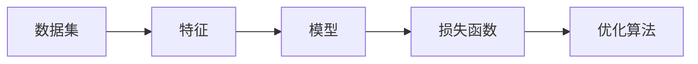

## 1. 背景介绍

### 1.1 人工智能的崛起

近年来，人工智能（AI）技术取得了突飞猛进的发展，已经渗透到各行各业，深刻地改变着我们的生活方式。机器学习作为人工智能的核心领域之一，扮演着至关重要的角色。它赋予计算机从数据中学习的能力，从而使计算机能够像人类一样思考、预测和决策。

### 1.2 机器学习的定义

机器学习的核心思想是利用算法从数据中学习模式和规律，并利用这些规律对新的数据进行预测或决策。与传统的基于规则的编程方式不同，机器学习算法能够自动地从数据中提取特征，并建立模型来描述数据的内在规律。

### 1.3 机器学习的应用

机器学习的应用领域非常广泛，包括：

* **图像识别:** 人脸识别、物体检测、医学影像分析等
* **自然语言处理:** 语音识别、机器翻译、文本分类等
* **推荐系统:** 商品推荐、电影推荐、音乐推荐等
* **金融风控:** 信用评分、欺诈检测等
* **医疗诊断:** 疾病预测、辅助诊断等

## 2. 核心概念与联系

### 2.1 数据集

数据集是机器学习算法的输入，它包含大量的样本数据，每个样本数据由多个特征组成。

* **训练集:** 用于训练机器学习模型的数据集。
* **验证集:** 用于评估模型性能的数据集，通常用于调整模型参数。
* **测试集:** 用于最终评估模型性能的数据集，模拟真实环境下的数据分布。

### 2.2 特征

特征是描述样本数据的属性，例如：

* **图像数据:** 像素值、颜色、纹理等
* **文本数据:** 词语、句子、段落等
* **数值数据:** 年龄、收入、身高、体重等

### 2.3 模型

模型是机器学习算法的输出，它是一个数学函数，用于描述数据的内在规律。常见的模型类型包括：

* **线性模型:** 线性回归、逻辑回归等
* **决策树:** ID3、C4.5、CART等
* **支持向量机:** SVM
* **神经网络:** CNN、RNN、LSTM等

### 2.4 损失函数

损失函数用于衡量模型预测结果与真实值之间的差异，常见的损失函数包括：

* **均方误差:** 用于回归问题
* **交叉熵:** 用于分类问题

### 2.5 优化算法

优化算法用于寻找最优的模型参数，使得损失函数最小化，常见的优化算法包括：

* **梯度下降法:** GD、SGD、Adam等

### 2.6 核心概念联系图



## 3. 核心算法原理具体操作步骤

### 3.1 线性回归

#### 3.1.1 原理

线性回归是一种用于预测连续值输出的线性模型，其目标是找到一条直线或超平面，能够最好地拟合输入特征和输出值之间的关系。

#### 3.1.2 操作步骤

1. 准备数据集，包括输入特征和输出值。
2. 选择损失函数，例如均方误差。
3. 选择优化算法，例如梯度下降法。
4. 初始化模型参数。
5. 使用训练集进行模型训练，通过迭代更新模型参数，使得损失函数最小化。
6. 使用验证集评估模型性能，并调整模型参数。
7. 使用测试集评估最终模型性能。

#### 3.1.3 代码示例

```python
import numpy as np
from sklearn.linear_model import LinearRegression

# 准备数据集
X = np.array([[1], [2], [3], [4], [5]])
y = np.array([2, 4, 6, 8, 10])

# 创建线性回归模型
model = LinearRegression()

# 训练模型
model.fit(X, y)

# 预测新数据
X_new = np.array([[6]])
y_pred = model.predict(X_new)

# 输出预测结果
print(y_pred)
```

### 3.2 逻辑回归

#### 3.2.1 原理

逻辑回归是一种用于预测二元分类输出的线性模型，其输出值介于 0 到 1 之间，表示样本属于某个类别的概率。

#### 3.2.2 操作步骤

1. 准备数据集，包括输入特征和类别标签。
2. 选择损失函数，例如交叉熵。
3. 选择优化算法，例如梯度下降法。
4. 初始化模型参数。
5. 使用训练集进行模型训练，通过迭代更新模型参数，使得损失函数最小化。
6. 使用验证集评估模型性能，并调整模型参数。
7. 使用测试集评估最终模型性能。

#### 3.2.3 代码示例

```python
import numpy as np
from sklearn.linear_model import LogisticRegression

# 准备数据集
X = np.array([[1, 2], [2, 3], [3, 4], [4, 5], [5, 6]])
y = np.array([0, 0, 1, 1, 1])

# 创建逻辑回归模型
model = LogisticRegression()

# 训练模型
model.fit(X, y)

# 预测新数据
X_new = np.array([[6, 7]])
y_pred = model.predict(X_new)

# 输出预测结果
print(y_pred)
```

## 4. 数学模型和公式详细讲解举例说明

### 4.1 线性回归

#### 4.1.1 模型公式

$$
y = w_0 + w_1 x_1 + w_2 x_2 + ... + w_n x_n
$$

其中：

* $y$ 是输出值
* $x_1, x_2, ..., x_n$ 是输入特征
* $w_0, w_1, w_2, ..., w_n$ 是模型参数

#### 4.1.2 损失函数

均方误差：

$$
MSE = \frac{1}{m} \sum_{i=1}^{m} (y_i - \hat{y_i})^2
$$

其中：

* $m$ 是样本数量
* $y_i$ 是真实值
* $\hat{y_i}$ 是预测值

#### 4.1.3 优化算法

梯度下降法：

$$
w_j = w_j - \alpha \frac{\partial MSE}{\partial w_j}
$$

其中：

* $\alpha$ 是学习率
* $\frac{\partial MSE}{\partial w_j}$ 是损失函数对参数 $w_j$ 的偏导数

### 4.2 逻辑回归

#### 4.2.1 模型公式

$$
p = \frac{1}{1 + e^{-(w_0 + w_1 x_1 + w_2 x_2 + ... + w_n x_n)}}
$$

其中：

* $p$ 是样本属于正类的概率
* $x_1, x_2, ..., x_n$ 是输入特征
* $w_0, w_1, w_2, ..., w_n$ 是模型参数

#### 4.2.2 损失函数

交叉熵：

$$
CE = -\frac{1}{m} \sum_{i=1}^{m} [y_i log(p_i) + (1-y_i)log(1-p_i)]
$$

其中：

* $m$ 是样本数量
* $y_i$ 是真实标签
* $p_i$ 是预测概率

#### 4.2.3 优化算法

梯度下降法：

$$
w_j = w_j - \alpha \frac{\partial CE}{\partial w_j}
$$

其中：

* $\alpha$ 是学习率
* $\frac{\partial CE}{\partial w_j}$ 是损失函数对参数 $w_j$ 的偏导数

## 5. 项目实践：代码实例和详细解释说明

### 5.1 手写数字识别

#### 5.1.1 数据集

MNIST 数据集包含 70000 张手写数字图像，每张图像大小为 28x28 像素。

#### 5.1.2 模型

使用卷积神经网络 (CNN) 进行手写数字识别。

#### 5.1.3 代码

```python
import tensorflow as tf

# 加载 MNIST 数据集
(x_train, y_train), (x_test, y_test) = tf.keras.datasets.mnist.load_data()

# 数据预处理
x_train = x_train.astype('float32') / 255.0
x_test = x_test.astype('float32') / 255.0
y_train = tf.keras.utils.to_categorical(y_train, num_classes=10)
y_test = tf.keras.utils.to_categorical(y_test, num_classes=10)

# 创建 CNN 模型
model = tf.keras.models.Sequential([
  tf.keras.layers.Conv2D(32, (3, 3), activation='relu', input_shape=(28, 28, 1)),
  tf.keras.layers.MaxPooling2D((2, 2)),
  tf.keras.layers.Conv2D(64, (3, 3), activation='relu'),
  tf.keras.layers.MaxPooling2D((2, 2)),
  tf.keras.layers.Flatten(),
  tf.keras.layers.Dense(10, activation='softmax')
])

# 编译模型
model.compile(optimizer='adam',
              loss='categorical_crossentropy',
              metrics=['accuracy'])

# 训练模型
model.fit(x_train, y_train, epochs=5)

# 评估模型
loss, accuracy = model.evaluate(x_test, y_test, verbose=0)
print('Test loss:', loss)
print('Test accuracy:', accuracy)
```

#### 5.1.4 解释说明

* **数据预处理:** 将图像数据转换为浮点数，并进行归一化处理。
* **模型构建:** 使用 `tf.keras.models.Sequential` 创建一个顺序模型，添加卷积层、池化层、Flatten 层和 Dense 层。
* **模型编译:** 使用 `model.compile` 方法配置模型的优化器、损失函数和评估指标。
* **模型训练:** 使用 `model.fit` 方法训练模型，指定训练轮数。
* **模型评估:** 使用 `model.evaluate` 方法评估模型性能，计算损失值和准确率。

## 6. 实际应用场景

### 6.1 图像识别

* 人脸识别
* 物体检测
* 医学影像分析

### 6.2 自然语言处理

* 语音识别
* 机器翻译
* 文本分类

### 6.3 推荐系统

* 商品推荐
* 电影推荐
* 音乐推荐

### 6.4 金融风控

* 信用评分
* 欺诈检测

### 6.5 医疗诊断

* 疾病预测
* 辅助诊断

## 7. 工具和资源推荐

### 7.1 Python 库

* **Scikit-learn:** 提供了丰富的机器学习算法和工具。
* **TensorFlow:** 用于构建和训练深度学习模型。
* **PyTorch:** 另一个流行的深度学习框架。

### 7.2 在线课程

* **Coursera:** 提供了大量的机器学习课程。
* **Udacity:** 提供了纳米学位课程，专注于机器学习和深度学习。

### 7.3 书籍

* **《统计学习方法》:** 李航
* **《机器学习》:** 周志华

## 8. 总结：未来发展趋势与挑战

### 8.1 未来发展趋势

* **深度学习:** 深度学习模型将会更加复杂和强大，能够处理更加复杂的任务。
* **强化学习:** 强化学习将会在机器人、游戏等领域得到更广泛的应用。
* **迁移学习:** 迁移学习能够将知识从一个领域迁移到另一个领域，提高模型的泛化能力。

### 8.2 挑战

* **数据隐私:** 机器学习需要大量的训练数据，如何保护数据隐私是一个重要的问题。
* **模型可解释性:** 深度学习模型通常是一个黑盒，难以解释其预测结果。
* **算法公平性:** 机器学习算法可能会存在偏见，导致不公平的结果。

## 9. 附录：常见问题与解答

### 9.1 什么是过拟合？

过拟合是指模型在训练集上表现很好，但在测试集上表现很差的现象。

### 9.2 如何防止过拟合？

* **增加训练数据**
* **正则化**
* **Dropout**

### 9.3 什么是学习率？

学习率是梯度下降法中的一个重要参数，它控制着参数更新的步长。

### 9.4 如何选择合适的学习率？

学习率的选择需要根据具体问题进行调整，通常可以尝试不同的学习率，并观察模型的训练过程。
