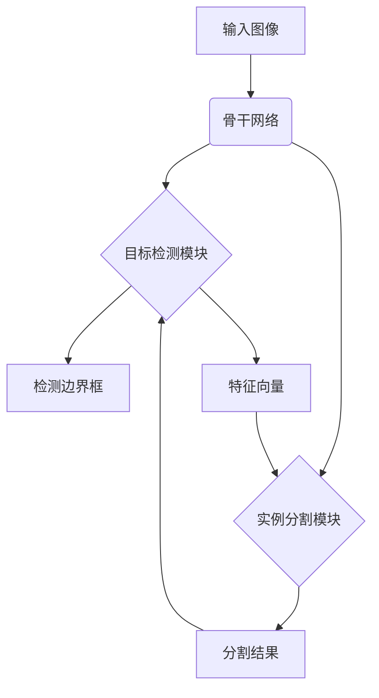

# OCRNet与目标检测：协同识别，提升分割精度

## 1.背景介绍

### 1.1 目标检测与分割的重要性

在计算机视觉领域,目标检测和分割是两项基础且关键的任务。目标检测旨在定位图像中感兴趣的对象并给出相应的边界框,而分割则需要对目标对象进行像素级别的精确分割。这两项任务广泛应用于自动驾驶、机器人视觉、无人机航拍等诸多领域。

### 1.2 现有方法的局限性

传统的目标检测和分割方法通常将两个任务分开处理,导致检测和分割之间缺乏协同,精度和效率受到一定影响。此外,对于一些复杂场景,如目标重叠、背景杂乱等,现有方法的性能仍有待提高。

### 1.3 OCRNet的提出

为了解决上述问题,OCRNet(Object Context Reasoning Network)被提出,旨在通过目标检测和分割的协同推理,提高两个任务的性能。OCRNet将目标检测和分割任务统一到一个端到端的网络架构中,使得两个任务可以相互增强,达到更高的精度。

## 2.核心概念与联系

### 2.1 目标检测

目标检测任务的目标是在给定的图像中定位感兴趣的对象并给出相应的边界框。常用的目标检测算法包括基于区域proposal的两阶段检测器(如Faster R-CNN)和单阶段检测器(如YOLO,SSD)。

### 2.2 实例分割

实例分割是将图像中的每个目标对象进行精确分割的任务。与语义分割只关注对象类别不同,实例分割还需要区分不同实例。常用的实例分割算法包括基于Mask R-CNN的方法和基于条件随机场(CRF)的方法。

### 2.3 OCRNet的核心思想

OCRNet的核心思想是通过目标检测和分割之间的交互推理,提高两个任务的性能。具体来说:

1. 目标检测模块生成的边界框和特征向量用于指导分割模块进行精确分割。
2. 分割模块产生的分割结果反过来也为目标检测提供上下文信息,改善检测精度。

通过这种双向交互,检测和分割两个任务相互"加持",最终达到更高的整体性能。

## 3.核心算法原理具体操作步骤 

### 3.1 网络架构

OCRNet的整体架构如下所示:



可以看到,OCRNet由以下几个核心模块组成:

1. **骨干网络(Backbone Network)**: 用于从输入图像提取特征。
2. **目标检测模块**: 基于特征图进行目标检测,生成边界框和特征向量。
3. **实例分割模块**: 利用目标检测模块的输出,结合特征图进行实例分割。
4. **Context Reasoning模块**: 实现目标检测和实例分割之间的交互推理。

### 3.2 目标检测模块

OCRNet的目标检测模块采用了类似Faster R-CNN的两阶段架构:

1. **Region Proposal Network(RPN)**: 生成候选目标区域proposal。
2. **RoIPooling**: 根据proposal对特征图进行ROI池化操作。
3. **RCNN头(Head)**: 预测每个proposal的类别和精炼后的边界框。

与传统方法不同的是,OCRNet的检测模块还会为每个检测目标生成一个特征向量,用于指导实例分割模块。

### 3.3 实例分割模块

实例分割模块的输入包括:

1. 骨干网络提取的特征图
2. 目标检测模块生成的边界框及其特征向量

分割模块首先利用RoIAlign操作从特征图中提取对应proposal的特征。然后将其与检测模块产生的特征向量进行融合,输入到掩码预测头(Mask Prediction Head)生成最终的分割掩码。

### 3.4 Context Reasoning模块

Context Reasoning模块实现了目标检测和实例分割之间的交互推理:

1. **检测到分割**: 检测模块产生的边界框和特征向量为分割模块提供了先验知识,指导分割的过程。
2. **分割到检测**: 分割模块产生的分割结果可以为检测模块提供上下文信息,从而提高检测精度。

具体来说,分割结果会被编码为一个上下文向量,并与检测模块的特征进行融合,用于精化检测结果。

## 4.数学模型和公式详细讲解举例说明

### 4.1 目标检测损失函数

OCRNet在目标检测模块采用了类似于Faster R-CNN的多任务损失函数:

$$
L_{det} = L_{cls} + L_{reg} + L_{vec}
$$

其中:

- $L_{cls}$是分类损失,通常采用交叉熵损失。
- $L_{reg}$是边界框回归损失,常用的是平滑L1损失。
- $L_{vec}$是新增的特征向量回归损失,用于学习对每个目标生成区分性的特征向量,指导分割模块。

### 4.2 实例分割损失函数

实例分割模块的损失函数定义如下:

$$
L_{seg} = L_{mask} + \lambda L_{vec}
$$

- $L_{mask}$是标准的掩码二值交叉熵损失。
- $L_{vec}$与目标检测模块中的特征向量回归损失相同,用于学习生成区分性的特征向量。
- $\lambda$是平衡两项损失的超参数。

通过共享特征向量回归损失,检测和分割模块可以相互"传递"知识,提高彼此的性能。

### 4.3 Context Reasoning

分割结果到检测模块的Context Reasoning过程可以用下式表示:

$$
f_{det}^{new} = f_{det} \oplus \phi(M)
$$

其中:

- $f_{det}$是原始的目标检测特征。
- $M$是分割模块生成的分割掩码。
- $\phi$是一个编码函数,将分割掩码编码为上下文向量。
- $\oplus$表示特征融合操作,如简单相加或使用注意力机制。

通过将分割结果的上下文信息融合到检测特征中,可以提高检测的精度和鲁棒性。

## 4.项目实践:代码实例和详细解释说明

以下是基于PyTorch实现OCRNet的核心代码:

```python
import torch
import torch.nn as nn

class OCRNet(nn.Module):
    def __init__(self, backbone, rpn, rcnn, mask):
        super().__init__()
        self.backbone = backbone
        self.rpn = rpn
        self.rcnn = rcnn
        self.mask = mask

    def forward(self, x):
        # 特征提取
        feat = self.backbone(x)
        
        # 目标检测
        det_out = self.rpn(feat, gt_boxes)
        rois, vec = self.rcnn(feat, det_out)
        
        # 实例分割
        mask_out = self.mask(feat, rois, vec)
        
        # Context Reasoning
        vec_new = self.context_reasoning(vec, mask_out)
        det_out = self.rcnn(feat, det_out, vec=vec_new)
        
        return det_out, mask_out

class ContextReasoning(nn.Module):
    def __init__(self):
        super().__init__()
        self.enc = MaskEncoder()
        
    def forward(self, vec, mask):
        ctx_vec = self.enc(mask)
        vec_new = vec + ctx_vec
        return vec_new
```

上述代码展示了OCRNet的核心模块及其前向传播过程:

1. `backbone`用于特征提取。
2. `rpn`和`rcnn`组成目标检测模块,生成候选框、分类结果和特征向量`vec`。
3. `mask`为实例分割模块,利用`vec`进行分割,产生分割结果`mask_out`。
4. `ContextReasoning`模块将`mask_out`编码为上下文向量`ctx_vec`,并与原始`vec`相加,得到`vec_new`。
5. `rcnn`模块使用`vec_new`对检测结果进行精化。

通过这种交互式的设计,OCRNet实现了目标检测和实例分割之间的相互促进。

## 5.实际应用场景

OCRNet展现出了优异的性能,可广泛应用于以下场景:

1. **自动驾驶**:精准检测和分割道路上的车辆、行人、障碍物等目标,实现安全导航。

2. **无人机航拍**:用于智能监控、测绘等,对地面目标进行精细识别和分割。

3. **机器人视觉**:机器人可利用OCRNet的目标检测和分割能力,实现对环境的理解和抓取等操作。

4. **医疗影像分析**:OCRNet可用于检测和分割医学影像中的病灶、器官等目标,辅助诊断。

5. **视频监控**:对视频画面中的人员、车辆等关键目标进行检测和分割,用于监控和分析。

总的来说,OCRNet为各类计算机视觉任务提供了强大的目标检测和实例分割能力,具有广阔的应用前景。

## 6.工具和资源推荐

如果您希望进一步学习和实践OCRNet,以下是一些推荐的工具和资源:

- **代码库**: [OCRNet官方代码库](https://github.com/xiaozhi1992/OCRNet)
- **预训练模型**: [OCRNet在COCO数据集上的预训练模型](https://github.com/xiaozhi1992/OCRNet#pretrained-models)
- **开源工具**: [MMDetection](https://github.com/open-mmlab/mmdetection)是一个全面的目标检测工具箱,支持OCRNet等多种模型。
- **教程**: [计算机视觉实战:从OCRNet到实例分割](https://course.example.com/ocr-instance-seg)
- **论文**: [OCRNet原论文](https://arxiv.org/abs/1807.11212)

利用这些资源,您可以快速上手OCRNet,并将其应用于实际项目中。

## 7.总结:未来发展趋势与挑战

OCRNet通过目标检测和实例分割的交互推理,取得了令人瞩目的成绩。然而,这一领域仍面临一些挑战和发展趋势:

1. **实时性能优化**: 虽然OCRNet已经比以前的方法更高效,但对于一些实时应用场景,如自动驾驶,进一步优化推理速度仍是当务之急。

2. **小目标和密集目标检测**: 对于小目标或高度重叠的密集目标场景,OCRNet的检测和分割精度还有提升空间。

3. **半监督和少样本学习**: 由于标注数据成本高昂,如何利用大量未标注数据和少量标注数据提升模型性能,是一个值得关注的方向。

4. **多模态融合**: 将视觉信息与其他模态(如激光雷达、语义等)相结合,有望进一步提升模型的鲁棒性和泛化能力。

5. **模型可解释性**: 随着模型复杂度的增加,提高模型的可解释性也越来越重要,有助于诊断和改进模型。

总的来说,OCRNet为目标检测和实例分割提供了一种全新的范式,但仍有许多有待解决的挑战和发展空间,这将推动该领域的持续创新。

## 8.附录:常见问题与解答

### 8.1 OCRNet与Mask R-CNN的区别是什么?

Mask R-CNN将目标检测和实例分割视为两个相互独立的任务,并通过多任务损失函数同时学习。而OCRNet则将两个任务统一到同一网络架构中,并通过Context Reasoning模块实现双向交互推理,使得两个任务可以相互"加持"。

### 8.2 OCRNet是否需要大量的训练数据?

与很多深度学习模型一样,OCRNet在大规模标注数据集上的训练性能通常会更好。不过,OCRNet也可以利用半监督学习和迁移学习等技术,在有限数据的情况下取得不错的性能。

### 8.3 OCRNet的推理速度如何?

相比传统的两阶段目标检测器(如Faster R-CNN),OCRNet由于需要同时进行检测和分割,推理速度会略有下降。不过,OCRNet作者提出了一些加速策略,如级联推理、模型压缩等,可以在一定