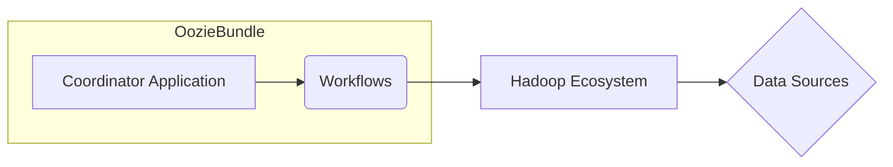

# OozieBundle在物联网领域的应用:处理海量设备数据

作者：禅与计算机程序设计艺术

## 1. 背景介绍

### 1.1 物联网与大数据

近年来，随着传感器、移动设备和无线通信技术的快速发展，物联网（IoT）已经渗透到我们生活的方方面面。从智能家居、智慧城市到工业自动化，物联网正在以前所未有的速度产生海量数据。这些数据蕴含着巨大的价值，可以帮助我们优化资源配置、提高生产效率、改善生活质量。

### 1.2 数据处理挑战

然而，物联网数据的爆炸式增长也给数据处理带来了前所未有的挑战。海量设备产生的数据具有以下特点：

* **数据量大：** 物联网设备数量庞大，每台设备每秒钟都可能产生大量数据，数据总量非常巨大。
* **数据种类多：** 物联网数据来自各种类型的传感器和设备，数据格式多样，包括结构化数据、半结构化数据和非结构化数据。
* **数据实时性要求高：** 许多物联网应用需要实时或近实时地处理数据，例如异常检测、实时监控等。
* **数据质量参差不齐：** 物联网设备部署环境复杂，数据采集过程中容易出现噪声、缺失值等问题，对数据质量提出了更高的要求。

### 1.3 OozieBundle的优势

为了应对这些挑战，我们需要一个高效、可靠、可扩展的数据处理平台。Apache Oozie是一个开源的工作流调度系统，特别适合处理大规模数据处理任务。OozieBundle是Oozie提供的一种高级工作流定义方式，它可以将多个相关的Oozie工作流组织在一起，并定义它们之间的依赖关系，从而实现复杂的数据处理流程。

OozieBundle在处理物联网海量设备数据方面具有以下优势：

* **简化复杂工作流管理：** OozieBundle可以将多个Oozie工作流组合成一个逻辑单元，简化了复杂数据处理流程的管理。
* **提高数据处理效率：** OozieBundle可以根据数据依赖关系自动调度工作流执行，并行执行多个任务，从而提高数据处理效率。
* **增强数据处理可靠性：** OozieBundle支持工作流的失败重试机制，可以保证数据处理流程的可靠性。
* **降低数据处理成本：** OozieBundle可以与Hadoop生态系统中的其他工具集成，例如Hive、Pig和Spark，可以充分利用现有资源，降低数据处理成本。

## 2. 核心概念与联系

### 2.1 Oozie 工作流

Oozie 工作流是由一系列动作（Action）组成的有向无环图（DAG）。每个动作代表一个数据处理任务，例如数据采集、数据清洗、数据转换、数据分析等。Oozie 协调器负责按照预定义的顺序和依赖关系执行这些动作。

### 2.2 OozieBundle

OozieBundle 是一种高级工作流定义方式，它可以将多个相关的 Oozie 工作流组织在一起，并定义它们之间的依赖关系。OozieBundle 可以看作是 Oozie 工作流的容器，它可以协调多个工作流的执行，并提供统一的管理界面。

### 2.3 关键组件关系图



**图例:**

* **OozieBundle:** OozieBundle 是管理多个 Oozie 工作流的容器。
* **Coordinator Application:** Coordinator Application 定义了 OozieBundle 中各个工作流的执行计划和依赖关系。
* **Workflows:** 工作流是由一系列动作组成的有向无环图，用于执行具体的数据处理任务。
* **Hadoop Ecosystem:** Hadoop 生态系统提供了各种数据存储和处理工具，例如 HDFS、Hive、Pig 和 Spark。
* **Data Sources:** 数据源可以是各种类型的数据库、文件系统或消息队列。

## 3. 核心算法原理具体操作步骤

### 3.1 创建 Oozie 工作流

首先，我们需要创建多个 Oozie 工作流，每个工作流负责执行一个特定的数据处理任务。例如，我们可以创建一个工作流来收集传感器数据，另一个工作流来清洗和转换数据，还有一个工作流来将处理后的数据加载到数据仓库中。

### 3.2 定义 OozieBundle

创建完 Oozie 工作流后，我们需要定义一个 OozieBundle 来组织这些工作流。OozieBundle 定义文件是一个 XML 文件，它包含以下信息：

* OozieBundle 的名称和描述。
* OozieBundle 中包含的 Oozie 工作流列表。
* Oozie 工作流之间的依赖关系。
* OozieBundle 的执行计划。

### 3.3 提交和管理 OozieBundle

定义好 OozieBundle 后，我们可以使用 Oozie 命令行工具或 Web 界面将其提交到 Oozie 服务器。Oozie 服务器会根据 OozieBundle 的定义文件自动调度和执行工作流。我们也可以使用 Oozie 的监控工具来跟踪 OozieBundle 的执行情况。

## 4. 数学模型和公式详细讲解举例说明

本节不涉及具体的数学模型和公式。

## 5. 项目实践：代码实例和详细解释说明

### 5.1 示例场景

假设我们正在构建一个智能交通系统，该系统需要实时收集和分析来自数百万辆汽车的传感器数据。我们需要使用 OozieBundle 来构建一个数据处理流程，该流程可以：

1. 从 Kafka 主题中收集传感器数据。
2. 清洗和转换数据，例如过滤掉无效数据、格式化数据等。
3. 将处理后的数据存储到 HDFS 中。
4. 使用 Spark 对数据进行实时分析，例如计算交通流量、检测交通拥堵等。

### 5.2 代码示例

**Oozie 工作流 1：收集传感器数据**

```xml
<workflow-app xmlns="uri:oozie:workflow:0.2" name="collect-sensor-data">
  <start to="kafka-consumer" />

  <action name="kafka-consumer">
    <java>
      <main-class>com.example.KafkaConsumer</main-class>
      <arg>-topic</arg>
      <arg>sensor-data</arg>
      <arg>-outputDir</arg>
      <arg>/tmp/sensor-data</arg>
    </java>
    <ok to="end" />
    <error to="fail" />
  </action>

  <kill name="fail">
    <message>Workflow failed, error message[${wf:errorMessage(wf:lastErrorNode())}]</message>
  </kill>

  <end name="end" />
</workflow-app>
```

**Oozie 工作流 2：清洗和转换数据**

```xml
<workflow-app xmlns="uri:oozie:workflow:0.2" name="clean-and-transform-data">
  <start to="data-cleaning" />

  <action name="data-cleaning">
    <pig>
      <script>data_cleaning.pig</script>
      <param>inputDir=/tmp/sensor-data</param>
      <param>outputDir=/tmp/cleaned-data</param>
    </pig>
    <ok to="end" />
    <error to="fail" />
  </action>

  <kill name="fail">
    <message>Workflow failed, error message[${wf:errorMessage(wf:lastErrorNode())}]</message>
  </kill>

  <end name="end" />
</workflow-app>
```

**Oozie 工作流 3：将数据存储到 HDFS**

```xml
<workflow-app xmlns="uri:oozie:workflow:0.2" name="store-data-to-hdfs">
  <start to="hdfs-put" />

  <action name="hdfs-put">
    <fs>
      <mkdir path="/user/hive/warehouse/sensor_data" />
      <put source="/tmp/cleaned-data" target="/user/hive/warehouse/sensor_data" />
    </fs>
    <ok to="end" />
    <error to="fail" />
  </action>

  <kill name="fail">
    <message>Workflow failed, error message[${wf:errorMessage(wf:lastErrorNode())}]</message>
  </kill>

  <end name="end" />
</workflow-app>
```

**Oozie 工作流 4：使用 Spark 进行实时分析**

```xml
<workflow-app xmlns="uri:oozie:workflow:0.2" name="real-time-analysis">
  <start to="spark-submit" />

  <action name="spark-submit">
    <spark>
      <job-tracker>${jobTracker}</job-tracker>
      <name-node>${nameNode}</name-node>
      <master>yarn-cluster</master>
      <name>RealTimeAnalysis</name>
      <class>com.example.RealTimeAnalysis</class>
      <jar>real-time-analysis.jar</jar>
    </spark>
    <ok to="end" />
    <error to="fail" />
  </action>

  <kill name="fail">
    <message>Workflow failed, error message[${wf:errorMessage(wf:lastErrorNode())}]</message>
  </kill>

  <end name="end" />
</workflow-app>
```

**OozieBundle 定义文件**

```xml
<bundle-app xmlns="uri:oozie:bundle:0.2" name="iot-data-processing">
  <controls>
    <kick-off-time>2024-05-23T00:00Z</kick-off-time>
    <frequency>5</frequency>
    <time-unit>minutes</time-unit>
  </controls>

  <coordinator name="collect-data">
    <app-path>${nameNode}/user/oozie/workflows/collect-sensor-data</app-path>
  </coordinator>

  <coordinator name="clean-and-transform-data">
    <app-path>${nameNode}/user/oozie/workflows/clean-and-transform-data</app-path>
    <depends-on>collect-data</depends-on>
  </coordinator>

  <coordinator name="store-data-to-hdfs">
    <app-path>${nameNode}/user/oozie/workflows/store-data-to-hdfs</app-path>
    <depends-on>clean-and-transform-data</depends-on>
  </coordinator>

  <coordinator name="real-time-analysis">
    <app-path>${nameNode}/user/oozie/workflows/real-time-analysis</app-path>
    <depends-on>store-data-to-hdfs</depends-on>
  </coordinator>
</bundle-app>
```

### 5.3 代码解释

* **Oozie 工作流：** 每个 Oozie 工作流都定义了一个特定的数据处理任务，例如收集数据、清洗数据、存储数据和分析数据。
* **OozieBundle 定义文件：** OozieBundle 定义文件将所有 Oozie 工作流组织在一起，并定义了它们之间的依赖关系。
* **controls 元素：** controls 元素定义了 OozieBundle 的执行计划，例如启动时间、执行频率和时间单位。
* **coordinator 元素：** 每个 coordinator 元素代表一个 Oozie 工作流，app-path 属性指定了工作流定义文件的路径，depends-on 属性指定了该工作流依赖的其他工作流。

## 6. 实际应用场景

除了智能交通系统外，OozieBundle 还可以应用于许多其他物联网场景，例如：

* **工业自动化：** OozieBundle 可以用于构建数据处理流程，以收集和分析来自工业设备的传感器数据，例如监控设备运行状态、预测设备故障等。
* **智慧城市：** OozieBundle 可以用于构建数据处理流程，以收集和分析来自城市基础设施的传感器数据，例如监控交通流量、优化交通信号灯控制、检测环境污染等。
* **智能家居：** OozieBundle 可以用于构建数据处理流程，以收集和分析来自智能家居设备的传感器数据，例如监控能源消耗、优化空调温度、提供个性化服务等。

## 7. 工具和资源推荐

* **Apache Oozie:** https://oozie.apache.org/
* **Apache Kafka:** https://kafka.apache.org/
* **Apache Hadoop:** https://hadoop.apache.org/
* **Apache Spark:** https://spark.apache.org/

## 8. 总结：未来发展趋势与挑战

OozieBundle 为处理物联网海量设备数据提供了一个强大而灵活的解决方案。随着物联网技术的不断发展，OozieBundle 也将不断发展和完善。未来，OozieBundle 将面临以下挑战：

* **支持更多数据源和数据格式：** 物联网数据来自各种类型的传感器和设备，OozieBundle 需要支持更多的数据源和数据格式，以满足不断增长的数据处理需求。
* **提高数据处理效率和可扩展性：** 随着物联网设备数量的不断增加，OozieBundle 需要提高数据处理效率和可扩展性，以应对海量数据的挑战。
* **增强数据安全和隐私保护：** 物联网数据包含大量的敏感信息，OozieBundle 需要增强数据安全和隐私保护，以防止数据泄露和滥用。

## 9. 附录：常见问题与解答

### 9.1 OozieBundle 和 Oozie 工作流的区别是什么？

Oozie 工作流是由一系列动作组成的有向无环图，用于执行具体的数据处理任务。OozieBundle 是一种高级工作流定义方式，它可以将多个相关的 Oozie 工作流组织在一起，并定义它们之间的依赖关系。

### 9.2 如何监控 OozieBundle 的执行情况？

可以使用 Oozie 的 Web 界面或命令行工具来监控 OozieBundle 的执行情况。

### 9.3 OozieBundle 支持哪些数据源和数据格式？

OozieBundle 可以与 Hadoop 生态系统中的其他工具集成，例如 Hive、Pig 和 Spark，因此它可以支持各种数据源和数据格式，包括结构化数据、半结构化数据和非结构化数据。