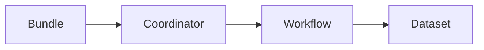

# OozieBundle配置文件案例分析：解读典型配置方案

作者：禅与计算机程序设计艺术

## 1. 背景介绍

### 1.1 Oozie与大数据工作流

在当今大数据时代，海量数据的处理和分析需求日益增长。为了应对这种挑战，各种大数据处理框架应运而生，例如 Hadoop、Spark 等。然而，这些框架通常需要多个步骤和组件协同工作才能完成复杂的数据处理任务。如何有效地编排和管理这些任务成为了一个关键问题。

Oozie 作为一个开源的工作流调度系统，为解决上述问题提供了一种优雅的解决方案。它允许用户以有向无环图（DAG）的形式定义复杂的数据处理工作流，并指定每个节点的执行顺序、依赖关系以及输入输出数据。Oozie 负责按照预定义的逻辑自动执行工作流中的各个任务，并监控其运行状态，从而简化了大数据处理流程。

### 1.2 Oozie Bundle 的作用和优势

Oozie Bundle 是 Oozie 提供的一种高级工作流管理机制，它允许用户将多个相关的 Oozie Workflow 或 Coordinator 组织成一个逻辑单元进行统一管理。通过使用 Bundle，用户可以：

* **简化复杂工作流的管理：** 将多个相关的 Workflow 或 Coordinator 组合成一个 Bundle，可以降低管理和维护的复杂度。
* **实现工作流的灵活调度：** Bundle 支持多种调度策略，例如基于时间、事件或依赖关系的调度，可以满足不同应用场景的需求。
* **提高工作流的可重用性：** Bundle 可以作为模板进行复用，从而减少重复开发工作量。

### 1.3 本文目标和结构

本文旨在通过对 Oozie Bundle 配置文件案例的深入分析，帮助读者理解 Bundle 的核心概念、配置方法和应用技巧。

本文结构如下：

* **背景介绍：** 介绍 Oozie 和 Bundle 的背景知识，以及本文的目标和结构。
* **核心概念与联系：** 解释 Bundle 的关键概念，例如 Coordinator、Workflow、Dataset 等，并阐述它们之间的关系。
* **核心算法原理具体操作步骤：**  详细介绍 Bundle 配置文件的结构和语法，并结合实例讲解如何配置 Bundle 的关键参数。
* **项目实践：代码实例和详细解释说明：**  提供完整的 Bundle 配置文件示例，并对关键代码段进行详细解释说明。
* **实际应用场景：**  列举 Bundle 的典型应用场景，例如数据仓库 ETL 流程、机器学习模型训练等。
* **工具和资源推荐：**  推荐一些常用的 Oozie Bundle 开发工具和学习资源。
* **总结：未来发展趋势与挑战：**  总结 Bundle 的优势和局限性，并展望其未来发展趋势。
* **附录：常见问题与解答：**  解答一些关于 Bundle 的常见问题。

## 2. 核心概念与联系

### 2.1 Oozie 坐标系

在深入探讨 Bundle 配置文件之前，首先需要了解 Oozie 坐标系的概念。Oozie 坐标系用于唯一标识和管理 Oozie 中的各种资源，例如 Workflow、Coordinator、Bundle 等。

Oozie 坐标系由以下四个部分组成：

* **组 ID（Group ID）：**  用于标识资源所属的组，例如 `com.example`。
* **工件 ID（Artifact ID）：**  用于标识资源的名称，例如 `my-workflow`。
* **版本号（Version）：**  用于区分同一资源的不同版本，例如 `1.0.0`。
* **类型（Type）：**  用于标识资源的类型，例如 `jar`、`bundle`、`coord`、`wf` 等。

例如，一个名为 `my-workflow` 的 Workflow 的 Oozie 坐标系可能为：`com.example:my-workflow:1.0.0:wf`。

### 2.2 Bundle 组成元素

一个完整的 Oozie Bundle 通常包含以下几个组成部分：

* **Bundle 配置文件：**  定义了 Bundle 的元数据信息，例如名称、描述、调度策略等，以及 Bundle 中包含的 Coordinator 或 Workflow 列表。
* **Coordinator 配置文件：**  定义了 Coordinator 的元数据信息，例如名称、调度频率、数据依赖关系等。
* **Workflow 配置文件：**  定义了 Workflow 的元数据信息，例如名称、执行步骤、输入输出数据等。

### 2.3 核心概念之间的关系

下图展示了 Bundle、Coordinator、Workflow 和 Dataset 之间的关系：



* **Bundle** 是最顶层的容器，它可以包含多个 Coordinator 或 Workflow。
* **Coordinator** 用于定义周期性调度的工作流，它可以依赖于输入数据的可用性。
* **Workflow** 是实际执行数据处理任务的单元，它可以包含多个 Action。
* **Dataset** 表示输入或输出数据，Coordinator 可以根据 Dataset 的状态来决定是否触发 Workflow 的执行。

## 3. 核心算法原理具体操作步骤

### 3.1 Bundle 配置文件结构

Oozie Bundle 配置文件是一个 XML 文件，它使用 `bundle-app` 元素作为根元素。`bundle-app` 元素包含以下几个子元素：

* **`name`：**  Bundle 的名称。
* **`description`：**  Bundle 的描述信息。
* **`parameters`：**  定义 Bundle 级别的参数，可以在 Coordinator 或 Workflow 中引用。
* **`controls`：**  定义 Bundle 的调度策略，例如启动时间、结束时间、并发数等。
* **`coordinator` 或 `workflow`：**  定义 Bundle 中包含的 Coordinator 或 Workflow 列表。

### 3.2 配置 Bundle 调度策略

Bundle 的调度策略由 `controls` 元素定义，它支持以下几个属性：

* **`start`：**  Bundle 的启动时间，可以使用 cron 表达式或日期时间格式指定。
* **`end`：**  Bundle 的结束时间，可以使用 cron 表达式或日期时间格式指定。
* **`frequency`：**  Bundle 的调度频率，可以使用 cron 表达式或时间间隔格式指定。
* **`timezone`：**  Bundle 使用的时区。
* **`concurrency`：**  Bundle 允许的最大并发数。

例如，以下配置定义了一个每天凌晨 2 点启动，每天运行一次的 Bundle：

```xml
<controls>
  <start>2024-05-23T02:00Z</start>
  <frequency>daily</frequency>
</controls>
```

### 3.3 配置 Coordinator 和 Workflow

`coordinator` 和 `workflow` 元素用于定义 Bundle 中包含的 Coordinator 或 Workflow 列表。每个 `coordinator` 或 `workflow` 元素都需要指定以下几个属性：

* **`app-path`：**  Coordinator 或 Workflow 配置文件的路径，可以使用 HDFS 路径或本地文件系统路径。
* **`configuration`：**  定义 Coordinator 或 Workflow 的配置参数，可以覆盖配置文件中的默认值。

例如，以下配置定义了一个名为 `my-coordinator` 的 Coordinator：

```xml
<coordinator app-path="hdfs:///path/to/my-coordinator.xml">
  <configuration>
    <property>
      <name>myParam</name>
      <value>myValue</value>
    </property>
  </configuration>
</coordinator>
```

## 4. 数学模型和公式详细讲解举例说明

本节将介绍 Oozie Bundle 中常用的数学模型和公式，并结合实例进行讲解。

### 4.1 Cron 表达式

Cron 表达式是一种用于指定定时任务执行时间的字符串。它由 6 个字段组成，每个字段之间用空格分隔。

| 字段       | 取值范围    | 含义                                   |
| ---------- | ----------- | -------------------------------------- |
| 秒         | 0-59         | 秒                                       |
| 分         | 0-59         | 分                                       |
| 时         | 0-23         | 时                                       |
| 日         | 1-31         | 月中的天                                   |
| 月         | 1-12 或 JAN-DEC | 月                                       |
| 星期       | 0-7 或 SUN-SAT | 星期，0 或 7 表示星期日                     |

例如，以下 cron 表达式表示每天凌晨 2 点执行一次任务：

```
0 0 2 * * ?
```

### 4.2 时间间隔格式

时间间隔格式用于指定两个时间点之间的时间差。它由一个数字和一个时间单位组成，时间单位可以是 `minutes`、`hours`、`days`、`months` 或 `years`。

例如，以下时间间隔格式表示 1 天：

```
1d
```

## 5. 项目实践：代码实例和详细解释说明

### 5.1 示例场景

假设我们需要构建一个数据仓库 ETL 流程，该流程每天从多个数据源导入数据，然后进行数据清洗、转换和加载操作。我们可以使用 Oozie Bundle 来编排和管理这个 ETL 流程。

### 5.2 Bundle 配置文件

```xml
<bundle-app name="data-warehouse-etl" xmlns="uri:oozie:bundle:0.2">
  <controls>
    <start>2024-05-23T02:00Z</start>
    <frequency>daily</frequency>
  </controls>

  <coordinator app-path="hdfs:///path/to/data-import-coordinator.xml">
    <configuration>
      <property>
        <name>data_sources</name>
        <value>source1,source2,source3</value>
      </property>
    </configuration>
  </coordinator>

  <coordinator app-path="hdfs:///path/to/data-processing-coordinator.xml">
    <datasets>
      <dataset name="raw_data" frequency="${coord:days(1)}" initial-instance="2024-05-22T00:00Z">
        <uri-template>hdfs:///path/to/raw_data/${YEAR}-${MONTH}-${DAY}</uri-template>
      </dataset>
    </datasets>
  </coordinator>
</bundle-app>
```

### 5.3 代码解释

* **Bundle 配置：**  定义了一个名为 `data-warehouse-etl` 的 Bundle，该 Bundle 每天凌晨 2 点启动，每天运行一次。
* **数据导入 Coordinator：**  定义了一个名为 `data-import-coordinator` 的 Coordinator，该 Coordinator 负责从多个数据源导入数据。`data_sources` 参数指定了数据源列表。
* **数据处理 Coordinator：**  定义了一个名为 `data-processing-coordinator` 的 Coordinator，该 Coordinator 依赖于 `raw_data` 数据。`raw_data` 数据每天生成一次，存储在 HDFS 上。

## 6. 实际应用场景

### 6.1 数据仓库 ETL 流程

Oozie Bundle 非常适合用于编排和管理数据仓库 ETL 流程。例如，可以使用 Bundle 来定义每天从多个数据源导入数据，然后进行数据清洗、转换和加载操作的工作流。

### 6.2 机器学习模型训练

Oozie Bundle 也可以用于编排和管理机器学习模型训练流程。例如，可以使用 Bundle 来定义每天从数据仓库中提取训练数据，然后使用 Spark MLlib 进行模型训练的工作流。

### 6.3 定时数据备份

Oozie Bundle 还可以用于定时数据备份。例如，可以使用 Bundle 来定义每天凌晨将数据库备份到 HDFS 上的工作流。

## 7. 工具和资源推荐

### 7.1 Oozie Web UI

Oozie Web UI 提供了一个图形化的界面，用于管理和监控 Oozie 工作流。

### 7.2 Hue

Hue 是一个开源的 Hadoop 用户界面，它提供了一个 Oozie 编辑器，可以方便地创建和管理 Oozie 工作流。

### 7.3 Apache Oozie 官方文档

Apache Oozie 官方文档提供了详细的 Oozie Bundle 配置信息和使用指南。

## 8. 总结：未来发展趋势与挑战

Oozie Bundle 作为 Oozie 提供的一种高级工作流管理机制，可以有效地简化复杂工作流的管理和调度。未来，Oozie Bundle 将继续朝着更加灵活、易用和高效的方向发展。

### 8.1 未来发展趋势

* **更加灵活的调度策略：**  支持更加复杂的调度策略，例如基于事件、条件或资源的调度。
* **更加强大的工作流控制能力：**  提供更加丰富的控制流操作符，例如分支、循环和异常处理。
* **更加完善的监控和报警机制：**  提供更加详细的工作流运行状态信息，并支持自定义报警规则。

### 8.2 面临的挑战

* **与其他大数据生态系统组件的集成：**  需要与其他大数据生态系统组件（例如 Spark、Flink 等）进行更加紧密的集成。
* **性能和可扩展性：**  需要不断优化 Bundle 的性能和可扩展性，以应对日益增长的数据量和工作流规模。
* **安全性：**  需要加强 Bundle 的安全性，以保护敏感数据和防止恶意攻击。

## 9. 附录：常见问题与解答

### 9.1 如何设置 Bundle 的启动时间？

可以使用 `controls` 元素的 `start` 属性来设置 Bundle 的启动时间。`start` 属性可以使用 cron 表达式或日期时间格式指定。

### 9.2 如何设置 Bundle 的调度频率？

可以使用 `controls` 元素的 `frequency` 属性来设置 Bundle 的调度频率。`frequency` 属性可以使用 cron 表达式或时间间隔格式指定。

### 9.3 如何在 Coordinator 中引用 Bundle 参数？

可以使用 `${bundle:<param_name>}` 语法在 Coordinator 中引用 Bundle 参数。

### 9.4 如何查看 Bundle 的运行状态？

可以使用 Oozie Web UI 或 Hue 来查看 Bundle 的运行状态。