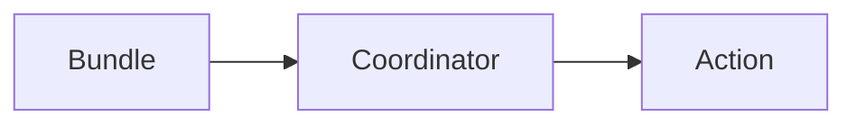

## 1. 背景介绍

### 1.1 大数据处理的挑战

随着互联网和移动设备的普及，数据量呈现爆炸式增长，传统的单机处理模式已经无法满足需求。大数据处理平台应运而生，Hadoop作为其中的佼佼者，提供了分布式存储和计算能力，为处理海量数据提供了基础设施。

### 1.2 工作流调度系统的重要性

在大数据处理过程中，通常需要执行一系列相互依赖的任务，例如数据采集、清洗、转换、分析等。为了高效地管理这些任务，需要一个工作流调度系统，负责按照预先定义的顺序和依赖关系自动执行任务。

### 1.3 Oozie：Hadoop生态系统中的工作流调度引擎

Oozie是Hadoop生态系统中的一种工作流调度引擎，它可以定义、管理和执行Hadoop任务的工作流程。Oozie工作流由多个动作（Action）组成，这些动作可以是MapReduce任务、Pig脚本、Hive查询、Shell脚本等。Oozie通过配置文件来定义工作流的结构和执行方式，其中Oozie Bundle配置文件用于定义一组相关的Coordinator应用程序，并指定它们的执行计划。

## 2. 核心概念与联系

### 2.1 Oozie Bundle

Oozie Bundle 是一种逻辑分组机制，用于将多个Coordinator应用程序组合在一起，并定义它们的执行计划和依赖关系。Bundle配置文件定义了Bundle的名称、Coordinator应用程序的列表、启动时间、频率、依赖关系等信息。

### 2.2 Coordinator应用程序

Coordinator应用程序定义了一个周期性执行的工作流，它包含多个Action，并指定了它们的执行时间、频率、数据集依赖等信息。Coordinator应用程序通过配置文件来定义，其中包含了Action的定义、输入输出数据集、工作流控制逻辑等。

### 2.3 Action

Action是Oozie工作流中的最小执行单元，它可以是MapReduce任务、Pig脚本、Hive查询、Shell脚本等。Action通过配置文件来定义，其中包含了执行命令、输入输出路径、资源配置等信息。

### 2.4 关系图



## 3. 核心算法原理具体操作步骤

### 3.1 创建Bundle配置文件

Bundle配置文件是一个XML文件，它定义了Bundle的名称、Coordinator应用程序的列表、启动时间、频率、依赖关系等信息。

**示例：**

```xml
<bundle-app name="my-bundle" xmlns="uri:oozie:bundle:0.2">
    <controls>
        <kick-off-time>${startTime}</kick-off-time>
        <frequency>${frequency}</frequency>
        <time-unit>${timeUnit}</time-unit>
    </controls>
    <coordinator name="coordinator1">
        <app-path>${coordinator1AppPath}</app-path>
    </coordinator>
    <coordinator name="coordinator2">
        <app-path>${coordinator2AppPath}</app-path>
        <depends-on>coordinator1</depends-on>
    </coordinator>
</bundle-app>
```

**参数说明：**

* `name`: Bundle的名称。
* `kick-off-time`: Bundle的启动时间，可以使用变量 `${startTime}` 来动态指定。
* `frequency`: Bundle的执行频率，可以使用变量 `${frequency}` 来动态指定。
* `time-unit`: Bundle的频率时间单位，例如分钟、小时、天等，可以使用变量 `${timeUnit}` 来动态指定。
* `coordinator`: 定义一个Coordinator应用程序，包括应用程序名称和路径。
* `app-path`: Coordinator应用程序的路径。
* `depends-on`: 指定Coordinator应用程序的依赖关系，例如 `coordinator2` 依赖于 `coordinator1`。

### 3.2 提交Bundle应用程序

可以使用Oozie命令行工具或Web UI提交Bundle应用程序。

**命令行工具：**

```
oozie job -oozie http://oozie-server:11000/oozie -config bundle.xml -run
```

**Web UI：**

1. 登录Oozie Web UI。
2. 点击 "Submit Workflow" 按钮。
3. 选择 "Bundle" 作为应用程序类型。
4. 上传Bundle配置文件。
5. 点击 "Submit" 按钮。

### 3.3 监控Bundle执行状态

可以使用Oozie命令行工具或Web UI监控Bundle的执行状态。

**命令行工具：**

```
oozie job -oozie http://oozie-server:11000/oozie -info <bundle-job-id>
```

**Web UI：**

1. 登录Oozie Web UI。
2. 点击 "Jobs" 选项卡。
3. 找到Bundle应用程序的ID。
4. 点击Bundle ID查看执行状态和日志。

## 4. 数学模型和公式详细讲解举例说明

Oozie Bundle配置文件不涉及数学模型和公式。

## 5. 项目实践：代码实例和详细解释说明

**示例：**

假设我们有一个数据仓库，需要每天执行以下任务：

* 从源数据库导入数据到HDFS。
* 使用Hive对数据进行清洗和转换。
* 使用Spark对数据进行分析。

我们可以使用Oozie Bundle来定义这个工作流，并指定每天凌晨2点执行。

**Bundle配置文件：**

```xml
<bundle-app name="data-warehouse-bundle" xmlns="uri:oozie:bundle:0.2">
    <controls>
        <kick-off-time>00:02</kick-off-time>
        <frequency>1</frequency>
        <time-unit>day</time-unit>
    </controls>
    <coordinator name="import-data">
        <app-path>${importDataAppPath}</app-path>
    </coordinator>
    <coordinator name="clean-transform-data">
        <app-path>${cleanTransformDataAppPath}</app-path>
        <depends-on>import-data</depends-on>
    </coordinator>
    <coordinator name="analyze-data">
        <app-path>${analyzeDataAppPath}</app-path>
        <depends-on>clean-transform-data</depends-on>
    </coordinator>
</bundle-app>
```

**Coordinator应用程序配置文件：**

```xml
<coordinator-app name="import-data" frequency="${coord:days(1)}" start="${startTime}" end="${endTime}" timezone="UTC" xmlns="uri:oozie:coordinator:0.1">
    <action>
        <workflow>
            <app-path>${workflowAppPath}</app-path>
        </workflow>
    </action>
</coordinator-app>
```

**Workflow应用程序配置文件：**

```xml
<workflow-app name="import-data-workflow" xmlns="uri:oozie:workflow:0.2">
    <start to="import-data"/>
    <action name="import-data">
        <sqoop xmlns="uri:oozie:sqoop-action:0.2">
            <job-tracker>${jobTracker}</job-tracker>
            <name-node>${nameNode}</name-node>
            <command>import --connect jdbc:mysql://${dbHost}:${dbPort}/${dbName} --username ${dbUser} --password ${dbPassword} --table ${dbTable} --target-dir ${hdfsTargetDir}</command>
        </sqoop>
        <ok to="end"/>
        <error to="fail"/>
    </action>
    <kill name="fail">
        <message>Workflow failed, error message[${wf:errorMessage(wf:lastErrorNode())}]</message>
    </kill>
    <end name="end"/>
</workflow-app>
```

## 6. 实际应用场景

Oozie Bundle适用于以下场景：

* 数据仓库和ETL流程
* 定期报表生成
* 机器学习模型训练
* 日志分析和监控

## 7. 工具和资源推荐

* Oozie官方文档：https://oozie.apache.org/docs/4.3.1/
* Apache Hadoop官方网站：https://hadoop.apache.org/

## 8. 总结：未来发展趋势与挑战

Oozie作为Hadoop生态系统中的工作流调度引擎，在未来将继续发展和完善，以满足不断变化的大数据处理需求。

**未来发展趋势：**

* 支持更丰富的Action类型，例如容器化应用程序、机器学习模型等。
* 提供更强大的工作流控制能力，例如条件分支、循环等。
* 与其他大数据技术集成，例如Spark、Kafka等。

**挑战：**

* 提高性能和可扩展性，以处理更大规模的工作流。
* 简化配置和使用，降低学习成本。
* 增强安全性，保护敏感数据。

## 9. 附录：常见问题与解答

**问题1：如何设置Bundle的启动时间和频率？**

**解答：**

在Bundle配置文件的 `<controls>` 元素中，可以使用 `kick-off-time` 和 `frequency` 属性来设置启动时间和频率。

* `kick-off-time`：指定Bundle的启动时间，可以使用变量 `${startTime}` 来动态指定。
* `frequency`：指定Bundle的执行频率，可以使用变量 `${frequency}` 来动态指定。

**问题2：如何指定Coordinator应用程序的依赖关系？**

**解答：**

在Coordinator应用程序的定义中，可以使用 `<depends-on>` 元素来指定依赖关系。例如：

```xml
<coordinator name="coordinator2">
    <app-path>${coordinator2AppPath}</app-path>
    <depends-on>coordinator1</depends-on>
</coordinator>
```

这表示 `coordinator2` 依赖于 `coordinator1`，只有在 `coordinator1` 成功完成后，`coordinator2` 才会开始执行。

**问题3：如何监控Bundle的执行状态？**

**解答：**

可以使用Oozie命令行工具或Web UI监控Bundle的执行状态。

* **命令行工具：**

```
oozie job -oozie http://oozie-server:11000/oozie -info <bundle-job-id>
```

* **Web UI：**

1. 登录Oozie Web UI。
2. 点击 "Jobs" 选项卡。
3. 找到Bundle应用程序的ID。
4. 点击Bundle ID查看执行状态和日志。
