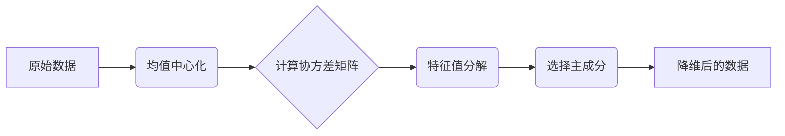

# PCA：揭开数据背后的秘密

作者：禅与计算机程序设计艺术

## 1. 背景介绍

### 1.1 数据分析的挑战

在信息爆炸的时代，我们每天都被海量的数据所包围。从社交媒体上的帖子到金融市场的交易数据，从基因测序的结果到天文观测的数据，这些数据中蕴藏着巨大的价值。然而，如何从这些海量的数据中提取出有用的信息，并将其转化为可 actionable 的知识，成为了数据分析领域的一大挑战。

### 1.2 降维的需求

数据的高维度性是数据分析面临的主要挑战之一。高维数据不仅增加了计算的复杂度，也容易导致“维度灾难”，即在高维空间中，数据的稀疏性会急剧增加，从而影响到机器学习算法的性能。为了解决这个问题，我们需要对数据进行降维，即将高维数据映射到低维空间，同时尽可能地保留原始数据的信息。

### 1.3 PCA: 一种强大的降维技术

主成分分析（Principal Component Analysis，PCA）是一种常用的线性降维方法，它通过线性变换将原始数据变换为一组各维度线性无关的表示，可用于提取数据的主要特征分量，常用于高维数据的降维、可视化、噪声去除、特征提取和数据压缩等领域。


## 2. 核心概念与联系

### 2.1 数据矩阵

假设我们有一个包含 $n$ 个样本的数据集，每个样本有 $m$ 个特征，我们可以用一个 $n \times m$ 的矩阵 $\mathbf{X}$ 来表示这个数据集，其中 $\mathbf{X}_{ij}$ 表示第 $i$ 个样本的第 $j$ 个特征的值。

### 2.2 均值中心化

在进行 PCA 之前，我们需要对数据进行均值中心化，即所有样本的每个特征都减去该特征的均值。这样做的目的是为了消除不同特征之间量纲的影响，方便后续计算协方差矩阵。

均值中心化后的数据矩阵 $\mathbf{X}_c$ 可以表示为：

$$\mathbf{X}_c = \mathbf{X} - \mathbf{\bar{x}},$$

其中 $\mathbf{\bar{x}}$ 是一个 $1 \times m$ 的向量，表示每个特征的均值。

### 2.3 协方差矩阵

协方差矩阵 $\mathbf{C}$ 是一个 $m \times m$ 的矩阵，用于描述数据集中不同特征之间的相关性。协方差矩阵的第 $(i, j)$ 个元素 $\mathbf{C}_{ij}$ 表示第 $i$ 个特征和第 $j$ 个特征之间的协方差：

$$\mathbf{C}_{ij} = \frac{1}{n-1} \sum_{k=1}^{n} (\mathbf{X}_{ki} - \mathbf{\bar{x}}_i)(\mathbf{X}_{kj} - \mathbf{\bar{x}}_j).$$

### 2.4 特征值和特征向量

特征值和特征向量是线性代数中的重要概念，它们在 PCA 中扮演着重要的角色。对于一个矩阵 $\mathbf{A}$，如果存在一个非零向量 $\mathbf{v}$ 和一个标量 $\lambda$，使得：

$$\mathbf{A}\mathbf{v} = \lambda \mathbf{v},$$

则称 $\lambda$ 为矩阵 $\mathbf{A}$ 的特征值，$\mathbf{v}$ 为矩阵 $\mathbf{A}$ 对应于特征值 $\lambda$ 的特征向量。

### 2.5 主成分

PCA 的核心思想是找到数据集中方差最大的方向，这些方向被称为主成分。主成分是协方差矩阵 $\mathbf{C}$ 的特征向量，对应于最大的特征值的方向就是数据集中方差最大的方向。

## 3. 核心算法原理具体操作步骤

### 3.1 算法流程

PCA 算法的具体操作步骤如下：

1. **数据预处理:** 对原始数据进行均值中心化。
2. **计算协方差矩阵:** 计算均值中心化后的数据矩阵的协方差矩阵 $\mathbf{C}$。
3. **特征值分解:** 对协方差矩阵 $\mathbf{C}$ 进行特征值分解，得到特征值矩阵 $\mathbf{\Lambda}$ 和特征向量矩阵 $\mathbf{V}$。
4. **选择主成分:** 根据特征值的大小，选择前 $k$ 个最大的特征值对应的特征向量作为主成分，组成一个 $m \times k$ 的矩阵 $\mathbf{W}$。
5. **数据降维:** 将原始数据矩阵 $\mathbf{X}$ 映射到由主成分张成的低维空间中，得到降维后的数据矩阵 $\mathbf{Z}$：

$$\mathbf{Z} = \mathbf{X}_c \mathbf{W}.$$

### 3.2 图示说明

下图展示了 PCA 算法的基本原理：



## 4. 数学模型和公式详细讲解举例说明

### 4.1 协方差矩阵的计算

假设我们有一个包含 3 个样本的数据集，每个样本有 2 个特征：

$$\mathbf{X} = \begin{bmatrix} 1 & 2 \\ 3 & 1 \\ 2 & 3 \end{bmatrix}.$$

首先，我们需要对数据进行均值中心化：

$$\mathbf{\bar{x}} = \begin{bmatrix} 2 & 2 \end{bmatrix},$$

$$\mathbf{X}_c = \mathbf{X} - \mathbf{\bar{x}} = \begin{bmatrix} -1 & 0 \\ 1 & -1 \\ 0 & 1 \end{bmatrix}.$$

然后，我们可以计算协方差矩阵：

$$\mathbf{C} = \frac{1}{2} \begin{bmatrix} -1 & 1 & 0 \\ 0 & -1 & 1 \end{bmatrix} \begin{bmatrix} -1 & 0 \\ 1 & -1 \\ 0 & 1 \end{bmatrix} = \begin{bmatrix} 1 & -0.5 \\ -0.5 & 1 \end{bmatrix}.$$

### 4.2 特征值分解

对协方差矩阵 $\mathbf{C}$ 进行特征值分解，得到：

$$\mathbf{C} = \mathbf{V} \mathbf{\Lambda} \mathbf{V}^{-1},$$

其中：

$$\mathbf{\Lambda} = \begin{bmatrix} 1.5 & 0 \\ 0 & 0.5 \end{bmatrix},$$

$$\mathbf{V} = \begin{bmatrix} -0.707 & 0.707 \\ 0.707 & 0.707 \end{bmatrix}.$$

### 4.3 选择主成分

由于第一个特征值 (1.5) 大于第二个特征值 (0.5)，因此我们选择第一个特征向量作为主成分：

$$\mathbf{w}_1 = \begin{bmatrix} -0.707 \\ 0.707 \end{bmatrix}.$$

### 4.4 数据降维

将原始数据矩阵 $\mathbf{X}$ 映射到由主成分 $\mathbf{w}_1$ 张成的低维空间中，得到降维后的数据矩阵 $\mathbf{Z}$：

$$\mathbf{Z} = \mathbf{X}_c \mathbf{w}_1 = \begin{bmatrix} -1 & 0 \\ 1 & -1 \\ 0 & 1 \end{bmatrix} \begin{bmatrix} -0.707 \\ 0.707 \end{bmatrix} = \begin{bmatrix} 0.707 \\ -1.414 \\ 0.707 \end{bmatrix}.$$

## 5. 项目实践：代码实例和详细解释说明

### 5.1 Python 代码实现

```python
import numpy as np

def pca(X, k):
  """
  主成分分析 (PCA)

  参数:
    X: 数据矩阵 (n_samples, n_features)
    k: 主成分数量

  返回值:
    Z: 降维后的数据矩阵 (n_samples, k)
    W: 主成分矩阵 (n_features, k)
  """

  # 数据预处理: 均值中心化
  X_c = X - np.mean(X, axis=0)

  # 计算协方差矩阵
  C = np.cov(X_c.T)

  # 特征值分解
  eigenvalues, eigenvectors = np.linalg.eig(C)

  # 选择主成分
  W = eigenvectors[:, np.argsort(eigenvalues)[::-1]][:, :k]

  # 数据降维
  Z = X_c @ W

  return Z, W
```

### 5.2 代码解释

* `pca(X, k)` 函数接受两个参数：数据矩阵 `X` 和主成分数量 `k`，返回降维后的数据矩阵 `Z` 和主成分矩阵 `W`。
* 首先，代码对数据进行均值中心化，得到 `X_c`。
* 然后，代码计算协方差矩阵 `C`。
* 接下来，代码对协方差矩阵进行特征值分解，得到特征值 `eigenvalues` 和特征向量 `eigenvectors`。
* 然后，代码根据特征值的大小，选择前 `k` 个最大的特征值对应的特征向量作为主成分，组成主成分矩阵 `W`。
* 最后，代码将原始数据矩阵 `X` 映射到由主成分张成的低维空间中，得到降维后的数据矩阵 `Z`。

## 6. 实际应用场景

### 6.1 图像压缩

PCA 可以用于图像压缩，通过将图像数据降维，可以减少存储图像所需的空间。

### 6.2 人脸识别

PCA 可以用于人脸识别，通过提取人脸图像的主要特征，可以将人脸图像表示为低维向量，并使用这些向量进行人脸识别。

### 6.3 基因数据分析

PCA 可以用于基因数据分析，通过降维可以发现基因表达数据中的潜在模式和关系。

### 6.4 金融建模

PCA 可以用于金融建模，例如，可以使用 PCA 来降低风险因素的数量，从而简化投资组合的管理。

## 7. 总结：未来发展趋势与挑战

### 7.1 非线性降维

PCA 是一种线性降维方法，对于非线性结构的数据，PCA 的效果可能不佳。未来，非线性降维方法将得到进一步发展，例如，核 PCA、局部线性嵌入 (LLE) 和等距映射 (Isomap) 等。

### 7.2 大规模数据的处理

随着数据量的不断增加，如何高效地处理大规模数据成为了一个挑战。未来，需要开发更高效的 PCA 算法，例如，随机 PCA 和增量 PCA 等。

### 7.3 可解释性的提升

PCA 是一种黑盒方法，其结果难以解释。未来，需要开发更具可解释性的降维方法，例如，稀疏 PCA 和非负矩阵分解 (NMF) 等。


## 8. 附录：常见问题与解答

### 8.1 如何选择主成分的数量？

选择主成分的数量是一个比较 subjective 的问题，通常需要根据具体的问题和数据的特点来决定。一种常用的方法是绘制“累积解释方差”曲线，该曲线表示前 $k$ 个主成分能够解释的方差比例。通常情况下，我们会选择能够解释大部分方差 (例如，80% 或 90%) 的主成分。

### 8.2 PCA 对数据有什么要求？

PCA 对数据的主要要求是数据需要服从多元正态分布。如果数据不服从多元正态分布，可以尝试对数据进行变换，例如，对数变换或 Box-Cox 变换等。

### 8.3 PCA 和奇异值分解 (SVD) 之间有什么关系？

PCA 和 SVD 是密切相关的两种方法。实际上，PCA 可以通过 SVD 来实现。SVD 将数据矩阵分解为三个矩阵的乘积，其中一个矩阵包含主成分。
