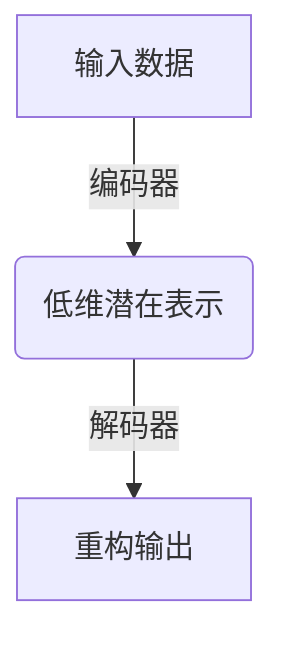

# Python实现自编码器：深度学习无监督学习实战

## 1.背景介绍

### 1.1 无监督学习的重要性

在机器学习和人工智能领域中,监督学习一直是研究的热点和重点。然而,随着数据量的激增和问题复杂性的提高,无监督学习也越来越受到关注。无监督学习不需要人工标注的训练数据,可以从原始数据中自动发现数据的内在模式和结构,具有广阔的应用前景。

### 1.2 自编码器在无监督学习中的地位

自编码器(Autoencoder)是无监督学习中最经典和最重要的模型之一。它通过学习数据的压缩表示,实现了数据的降维和特征提取,可以用于降噪、数据预处理、特征学习等多种任务。自编码器的核心思想是将输入数据先压缩编码为低维表示,再解码重构出原始数据,并最小化输入数据与重构数据之间的差异。

### 1.3 Python在深度学习中的重要作用

Python已经成为深度学习领域事实上的标准编程语言。凭借简洁高效的语法、强大的科学计算生态系统(如NumPy、Pandas、Matplotlib等)和多种深度学习框架(如TensorFlow、PyTorch、Keras等),Python为研究人员和工程师提供了高效的开发环境,推动了深度学习技术的快速发展。

## 2.核心概念与联系

### 2.1 自编码器的基本结构

自编码器是一种由编码器(Encoder)和解码器(Decoder)组成的神经网络模型。编码器将高维输入压缩为低维潜在表示,解码器则将低维潜在表示重构为与输入相似的高维输出。编码器和解码器可以是任何形式的神经网络,如全连接网络、卷积网络等。



### 2.2 自编码器的目标函数

自编码器的目标是使重构输出 $\hat{x}$ 尽可能接近原始输入 $x$,即最小化输入数据与重构数据之间的重构误差。常用的损失函数有均方误差、交叉熵等。目标函数可表示为:

$$J(\theta) = \frac{1}{n}\sum_{i=1}^{n}L(x^{(i)}, \hat{x}^{(i)})$$

其中 $\theta$ 为自编码器的所有可训练参数, $L$ 为选定的损失函数, $n$ 为训练样本数量。

### 2.3 自编码器的变体

基于基本自编码器,研究人员提出了多种变体来解决不同的问题:

- 去噪自编码器(Denoising Autoencoder): 从含噪数据中学习干净的数据表示
- 稀疏自编码器(Sparse Autoencoder): 学习稀疏的特征表示
- 变分自编码器(Variational Autoencoder): 学习数据的概率分布

这些变体通过在目标函数或网络结构上的改进,赋予了自编码器更多的功能。

## 3.核心算法原理具体操作步骤

### 3.1 自编码器的前向传播

给定一个输入样本 $x$, 自编码器的前向计算过程为:

1. 编码器将 $x$ 编码为隐含表示 $h$:
   $$h = f(Wx+b)$$
   其中 $f$ 为激活函数, $W$ 和 $b$ 为编码器参数。

2. 解码器将 $h$ 解码为重构输出 $\hat{x}$: 
   $$\hat{x} = g(W'h+b')$$
   其中 $g$ 为激活函数, $W'$ 和 $b'$ 为解码器参数。

### 3.2 自编码器的反向传播

在训练过程中,通过反向传播算法优化自编码器的参数:

1. 计算重构误差 $L(x, \hat{x})$
2. 计算 $L$ 相对于输出 $\hat{x}$ 的梯度:
   $$\frac{\partial L}{\partial \hat{x}}$$
3. 反向传播计算梯度,更新解码器参数 $W'$ 和 $b'$
4. 反向传播计算梯度,更新编码器参数 $W$ 和 $b$

通过多次迭代,自编码器最终学习到能够最小化重构误差的参数。

### 3.3 自编码器的训练技巧

1. **批量归一化(Batch Normalization)**: 加速收敛,提高泛化能力
2. **正则化(Regularization)**: 如L1/L2正则,防止过拟合
3. **梯度裁剪(Gradient Clipping)**: 防止梯度爆炸
4. **学习率衰减(Learning Rate Decay)**: 在后期训练时减小学习率

## 4.数学模型和公式详细讲解举例说明

### 4.1 自编码器的数学表示

一个单层自编码器可以用下式表示:

$$\begin{align*}
h &= f(Wx+b) \\
\hat{x} &= g(W'h+b')
\end{align*}$$

其中:
- $x$ 为输入数据, $\hat{x}$ 为重构输出
- $W$ 和 $b$ 为编码器参数, $W'$ 和 $b'$ 为解码器参数 
- $f$ 和 $g$ 分别为编码器和解码器的激活函数,如Sigmoid、ReLU等

对于一个有 $L$ 层的堆叠自编码器,可表示为:

$$\begin{align*}
h^{(1)} &= f^{(1)}(W^{(1)}x+b^{(1)}) \\
h^{(2)} &= f^{(2)}(W^{(2)}h^{(1)}+b^{(2)}) \\
&\ldots \\
h^{(L)} &= f^{(L)}(W^{(L)}h^{(L-1)}+b^{(L)})
\end{align*}$$

其中上标 $(l)$ 表示第 $l$ 层参数和激活函数。解码过程为编码过程的逆向操作。

### 4.2 自编码器的损失函数

自编码器最常用的损失函数是均方误差(Mean Squared Error):

$$J_{MSE}(\theta) = \frac{1}{n}\sum_{i=1}^{n}\|x^{(i)}-\hat{x}^{(i)}\|_2^2$$

其中 $\theta$ 为所有可训练参数, $n$ 为训练样本数量。

对于二值数据,常用交叉熵损失函数(Cross-Entropy Loss):

$$\begin{aligned}
J_{CE}(\theta) &= -\frac{1}{n}\sum_{i=1}^{n}\sum_{j=1}^{d}[x_{j}^{(i)}\log\hat{x}_{j}^{(i)} + (1-x_{j}^{(i)})\log(1-\hat{x}_{j}^{(i)})] \\
           &= -\frac{1}{n}\sum_{i=1}^{n}[x^{(i)}\log\hat{x}^{(i)} + (1-x^{(i)})\log(1-\hat{x}^{(i)})]
\end{aligned}$$

其中 $d$ 为输入维度。

### 4.3 自编码器的正则化

为防止自编码器过拟合,常采用L1或L2正则化,即在损失函数中加入参数的范数惩罚项:

$$J_{reg}(\theta) = J(\theta) + \lambda\sum_{l=1}^{L}\|W^{(l)}\|$$

其中 $\lambda$ 为正则化系数, $\|\cdot\|$ 为L1范数或L2范数。

## 4.项目实践:代码实例和详细解释说明

以下是使用PyTorch实现一个简单的自编码器的示例代码:

```python
import torch
import torch.nn as nn

# 定义自编码器模型
class Autoencoder(nn.Module):
    def __init__(self, input_dim, hidden_dim):
        super().__init__()
        
        # 编码器
        self.encoder = nn.Sequential(
            nn.Linear(input_dim, hidden_dim),
            nn.ReLU()
        )
        
        # 解码器
        self.decoder = nn.Sequential(
            nn.Linear(hidden_dim, input_dim),
            nn.Sigmoid()
        )
        
    def forward(self, x):
        # 编码
        encoded = self.encoder(x)
        
        # 解码
        decoded = self.decoder(encoded)
        
        return decoded

# 创建自编码器实例
input_dim = 28 * 28  # MNIST图像展平后的维度
hidden_dim = 32  # 隐含层维度
autoencoder = Autoencoder(input_dim, hidden_dim)

# 定义损失函数和优化器
criterion = nn.MSELoss()
optimizer = torch.optim.Adam(autoencoder.parameters(), lr=0.001)

# 训练
num_epochs = 20
for epoch in range(num_epochs):
    for data in train_loader:
        img, _ = data
        img = img.view(img.size(0), -1)
        
        # 前向传播
        outputs = autoencoder(img)
        loss = criterion(outputs, img)
        
        # 反向传播和优化
        optimizer.zero_grad()
        loss.backward()
        optimizer.step()
        
    print(f'Epoch: {epoch+1}, Loss: {loss.item():.4f}')
```

这是一个最基本的自编码器实现,包含以下几个主要部分:

1. 定义自编码器模型结构,包括编码器和解码器网络。
2. 实例化自编码器,指定输入维度和隐含层维度。
3. 定义损失函数(这里使用均方误差)和优化器。
4. 训练循环,包括前向传播、计算损失、反向传播和优化器更新参数。

在实际应用中,可以根据需求调整网络结构、损失函数、正则化方式等,以获得更好的表现。

## 5.实际应用场景

自编码器在许多领域都有广泛的应用,包括但不限于:

### 5.1 数据压缩与降噪

利用自编码器学习到的压缩表示,可以实现高效的数据压缩。去噪自编码器则可以从含噪数据中重构出干净的数据,用于图像/音频/视频的降噪。

### 5.2 特征学习与表示学习

自编码器可以自动学习数据的高阶特征表示,这对于提高后续任务(如分类、聚类等)的性能非常有帮助。变分自编码器则可以学习数据的概率分布,产生新的相似样本。

### 5.3 异常检测

由于自编码器旨在最小化输入和重构之间的差异,因此对于异常数据,重构误差会明显更大。基于这一点,可以构建有效的异常检测系统。

### 5.4 推荐系统

利用自编码器对用户和物品进行有效表示,可以提高协同过滤推荐系统的性能。

### 5.5 生成对抗网络(GAN)

变分自编码器与生成对抗网络有着内在的联系,两者结合可以产生更加真实、多样的生成样本。

### 5.6 其他应用

自编码器还可应用于语音增强、人脸识别、机器翻译、药物设计等诸多领域。

## 6.工具和资源推荐

### 6.1 Python深度学习框架

- **TensorFlow**: 谷歌开源的最流行的深度学习框架之一。
- **PyTorch**: 由Facebook人工智能研究小组开源,具有优秀的Python集成性和动态计算图灵活性。
- **Keras**: 高层次的神经网络API,可在TensorFlow/CNTK/Theano之上运行。

### 6.2 自编码器实现库

- **Pyunpack**: 一个用于构建各种自编码器的简单库。
- **Autoencoder.py**: PyTorch实现的各种自编码器模型。
- **ae**: 一个用于快速构建自编码器的Python库。

### 6.3 数据集资源

- **MNIST**: 经典的手写数字图像数据集。
- **Fashion-MNIST**: 类似MNIST的服饰图像数据集。
- **CelebA**: 大规模人脸属性数据集。
- **UCI机器学习资源库**: 包含多种数据集,可用于无监督学习。

### 6.4 在线课程和教程

- **Coursera深度学习专修课程**: 吴恩达经典的深度学习课程,涉及自编码器。
- **自编码器简介**: Keras官方提供的自编码器入门教程。
- **变分自编码器教程**: 变分自编码器的PyTorch实现和解释。

## 7.总结:未来发展趋势与挑战

自编码器作为无监督学习的基础模型,在过去几年取得了长足的进展