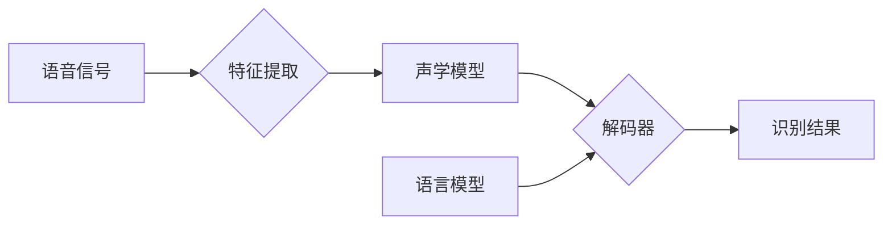

## Python机器学习实战：深度学习在语音识别中的应用

作者：禅与计算机程序设计艺术

## 1. 背景介绍

### 1.1 语音识别的发展历程

语音识别技术，简单来说就是将人类的语音信号转换为文本或命令的技术，其发展可以追溯到上世纪50年代。从早期的基于模板匹配的简单系统，到基于统计模型的隐马尔可夫模型（HMM），再到如今基于深度学习的端到端语音识别系统，语音识别技术经历了巨大的变革，识别精度和效率都得到了显著提升。

### 1.2 深度学习的兴起与应用

深度学习作为机器学习的一个重要分支，近年来在图像识别、自然语言处理等领域取得了突破性进展。相较于传统的机器学习方法，深度学习能够自动学习数据中的复杂特征表示，具有更强的泛化能力和更高的识别精度。在语音识别领域，深度学习的应用极大地推动了技术的进步，使得语音识别系统能够处理更加复杂多变的语音信号，识别效果也更加准确自然。

### 1.3 Python在机器学习中的优势

Python作为一种简洁易用、功能强大的编程语言，在机器学习领域得到了广泛应用。Python拥有丰富的机器学习库和工具，例如NumPy、Pandas、Scikit-learn、TensorFlow、PyTorch等，为机器学习算法的实现和应用提供了强大的支持。

## 2. 核心概念与联系

### 2.1 语音信号的特征提取

语音信号是一种非平稳的时变信号，为了能够被计算机识别，需要先进行特征提取，将语音信号转换为计算机能够处理的特征向量序列。常用的语音特征包括MFCC、PLP等。

#### 2.1.1 MFCC（Mel频率倒谱系数）

MFCC是一种基于人耳听觉特性的语音特征参数，它模拟了人耳对不同频率声音的感知能力。MFCC特征提取的过程包括预加重、分帧、加窗、FFT变换、Mel滤波器组、DCT变换等步骤。

#### 2.1.2 PLP（感知线性预测）

PLP是一种基于听觉模型的语音特征参数，它模拟了人耳基底膜的频率选择性。PLP特征提取的过程包括预加重、分帧、加窗、线性预测分析、Bark频率弯折、等响度预加重、DCT变换等步骤。

### 2.2 声学模型

声学模型是语音识别系统的核心组成部分，它用于描述语音特征序列与音素之间的关系。传统的声学模型主要基于隐马尔可夫模型（HMM），而深度学习的应用使得基于深度神经网络（DNN）的声学模型成为主流。

#### 2.2.1 隐马尔可夫模型（HMM）

HMM是一种统计模型，它用于描述一个系统在不同状态之间的转移概率以及每个状态下观测值的概率分布。在语音识别中，HMM的状态对应于音素，观测值对应于语音特征向量。

#### 2.2.2 深度神经网络（DNN）

DNN是一种多层神经网络，它能够学习数据中的复杂非线性关系。在语音识别中，DNN可以用于构建声学模型，将语音特征向量序列映射到音素概率。

### 2.3 语言模型

语言模型用于描述词语序列出现的概率，它可以帮助语音识别系统在多个候选识别结果中选择最符合语法和语义的结果。常用的语言模型包括统计语言模型和神经网络语言模型。

#### 2.3.1 统计语言模型

统计语言模型基于统计方法，通过统计大量的文本数据来估计词语序列出现的概率。常用的统计语言模型包括N-gram模型等。

#### 2.3.2 神经网络语言模型

神经网络语言模型基于深度学习技术，能够学习更加复杂的语言模型，例如循环神经网络（RNN）、长短期记忆网络（LSTM）等。

### 2.4 解码器

解码器用于将声学模型和语言模型的输出结合起来，找到最优的词语序列作为识别结果。常用的解码算法包括维特比算法、Beam Search算法等。

## 3. 核心算法原理具体操作步骤

### 3.1 基于深度学习的语音识别系统框架



### 3.2 声学模型训练

#### 3.2.1 数据准备

收集大量的语音数据，并进行标注，将每段语音与其对应的文本进行对齐。

#### 3.2.2 特征提取

对语音数据进行特征提取，例如MFCC、PLP等，将语音信号转换为特征向量序列。

#### 3.2.3 模型构建

选择合适的深度神经网络模型，例如DNN、CNN、RNN等，构建声学模型。

#### 3.2.4 模型训练

使用标注好的语音数据对声学模型进行训练，调整模型参数，使得模型能够准确地将语音特征向量序列映射到音素概率。

### 3.3 语言模型训练

#### 3.3.1 数据准备

收集大量的文本数据，例如新闻、小说、维基百科等。

#### 3.3.2 模型构建

选择合适的语言模型，例如N-gram模型、RNN、LSTM等。

#### 3.3.3 模型训练

使用收集到的文本数据对语言模型进行训练，调整模型参数，使得模型能够准确地估计词语序列出现的概率。

### 3.4 解码

#### 3.4.1 输入

将待识别的语音信号输入到语音识别系统。

#### 3.4.2 特征提取

对语音信号进行特征提取，得到特征向量序列。

#### 3.4.3 声学模型解码

将特征向量序列输入到训练好的声学模型中，得到每个时间步的音素概率分布。

#### 3.4.4 语言模型解码

根据语言模型，计算每个词语序列的概率。

#### 3.4.5 搜索最优路径

使用解码算法，例如维特比算法、Beam Search算法等，结合声学模型和语言模型的输出，找到最优的词语序列作为识别结果。

## 4. 数学模型和公式详细讲解举例说明

### 4.1 隐马尔可夫模型（HMM）

#### 4.1.1 模型定义

一个HMM模型可以表示为一个五元组 $\lambda = (S, V, A, B, \pi)$，其中：

* $S$ 是状态集合，表示模型所有可能的状态。
* $V$ 是观测值集合，表示模型所有可能的观测值。
* $A$ 是状态转移概率矩阵，$a_{ij}$ 表示从状态 $s_i$ 转移到状态 $s_j$ 的概率。
* $B$ 是观测值概率矩阵，$b_j(k)$ 表示在状态 $s_j$ 下观测到 $v_k$ 的概率。
* $\pi$ 是初始状态概率分布，$\pi_i$ 表示初始状态为 $s_i$ 的概率。

#### 4.1.2 三个基本问题

HMM模型有三个基本问题：

* **评估问题:** 给定一个HMM模型 $\lambda$ 和一个观测序列 $O$，计算 $P(O|\lambda)$，即在模型 $\lambda$ 下观测到序列 $O$ 的概率。
* **解码问题:** 给定一个HMM模型 $\lambda$ 和一个观测序列 $O$，找到最有可能产生该观测序列的状态序列 $Q$。
* **学习问题:** 给定一个观测序列 $O$，估计HMM模型的参数 $\lambda$，使得 $P(O|\lambda)$ 最大。

#### 4.1.3 举例说明

假设我们要建立一个HMM模型来识别数字“0”到“9”的语音。

* 状态集合 $S = \{0, 1, 2, 3, 4, 5, 6, 7, 8, 9\}$，表示10个数字。
* 观测值集合 $V = \{v_1, v_2, ..., v_K\}$，表示语音特征向量的所有可能取值。
* 状态转移概率矩阵 $A$ 可以通过统计训练数据中数字之间的转移次数来估计。
* 观测值概率矩阵 $B$ 可以通过统计训练数据中每个数字对应的语音特征向量的分布来估计。
* 初始状态概率分布 $\pi$ 可以设置为均匀分布。

### 4.2 深度神经网络（DNN）

#### 4.2.1 模型结构

DNN是由多个神经元层组成的网络结构，每个神经元层都包含多个神经元。每个神经元都与上一层的所有神经元相连，并通过一个激活函数来计算输出值。

#### 4.2.2 前向传播

DNN的前向传播过程是指从输入层开始，逐层计算每个神经元的输出值，直到输出层。每个神经元的输出值都是上一层所有神经元输出值的加权和，并经过激活函数的处理。

#### 4.2.3 反向传播

DNN的反向传播过程是指从输出层开始，逐层计算每个神经元的误差，并根据误差来更新神经元的权重。误差的计算是根据损失函数来定义的，损失函数用于衡量模型预测值与真实值之间的差异。

#### 4.2.4 举例说明

假设我们要建立一个DNN模型来识别手写数字图片。

* 输入层的神经元个数为图片的像素个数。
* 输出层的神经元个数为10，表示10个数字。
* 隐藏层的神经元个数可以根据实际情况进行调整。

## 5. 项目实践：代码实例和详细解释说明

```python
import speech_recognition as sr

# 初始化识别器
r = sr.Recognizer()

# 读取音频文件
with sr.AudioFile('audio.wav') as source:
    audio = r.record(source)

# 识别语音
try:
    # 使用Google Speech Recognition API进行识别
    text = r.recognize_google(audio)
    print("识别结果：", text)

except sr.UnknownValueError:
    print("无法识别语音")

except sr.RequestError as e:
    print("请求出错：", e)
```

**代码解释：**

1. 首先，导入 `speech_recognition` 库。
2. 创建一个 `Recognizer` 对象，用于识别语音。
3. 使用 `sr.AudioFile` 函数读取音频文件，并使用 `r.record` 函数录制音频。
4. 使用 `r.recognize_google` 函数调用 Google Speech Recognition API 进行语音识别。
5. 如果识别成功，则打印识别结果；如果识别失败，则打印错误信息。

## 6. 实际应用场景

语音识别技术在现实生活中有着广泛的应用，例如：

* **语音助手:** Siri、Alexa、Google Assistant 等语音助手利用语音识别技术来理解用户的语音指令。
* **智能家居:** 语音控制家电、灯光、窗帘等设备。
* **语音输入法:** 将语音转换为文字，提高输入效率。
* **语音搜索:** 通过语音搜索信息，更加方便快捷。
* **语音翻译:** 将一种语言的语音实时翻译成另一种语言的文字或语音。
* **医疗保健:** 语音识别技术可以用于医疗记录的录入、语音问诊等场景。

## 7. 总结：未来发展趋势与挑战

### 7.1 未来发展趋势

* **更精准的识别:** 随着深度学习技术的不断发展，语音识别系统的识别精度将会越来越高。
* **更自然的交互:** 语音识别系统将会更加智能化，能够理解更加复杂的语音指令，实现更加自然的语音交互。
* **多语言支持:** 语音识别系统将会支持更多的语言，打破语言障碍。
* **个性化定制:** 语音识别系统将会根据用户的语音习惯进行个性化定制，提供更加精准的识别服务。

### 7.2 面临的挑战

* **噪声环境下的识别:** 在噪声环境下，语音识别系统的识别精度会受到很大影响。
* **口音和方言的识别:** 不同地区的人们口音和方言差异很大，语音识别系统需要克服这些差异，提高识别精度。
* **隐私和安全问题:** 语音数据包含用户的个人隐私信息，语音识别系统的安全性和隐私保护问题需要得到重视。

## 8. 附录：常见问题与解答

### 8.1 问：如何提高语音识别系统的识别精度？

答：提高语音识别系统识别精度的方法有很多，例如：

* 使用高质量的语音数据进行训练。
* 选择合适的声学模型和语言模型。
* 对语音数据进行预处理，例如降噪、语音增强等。
* 对识别结果进行后处理，例如纠错、语义理解等。

### 8.2 问：如何选择合适的语音识别 API？

答：选择语音识别 API 需要考虑以下因素：

* 识别精度
* 支持的语言
* 价格
* API 文档和技术支持

### 8.3 问：如何保护语音数据的隐私和安全？

答：保护语音数据的隐私和安全可以采取以下措施：

* 对语音数据进行加密存储和传输。
* 严格控制语音数据的访问权限。
* 使用安全的语音识别 API。
* 遵守相关的法律法规。
