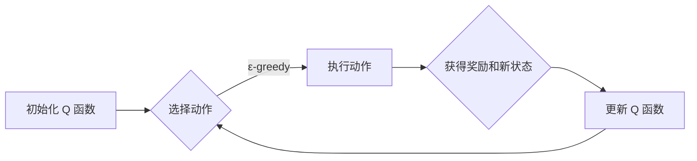

## 1. 背景介绍

### 1.1 强化学习概述

强化学习（Reinforcement Learning, RL）是机器学习的一个重要分支，它关注智能体（Agent）如何在与环境的交互中学习到最优策略，以最大化累积奖励。与监督学习不同，强化学习不需要预先提供标记好的训练数据，而是通过试错的方式来学习。

### 1.2 Q-Learning 的发展历程

Q-Learning 是一种经典的无模型（Model-Free）强化学习算法，由 Watkins 在 1989 年首次提出。它基于价值迭代的思想，通过学习状态-动作值函数（Q 函数）来评估在特定状态下采取不同动作的长期价值。

### 1.3 Q-Learning 的应用领域

Q-Learning 算法在游戏、机器人控制、推荐系统等领域有着广泛的应用。例如，DeepMind 开发的 AlphaGo 和 AlphaZero 等围棋程序就采用了 Q-Learning 的思想。

## 2. 核心概念与联系

### 2.1 智能体与环境

强化学习的核心要素是智能体和环境。智能体通过感知环境的状态，并根据自身的策略选择相应的动作，环境则根据智能体的动作给出相应的奖励和状态转移。

### 2.2 状态、动作、奖励

* **状态（State）**: 描述环境在某个时刻的状况。
* **动作（Action）**: 智能体在某个状态下可以采取的操作。
* **奖励（Reward）**: 环境对智能体动作的反馈，通常是一个数值。

### 2.3 策略、价值函数

* **策略（Policy）**: 智能体根据当前状态选择动作的规则。
* **价值函数（Value Function）**: 评估在某个状态下采取某种策略的长期价值。

### 2.4 Q 函数

Q 函数是 Q-Learning 算法的核心，它表示在某个状态下采取某个动作的预期累积奖励。

## 3. 核心算法原理具体操作步骤

### 3.1 Q 函数更新公式

Q-Learning 算法的核心是不断更新 Q 函数，使其逼近最优 Q 函数。Q 函数的更新公式如下：

$$
Q(s_t, a_t) \leftarrow Q(s_t, a_t) + \alpha [r_{t+1} + \gamma \max_{a} Q(s_{t+1}, a) - Q(s_t, a_t)]
$$

其中：

* $Q(s_t, a_t)$ 表示在状态 $s_t$ 下采取动作 $a_t$ 的 Q 值；
* $\alpha$ 为学习率，控制每次更新的幅度；
* $r_{t+1}$ 为在状态 $s_t$ 下采取动作 $a_t$ 后获得的奖励；
* $\gamma$ 为折扣因子，用于平衡当前奖励和未来奖励的重要性；
* $\max_{a} Q(s_{t+1}, a)$ 表示在状态 $s_{t+1}$ 下采取所有可能动作所能获得的最大 Q 值。

### 3.2 算法流程图



### 3.3 算法步骤

1. 初始化 Q 函数，通常将所有 Q 值初始化为 0。
2. 循环执行以下步骤，直到满足终止条件：
    * 根据当前状态 $s_t$ 和策略选择动作 $a_t$。
    * 执行动作 $a_t$，得到奖励 $r_{t+1}$ 和新状态 $s_{t+1}$。
    * 根据 Q 函数更新公式更新 Q 值：
      $$
      Q(s_t, a_t) \leftarrow Q(s_t, a_t) + \alpha [r_{t+1} + \gamma \max_{a} Q(s_{t+1}, a) - Q(s_t, a_t)]
      $$
    * 更新状态 $s_t \leftarrow s_{t+1}$。

## 4. 数学模型和公式详细讲解举例说明

### 4.1 Bellman 方程

Q-Learning 算法的理论基础是 Bellman 方程，它描述了价值函数之间的迭代关系。对于 Q 函数，Bellman 方程可以表示为：

$$
Q(s, a) = \mathbb{E}[r + \gamma \max_{a'} Q(s', a') | s, a]
$$

其中：

* $\mathbb{E}$ 表示期望；
* $r$ 表示在状态 $s$ 下采取动作 $a$ 后获得的奖励；
* $s'$ 表示下一个状态；
* $a'$ 表示在状态 $s'$ 下采取的动作。

Bellman 方程表明，当前状态-动作对的价值等于当前奖励加上折扣后的下一个状态-动作对的期望价值。

### 4.2 Q-Learning 更新公式推导

Q-Learning 更新公式可以从 Bellman 方程推导而来。将 Bellman 方程改写为迭代形式：

$$
Q_{k+1}(s, a) = \mathbb{E}[r + \gamma \max_{a'} Q_k(s', a') | s, a]
$$

其中 $k$ 表示迭代次数。将期望替换为样本均值，得到：

$$
Q_{k+1}(s, a) \approx r + \gamma \max_{a'} Q_k(s', a')
$$

将上式变形，得到 Q-Learning 更新公式：

$$
Q(s, a) \leftarrow Q(s, a) + \alpha [r + \gamma \max_{a'} Q(s', a') - Q(s, a)]
$$

### 4.3 举例说明

假设有一个迷宫环境，智能体可以上下左右移动，目标是找到迷宫的出口。环境的奖励函数如下：

* 到达出口：+10
* 撞墙：-1
* 其他情况：0

智能体初始位置在迷宫的左上角，出口在迷宫的右下角。

使用 Q-Learning 算法学习迷宫环境的最优策略。

1. 初始化 Q 函数，将所有 Q 值初始化为 0。
2. 循环执行以下步骤，直到智能体找到出口：
    * 根据当前状态和 ε-greedy 策略选择动作。
    * 执行动作，得到奖励和新状态。
    * 根据 Q 函数更新公式更新 Q 值。
    * 更新状态。

经过多次迭代后，Q 函数会收敛到最优 Q 函数，智能体就可以根据 Q 函数选择最优动作，从而找到迷宫的出口。

## 5. 项目实践：代码实例和详细解释说明

### 5.1 迷宫环境代码

```python
import numpy as np

class Maze:
    def __init__(self, width, height, start, goal):
        self.width = width
        self.height = height
        self.start = start
        self.goal = goal
        self.grid = np.zeros((height, width), dtype=int)
        self.grid[goal] = 1

    def reset(self):
        return self.start

    def step(self, state, action):
        x, y = state
        if action == 0:  # 上
            y = max(0, y - 1)
        elif action == 1:  # 下
            y = min(self.height - 1, y + 1)
        elif action == 2:  # 左
            x = max(0, x - 1)
        elif action == 3:  # 右
            x = min(self.width - 1, x + 1)
        next_state = (x, y)
        reward = 10 if next_state == self.goal else -1 if next_state != state else 0
        done = next_state == self.goal
        return next_state, reward, done
```

### 5.2 Q-Learning 算法代码

```python
import random

class QLearning:
    def __init__(self, width, height, actions, alpha=0.1, gamma=0.9, epsilon=0.1):
        self.width = width
        self.height = height
        self.actions = actions
        self.alpha = alpha
        self.gamma = gamma
        self.epsilon = epsilon
        self.q_table = np.zeros((height, width, len(actions)))

    def choose_action(self, state):
        if random.uniform(0, 1) < self.epsilon:
            return random.choice(self.actions)
        else:
            return np.argmax(self.q_table[state])

    def learn(self, state, action, reward, next_state, done):
        if not done:
            self.q_table[state][action] += self.alpha * (
                reward
                + self.gamma * np.max(self.q_table[next_state])
                - self.q_table[state][action]
            )
        else:
            self.q_table[state][action] += self.alpha * (
                reward - self.q_table[state][action]
            )
```

### 5.3 训练代码

```python
# 初始化迷宫环境和 Q-Learning 算法
maze = Maze(width=5, height=5, start=(0, 0), goal=(4, 4))
agent = QLearning(
    width=maze.width, height=maze.height, actions=[0, 1, 2, 3]
)

# 训练
for episode in range(1000):
    state = maze.reset()
    done = False
    while not done:
        action = agent.choose_action(state)
        next_state, reward, done = maze.step(state, action)
        agent.learn(state, action, reward, next_state, done)
        state = next_state

# 打印 Q 表
print(agent.q_table)
```

## 6. 实际应用场景

### 6.1 游戏领域

* 游戏 AI：Q-Learning 可以用于训练游戏 AI，例如 Atari 游戏、围棋等。
* 游戏推荐：根据玩家的游戏历史和偏好，使用 Q-Learning 算法推荐游戏。

### 6.2 机器人控制

* 路径规划：使用 Q-Learning 算法学习机器人在复杂环境中的最优路径。
* 机械臂控制：使用 Q-Learning 算法控制机械臂完成抓取、搬运等任务。

### 6.3 推荐系统

* 商品推荐：根据用户的购买历史和浏览记录，使用 Q-Learning 算法推荐商品。
* 新闻推荐：根据用户的阅读历史和兴趣标签，使用 Q-Learning 算法推荐新闻。

## 7. 总结：未来发展趋势与挑战

### 7.1 深度强化学习

将深度学习与强化学习相结合，可以解决更复杂的任务，例如图像识别、自然语言处理等。

### 7.2 多智能体强化学习

研究多个智能体之间的协作和竞争关系，例如机器人足球、无人机编队等。

### 7.3 强化学习的可解释性

提高强化学习算法的可解释性，使其决策过程更加透明和易于理解。

## 8. 附录：常见问题与解答

### 8.1 Q-Learning 算法中的探索与利用问题

Q-Learning 算法需要在探索新的状态-动作对和利用已知的最佳策略之间进行平衡。

### 8.2 Q-Learning 算法的参数设置

Q-Learning 算法的参数，例如学习率、折扣因子等，需要根据具体的应用场景进行调整。

### 8.3 Q-Learning 算法的收敛性

Q-Learning 算法在满足一定条件下可以收敛到最优策略。
