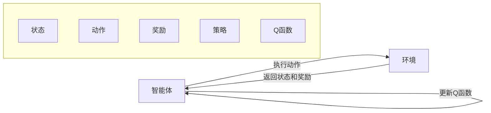
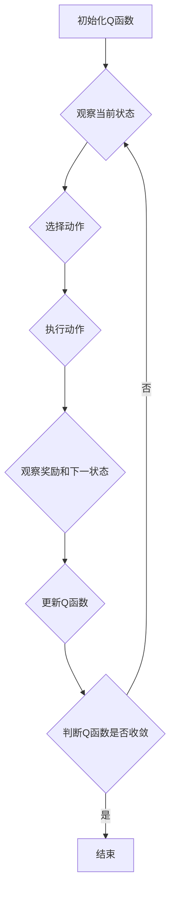

# Q-Learning极简入门：基础概念与算法思想

作者：禅与计算机程序设计艺术

## 1. 背景介绍

### 1.1 强化学习：与环境交互，学习最优策略

强化学习（Reinforcement Learning, RL）作为机器学习的一个重要分支，近年来取得了令人瞩目的成就。不同于监督学习和无监督学习，强化学习强调智能体（Agent）与环境的交互。智能体通过不断尝试不同的动作，观察环境的反馈（奖励或惩罚），从而学习到在特定环境中采取何种行动才能获得最大的累积奖励，即最优策略。

### 1.2 Q-Learning：基于价值迭代的经典算法

在众多强化学习算法中，Q-Learning以其简洁优雅的思想和易于实现的特点，成为了最基础、最经典的算法之一。它属于基于价值迭代的强化学习算法，其核心思想是学习一个状态-动作价值函数（Q 函数），该函数能够评估智能体在某个状态下采取某个动作的长期价值。

### 1.3 本文目标：深入浅出，掌握 Q-Learning 精髓

本文旨在为初学者提供一份通俗易懂的 Q-Learning 入门指南。我们将从基本概念入手，逐步深入算法原理，并结合实际案例和代码实现，帮助读者快速掌握 Q-Learning 的精髓，并为进一步学习更高级的强化学习算法打下坚实的基础。

## 2. 核心概念与联系

### 2.1 强化学习基本要素

在深入探讨 Q-Learning 之前，我们先来回顾一下强化学习的基本要素：

* **智能体（Agent）**:  与环境交互并执行动作的主体。
* **环境（Environment）**:  智能体所处的外部世界，它会根据智能体的动作给出相应的反馈。
* **状态（State）**:   描述环境当前状况的信息。
* **动作（Action）**:   智能体在特定状态下可以采取的操作。
* **奖励（Reward）**:   环境对智能体动作的反馈，通常是一个数值。
* **策略（Policy）**:   智能体根据当前状态选择动作的规则。
* **价值函数（Value Function）**:   用于评估智能体在某个状态或状态-动作对下所能获得的长期累积奖励。

### 2.2 Q-Learning 中的关键概念

* **状态-动作价值函数（Q 函数）**:  Q(s, a) 表示智能体在状态 s 下采取动作 a 后，所能获得的期望累积奖励。
* **时间差分（Temporal Difference, TD）**:  利用当前时刻的估计值来更新上一时刻的估计值，是 Q-Learning 中的核心思想。
* **探索-利用困境（Exploration-Exploitation Dilemma）**:  智能体需要在探索未知状态-动作对和利用已知信息之间做出权衡。


### 2.3  要素之间的关系图



## 3. 核心算法原理具体操作步骤

### 3.1 Q-Learning 算法流程

Q-Learning 算法的核心思想是通过不断迭代更新 Q 函数，最终得到一个收敛的 Q 函数，从而指导智能体在任意状态下选择最优动作。其算法流程如下：

1. **初始化 Q 函数**: 为所有状态-动作对赋予一个初始值，通常为 0。
2. **循环迭代**:
    1. **观察当前状态** s。
    2. **根据当前 Q 函数和一定的探索策略选择动作** a，例如 ε-greedy 策略。
    3. **执行动作** a，并观察环境返回的下一个状态 s' 和奖励 r。
    4. **更新 Q 函数**:  
       $$ Q(s, a) \leftarrow Q(s, a) + \alpha [r + \gamma \max_{a'} Q(s', a') - Q(s, a)] $$
       其中：
       * $\alpha$ 为学习率，控制每次更新的幅度；
       * $\gamma$ 为折扣因子，用于平衡当前奖励和未来奖励的重要性；
       * $\max_{a'} Q(s', a')$ 表示在下一个状态 s' 下，所有可选动作中 Q 值最大的动作对应的 Q 值。
    5. **更新状态**:  s = s'。
3. **直到 Q 函数收敛**:  当 Q 函数的变化小于某个阈值时，认为 Q 函数已经收敛。

### 3.2  算法流程图



### 3.3  关键步骤详解

1. **选择动作**: 在选择动作时，需要平衡探索和利用之间的关系。常用的探索策略有 ε-greedy 策略，即以 ε 的概率随机选择动作，以 1-ε 的概率选择当前 Q 函数认为最优的动
作。
2. **更新 Q 函数**: Q 函数的更新公式是 Q-Learning 算法的核心，它基于时间差分（TD）的思想，利用当前时刻的估计值来更新上一时刻的估计值。
3. **判断 Q 函数是否收敛**:  判断 Q 函数是否收敛的常用方法是观察 Q 函数的变化情况，当 Q 函数的变化小于某个阈值时，认为 Q 函数已经收敛。

## 4. 数学模型和公式详细讲解举例说明

### 4.1  Bellman 方程

Q-Learning 的数学基础是 Bellman 方程。Bellman 方程描述了状态-动作价值函数（Q 函数）之间的迭代关系，其表达式如下：

$$
Q(s, a) = \mathbb{E}[r + \gamma \max_{a'} Q(s', a') | s, a] 
$$

其中：

* $Q(s, a)$ 表示在状态 s 下采取动作 a 后，所能获得的期望累积奖励；
* $\mathbb{E}$ 表示期望值；
* $r$ 表示在状态 s 下采取动作 a 后，环境返回的即时奖励；
* $\gamma$ 为折扣因子，用于平衡当前奖励和未来奖励的重要性；
* $s'$ 表示在状态 s 下采取动作 a 后，环境转移到的下一个状态；
* $\max_{a'} Q(s', a')$ 表示在下一个状态 s' 下，所有可选动作中 Q 值最大的动作对应的 Q 值。

### 4.2  Q-Learning 更新公式推导

Q-Learning 的更新公式可以从 Bellman 方程推导而来。将 Bellman 方程中的期望值用样本均值代替，并将 Q 函数更新公式改写成增量形式，即可得到 Q-Learning 的更新公式：

$$
\begin{aligned}
Q(s, a) &\leftarrow Q(s, a) + \alpha [r + \gamma \max_{a'} Q(s', a') - Q(s, a)] \\
&= (1 - \alpha) Q(s, a) + \alpha [r + \gamma \max_{a'} Q(s', a')]
\end{aligned}
$$

### 4.3  实例讲解

假设有一个迷宫环境，智能体需要从起点走到终点，每走一步会得到 -1 的奖励，走到终点会得到 100 的奖励。我们可以用 Q-Learning 算法来训练一个智能体，让它学会如何在迷宫中找到最短路径。

1. **初始化 Q 函数**: 将所有状态-动作对的 Q 值初始化为 0。
2. **循环迭代**:
    1. **观察当前状态** s，例如智能体当前位于迷宫的 (1, 1) 位置。
    2. **根据当前 Q 函数和 ε-greedy 策略选择动作** a，例如智能体有 0.8 的概率选择 Q 值最大的动作，0.2 的概率随机选择动作。
    3. **执行动作** a，并观察环境返回的下一个状态 s' 和奖励 r，例如智能体选择向上移动，到达 (0, 1) 位置，得到 -1 的奖励。
    4. **更新 Q 函数**:  
       $$ Q((1, 1), 向上) \leftarrow Q((1, 1), 向上) + 0.1 [-1 + 0.9 \max_{a'} Q((0, 1), a') - Q((1, 1), 向上)] $$
       其中：
       * 学习率 $\alpha$ 设置为 0.1；
       * 折扣因子 $\gamma$ 设置为 0.9。
    5. **更新状态**:  s = s'，即智能体当前位于 (0, 1) 位置。
3. **直到 Q 函数收敛**:  当 Q 函数的变化小于某个阈值时，认为 Q 函数已经收敛。

## 5. 项目实践：代码实例和详细解释说明

### 5.1  迷宫环境搭建

```python
import numpy as np

class Maze:
    def __init__(self, width, height, start, end, obstacles):
        self.width = width
        self.height = height
        self.start = start
        self.end = end
        self.obstacles = obstacles

    def is_valid_state(self, state):
        x, y = state
        return 0 <= x < self.width and 0 <= y < self.height and (x, y) not in self.obstacles

    def get_reward(self, state):
        if state == self.end:
            return 100
        else:
            return -1

    def get_next_state(self, state, action):
        x, y = state
        if action == "up":
            next_state = (x - 1, y)
        elif action == "down":
            next_state = (x + 1, y)
        elif action == "left":
            next_state = (x, y - 1)
        elif action == "right":
            next_state = (x, y + 1)
        else:
            raise ValueError("Invalid action.")

        if self.is_valid_state(next_state):
            return next_state
        else:
            return state
```

### 5.2  Q-Learning 算法实现

```python
import random

class QLearningAgent:
    def __init__(self, maze, actions, epsilon=0.1, alpha=0.1, gamma=0.9):
        self.maze = maze
        self.actions = actions
        self.epsilon = epsilon
        self.alpha = alpha
        self.gamma = gamma
        self.q_table = np.zeros((maze.width, maze.height, len(actions)))

    def choose_action(self, state):
        if random.random() < self.epsilon:
            return random.choice(self.actions)
        else:
            return self.actions[np.argmax(self.q_table[state[0], state[1], :])]

    def learn(self, state, action, reward, next_state):
        predict_q = self.q_table[state[0], state[1], self.actions.index(action)]
        target_q = reward + self.gamma * np.max(self.q_table[next_state[0], next_state[1], :])
        self.q_table[state[0], state[1], self.actions.index(action)] += self.alpha * (target_q - predict_q)
```

### 5.3  训练和测试

```python
# 初始化迷宫环境
maze = Maze(width=5, height=5, start=(0, 0), end=(4, 4), obstacles=[(1, 1), (2, 2), (3, 3)])

# 初始化 Q-Learning 智能体
agent = QLearningAgent(maze, actions=["up", "down", "left", "right"])

# 训练智能体
for episode in range(1000):
    state = maze.start
    while state != maze.end:
        action = agent.choose_action(state)
        next_state = maze.get_next_state(state, action)
        reward = maze.get_reward(next_state)
        agent.learn(state, action, reward, next_state)
        state = next_state

# 测试智能体
state = maze.start
while state != maze.end:
    action = agent.choose_action(state)
    print(f"当前位置：{state}，选择动作：{action}")
    state = maze.get_next_state(state, action)
print(f"到达终点：{state}")
```

## 6. 实际应用场景

### 6.1 游戏 AI

Q-Learning 可以用于开发游戏 AI，例如训练游戏角色自动玩游戏、寻找最优路径等。

### 6.2  推荐系统

Q-Learning 可以用于构建个性化推荐系统，根据用户的历史行为和偏好推荐商品或服务。

### 6.3  机器人控制

Q-Learning 可以用于训练机器人在复杂环境中执行任务，例如路径规划、物体抓取等。

## 7. 总结：未来发展趋势与挑战

### 7.1  深度强化学习

将深度学习与强化学习相结合，利用深度神经网络强大的表征能力来解决更复杂的强化学习问题，例如 Deep Q-Network (DQN) 等。

### 7.2  多智能体强化学习

研究多个智能体在共享环境中相互协作或竞争，学习最优策略，例如 Multi-Agent Deep Deterministic Policy Gradient (MADDPG) 等。

### 7.3  强化学习的安全性

随着强化学习应用的不断扩展，其安全性问题也日益凸显，例如如何避免智能体学习到危险或不道德的行为等。

## 8. 附录：常见问题与解答

### 8.1  Q-Learning 中的学习率和折扣因子如何选择？

学习率和折扣因子是 Q-Learning 中的两个重要参数，它们的选择会影响算法的收敛速度和最终性能。

* **学习率** 控制每次更新的幅度，学习率越大，收敛速度越快，但也可能导致算法震荡或不稳定。通常情况下，学习率设置为 0.1 或更小的值。
* **折扣因子** 用于平衡当前奖励和未来奖励的重要性，折扣因子越大，未来奖励的重要性越高，反之亦然。通常情况下，折扣因子设置为 0.9 或更大的值。

### 8.2  Q-Learning 中的探索-利用困境如何解决？

探索-利用困境是强化学习中的一个经典问题，它指的是智能体需要在探索未知状态-动作对和利用已知信息之间做出权衡。常用的解决方法有：

* **ε-greedy 策略**: 以 ε 的概率随机选择动作，以 1-ε 的概率选择当前 Q 函数认为最优的动作。
* **UCB 算法**:  根据状态-动作对的访问次数和平均奖励来选择动作，访问次数越少、平均奖励越高的动作，被选择的概率越大。

### 8.3  Q-Learning 有哪些优缺点？

**优点**:

* 简洁易懂，易于实现。
* 可以处理离散状态和动作空间的问题。

**缺点**:

* 当状态和动作空间很大时，Q-Learning 的效率会很低。
* Q-Learning 只能处理离散奖励的问题，不能处理连续奖励的问题。