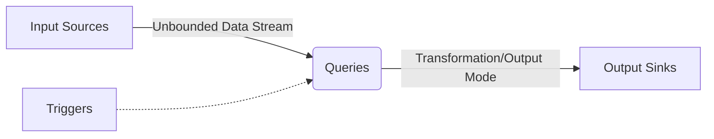
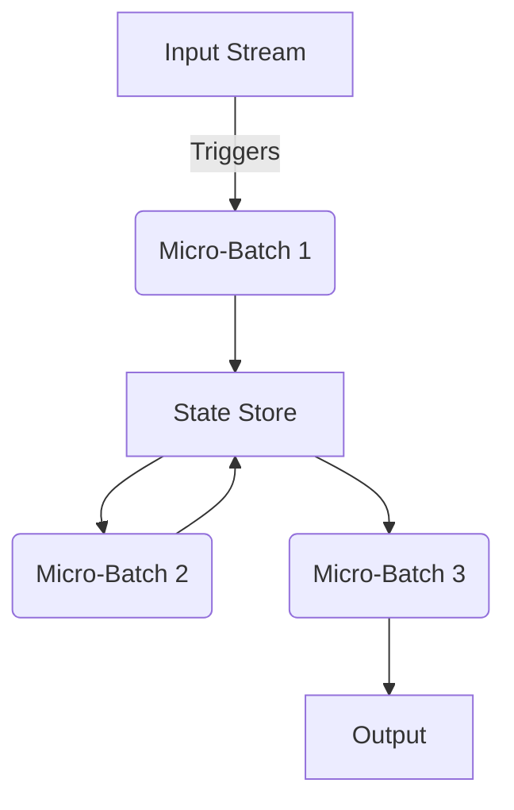

# Structured Streaming原理与代码实例讲解

## 1.背景介绍

### 1.1 大数据处理的挑战

在当今数据爆炸的时代,海量的数据不断产生和涌入。传统的批处理系统如Apache Hadoop MapReduce虽然可以处理静态数据,但面对实时产生的动态数据却显得力不从心。对于金融交易、网络安全监控、物联网设备监测等应用场景,它们需要实时处理持续到来的数据流,以便及时做出反应和决策。

### 1.2 流式计算的兴起

为了解决这一难题,流式计算(Stream Processing)应运而生。它将数据视为无界(unbounded)的持续流,可以实时处理并生成结果。Apache Spark作为内存计算框架,通过其Structured Streaming模块提供了高度抽象和高性能的流式计算能力,使开发人员能够像批处理一样编写流式应用程序。

### 1.3 Structured Streaming的优势

Spark Structured Streaming具有以下优势:

- 统一批流处理:使用相同的代码可以应对批处理和流式处理
- 高度抽象:提供类似SQL的高级API,无需编写底层流处理代码
- 容错与恢复:可以从故障中恢复并重新处理数据
- 与Spark生态系统集成:可以与Spark SQL、DataFrames、机器学习等无缝集成

通过Structured Streaming,开发人员可以专注于业务逻辑,而不必过多关注底层的流式处理细节,从而大大提高了开发效率和运维便利性。

## 2.核心概念与联系

### 2.1 Structured Streaming概览

Structured Streaming将流式计算抽象为一个流输入、经过处理逻辑、产生结果流输出的过程。其核心概念包括:

- Input Sources: 流式数据源,如Kafka、文件流等
- Queries: 定义流式数据的处理逻辑
- Triggers: 触发流式查询执行的机制
- Output Sinks: 处理结果输出到外部系统,如内存、文件等



### 2.2 Input Sources

Input Sources定义了流式数据的来源,可以来自各种消息队列(如Kafka)、文件系统(如HDFS)、Socket流等。Structured Streaming支持多种内置和自定义的数据源。

### 2.3 Queries

Queries定义了对流式数据的处理逻辑,可以使用Dataset/DataFrame API进行各种转换和操作,如选择、过滤、聚合等。Structured Streaming提供了两种模式:

- Append Mode(默认):只输出新增加的行
- Update Mode: 对已有行更新,可以捕获更新和删除操作

### 2.4 Triggers

Triggers控制着流式查询的执行时机,可以是:

- Fixed interval micro-batches: 固定时间间隔执行 
- One-time micro-batch: 仅执行一次
- Continuous with fixed checkpoint: 连续执行并定期检查点

### 2.5 Output Sinks 

Output Sinks定义了处理结果输出的目标位置,可以是内存表、文件系统、数据库等。根据输出模式,结果会以全量或增量方式输出。

### 2.6 核心原理:微批处理

Structured Streaming背后的核心原理是将流式计算视为一系列小批次(micro-batches)的连续执行。每个触发周期,引擎从源头获取新增数据,与旧状态进行整合后再应用处理逻辑,生成新结果输出。这种设计使得Structured Streaming可以复用Spark的批处理引擎,并保证了端到端的容错和恢复语义。



## 3.核心算法原理具体操作步骤

Structured Streaming的处理流程可以概括为以下几个步骤:

### 3.1 构建流式输入

使用`spark.readStream`创建一个无界(unbounded)的输入流:

```python
inputStream = spark \
  .readStream \
  .format("kafka") \
  .option("kafka.bootstrap.servers", "host1:port1,host2:port2") \
  .option("subscribe", "topic1") \
  .load()
```

### 3.2 定义流式查询

使用Dataset/DataFrame API进行转换和处理:

```python
wordCounts = inputStream \
  .select(explode(split("value", " ")).alias("word")) \
  .groupBy("word") \
  .count()
```

### 3.3 指定输出模式

选择Append或Update模式:

```python
query = wordCounts \
  .writeStream \
  .format("memory") \
  .outputMode("complete") \ # 或 "append" 
  .queryName("counts") \
  .start()
```

### 3.4 设置触发间隔 

使用`trigger`方法指定触发器:

```python
query = wordCounts \
  .writeStream \
  .trigger(processingTime='5 seconds') \ # 每5秒执行一次
  ...
```

### 3.5 开始流式执行

启动流式查询并等待结果:

```python 
query.awaitTermination()
```

Structured Streaming将自动管理状态,在触发时执行微批次,并输出增量结果。

### 3.6 容错与检查点

流式查询会自动将中间状态保存到检查点位置(如HDFS),以便故障恢复:

```python
query = wordCounts \
  .writeStream \
  .option("checkpointLocation", "/path/to/checkpoint") \
  ...
```

### 3.7 停止流式查询

当不再需要时,可以停止流式查询:

```python
query.stop()
```

通过上述步骤,我们可以轻松构建和运行Structured Streaming应用程序。Spark负责底层的流式处理细节,开发人员只需关注业务逻辑。

## 4.数学模型和公式详细讲解举例说明 

在Structured Streaming中,流式计算的核心思想可以用数学模型来表示。假设我们有一个输入数据流$D$,经过查询$Q$的转换后生成输出结果流$R$,可以表示为:

$$R = Q(D)$$

其中$D = \{d_1, d_2, d_3, ...\}$是一个无限的数据序列,每个$d_i$表示一条流式数据记录。

为了实现增量计算,Structured Streaming将查询$Q$分解为一系列的增量操作符$q_i$。对于每个微批次,只需要计算增量部分$\Delta D_i$,然后与前一个状态$S_{i-1}$相结合,生成新的输出增量$\Delta R_i$和状态$S_i$。形式化表示为:

$$
\begin{align*}
S_i &= q_i(S_{i-1}, \Delta D_i) \\
\Delta R_i &= p_i(S_i)
\end{align*}
$$

其中$S_i$是第$i$个微批次的状态,$\Delta D_i$是该批次新增的数据,$\Delta R_i$是生成的输出增量。状态$S_i$由前一个状态$S_{i-1}$和新增数据$\Delta D_i$共同决定,而输出增量$\Delta R_i$则由状态$S_i$决定。

以单词计数(WordCount)为例,在第$i$个微批次中,我们需要:

1. 从Kafka获取新增消息$\Delta D_i$
2. 提取单词,与前一个状态$S_{i-1}$相结合,生成新的单词计数状态$S_i$
3. 将$S_i$转换为输出增量$\Delta R_i$

最终的输出结果$R$就是所有增量$\Delta R_i$的并集。通过这种方式,Structured Streaming实现了高效的增量计算。

上述数学模型同时体现了Structured Streaming的无界语义。由于输入数据流$D$是无限的,因此计算永远不会终止,而是持续进行状态迁移和增量输出。

## 4.项目实践:代码实例和详细解释说明

让我们通过一个实际的代码示例来深入理解Structured Streaming的使用。这个示例将从Kafka消费消息,进行单词计数统计,并将结果输出到内存表中。

### 4.1 导入所需库

```python
from pyspark.sql import SparkSession
from pyspark.sql.functions import explode, split
```

### 4.2 创建SparkSession

```python
spark = SparkSession \
    .builder \
    .appName("StructuredNetworkWordCount") \
    .getOrCreate()
```

### 4.3 构建Kafka输入流

```python
# 从Kafka主题'test'读取数据流
inputStream = spark \
    .readStream \
    .format("kafka") \
    .option("kafka.bootstrap.servers", "host1:port1,host2:port2") \
    .option("subscribe", "test") \
    .load()
```

### 4.4 定义流式查询

```python
# 对流式数据进行转换
wordCounts = inputStream \
    .select(explode(split("value", " ")).alias("word")) \
    .groupBy("word") \
    .count()
```

这里我们:

1. 从Kafka消息的`value`字段中提取单词(`explode(split("value", " "))`)
2. 按单词分组并计数(`groupBy("word").count()`)

### 4.5 输出结果到内存表

```python
# 将单词计数结果输出到内存表
query = wordCounts \
    .writeStream \
    .format("memory") \
    .outputMode("complete") \
    .queryName("counts") \
    .start()
```

这里我们:

1. 使用`writeStream`开始定义输出
2. 将输出格式指定为`memory`(内存表)
3. 指定输出模式为`complete`(全量输出)
4. 给查询命名为`counts`
5. 调用`start`开始执行流式查询

### 4.6 等待输出

```python
# 等待输出并打印结果
while True:
    try:
        output_df = spark.sql("SELECT * FROM counts")
        output_rows = output_df.collect()
        for row in output_rows:
            print(f"Word: {row['word']}, Count: {row['count']}")
        query.awaitTermination(5)  # 等待5秒
    except KeyboardInterrupt:
        break
```

在这个循环中,我们:

1. 从内存表`counts`中查询并收集结果
2. 打印每个单词及其计数
3. 调用`query.awaitTermination(5)`等待5秒,以便Structured Streaming处理新的微批次

当有新的微批次到来时,内存表`counts`会自动更新,我们就可以看到打印出的单词计数结果。

### 4.7 停止查询

当需要停止时,可以使用`Ctrl+C`中断循环,并调用`query.stop()`来停止流式查询。

```python
query.stop()
```

通过这个示例,我们可以看到使用Structured Streaming进行流式计算是多么简单。Spark为我们抽象了底层的流处理细节,我们只需关注数据转换逻辑即可。

## 5.实际应用场景

Structured Streaming的应用场景非常广泛,包括但不限于:

### 5.1 实时数据分析

- 网络流量监控和安全检测
- 物联网设备数据分析
- 金融交易实时处理

### 5.2 实时数据集成

- 日志收集和处理
- 数据湖构建
- 变化数据捕获(CDC)

### 5.3 实时机器学习

- 推荐系统
- 实时预测
- 在线模型训练和更新

### 5.4 流式ETL

- 实时数据清洗和转换
- 实时数据编排

### 5.5 流式处理管道

- 复杂事件处理(CEP)
- 实时报警和通知

无论是传统行业还是新兴领域,实时处理动态数据流对于及时做出反应和决策至关重要。Structured Streaming为这些应用场景提供了强大的支持。

## 6.工具和资源推荐

学习和使用Structured Streaming时,以下工具和资源可能会有所帮助:

### 6.1 Apache Spark官方文档

Spark官方文档(https://spark.apache.org/docs/latest/structured-streaming-programming-guide.html)提供了详细的Structured Streaming介绍、API使用指南和最佳实践。

### 6.2 Structured Streaming编程指南

Databricks提供了免费的Structured Streaming编程指南(https://databricks.com/p/ebook/deep-dive-into-structured-streaming),涵盖了核心概念、高级用法和性能调优技巧。

### 6.3 Kafka集成

由于Kafka是最常用的流式数据源之一,了解Kafka与Structured Streaming的集成非常重要。Kafka官方文档(https://kafka.apache.org/documentation/)和Conflu