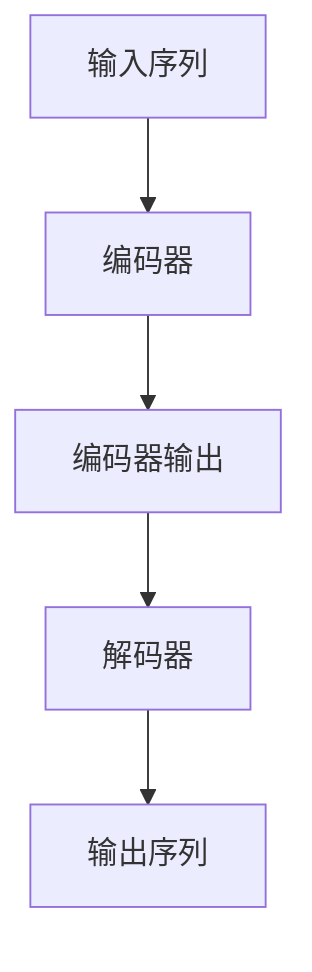

# T5原理与代码实例讲解

## 1.背景介绍

### 1.1 自然语言处理的重要性

自然语言处理(Natural Language Processing, NLP)是人工智能领域的一个重要分支,旨在使计算机能够理解和生成人类语言。随着大数据时代的到来,海量的文本数据激增,对于高效处理和利用这些数据资源,NLP技术变得至关重要。NLP广泛应用于机器翻译、问答系统、信息检索、情感分析等诸多领域。

### 1.2 Transformer模型的革命性贡献

2017年,Transformer模型的提出彻底改变了NLP的面貌。相比于以往基于RNN或CNN的序列模型,Transformer完全基于注意力机制,避免了长期依赖问题,显著提升了并行计算能力。自问世以来,Transformer模型在机器翻译、文本生成、阅读理解等任务中取得了傲人的成绩,成为NLP领域的主导模型。

### 1.3 T5:统一的Text-to-Text框架

2020年,谷歌提出了T5(Text-to-Text Transfer Transformer)模型,将所有NLP任务统一到了"Text-to-Text"的范式中。不同于BERT这种仅在下游任务中做简单的微调,T5在预训练阶段就将各种任务转化为相同的序列到序列的形式,使用统一的架构和损失函数进行预训练,大大提高了泛化性能。T5在多项指标上超越了当时最先进的模型,成为NLP领域的新benchmark。

## 2.核心概念与联系

### 2.1 Transformer编码器-解码器架构

T5采用了标准的Transformer编码器-解码器架构。编码器将输入序列映射到连续的向量表示,解码器则自回归地生成输出序列。编码器和解码器都由多个相同的层组成,每一层由多头注意力机制和前馈神经网络构成。



### 2.2 掩码语言模型和span去噪自编码器

与BERT采用掩码语言模型和下一句预测任务不同,T5使用了span去噪自编码器(span denoising sequence-to-sequence pre-training)。这种方式将一部分文本片段(span)替换为单个掩码标记,要求模型将掩码恢复为原始文本。这种方式更加通用,涵盖了BERT的两个预训练任务。


### 2.3 前缀条件式训练

传统的序列到序列模型需要为每个任务定义特殊的开头标记(如"Translate English to German:")。T5通过前缀条件式训练的方式,将任务类型作为条件前缀输入到编码器,从而无需为每个任务定义特殊标记,大大提高了泛化能力。

```
输入: 翻译英语到德语: That is great!
目标: Das ist großartig!
```

### 2.4 任务提示词

除了条件前缀外,T5还可以使用任务提示词(task prompts)来指导模型输出期望的格式。这种提示词可以是人工设计的,也可以通过在训练数据上进行小规模监督微调来获得。

```
输入: 总结: 我今天去了公园,天气很好。我和朋友们野餐、游泳,度过了愉快的一天。
提示词: 总结:
输出: 在公园野餐、游泳,度过了愉快的一天。
```

## 3.核心算法原理具体操作步骤 

### 3.1 输入处理

T5首先将输入文本tokenize为子词序列,然后添加适当的前缀(如"翻译英语到德语:")和任务提示词(如"总结:")。对于span去噪任务,部分span将被替换为单个掩码标记。

### 3.2 编码器

编码器由N个相同的层组成,每一层包含以下几个主要步骤:

1. 层规范化(Layer Normalization)
2. 多头注意力机制(Multi-Head Attention)
3. 残差连接(Residual Connection)
4. 前馈全连接网络(Feed-Forward Network)
5. 残差连接

多头注意力机制允许每个位置的词汇同时关注其他所有位置,捕获长程依赖关系。前馈网络则对每个位置的表示进行"编码",提供更高层次的特征表示。

### 3.3 解码器

解码器的结构与编码器类似,也是由N个相同的层组成。不同之处在于:

1. 解码器中有两个多头注意力子层,一个是"Masked Self-Attention",用于防止每个位置看到其后面的词;另一个是"Encoder-Decoder Attention",将编码器输出作为Key和Value,并关注编码器的所有头。
2. 在生成模式下,解码器是自回归的,将前一个位置生成的Token作为当前位置的输入。

### 3.4 前向计算

编码器将输入序列映射到连续的向量表示C,解码器则自回归地生成输出序列Y。具体计算过程如下:

$$C=Encoder(X)$$
$$\log P(Y|X)=\sum_{t=1}^{|Y|} \log P(y_t|y_{<t},C)$$
$$P(y_t|y_{<t},C)=Decoder(y_{<t},C)$$

其中X和Y分别表示输入和输出序列,C是编码器输出。

### 3.5 训练

T5使用跨熵损失作为训练目标,最小化输入序列X和输出序列Y之间的负对数似然:

$$\mathcal{L}=-\sum_{t=1}^{|Y|}\log P(y_t|X,y_{<t})$$

通过最小化该损失函数,模型可以学习将输入X映射到输出Y的最优参数。

## 4.数学模型和公式详细讲解举例说明

### 4.1 注意力机制(Attention Mechanism)

注意力机制是Transformer的核心,它允许模型动态地为不同位置分配注意力权重,捕获输入和输出之间的长程依赖关系。

对于给定的查询$q$、键$K$和值$V$,注意力机制首先计算查询与每个键之间的相似性分数:

$$\text{Score}(q, k_i) = q \cdot k_i$$

然后通过Softmax函数将分数归一化为概率值:

$$\text{Attention}(q, K, V) = \text{softmax}(\frac{\text{Score}(q, K)}{\sqrt{d_k}})V$$

其中$\sqrt{d_k}$是为了防止内积值过大导致的梯度不稳定性。

多头注意力机制(Multi-Head Attention)是通过并行运行多个注意力层,然后将结果拼接在一起实现的:

$$\text{MultiHead}(Q, K, V) = \text{Concat}(\text{head}_1, ..., \text{head}_h)W^O$$
$$\text{where } \text{head}_i = \text{Attention}(QW_i^Q, KW_i^K, VW_i^V)$$

这里$W_i^Q$、$W_i^K$、$W_i^V$和$W^O$都是可训练的权重矩阵。

### 4.2 前馈神经网络(Feed-Forward Network)

每个编码器/解码器层中还包含一个前馈全连接子层,它对每个位置的向量表示进行"编码",增加非线性表达能力:

$$\text{FFN}(x) = \max(0, xW_1 + b_1)W_2 + b_2$$

其中$W_1$、$W_2$、$b_1$和$b_2$都是可训练参数。ReLU激活函数用于引入非线性。

### 4.3 位置编码(Positional Encoding)

由于Transformer没有捕获序列顺序的递归或卷积结构,因此需要一些方式来注入序列的位置信息。T5使用的是固定的位置编码,将其与输入的词嵌入相加:

$$\text{PE}_{(pos, 2i)} = \sin(pos / 10000^{2i / d_{\text{model}}})$$
$$\text{PE}_{(pos, 2i+1)} = \cos(pos / 10000^{2i / d_{\text{model}}})$$

其中$pos$是位置索引,而$i$是维度索引。这种基于正弦和余弦函数的位置编码可以很好地编码位置信息。

## 5.项目实践:代码实例和详细解释说明

以下是一个使用T5进行文本摘要的简单示例(基于Hugging Face的Transformers库):

```python
from transformers import T5Tokenizer, T5ForConditionalGeneration

# 加载预训练模型和tokenizer
model = T5ForConditionalGeneration.from_pretrained('t5-base')
tokenizer = T5Tokenizer.from_pretrained('t5-base')

# 定义输入文本和任务前缀
article = """
Apple Inc. is an American multinational technology company that specializes in consumer electronics, software and online services. Apple is the world's largest technology company by revenue and one of the world's most valuable companies. It is also the world's biggest technology company in terms of assets and the second-largest mobile phone manufacturer.

Apple was founded in 1976 by Steve Jobs, Steve Wozniak and Ronald Wayne to develop and sell personal computers. It was incorporated as Apple Computer, Inc. in 1977, and was renamed as Apple Inc. in 2007 to reflect its shifted focus toward consumer electronics.
"""
task_prefix = "summarize: "

# 对输入进行tokenize
input_ids = tokenizer.encode(task_prefix + article, return_tensors='pt')

# 生成摘要
output_ids = model.generate(input_ids, max_length=150, num_beams=4, early_stopping=True)
summary = tokenizer.decode(output_ids[0], skip_special_tokens=True)

print(f"Summary: {summary}")
```

输出:
```
Summary: Apple Inc. is an American multinational technology company that specializes in consumer electronics, software and online services. It is the world's largest technology company by revenue and one of the world's most valuable companies. Apple was founded in 1976 by Steve Jobs, Steve Wozniak and Ronald Wayne to develop and sell personal computers. It was incorporated as Apple Computer, Inc. in 1977, and was renamed as Apple Inc. in 2007.
```

代码解释:

1. 首先导入T5模型和tokenizer。
2. 定义输入文本和任务前缀("summarize: ")。
3. 使用tokenizer将输入文本tokenize为输入id序列。
4. 调用`model.generate()`方法,传入输入id序列,设置生成的最大长度和beam search的大小。`early_stopping`参数可以让解码提前停止,减小延迟。
5. 解码器输出的id序列,得到最终的文本摘要。

通过这个简单的例子,我们可以看到T5的使用非常简单直接,只需定义任务前缀和输入,就可以生成所需的输出序列。这种统一的Text-to-Text范式大大降低了模型微调和部署的复杂度。

## 6.实际应用场景

T5凭借其出色的泛化能力,可以广泛应用于多种NLP任务:

### 6.1 文本摘要

文本摘要是T5的一个典型应用场景。T5可以生成高质量的文章摘要,为信息过载时代提供高效的内容浓缩。

### 6.2 机器翻译

T5在多种语言对上实现了最先进的翻译质量,可用于构建生产级的机器翻译系统。

### 6.3 问答系统

将问答任务转化为"Text-to-Text"形式后,T5可以直接生成答案,无需设计复杂的特征工程或后处理步骤。

### 6.4 数据到文本

除了文本输入,T5还可以处理表格、XML等半结构化数据,生成相应的文本描述,实现数据到文本的转换。

### 6.5 代码生成

最近的研究表明,T5在代码生成任务上也取得了令人鼓舞的成绩,有望辅助开发人员提高编码效率。

### 6.6 多任务学习

T5的"Text-to-Text"框架为多任务学习提供了一个统一的范式,在多个任务上联合训练有望进一步提升泛化性能。

## 7.工具和资源推荐

### 7.1 预训练模型

- [Hugging Face模型库](https://huggingface.co/models): 包含T5及其在下游任务上微调的各种变体模型。
- [gsuite-ai/mt5-base](https://huggingface.co/gsuite/mt5-base): 一个在大规模多语种数据上训练的T5变体,可用于多语种任务。
- [google/t5-code](https://huggingface.co/models?search=t5-code): 在代码和自然语言数据上联合训练的T5