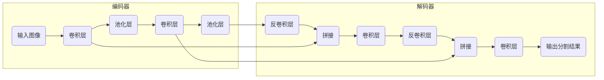

# TensorFlow：构建UNet模型的利器

## 1. 背景介绍

### 1.1 图像分割的挑战与机遇

图像分割是计算机视觉领域的一项基础性任务，旨在将图像分割成多个具有语义意义的区域，每个区域代表不同的物体或部分。近年来，随着深度学习技术的快速发展，图像分割技术取得了显著的进步，并在自动驾驶、医疗影像分析、遥感图像解译等领域展现出巨大的应用潜力。

然而，图像分割任务本身也面临着一些挑战：

- **复杂场景下的分割精度**:  现实场景中的图像往往包含复杂的背景、光照变化、遮挡等因素，这对分割算法的鲁棒性提出了更高的要求。
- **高效的模型训练与推理**:  图像分割模型通常需要处理大量的像素信息，这对计算资源和处理速度提出了挑战。
- **模型的可解释性**:  理解模型的决策过程对于提高模型的可信度和可靠性至关重要。

### 1.2 UNet：应对挑战的利器

UNet是一种基于深度学习的图像分割模型，因其独特的U型结构而得名。UNet架构于2015年首次提出，并在医学图像分割领域取得了突破性的成果。其主要特点包括：

- **编码器-解码器结构**:  UNet采用编码器-解码器结构，其中编码器逐渐降低图像分辨率并提取高级语义特征，解码器则逐步恢复图像分辨率并结合低级特征进行精细分割。
- **跳跃连接**:  UNet引入了跳跃连接，将编码器中的特征图直接传递给解码器，有效地融合了不同尺度的特征信息，提高了分割精度。
- **端到端的训练**:  UNet可以进行端到端的训练，无需手动提取特征或进行后处理，简化了模型训练流程。

### 1.3 TensorFlow：强大的深度学习框架

TensorFlow是Google Brain团队开发的开源深度学习框架，提供了丰富的API和工具，方便用户构建、训练和部署机器学习模型。TensorFlow具有以下优势：

- **灵活性和可扩展性**:  TensorFlow支持多种硬件平台和部署环境，可以灵活地适应不同的应用场景。
- **强大的社区支持**:  TensorFlow拥有庞大的用户群体和活跃的社区，为用户提供丰富的学习资源和技术支持。
- **高效的计算性能**:  TensorFlow针对CPU、GPU和TPU等硬件平台进行了优化，可以高效地进行模型训练和推理。

## 2. 核心概念与联系

### 2.1 卷积神经网络(CNN)

卷积神经网络(CNN)是一种专门处理具有网格结构数据的深度学习模型，其核心思想是利用卷积核提取图像的局部特征。CNN通常由多个卷积层、池化层和全连接层组成。

- **卷积层**:  卷积层利用卷积核对输入图像进行卷积运算，提取图像的局部特征。
- **池化层**:  池化层对卷积层的输出进行降采样，减少特征图的维度，并提高模型的鲁棒性。
- **全连接层**:  全连接层将所有特征图连接起来，进行分类或回归等任务。

### 2.2 编码器-解码器结构

编码器-解码器结构是一种常用的深度学习模型架构，广泛应用于图像分割、机器翻译、语音识别等领域。编码器-解码器结构的核心思想是将输入数据映射到一个低维的特征空间，然后解码器将特征向量映射回原始数据空间。

- **编码器**:  编码器负责将输入数据压缩成一个低维的特征向量，通常由多个卷积层和池化层组成。
- **解码器**:  解码器负责将特征向量还原成原始数据，通常由多个反卷积层和上采样层组成。

### 2.3 跳跃连接

跳跃连接是一种深度学习模型中的连接方式，它将低层特征图直接传递给高层，有效地融合了不同尺度的特征信息。跳跃连接可以有效地缓解梯度消失问题，提高模型的训练效率和泛化能力。

## 3. 核心算法原理具体操作步骤

### 3.1 UNet模型架构

UNet模型采用编码器-解码器结构，并引入了跳跃连接。其具体架构如下图所示：



- **编码器**:  UNet的编码器部分由多个卷积层和池化层组成。每个卷积层使用3x3的卷积核，步长为1，填充方式为"same"。每个池化层使用2x2的最大池化，步长为2。
- **解码器**:  UNet的解码器部分与编码器部分对称，由多个反卷积层和上采样层组成。每个反卷积层使用2x2的反卷积核，步长为2。每个上采样层使用2x2的最近邻插值。
- **跳跃连接**:  UNet在编码器和解码器之间引入了跳跃连接，将编码器中的特征图与解码器中对应层的输出进行拼接。

### 3.2 模型训练流程

1. **数据预处理**:  对训练数据进行预处理，例如图像缩放、归一化等。
2. **模型构建**:  使用TensorFlow构建UNet模型。
3. **模型编译**:  选择合适的优化器、损失函数和评估指标，对模型进行编译。
4. **模型训练**:  使用训练数据对模型进行训练，并监控训练过程中的损失函数和评估指标。
5. **模型评估**:  使用测试数据对训练好的模型进行评估，计算模型的各项指标。

### 3.3 模型预测流程

1. **数据预处理**:  对预测数据进行预处理，与训练数据保持一致。
2. **模型加载**:  加载训练好的UNet模型。
3. **模型预测**:  使用模型对预测数据进行预测，得到分割结果。
4. **结果后处理**:  对预测结果进行后处理，例如二值化、形态学操作等。

## 4. 数学模型和公式详细讲解举例说明

### 4.1 卷积运算

卷积运算是一种数学运算，用于提取图像的局部特征。卷积运算的公式如下：

$$
(f * g)(t) = \int_{-\infty}^{\infty} f(\tau)g(t - \tau)d\tau
$$

其中，$f$表示输入信号，$g$表示卷积核，$*$表示卷积运算。

### 4.2 反卷积运算

反卷积运算也称为转置卷积，是卷积运算的逆运算。反卷积运算可以将低分辨率的特征图还原成高分辨率的特征图。反卷积运算的公式如下：

$$
(f *^T g)(t) = \int_{-\infty}^{\infty} f(\tau)g(\tau - t)d\tau
$$

其中，$f$表示输入信号，$g$表示卷积核，$*^T$表示反卷积运算。

### 4.3 交叉熵损失函数

交叉熵损失函数是一种常用的图像分割损失函数，用于衡量预测结果与真实标签之间的差异。交叉熵损失函数的公式如下：

$$
L = -\frac{1}{N}\sum_{i=1}^{N}\sum_{c=1}^{C}y_{ic}\log(p_{ic})
$$

其中，$N$表示样本数量，$C$表示类别数量，$y_{ic}$表示第$i$个样本属于第$c$类的真实标签，$p_{ic}$表示模型预测第$i$个样本属于第$c$类的概率。

## 5. 项目实践：代码实例和详细解释说明

### 5.1 数据集介绍

本项目使用Oxford-IIIT Pet Dataset数据集进行图像分割实验。该数据集包含37个类别的宠物图像，共计7390张图像，其中训练集包含3680张图像，测试集包含3669张图像。

### 5.2 代码实现

```python
import tensorflow as tf

# 定义UNet模型
def unet(input_shape=(256, 256, 3), num_classes=2):
    # 编码器
    inputs = tf.keras.Input(shape=input_shape)
    conv1 = tf.keras.layers.Conv2D(64, 3, activation='relu', padding='same')(inputs)
    conv1 = tf.keras.layers.Conv2D(64, 3, activation='relu', padding='same')(conv1)
    pool1 = tf.keras.layers.MaxPooling2D(pool_size=(2, 2))(conv1)

    conv2 = tf.keras.layers.Conv2D(128, 3, activation='relu', padding='same')(pool1)
    conv2 = tf.keras.layers.Conv2D(128, 3, activation='relu', padding='same')(conv2)
    pool2 = tf.keras.layers.MaxPooling2D(pool_size=(2, 2))(conv2)

    # 解码器
    upconv1 = tf.keras.layers.Conv2DTranspose(128, (2, 2), strides=(2, 2), padding='same')(pool2)
    concat1 = tf.keras.layers.concatenate([upconv1, conv2], axis=3)
    conv3 = tf.keras.layers.Conv2D(128, 3, activation='relu', padding='same')(concat1)
    conv3 = tf.keras.layers.Conv2D(128, 3, activation='relu', padding='same')(conv3)

    upconv2 = tf.keras.layers.Conv2DTranspose(64, (2, 2), strides=(2, 2), padding='same')(conv3)
    concat2 = tf.keras.layers.concatenate([upconv2, conv1], axis=3)
    conv4 = tf.keras.layers.Conv2D(64, 3, activation='relu', padding='same')(concat2)
    conv4 = tf.keras.layers.Conv2D(64, 3, activation='relu', padding='same')(conv4)

    # 输出层
    outputs = tf.keras.layers.Conv2D(num_classes, 1, activation='softmax')(conv4)

    # 构建模型
    model = tf.keras.Model(inputs=[inputs], outputs=[outputs])
    return model

# 构建模型
model = unet()

# 编译模型
model.compile(optimizer='adam',
              loss='sparse_categorical_crossentropy',
              metrics=['accuracy'])

# 训练模型
model.fit(x_train, y_train, epochs=10)

# 评估模型
model.evaluate(x_test, y_test)
```

### 5.3 代码解释

- `unet()`函数定义了UNet模型的架构，包括编码器、解码器和跳跃连接。
- `model.compile()`函数对模型进行编译，选择优化器、损失函数和评估指标。
- `model.fit()`函数使用训练数据对模型进行训练。
- `model.evaluate()`函数使用测试数据对训练好的模型进行评估。

## 6. 实际应用场景

### 6.1 医学影像分析

UNet模型在医学影像分析领域有着广泛的应用，例如：

- **肿瘤分割**:  UNet可以用于分割肿瘤区域，辅助医生进行诊断和治疗。
- **器官分割**:  UNet可以用于分割器官，例如心脏、肝脏、肺部等，辅助医生进行手术规划和疾病诊断。
- **细胞分割**:  UNet可以用于分割细胞，例如血细胞、癌细胞等，辅助医生进行疾病诊断和药物研发。

### 6.2 自动驾驶

UNet模型在自动驾驶领域也有着重要的应用，例如：

- **车道线检测**:  UNet可以用于检测车道线，辅助车辆进行车道保持和变道。
- **行人检测**:  UNet可以用于检测行人，辅助车辆进行避障和路径规划。
- **交通标志识别**:  UNet可以用于识别交通标志，辅助车辆遵守交通规则。

### 6.3 其他应用场景

除了医学影像分析和自动驾驶，UNet模型还可以应用于其他领域，例如：

- **遥感图像解译**:  UNet可以用于分割遥感图像，例如土地利用分类、目标检测等。
- **工业检测**:  UNet可以用于检测工业产品缺陷，例如裂纹、划痕等。
- **图像编辑**:  UNet可以用于图像语义分割，辅助用户进行图像编辑和合成。

## 7. 工具和资源推荐

### 7.1 TensorFlow

TensorFlow是Google Brain团队开发的开源深度学习框架，提供了丰富的API和工具，方便用户构建、训练和部署机器学习模型。

- **官方网站**:  https://www.tensorflow.org/
- **GitHub仓库**:  https://github.com/tensorflow/tensorflow

### 7.2 Keras

Keras是一个高级神经网络API，可以运行在TensorFlow、CNTK和Theano之上。Keras提供了简洁易用的API，方便用户快速构建深度学习模型。

- **官方网站**:  https://keras.io/
- **GitHub仓库**:  https://github.com/keras-team/keras

### 7.3 Oxford-IIIT Pet Dataset

Oxford-IIIT Pet Dataset是一个宠物图像数据集，包含37个类别的宠物图像，共计7390张图像。

- **官方网站**:  https://www.robots.ox.ac.uk/~vgg/data/pets/

## 8. 总结：未来发展趋势与挑战

### 8.1 未来发展趋势

- **更深的网络结构**:  随着计算能力的提升，UNet模型的网络结构可以进一步加深，以提高分割精度。
- **多模态融合**:  将UNet模型与其他模态的数据进行融合，例如文本、语音等，可以提高模型的鲁棒性和泛化能力。
- **模型压缩**:  研究UNet模型的压缩方法，以降低模型的计算复杂度和存储空间占用。

### 8.2 面临的挑战

- **复杂场景下的分割精度**:  如何提高UNet模型在复杂场景下的分割精度仍然是一个挑战。
- **模型的可解释性**:  如何解释UNet模型的决策过程，提高模型的可信度和可靠性，也是一个需要解决的问题。
- **数据标注**:  获取高质量的标注数据是训练UNet模型的关键，如何降低数据标注成本是一个挑战。

## 9. 附录：常见问题与解答

### 9.1 UNet模型的优缺点是什么？

**优点**:

- 编码器-解码器结构，可以有效地提取图像的全局和局部特征。
- 跳跃连接，可以有效地融合不同尺度的特征信息。
- 端到端的训练，无需手动提取特征或进行后处理。

**缺点**:

- 模型参数量较大，训练时间较长。
- 对硬件设备的要求较高。

### 9.2 如何选择UNet模型的超参数？

UNet模型的超参数包括卷积核大小、池化层大小、学习率等。选择合适的超参数可以提高模型的性能。一般来说，可以通过交叉验证的方法来选择最佳的超参数。

### 9.3 如何评估UNet模型的性能？

可以使用多种指标来评估UNet模型的性能，例如：

- **像素精度**:  正确分类的像素占总像素的比例。
- **平均像素精度**:  每个类别像素精度的平均值。
- **交并比**:  预测结果与真实标签之间的重叠程度。