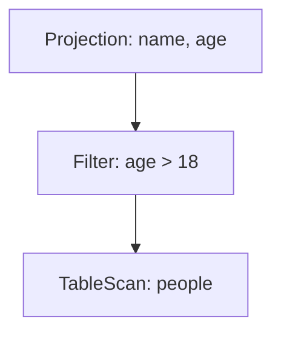

# Tungsten引擎的未来发展趋势：展望Spark性能优化

作者：禅与计算机程序设计艺术

## 1.背景介绍
### 1.1 大数据处理的挑战
#### 1.1.1 数据量的爆炸式增长
#### 1.1.2 数据处理的实时性需求
#### 1.1.3 数据分析的复杂度提升

### 1.2 Spark的诞生与发展
#### 1.2.1 Spark的起源与核心理念
#### 1.2.2 Spark生态系统的不断丰富
#### 1.2.3 Spark成为大数据处理的主流选择

### 1.3 Spark性能优化的重要性
#### 1.3.1 提升数据处理效率
#### 1.3.2 降低集群资源消耗
#### 1.3.3 支撑更大规模的数据分析

## 2.核心概念与联系
### 2.1 Spark的核心组件
#### 2.1.1 Spark Core
#### 2.1.2 Spark SQL
#### 2.1.3 Spark Streaming
#### 2.1.4 MLlib
#### 2.1.5 GraphX

### 2.2 Tungsten引擎的提出
#### 2.2.1 Tungsten项目的诞生背景
#### 2.2.2 Tungsten引擎的设计目标
#### 2.2.3 Tungsten引擎在Spark中的地位

### 2.3 Tungsten引擎与Spark性能优化的关系
#### 2.3.1 Tungsten引擎对Spark执行引擎的改进
#### 2.3.2 Tungsten引擎带来的性能提升
#### 2.3.3 Tungsten引擎在Spark未来发展中的重要性

## 3.核心算法原理具体操作步骤
### 3.1 Tungsten引擎的内存管理优化
#### 3.1.1 内存分配策略的改进
#### 3.1.2 内存对象的序列化存储
#### 3.1.3 内存回收机制的优化

### 3.2 Tungsten引擎的代码生成技术
#### 3.2.1 动态字节码生成
#### 3.2.2 表达式评估器的优化
#### 3.2.3 JIT编译技术的应用

### 3.3 Tungsten引擎的Cache-aware计算
#### 3.3.1 缓存友好的数据结构设计
#### 3.3.2 算子Fusing机制
#### 3.3.3 基于缓存的数据本地化计算

## 4.数学模型和公式详细讲解举例说明
### 4.1 Spark RDD的数学抽象
#### 4.1.1 RDD的分区与依赖关系
$$RDD_i = \{partition_1,partition_2,...,partition_n\} $$
$$Dependency(RDD_i,RDD_j) = \begin{cases} Narrow, & if |RDD_i| = |RDD_j| \\ Wide, & if |RDD_i| \neq |RDD_j| \end{cases}$$
#### 4.1.2 RDD的Transform与Action操作
$$map(RDD_i,f) \Rightarrow RDD_j, where \  \forall x \in RDD_i, \exists y=f(x) \in RDD_j$$
$$reduce(RDD_i,\oplus) \Rightarrow result, where \ result=\underset{x \in RDD_i}{\oplus} x$$
#### 4.1.3 RDD的Lineage与容错机制   
### 4.2 Tungsten引擎的内存布局优化
#### 4.2.1 行存储与列存储
$$Row-oriented: Record_i=[field_1,field_2,...,field_m]$$
$$Column-oriented: Column_j=\{field_j^1,field_j^2,...,field_j^n\}$$  
#### 4.2.2 Compact数据格式
$$CompactRow: [null\_mask,field_1,field_2,...,field_m]$$
$$CompactColumn: [null\_count,values,offset_1,offset_2,...,offset_n]$$ 
#### 4.2.3 Unsafe内存访问  
### 4.3 Spark SQL的优化器设计
#### 4.3.1 查询语法树的生成
```
SELECT name, age 
FROM   people
WHERE  age > 18
```


#### 4.3.2 基于规则的查询优化
- 常量折叠：`SELECT x + 1 FROM t` => `SELECT 6 FROM t WHERE x = 5`
- 投影裁剪：`SELECT a FROM t` => 移除对b的扫描
- 谓词下推：`SELECT * FROM t WHERE x > 10` => `SELECT * FROM (SELECT * FROM t WHERE x > 10)`

#### 4.3.3 基于代价的查询优化
$$Cost(p)=\begin{cases} 
{size(p)}, &{if \ p \ is \ leaf} \\
{\sum_{c \in children(p)} Cost(c) + w(p)}, &{otherwise}
\end{cases}$$

## 5.项目实践：代码实例和详细解释说明
### 5.1 使用Parquet列式存储格式
```scala
val df = spark.read.parquet("data.parquet")
df.write.mode("overwrite").parquet("output")  
```
Parquet是Tungsten引擎优化支持的列式存储格式，可以显著提高查询性能。

### 5.2 启用Tungsten引擎的代码生成
```scala
spark.conf.set("spark.sql.tungsten.enabled", true)
spark.conf.set("spark.sql.codegen.enabled", true)
```
通过设置相关参数，可以启用Tungsten引擎的代码生成特性，加速查询执行。

### 5.3 利用Cache-aware的数据结构
```scala
import org.apache.spark.sql.execution.vectorized.OnHeapColumnVector
val arrBytes: Array[Byte] = new Array[Byte](1024)
val columnVector = new OnHeapColumnVector(arrBytes)
```
Tungsten引擎提供了缓存友好的数据结构，如OnHeapColumnVector,能够充分利用CPU缓存，提升计算效率。

## 6.实际应用场景
### 6.1 实时数据分析
#### 6.1.1 日志流处理
#### 6.1.2 监控告警
#### 6.1.3 欺诈检测

### 6.2 机器学习
#### 6.2.1 特征工程
#### 6.2.2 模型训练
#### 6.2.3 推荐系统

### 6.3 图计算
#### 6.3.1 社交网络分析
#### 6.3.2 知识图谱构建
#### 6.3.3 网络异常检测

## 7.工具和资源推荐
### 7.1 Spark官方文档
- [Spark官网](https://spark.apache.org/)
- [Spark Programming Guide](https://spark.apache.org/docs/latest/rdd-programming-guide.html)
- [Spark SQL, DataFrames and Datasets Guide](https://spark.apache.org/docs/latest/sql-programming-guide.html)

### 7.2 Spark源码分析
- [Spark Internals](https://github.com/JerryLead/SparkInternals/blob/master/markdown/english/0-Introduction.md)
- [Spark源码阅读](https://github.com/lw-lin/CoolplaySpark)

### 7.3 Spark性能优化实践分享
- [Spark性能优化指南](https://zhuanlan.zhihu.com/p/34669142)
- [Spark Tungsten实现原理与优化实践](https://tech.meituan.com/2016/09/23/spark-tungsten.html)

## 8.总结：未来发展趋势与挑战
### 8.1 Tungsten引擎的持续演进
#### 8.1.1 向量化执行引擎
#### 8.1.2 更细粒度的代码生成
#### 8.1.3 NUMA感知的内存管理   

### 8.2 Spark与AI的深度融合
#### 8.2.1 Spark与深度学习框架的互补
#### 8.2.2 Spark在AI工程化中的重要作用
#### 8.2.3 AI时代对Spark性能优化提出新需求

### 8.3 Spark生态的持续繁荣
#### 8.3.1 Structured Streaming的成熟
#### 8.3.2 GPU加速的探索
#### 8.3.3 云原生部署的演进

## 9.附录：常见问题与解答
### Q1: 如何权衡Shuffle优化与CPU利用率的关系？
### A1: 
- 增加Reducer数量,提高并行度,但要考虑CPU负载
- 调节Shuffle Buffer大小,在内存与性能间平衡 
- 开启Shuffle File Consolidation,减少文件数量

### Q2: DataFrame和Dataset的区别和选择？  
### A2:
- DataFrame是无类型的,Dataset是强类型的
- DataFrame更适合与Spark SQL集成使用
- Dataset适合在数据分析Pipeline中使用,更直观和类型安全

### Q3: 如何避免Long GC对Spark执行的影响？
### A3:
- 调节RDD的持久化级别,避免过多中间结果保存在内存
- 增加Executor内存,给对象分配更多空间
- 开启GC调优参数,如-XX:+UseConcMarkSweepGC  

Tungsten引擎是Spark性能优化的关键利器,它在内存管理、代码生成、Cache友好计算等多个方面对Spark执行引擎进行了全面升级。深入理解Tungsten的优化机制,并将其应用到实际的Spark项目开发中,可以帮助我们构建高效、快速的数据处理应用。未来随着大数据、AI等技术的持续发展,Spark还将不断演进,成为驱动数字化转型的中流砥柱。让我们携手Spark社区,共同开创数据时代的新篇章。