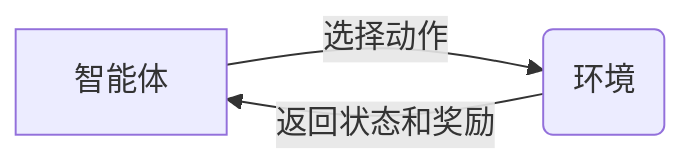

##  一切皆是映射：强化学习的基础概念与核心算法

作者：禅与计算机程序设计艺术

### 1. 背景介绍

#### 1.1 人工智能浪潮下的“学习”难题

近年来，人工智能技术以前所未有的速度发展，深刻地改变着我们的生活。从图像识别、语音助手到自动驾驶，人工智能在各个领域展现出巨大的潜力。然而，传统人工智能技术大多依赖于大量高质量的标注数据，难以适应复杂多变的真实世界环境。

强化学习作为一种新型的机器学习范式，为解决这一难题提供了新的思路。与传统的监督学习和无监督学习不同，强化学习强调智能体（Agent）通过与环境的交互来学习。智能体在环境中执行动作，并根据环境的反馈（奖励或惩罚）不断调整自己的策略，最终学会在复杂环境中做出最优决策。

#### 1.2 强化学习：从游戏到现实

强化学习最早应用于游戏领域，并在 Atari 游戏、围棋等领域取得了突破性进展。例如，DeepMind 开发的 AlphaGo 程序在 2016 年战胜了世界围棋冠军李世石，标志着强化学习在复杂策略游戏上的巨大成功。

近年来，强化学习逐渐从游戏领域走向现实世界，并在机器人控制、自动驾驶、推荐系统等领域展现出广阔的应用前景。例如，强化学习可以用于训练机器人手臂完成复杂的操作任务，可以帮助自动驾驶汽车在复杂路况下安全行驶，还可以为用户提供个性化的商品推荐。

#### 1.3 本文目标与结构

本文旨在深入浅出地介绍强化学习的基础概念、核心算法和应用场景，帮助读者建立对强化学习的全面认识。

本文共分为八个部分：

-   **背景介绍**: 介绍了强化学习的背景、发展历程和应用领域。
-   **核心概念与联系**:  详细解释了强化学习的五大核心要素：智能体、环境、状态、动作和奖励，并阐述了它们之间的联系。
-   **核心算法原理与具体操作步骤**:  介绍了强化学习的两种主要类型：基于价值的算法和基于策略的算法，并详细讲解了 Q-learning、SARSA、Policy Gradient 等经典算法的原理和操作步骤。
-   **数学模型和公式详细讲解举例说明**:  使用数学公式和示例，对强化学习的核心概念和算法进行了详细的解释和说明。
-   **项目实践：代码实例和详细解释说明**:  以一个具体的强化学习项目为例，展示了如何使用 Python 和 TensorFlow 等工具实现强化学习算法。
-   **实际应用场景**:  介绍了强化学习在机器人控制、自动驾驶、推荐系统等领域的实际应用场景。
-   **工具和资源推荐**:  推荐了一些常用的强化学习工具和学习资源。
-   **总结：未来发展趋势与挑战**:  总结了强化学习的未来发展趋势和挑战。
-   **附录：常见问题与解答**:  解答了一些强化学习的常见问题。


### 2.  核心概念与联系

#### 2.1 智能体 (Agent)

智能体是强化学习的核心，它可以感知环境状态，并根据学习到的策略选择相应的动作与环境进行交互。智能体的目标是通过与环境的交互，最大化累积奖励。

#### 2.2 环境 (Environment)

环境是智能体交互的对象，它可以是真实世界，也可以是虚拟环境。环境会根据智能体的动作做出相应的响应，并返回新的状态和奖励给智能体。

#### 2.3 状态 (State)

状态描述了环境在某一时刻的状况。智能体根据当前状态选择相应的动作。

#### 2.4 动作 (Action)

动作是智能体对环境做出的响应。智能体的目标是选择能够最大化未来累积奖励的动作。

#### 2.5 奖励 (Reward)

奖励是环境对智能体动作的评价。智能体的目标是最大化累积奖励。

#### 2.6  核心概念之间的联系

强化学习的过程可以看作是智能体与环境不断交互的过程。智能体根据当前状态选择动作，环境根据动作返回新的状态和奖励。智能体根据奖励调整自己的策略，从而在未来做出更好的决策。

下图展示了强化学习的核心概念之间的联系：



### 3.  核心算法原理与具体操作步骤

强化学习算法可以分为两大类：基于价值的算法和基于策略的算法。

#### 3.1 基于价值的算法

基于价值的算法的核心思想是学习一个价值函数，该函数可以评估智能体在某个状态下采取某个动作的长期价值。智能体根据价值函数选择价值最高的动作。

##### 3.1.1  Q-learning 算法

Q-learning 是一种经典的基于价值的强化学习算法。它使用 Q 表来存储状态-动作对的价值。Q 表的更新规则如下：

$$Q(s_t,a_t) \leftarrow Q(s_t,a_t) + \alpha [r_{t+1} + \gamma \max_{a} Q(s_{t+1}, a) - Q(s_t,a_t)]$$

其中：

-  $Q(s_t,a_t)$ 表示在状态 $s_t$ 下采取动作 $a_t$ 的价值。
-  $\alpha$ 是学习率，控制着每次更新的幅度。
-  $r_{t+1}$ 是智能体在状态 $s_t$ 下采取动作 $a_t$ 后获得的奖励。
-  $\gamma$ 是折扣因子，用于平衡当前奖励和未来奖励的重要性。
-  $\max_{a} Q(s_{t+1}, a)$ 表示在状态 $s_{t+1}$ 下所有可能动作中价值最高的动作的价值。

Q-learning 算法的具体操作步骤如下：

1.  初始化 Q 表。
2.  循环遍历每一个 episode：
    *   初始化智能体的初始状态。
    *   循环遍历 episode 中的每一个时间步：
        *   根据 Q 表选择当前状态下价值最高的动作。
        *   执行动作，并获得环境返回的下一个状态和奖励。
        *   根据 Q 表的更新规则更新 Q 表。
        *   将下一个状态作为当前状态。
    *   直到 episode 结束。

##### 3.1.2 SARSA 算法

SARSA 算法是另一种经典的基于价值的强化学习算法。与 Q-learning 算法不同的是，SARSA 算法在更新 Q 表时，使用的是智能体实际执行的下一个动作的价值，而不是所有可能动作中价值最高的动作的价值。

SARSA 算法的 Q 表更新规则如下：

$$Q(s_t,a_t) \leftarrow Q(s_t,a_t) + \alpha [r_{t+1} + \gamma Q(s_{t+1}, a_{t+1}) - Q(s_t,a_t)]$$

其中，$a_{t+1}$ 表示智能体在状态 $s_{t+1}$ 下实际执行的动作。

#### 3.2 基于策略的算法

基于策略的算法的核心思想是直接学习一个策略函数，该函数可以根据当前状态输出智能体应该采取的动作。智能体的目标是通过优化策略函数，最大化未来累积奖励。

##### 3.2.1 Policy Gradient 算法

Policy Gradient 算法是一种经典的基于策略的强化学习算法。它使用神经网络来表示策略函数。Policy Gradient 算法的目标是通过梯度下降法优化策略函数的参数，使得智能体在环境中获得的累积奖励最大化。

Policy Gradient 算法的梯度更新规则如下：

$$\theta \leftarrow \theta + \alpha \nabla_\theta J(\theta)$$

其中：

-   $\theta$ 是策略函数的参数。
-   $\alpha$ 是学习率。
-   $J(\theta)$ 是策略函数的性能指标，通常是累积奖励的期望值。
-   $\nabla_\theta J(\theta)$ 是策略函数性能指标对参数的梯度。

Policy Gradient 算法的具体操作步骤如下：

1.  初始化策略函数的参数。
2.  循环遍历每一个 episode：
    *   初始化智能体的初始状态。
    *   循环遍历 episode 中的每一个时间步：
        *   根据策略函数选择当前状态下应该采取的动作。
        *   执行动作，并获得环境返回的下一个状态和奖励。
        *   将下一个状态作为当前状态。
    *   直到 episode 结束。
3.  根据梯度更新规则更新策略函数的参数。


### 4. 数学模型和公式详细讲解举例说明

#### 4.1 马尔可夫决策过程 (Markov Decision Process, MDP)

马尔可夫决策过程是强化学习的数学基础。它可以用来描述强化学习问题。

一个马尔可夫决策过程可以由一个五元组 $(S, A, P, R, \gamma)$ 来表示，其中：

-  $S$ 是状态空间，表示所有可能的状态的集合。
-  $A$ 是动作空间，表示所有可能动作的集合。
-  $P$ 是状态转移概率矩阵，$P_{ss'}^a$ 表示在状态 $s$ 下采取动作 $a$ 后，转移到状态 $s'$ 的概率。
-  $R$ 是奖励函数，$R_s^a$ 表示在状态 $s$ 下采取动作 $a$ 后获得的奖励。
-  $\gamma$ 是折扣因子，用于平衡当前奖励和未来奖励的重要性。

#### 4.2 价值函数 (Value Function)

价值函数是强化学习的核心概念之一。它用来评估智能体在某个状态下采取某个动作的长期价值。

##### 4.2.1 状态价值函数 (State Value Function)

状态价值函数 $V^\pi(s)$ 表示智能体在状态 $s$ 下，按照策略 $\pi$ 行动，所能获得的累积奖励的期望值。

$$V^\pi(s) = E_\pi[R_t + \gamma R_{t+1} + \gamma^2 R_{t+2} + ... | s_t = s]$$

##### 4.2.2  动作价值函数 (Action Value Function)

动作价值函数 $Q^\pi(s, a)$ 表示智能体在状态 $s$ 下，采取动作 $a$，然后按照策略 $\pi$ 行动，所能获得的累积奖励的期望值。

$$Q^\pi(s, a) = E_\pi[R_t + \gamma R_{t+1} + \gamma^2 R_{t+2} + ... | s_t = s, a_t = a]$$

#### 4.3  贝尔曼方程 (Bellman Equation)

贝尔曼方程是强化学习的核心方程之一。它描述了价值函数之间的关系。

##### 4.3.1 状态价值函数的贝尔曼方程

$$V^\pi(s) = \sum_{a \in A} \pi(a|s) \sum_{s' \in S} P_{ss'}^a [R_s^a + \gamma V^\pi(s')]$$

##### 4.3.2  动作价值函数的贝尔曼方程

$$Q^\pi(s, a) = \sum_{s' \in S} P_{ss'}^a [R_s^a + \gamma \sum_{a' \in A} \pi(a'|s') Q^\pi(s', a')]$$

#### 4.4  举例说明

假设有一个迷宫环境，如下图所示：

```
+---+---+---+---+
| S |   |   | G |
+---+---+---+---+
|   | W |   | W |
+---+---+---+---+
```

其中，`S` 表示起点，`G` 表示终点，`W` 表示墙壁。智能体可以上下左右移动。

-   状态空间 $S = \{(0, 0), (0, 1), (0, 2), (0, 3), (1, 0), (1, 2), (1, 3)\}$。
-   动作空间 $A = \{上, 下, 左, 右\}$。
-   奖励函数：智能体每走一步，奖励为 -1；到达终点，奖励为 100；撞到墙壁，奖励为 -10。
-   折扣因子 $\gamma = 0.9$。

我们可以使用 Q-learning 算法来解决这个迷宫问题。

首先，我们初始化 Q 表，将所有状态-动作对的价值初始化为 0。

然后，我们让智能体在迷宫中不断探索，并根据 Q 表的更新规则更新 Q 表。

经过多次迭代后，Q 表会收敛到一个最优的 Q 函数。

最后，我们可以根据 Q 函数，让智能体从起点出发，找到一条到达终点的最短路径。

### 5. 项目实践：代码实例和详细解释说明

#### 5.1  CartPole 游戏介绍

CartPole 游戏是 OpenAI Gym 环境中的一个经典控制问题。游戏的目标是控制一个小车在水平轨道上移动，并保持杆子竖直向上。如果杆子倾斜角度超过一定阈值或者小车移动到轨道边缘，则游戏结束。

#### 5.2 使用 Q-learning 算法解决 CartPole 游戏

```python
import gym
import numpy as np

# 创建 CartPole 环境
env = gym.make('CartPole-v1')

# 定义 Q 表的参数
num_states = (1, 1, 6, 12)
num_actions = env.action_space.n
q_table = np.zeros(num_states + (num_actions,))

# 定义超参数
learning_rate = 0.1
discount_factor = 0.95
exploration_rate = 1.0
exploration_rate_decay = 0.995
min_exploration_rate = 0.01

# 定义训练参数
num_episodes = 10000
max_steps_per_episode = 1000

# 定义状态离散化函数
def discretize_state(state):
    # 将状态空间划分为离散的区间
    # ...
    return discretized_state

# 训练 Q-learning 算法
for episode in range(num_episodes):
    # 初始化环境
    state = env.reset()
    discretized_state = discretize_state(state)

    # 初始化 episode 的总奖励
    total_reward = 0

    # 循环遍历 episode 中的每一个时间步
    for step in range(max_steps_per_episode):
        # 选择动作
        if np.random.uniform(0, 1) < exploration_rate:
            # 探索：随机选择一个动作
            action = env.action_space.sample()
        else:
            # 利用：选择 Q 值最高的动作
            action = np.argmax(q_table[discretized_state])

        # 执行动作，并获得环境返回的下一个状态、奖励和是否结束标志
        next_state, reward, done, _ = env.step(action)
        next_discretized_state = discretize_state(next_state)

        # 更新 Q 表
        q_table[discretized_state + (action,)] += learning_rate * (
            reward
            + discount_factor * np.max(q_table[next_discretized_state])
            - q_table[discretized_state + (action,)]
        )

        # 更新状态和总奖励
        discretized_state = next_discretized_state
        total_reward += reward

        # 判断 episode 是否结束
        if done:
            break

    # 更新 exploration rate
    exploration_rate = max(
        min_exploration_rate, exploration_rate * exploration_rate_decay
    )

    # 打印 episode 的结果
    print(f"Episode {episode + 1}: Total reward = {total_reward}")

# 保存训练好的 Q 表
np.save("q_table.npy", q_table)

# 加载训练好的 Q 表
q_table = np.load("q_table.npy")

# 测试训练好的 Q-learning 算法
state = env.reset()
discretized_state = discretize_state(state)
total_reward = 0

while True:
    # 选择 Q 值最高的动作
    action = np.argmax(q_table[discretized_state])

    # 执行动作，并获得环境返回的下一个状态、奖励和是否结束标志
    next_state, reward, done, _ = env.step(action)
    next_discretized_state = discretize_state(next_state)

    # 更新状态和总奖励
    discretized_state = next_discretized_state
    total_reward += reward

    # 渲染环境
    env.render()

    # 判断 episode 是否结束
    if done:
        break

# 打印测试结果
print(f"Total reward = {total_reward}")
```

#### 5.3 代码解释

1.  首先，我们使用 `gym.make('CartPole-v1')` 创建了一个 CartPole 环境。
2.  然后，我们定义了 Q 表的参数、超参数和训练参数。
3.  接下来，我们定义了一个状态离散化函数 `discretize_state`，用于将连续的状态空间划分为离散的区间。
4.  在训练过程中，我们使用 $\epsilon$-greedy 策略来平衡探索和利用。
5.  在每一个时间步，我们根据 Q 表选择动作，执行动作，并获得环境返回的下一个状态、奖励和是否结束标志。
6.  然后，我们根据 Q 表的更新规则更新 Q 表。
7.  最后，我们打印 episode 的结果，并保存训练好的 Q 表。

### 6. 实际应用场景

强化学习在许多领域都有广泛的应用，包括：

-  **游戏**: 强化学习在游戏领域取得了巨大的成功，例如 AlphaGo、AlphaStar 等。
-