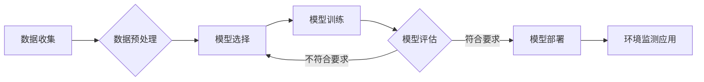

# 一切皆是映射：深度学习在环境监测中的应用

作者：禅与计算机程序设计艺术

## 1. 背景介绍

### 1.1 环境监测的重要性与挑战

环境监测是保护生态环境、保障人类健康的重要手段。近年来，随着工业化和城市化的快速发展，环境污染问题日益突出，对环境监测技术提出了更高的要求。传统的环境监测方法主要依赖人工采样和实验室分析，存在着成本高、效率低、实时性差等局限性。

### 1.2 深度学习技术的发展与应用

深度学习作为人工智能领域近年来取得突破性进展的技术之一，已经在图像识别、语音识别、自然语言处理等领域展现出巨大的应用潜力。深度学习的核心思想是通过构建多层神经网络，自动学习数据中的复杂特征，从而实现对数据的智能分析和预测。

### 1.3 深度学习赋能环境监测

将深度学习技术应用于环境监测领域，可以有效克服传统方法的局限性，实现环境监测的自动化、智能化和实时化。深度学习可以处理海量的环境监测数据，提取数据中的隐含特征，建立环境污染与各种因素之间的复杂关系模型，从而实现对环境污染的精准预测、预警和溯源。

## 2. 核心概念与联系

### 2.1 深度学习基本概念

* **神经网络:** 由多个神经元层组成的计算模型，能够学习输入数据中的复杂模式。
* **卷积神经网络 (CNN):**  一种专门用于处理图像数据的深度学习模型，通过卷积操作提取图像的空间特征。
* **循环神经网络 (RNN):** 一种专门用于处理序列数据的深度学习模型，能够捕捉数据的时间依赖关系。
* **长短期记忆网络 (LSTM):** 一种改进的 RNN 模型，能够更好地处理长序列数据。

### 2.2 环境监测数据类型

* **图像数据:** 卫星遥感图像、无人机航拍图像、地面监测图像等。
* **时序数据:**  空气质量监测数据、水质监测数据、气象数据等。
* **文本数据:** 环境监测报告、新闻报道、社交媒体数据等。

### 2.3 深度学习与环境监测的联系

深度学习可以通过分析不同类型的环境监测数据，提取数据中的特征信息，建立环境污染与各种因素之间的关系模型，从而实现对环境污染的监测、预测和预警。

## 3. 核心算法原理具体操作步骤

### 3.1 基于深度学习的环境监测模型构建流程

1. **数据收集与预处理:** 收集环境监测数据，并对数据进行清洗、去噪、归一化等预处理操作。
2. **模型选择与构建:** 根据具体的环境监测任务和数据类型，选择合适的深度学习模型，例如 CNN、RNN、LSTM 等。
3. **模型训练与优化:** 使用预处理后的数据对模型进行训练，并通过调整模型参数、优化算法等方式提升模型的性能。
4. **模型评估与测试:** 使用测试集数据对训练好的模型进行评估，评估指标包括准确率、精确率、召回率等。
5. **模型部署与应用:** 将训练好的模型部署到实际环境中，对新的环境监测数据进行预测和分析。

### 3.2 常用的深度学习环境监测模型

* **基于 CNN 的图像识别模型:** 可以用于识别卫星遥感图像中的污染源、监测水体污染状况等。
* **基于 RNN/LSTM 的时序预测模型:** 可以用于预测空气质量、水质等环境指标的变化趋势。
* **基于自然语言处理 (NLP) 的文本分析模型:** 可以用于分析环境监测报告、新闻报道等文本数据，提取环境污染事件信息。

### 3.3 模型训练与优化技巧

* **数据增强:** 通过对原始数据进行旋转、缩放、裁剪等操作，增加训练数据的数量和多样性，提高模型的泛化能力。
* **正则化:** 通过在模型的损失函数中添加正则化项，防止模型过拟合，提高模型的泛化能力。
* **学习率调整:**  选择合适的学习率，可以有效地控制模型的收敛速度和精度。

## 4. 数学模型和公式详细讲解举例说明

### 4.1 卷积神经网络 (CNN)

#### 4.1.1 卷积层

卷积层是 CNN 中的核心层，其主要作用是提取输入数据的特征。卷积层的计算过程如下：

$$
y_{i,j} = f(\sum_{m=1}^{M}\sum_{n=1}^{N}w_{m,n}x_{i+m-1,j+n-1}+b)
$$

其中，$x_{i,j}$ 表示输入数据的第 $i$ 行第 $j$ 列的像素值，$w_{m,n}$ 表示卷积核的第 $m$ 行第 $n$ 列的权重，$b$ 表示偏置项，$f(\cdot)$ 表示激活函数。

#### 4.1.2 池化层

池化层的作用是降低特征图的维度，减少计算量，同时提高模型的鲁棒性。常用的池化操作包括最大池化和平均池化。

#### 4.1.3 全连接层

全连接层的作用是将卷积层和池化层提取的特征映射到最终的输出类别。

### 4.2 循环神经网络 (RNN)

#### 4.2.1 隐藏状态更新公式

$$
h_t = f(W_{xh}x_t + W_{hh}h_{t-1} + b_h)
$$

其中，$h_t$ 表示 $t$ 时刻的隐藏状态，$x_t$ 表示 $t$ 时刻的输入数据，$W_{xh}$ 表示输入到隐藏状态的权重矩阵，$W_{hh}$ 表示隐藏状态到隐藏状态的权重矩阵，$b_h$ 表示偏置项，$f(\cdot)$ 表示激活函数。

#### 4.2.2 输出状态计算公式

$$
y_t = g(W_{hy}h_t + b_y)
$$

其中，$y_t$ 表示 $t$ 时刻的输出状态，$W_{hy}$ 表示隐藏状态到输出的权重矩阵，$b_y$ 表示偏置项，$g(\cdot)$ 表示输出函数。

### 4.3 长短期记忆网络 (LSTM)

LSTM  在 RNN 的基础上引入了门控机制，可以更好地处理长序列数据。LSTM 的核心是细胞状态，它贯穿整个序列，用于存储长期信息。

## 5. 项目实践：代码实例和详细解释说明

### 5.1 基于 CNN 的水体污染识别

```python
import tensorflow as tf

# 定义 CNN 模型
model = tf.keras.models.Sequential([
  tf.keras.layers.Conv2D(32, (3, 3), activation='relu', input_shape=(128, 128, 3)),
  tf.keras.layers.MaxPooling2D((2, 2)),
  tf.keras.layers.Conv2D(64, (3, 3), activation='relu'),
  tf.keras.layers.MaxPooling2D((2, 2)),
  tf.keras.layers.Conv2D(128, (3, 3), activation='relu'),
  tf.keras.layers.MaxPooling2D((2, 2)),
  tf.keras.layers.Flatten(),
  tf.keras.layers.Dense(128, activation='relu'),
  tf.keras.layers.Dense(1, activation='sigmoid')
])

# 编译模型
model.compile(optimizer='adam',
              loss='binary_crossentropy',
              metrics=['accuracy'])

# 加载训练数据
train_images = ...
train_labels = ...

# 训练模型
model.fit(train_images, train_labels, epochs=10)

# 加载测试数据
test_images = ...
test_labels = ...

# 评估模型
test_loss, test_acc = model.evaluate(test_images,  test_labels, verbose=2)
print('\nTest accuracy:', test_acc)

# 保存模型
model.save('water_pollution_model.h5')
```

### 5.2 基于 LSTM 的空气质量预测

```python
import tensorflow as tf

# 定义 LSTM 模型
model = tf.keras.models.Sequential([
  tf.keras.layers.LSTM(128, return_sequences=True, input_shape=(timesteps, features)),
  tf.keras.layers.LSTM(64),
  tf.keras.layers.Dense(1)
])

# 编译模型
model.compile(optimizer='adam', loss='mse')

# 加载训练数据
train_data = ...
train_labels = ...

# 训练模型
model.fit(train_data, train_labels, epochs=10)

# 加载测试数据
test_data = ...
test_labels = ...

# 评估模型
test_loss = model.evaluate(test_data, test_labels, verbose=2)
print('\nTest loss:', test_loss)

# 保存模型
model.save('air_quality_model.h5')
```

## 6. 实际应用场景

### 6.1  大气污染监测与预警

* **利用卫星遥感图像和地面监测数据，识别污染源的位置和排放强度。**
* **结合气象数据和污染物扩散模型，预测空气质量变化趋势，及时发布预警信息。**

### 6.2 水环境监测与治理

* **利用遥感图像和水质监测数据，监测水体污染状况，识别污染源。**
* **建立水质预测模型，预测水质变化趋势，为水环境治理提供决策支持。**

### 6.3  土壤污染监测与修复

* **利用遥感图像和土壤样本数据，监测土壤污染状况，识别污染区域。**
* **建立土壤污染预测模型，预测土壤污染变化趋势，为土壤修复提供科学依据。**

## 7. 工具和资源推荐

### 7.1 深度学习框架

* **TensorFlow:**  由 Google 开发的开源深度学习框架，提供了丰富的 API 和工具，方便用户构建和训练深度学习模型。
* **PyTorch:** 由 Facebook 开发的开源深度学习框架，具有灵活性和易用性，适合研究和开发。

### 7.2 环境监测数据集

* **UCI 机器学习库:**  包含多个环境监测数据集，例如空气质量数据集、水质数据集等。
* **Kaggle:**  数据科学竞赛平台，经常举办环境监测相关的比赛，提供大量的数据集和代码。

### 7.3 环境监测相关工具

* **Google Earth Engine:**  基于云计算的地理空间分析平台，可以方便地获取和处理卫星遥感图像。
* **ArcGIS:**  专业的地理信息系统软件，可以用于环境数据的可视化、分析和建模。

## 8. 总结：未来发展趋势与挑战

### 8.1 未来发展趋势

* **多源数据融合:**  将不同来源的环境监测数据进行融合，可以提高环境监测的全面性和准确性。
* **深度学习模型轻量化:**  将深度学习模型进行压缩和加速，使其能够部署在资源受限的设备上，例如传感器、无人机等。
* **深度学习与其他技术的结合:** 将深度学习与其他技术结合，例如物联网、边缘计算等，可以实现环境监测的智能化和实时化。

### 8.2 面临的挑战

* **数据质量问题:** 环境监测数据往往存在着噪声、缺失值、异常值等问题，需要进行有效的处理。
* **模型可解释性问题:** 深度学习模型往往是一个黑盒，难以解释其预测结果的原因，需要开发可解释性更强的模型。
* **模型泛化能力问题:**  深度学习模型在训练数据上表现良好，但在实际应用中可能会出现泛化能力不足的问题，需要提高模型的鲁棒性和泛化能力。

## 9. 附录：常见问题与解答

### 9.1  深度学习与传统环境监测方法相比有哪些优势？

深度学习相比于传统环境监测方法，主要有以下优势：

* **自动化程度高:** 深度学习可以自动学习数据中的特征，减少人工干预，提高效率。
* **预测精度高:** 深度学习可以处理复杂的非线性关系，建立更精准的预测模型。
* **实时性好:** 深度学习模型可以快速进行预测，实现环境监测的实时化。

### 9.2 如何选择合适的深度学习模型？

选择深度学习模型需要考虑以下因素：

* **数据类型:** 不同的深度学习模型适用于不同类型的数据，例如 CNN 适用于图像数据，RNN 适用于时序数据。
* **任务需求:**  不同的环境监测任务需要使用不同的模型，例如目标检测需要使用目标检测模型，预测需要使用预测模型。
* **计算资源:**  不同的深度学习模型对计算资源的要求不同，需要根据实际情况选择合适的模型。


## 10.  Mermaid 流程图


