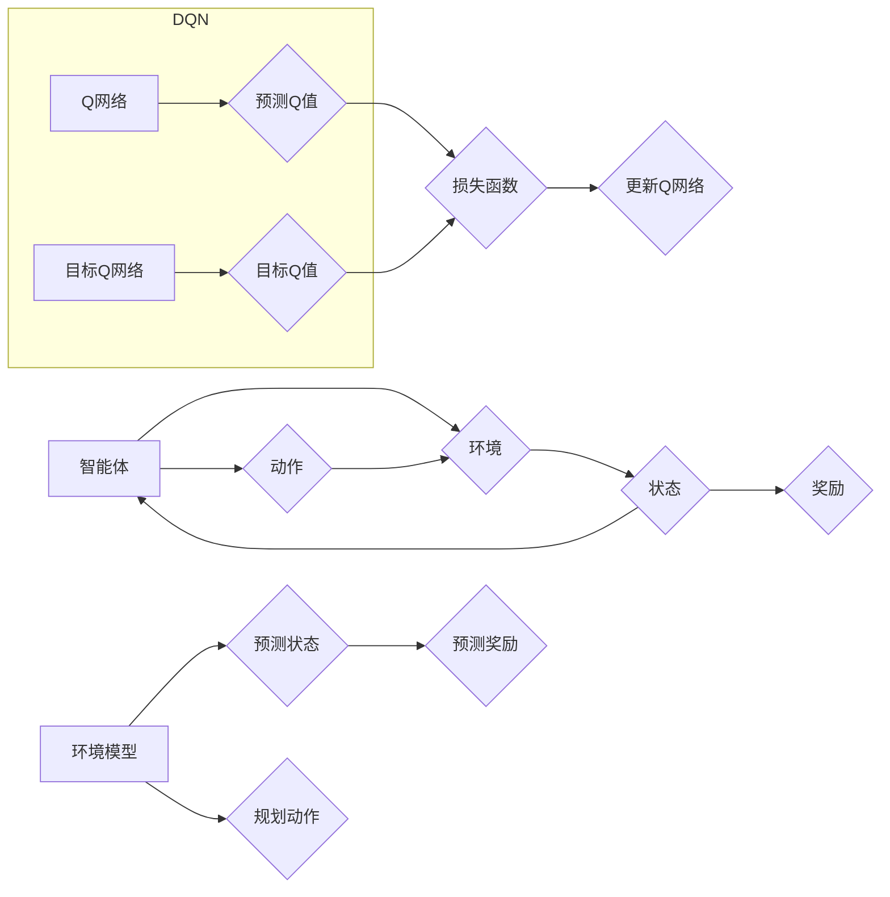

# 一切皆是映射：环境模型在DQN中的应用：预测和规划的作用

作者：禅与计算机程序设计艺术

## 1. 背景介绍

### 1.1 强化学习与环境交互

强化学习（Reinforcement Learning, RL）作为机器学习的一个重要分支，近年来取得了令人瞩目的成就。其核心思想是让智能体（Agent）通过与环境进行交互，不断试错学习，最终找到最优策略以最大化累积奖励。在这个过程中，智能体需要理解环境的运行机制，才能做出合理的决策。然而，现实世界中的环境往往是复杂多变的，智能体很难完全掌握环境的所有信息。

### 1.2 DQN算法的突破与局限

深度Q网络（Deep Q-Network, DQN）算法的出现，为强化学习带来了突破性的进展。DQN巧妙地结合了深度学习和Q学习的优势，利用深度神经网络来逼近价值函数，从而解决了传统Q学习中状态空间过大的问题。然而，DQN算法也存在一些局限性，例如：

* **样本效率低**: DQN需要大量的交互数据才能学习到有效的策略，这在实际应用中往往是不现实的。
* **泛化能力不足**: DQN在训练环境中表现出色，但在面对新的环境时，其泛化能力往往有限。

### 1.3 环境模型的引入

为了解决上述问题，研究人员开始探索将环境模型引入到DQN算法中。环境模型可以看作是对环境运行机制的一种抽象表示，它能够预测环境对智能体动作的响应，以及未来的状态变化。引入环境模型的优势在于：

* **提高样本效率**: 智能体可以通过与环境模型进行交互来学习，而不需要实际执行每个动作，从而减少了与真实环境交互的次数。
* **增强泛化能力**: 环境模型可以学习到环境的通用规律，从而提高智能体在面对新环境时的泛化能力。

## 2. 核心概念与联系

### 2.1 环境模型的定义

环境模型是指能够模拟真实环境行为的模型，它可以预测环境对智能体动作的响应，以及未来的状态变化。

#### 2.1.1 基于模型的强化学习

基于模型的强化学习（Model-Based Reinforcement Learning, MBRL）是指利用环境模型来辅助智能体进行决策的强化学习方法。

#### 2.1.2 环境模型的类型

* **确定性模型**: 预测结果是确定的，例如：线性模型、物理引擎等。
* **随机性模型**: 预测结果是概率分布，例如：高斯过程、贝叶斯网络等。

### 2.2 DQN算法回顾

DQN算法的核心思想是利用深度神经网络来逼近状态-动作值函数（Q函数），并利用经验回放机制来提高样本效率。

#### 2.2.1 Q函数

Q函数用于评估在某个状态下采取某个动作的价值，其定义为：

$$Q(s,a) = \mathbb{E}[R_t + \gamma R_{t+1} + \gamma^2 R_{t+2} + ... | S_t = s, A_t = a]$$

其中，$R_t$ 表示在时刻 $t$ 获得的奖励，$\gamma$ 表示折扣因子，$S_t$ 表示时刻 $t$ 的状态，$A_t$ 表示时刻 $t$ 采取的动作。

#### 2.2.2 经验回放

经验回放机制是指将智能体与环境交互的历史数据存储起来，并在训练过程中随机抽取一部分数据进行训练，从而提高样本利用率。

### 2.3 环境模型与DQN的结合

将环境模型引入到DQN算法中，主要有以下两种方式：

* **基于模型的预测**: 利用环境模型预测未来的状态和奖励，并将预测结果作为DQN算法的输入。
* **基于模型的规划**: 利用环境模型进行多步规划，找到最优的动作序列，并将规划结果作为DQN算法的目标值。

## 3. 核心算法原理具体操作步骤

### 3.1 基于模型的预测

#### 3.1.1 环境模型的训练

首先，需要训练一个能够准确预测环境行为的环境模型。可以使用各种机器学习算法来训练环境模型，例如：神经网络、高斯过程等。

#### 3.1.2 利用环境模型进行预测

在智能体与环境交互的过程中，可以使用训练好的环境模型来预测未来的状态和奖励。

#### 3.1.3 更新DQN网络

将预测得到的状态和奖励作为DQN算法的输入，并利用DQN算法更新网络参数。

### 3.2 基于模型的规划

#### 3.2.1 利用环境模型进行规划

在智能体需要做出决策时，可以使用训练好的环境模型进行多步规划，找到最优的动作序列。

#### 3.2.2 更新DQN网络

将规划得到的最优动作序列作为DQN算法的目标值，并利用DQN算法更新网络参数。

## 4. 数学模型和公式详细讲解举例说明

### 4.1 环境模型的数学模型

假设环境的状态空间为 $\mathcal{S}$，动作空间为 $\mathcal{A}$，环境模型可以用一个函数 $f: \mathcal{S} \times \mathcal{A} \rightarrow \mathcal{S}$ 来表示，该函数表示在当前状态 $s$ 下采取动作 $a$ 后，环境的下一个状态 $s'$。

### 4.2 基于模型的预测的数学公式

基于模型的预测是指利用环境模型 $f$ 来预测未来的状态和奖励。假设当前状态为 $s_t$，智能体采取动作 $a_t$，则下一个状态 $s_{t+1}$ 和奖励 $r_{t+1}$ 可以表示为：

$$s_{t+1} = f(s_t, a_t)$$

$$r_{t+1} = R(s_t, a_t, s_{t+1})$$

其中，$R$ 表示奖励函数。

### 4.3 基于模型的规划的数学公式

基于模型的规划是指利用环境模型 $f$ 进行多步规划，找到最优的动作序列。假设规划的步数为 $H$，则最优的动作序列可以表示为：

$$\{a_t, a_{t+1}, ..., a_{t+H-1}\} = \arg\max_{a_t, a_{t+1}, ..., a_{t+H-1}} \sum_{i=0}^{H-1} \gamma^i R(s_{t+i}, a_{t+i}, s_{t+i+1})$$

## 5. 项目实践：代码实例和详细解释说明

### 5.1 环境模型的构建

```python
import torch
import torch.nn as nn

class EnvironmentModel(nn.Module):
    def __init__(self, state_dim, action_dim, hidden_dim):
        super(EnvironmentModel, self).__init__()
        self.fc1 = nn.Linear(state_dim + action_dim, hidden_dim)
        self.fc2 = nn.Linear(hidden_dim, state_dim)

    def forward(self, state, action):
        x = torch.cat([state, action], dim=1)
        x = torch.relu(self.fc1(x))
        next_state = self.fc2(x)
        return next_state
```

### 5.2 基于模型的预测

```python
# 利用环境模型预测下一个状态和奖励
next_state_pred = env_model(state, action)
reward_pred = env.get_reward(state, action, next_state_pred)

# 将预测结果作为DQN算法的输入
q_values = dqn(next_state_pred)
...
```

### 5.3 基于模型的规划

```python
# 利用环境模型进行多步规划
for _ in range(planning_steps):
    # ...
    # 选择最佳动作
    # ...
    # 利用环境模型预测下一个状态
    next_state = env_model(state, action)
    # ...

# 将规划结果作为DQN算法的目标值
target_q_values = dqn(final_state)
...
```

## 6. 实际应用场景

环境模型在DQN中的应用非常广泛，例如：

* **游戏AI**: 在游戏AI中，可以使用环境模型来预测游戏角色的行为，从而提高游戏AI的智能水平。
* **机器人控制**: 在机器人控制中，可以使用环境模型来预测机器人的运动轨迹，从而提高机器人的控制精度。
* **推荐系统**: 在推荐系统中，可以使用环境模型来预测用户的行为，从而提高推荐系统的推荐效果。

## 7. 总结：未来发展趋势与挑战

环境模型是强化学习领域的一个重要研究方向，它能够有效地提高DQN算法的效率和泛化能力。未来，环境模型的发展趋势主要包括：

* **更精确的环境模型**: 随着深度学习技术的不断发展，未来将会出现更加精确的环境模型，从而进一步提高强化学习算法的性能。
* **更通用的环境模型**: 研究人员正在探索如何构建更加通用的环境模型，使其能够应用于更广泛的领域。
* **环境模型与其他技术的结合**: 环境模型可以与其他技术相结合，例如：元学习、迁移学习等，从而进一步提高强化学习算法的性能。

## 8. 附录：常见问题与解答

### 8.1 如何评估环境模型的准确性？

可以使用各种指标来评估环境模型的准确性，例如：均方误差（MSE）、平均绝对误差（MAE）等。

### 8.2 如何选择合适的环境模型？

选择合适的环境模型需要考虑多个因素，例如：环境的复杂度、数据的多少、计算资源的限制等。

### 8.3 环境模型有哪些局限性？

环境模型也存在一些局限性，例如：

* **模型偏差**: 环境模型只能逼近真实环境的行为，无法完全模拟真实环境。
* **模型更新**: 当真实环境发生变化时，需要重新训练环境模型。


##  Mermaid流程图


