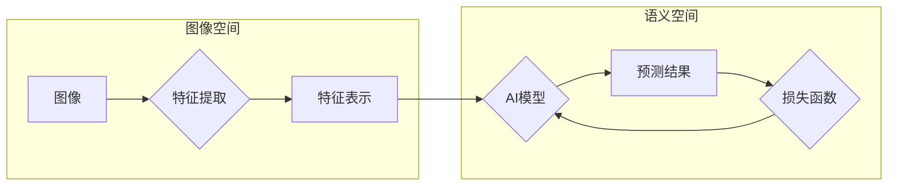

## 一切皆是映射：计算机视觉中的AI模型与应用

作者：禅与计算机程序设计艺术

### 1. 背景介绍

#### 1.1 视觉：智能的基石

视觉，作为人类感知世界最直接、信息量最大的方式，一直是人工智能领域研究的焦点。计算机视觉，顾名思义，旨在赋予机器以“看”的能力，使之能够像人一样理解、分析和处理图像信息。从最初的简单图像识别，到如今的人脸识别、自动驾驶、医疗影像分析等，计算机视觉技术正以惊人的速度改变着我们的生活。

#### 1.2 深度学习：计算机视觉的革命

深度学习的兴起，为计算机视觉的发展注入了强大的动力。以卷积神经网络（CNN）为代表的深度学习模型，凭借其强大的特征提取和表达能力，在图像分类、目标检测、图像分割等诸多计算机视觉任务中取得了突破性进展，将该领域推向了前所未有的高度。

#### 1.3 一切皆是映射：计算机视觉的核心思想

从本质上讲，计算机视觉的任务可以概括为学习一个从图像空间到语义空间的映射关系。无论是识别图像中的物体、定位物体的位置，还是理解图像的语义信息，都可以看作是寻找一个合适的映射函数，将图像的像素信息转化为我们所需要的输出结果。

### 2. 核心概念与联系

#### 2.1 图像表示：从像素到特征

计算机“看到”的图像，实际上是由一个个像素点组成的矩阵。为了让计算机能够理解图像的内容，首先需要将这些原始的像素信息转化为更高级、更抽象的特征表示。早期的计算机视觉方法通常依赖于人工设计的特征，例如SIFT、HOG等，而深度学习则可以通过多层神经网络自动地学习图像的层次化特征表示，从简单的边缘、纹理信息到复杂的物体部件、语义概念。

#### 2.2 AI模型：映射的具象化

在计算机视觉中，AI模型扮演着至关重要的角色，它充当着图像空间到语义空间的桥梁。常见的AI模型包括：

* **卷积神经网络（CNN）：**  擅长提取图像的局部特征，广泛应用于图像分类、目标检测等任务。
* **循环神经网络（RNN）：** 适用于处理序列数据，例如视频分析、图像描述生成等。
* **生成对抗网络（GAN）：**  能够生成逼真的图像，应用于图像生成、图像修复等领域。

#### 2.3 损失函数：引导模型学习的方向

为了训练一个优秀的AI模型，我们需要定义一个合适的损失函数，用来衡量模型预测结果与真实标签之间的差距。常见的损失函数包括：

* **交叉熵损失函数：** 用于分类任务，衡量预测概率分布与真实标签分布之间的差异。
* **均方误差损失函数：** 用于回归任务，衡量预测值与真实值之间的距离。

通过最小化损失函数，我们可以引导模型不断学习，逐步提高其映射的准确性和泛化能力。

#### 2.4 核心概念关系图



### 3. 核心算法原理具体操作步骤

#### 3.1 卷积神经网络（CNN）

##### 3.1.1 卷积层：提取局部特征

卷积层是CNN的核心组成部分，其作用是提取图像的局部特征。卷积操作通过滑动一个可学习的卷积核，对输入图像进行局部加权求和，得到特征图。不同的卷积核可以提取不同的特征，例如边缘、纹理等。

##### 3.1.2 池化层：降低特征维度

池化层的作用是降低特征图的维度，减少计算量，同时增加模型的鲁棒性。常见的池化操作包括最大池化和平均池化。

##### 3.1.3 全连接层：输出分类结果

经过多层卷积和池化操作后，最终将特征图展平成一维向量，输入到全连接层进行分类。

#### 3.2 目标检测算法

##### 3.2.1 基于区域的检测算法（R-CNN系列）

R-CNN系列算法首先使用选择性搜索算法生成候选区域，然后将候选区域输入到CNN中进行分类和回归，最终得到目标的类别和位置信息。

##### 3.2.2 单阶段检测算法（YOLO、SSD）

YOLO和SSD等单阶段检测算法将目标检测问题转化为回归问题，直接预测目标的类别和位置信息，速度更快。

#### 3.3 图像分割算法

##### 3.3.1 语义分割

语义分割旨在将图像中的每个像素分类到预定义的类别中，例如天空、道路、汽车等。

##### 3.3.2 实例分割

实例分割不仅要对每个像素进行分类，还要区分不同的实例，例如区分不同的汽车。


### 4. 数学模型和公式详细讲解举例说明

#### 4.1 卷积操作

卷积操作可以表示为：

$$
(f * g)(t) = \int_{-\infty}^{\infty} f(\tau)g(t-\tau)d\tau
$$

其中，$f$ 是输入信号，$g$ 是卷积核，$*$ 表示卷积操作。

例如，假设输入图像为：

```
1 2 3
4 5 6
7 8 9
```

卷积核为：

```
0 1 0
1 0 1
0 1 0
```

则卷积操作的结果为：

```
10 16 10
16 20 16
10 16 10
```

#### 4.2 激活函数

激活函数为神经网络引入了非线性，增强了模型的表达能力。常见的激活函数包括：

* **Sigmoid函数：**  将输入映射到0到1之间。
* **ReLU函数：**  对于正输入，输出原值；对于负输入，输出0。

#### 4.3 损失函数

以交叉熵损失函数为例，其公式为：

$$
L = -\frac{1}{N}\sum_{i=1}^{N}\sum_{j=1}^{C}y_{ij}log(p_{ij})
$$

其中，$N$ 是样本数量，$C$ 是类别数量，$y_{ij}$ 表示第 $i$ 个样本属于第 $j$ 类的真实标签，$p_{ij}$ 表示模型预测第 $i$ 个样本属于第 $j$ 类的概率。


### 5. 项目实践：代码实例和详细解释说明

#### 5.1 图像分类：使用ResNet识别CIFAR-10数据集

```python
import torch
import torch.nn as nn
import torch.optim as optim
from torchvision import datasets, transforms

# 定义ResNet模型
class ResNet(nn.Module):
    # ...

# 加载CIFAR-10数据集
train_loader = torch.utils.data.DataLoader(
    datasets.CIFAR10(
        '../data',
        train=True,
        download=True,
        transform=transforms.Compose(
            [transforms.ToTensor(), transforms.Normalize((0.5, 0.5, 0.5), (0.5, 0.5, 0.5))]
        ),
    ),
    batch_size=64,
    shuffle=True,
)
test_loader = torch.utils.data.DataLoader(
    datasets.CIFAR10(
        '../data',
        train=False,
        transform=transforms.Compose(
            [transforms.ToTensor(), transforms.Normalize((0.5, 0.5, 0.5), (0.5, 0.5, 0.5))]
        ),
    ),
    batch_size=1000,
    shuffle=False,
)

# 实例化模型、损失函数和优化器
model = ResNet()
criterion = nn.CrossEntropyLoss()
optimizer = optim.Adam(model.parameters())

# 训练模型
for epoch in range(10):
    # ...

# 测试模型
correct = 0
total = 0
with torch.no_grad():
    for data in test_loader:
        # ...

accuracy = 100 * correct / total
print(f'Accuracy: {accuracy}%')
```

#### 5.2 目标检测：使用YOLOv5检测图像中的物体

```python
import torch
from PIL import Image
from torchvision import transforms
from models.yolov5 import YOLOv5

# 加载模型
model = YOLOv5()

# 加载图像
image = Image.open('image.jpg')

# 图像预处理
transform = transforms.Compose([
    transforms.Resize((640, 640)),
    transforms.ToTensor(),
])
image = transform(image)

# 目标检测
with torch.no_grad():
    results = model(image)

# 显示检测结果
# ...
```

### 6. 实际应用场景

#### 6.1 自动驾驶

计算机视觉是自动驾驶技术的核心，应用于车道线检测、交通标志识别、行人检测等方面，为车辆提供环境感知能力。

#### 6.2 医疗影像分析

计算机视觉可以辅助医生进行医学影像诊断，例如识别肿瘤、分析病灶区域等，提高诊断效率和准确率。

#### 6.3 安防监控

计算机视觉技术应用于人脸识别、异常行为检测等方面，可以有效提升安防监控的智能化水平。


### 7. 工具和资源推荐

#### 7.1 深度学习框架

* **TensorFlow:** Google开源的深度学习框架。
* **PyTorch:** Facebook开源的深度学习框架。

#### 7.2 计算机视觉库

* **OpenCV:** 开源计算机视觉库，提供丰富的图像处理和计算机视觉算法。
* **PIL:** Python图像处理库。

#### 7.3 数据集

* **ImageNet:** 大规模图像分类数据集。
* **COCO:**  目标检测、分割和图像描述数据集。

### 8. 总结：未来发展趋势与挑战

#### 8.1 发展趋势

* **更精准的语义理解：**  未来的计算机视觉技术将更加注重对图像语义信息的理解，例如场景理解、行为识别等。
* **更强的泛化能力：**  模型的泛化能力将进一步提升，能够应对更加复杂多变的场景。
* **与其他技术的融合：**  计算机视觉将与自然语言处理、机器人技术等深度融合，创造更多应用场景。

#### 8.2 挑战

* **数据标注成本高：**  深度学习模型的训练需要大量的标注数据，数据标注成本高昂。
* **模型的可解释性：**  深度学习模型通常被视为黑盒，其决策过程难以解释。
* **伦理和隐私问题：**  计算机视觉技术的应用引发了诸如隐私泄露、算法歧视等伦理和隐私问题。


### 9. 附录：常见问题与解答

#### 9.1  如何选择合适的AI模型？

选择AI模型需要考虑多个因素，例如任务类型、数据规模、计算资源等。

#### 9.2 如何提高模型的准确率？

提高模型准确率的方法包括：数据增强、模型调参、使用预训练模型等。

#### 9.3 如何解决模型过拟合问题？

解决模型过拟合问题的方法包括：增加训练数据、正则化、dropout等。
