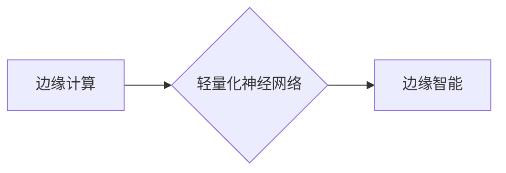

# 一切皆是映射：边缘计算中的轻量化神经网络部署

作者：禅与计算机程序设计艺术

## 1. 背景介绍

### 1.1.  边缘计算：智能的边缘化浪潮
近年来，随着物联网设备的爆炸性增长和数据量的指数级增加，传统的云计算模式已经难以满足实时性、安全性、带宽效率等方面的需求。应运而生的边缘计算，将计算和数据存储从集中式的云端迁移到更靠近数据源的网络边缘，为实时数据处理、低延迟响应、隐私保护等提供了新的解决方案。

### 1.2. 轻量化神经网络：边缘智能的基石
深度学习模型，特别是神经网络，在图像识别、语音处理、自然语言处理等领域取得了巨大的成功。然而，传统的神经网络模型通常规模庞大、计算复杂度高，难以直接部署在资源受限的边缘设备上。轻量化神经网络应运而生，通过模型压缩、结构优化等方法，在保证模型性能的前提下，大幅降低模型的计算量和存储空间，为边缘智能提供了强大的技术支持。

### 1.3. 边缘计算中的轻量化神经网络部署：挑战与机遇并存
将轻量化神经网络部署到边缘设备，面临着诸多挑战：
* **硬件资源受限:** 边缘设备通常计算能力、内存、存储空间有限。
* **网络连接不稳定:** 边缘设备的网络连接可能不稳定，带宽有限。
* **数据异构性:** 边缘设备收集的数据可能来自不同的传感器，具有不同的格式和质量。
* **安全隐私问题:** 边缘设备收集的数据可能包含敏感信息，需要保障数据安全和用户隐私。

 然而，边缘计算中的轻量化神经网络部署也蕴藏着巨大的机遇：
* **实时性:** 边缘计算可以实现数据的实时处理和分析，为实时应用提供可能。
* **可扩展性:** 边缘计算可以灵活地扩展计算和存储资源，以满足不断增长的应用需求。
* **成本效益:** 边缘计算可以降低数据传输和存储成本，提高资源利用效率。

## 2. 核心概念与联系

### 2.1.  边缘计算

#### 2.1.1. 定义
边缘计算是一种分布式计算范式，将计算和数据存储从集中式的云端迁移到更靠近数据源的网络边缘，例如网络路由器、交换机、基站、移动设备等。

#### 2.1.2. 特点
* **低延迟:** 数据在边缘设备本地处理，减少了数据传输延迟，提高了响应速度。
* **高带宽:** 边缘计算可以利用本地网络资源，降低对骨干网络带宽的压力。
* **数据隐私:** 数据在本地处理，可以有效保护用户隐私和数据安全。

### 2.2.  轻量化神经网络

#### 2.2.1. 定义
轻量化神经网络是指通过模型压缩、结构优化等方法，在保证模型性能的前提下，大幅降低模型的计算量和存储空间的神经网络模型。

#### 2.2.2.  常见方法
* **模型剪枝:**  去除模型中冗余或不重要的连接或神经元。
* **量化:**  使用低精度数据类型（例如 int8、float16）表示模型参数和激活值。
* **知识蒸馏:** 使用大型教师网络训练小型学生网络，将教师网络的知识迁移到学生网络。
* **神经网络架构搜索:**  自动搜索高效的网络结构，例如 MobileNet、ShuffleNet。

### 2.3.  边缘计算中的轻量化神经网络部署

#### 2.3.1. 定义
边缘计算中的轻量化神经网络部署是指将轻量化神经网络模型部署到边缘设备，实现边缘智能。

#### 2.3.2.  关键技术
* **模型转换:**  将训练好的轻量化神经网络模型转换为边缘设备支持的格式。
* **模型压缩:**  进一步压缩模型大小，以适应边缘设备的存储空间限制。
* **硬件加速:**  利用边缘设备的硬件加速器（例如 GPU、NPU）加速模型推理。

### 2.4. 核心概念关系图



## 3. 核心算法原理具体操作步骤

### 3.1.  模型量化

#### 3.1.1. 原理
模型量化是指使用低精度数据类型（例如 int8、float16）表示模型参数和激活值，以减少模型的存储空间和计算量。

#### 3.1.2.  操作步骤

1. **训练后量化:**  在模型训练完成后，对模型参数和激活值进行量化。
2. **量化感知训练:**  在模型训练过程中，模拟量化操作，以提高量化模型的精度。

#### 3.1.3.  示例

```python
import tensorflow as tf

# 定义模型
model = tf.keras.models.Sequential([
  tf.keras.layers.Dense(128, activation='relu'),
  tf.keras.layers.Dense(10, activation='softmax')
])

# 训练模型
# ...

# 模型量化
converter = tf.lite.TFLiteConverter.from_keras_model(model)
converter.optimizations = [tf.lite.Optimize.DEFAULT]
tflite_model = converter.convert()

# 保存量化模型
open('quantized_model.tflite', 'wb').write(tflite_model)
```

### 3.2.  知识蒸馏

#### 3.2.1. 原理
知识蒸馏是指使用大型教师网络训练小型学生网络，将教师网络的知识迁移到学生网络，以提高学生网络的性能。

#### 3.2.2.  操作步骤

1. **训练教师网络:**  使用大量数据训练一个高性能的教师网络。
2. **使用教师网络生成软标签:**  使用教师网络对训练数据进行预测，生成软标签。
3. **训练学生网络:**  使用训练数据和软标签训练学生网络，其中软标签作为学生网络的监督信号。

#### 3.2.3.  示例

```python
import tensorflow as tf

# 定义教师网络
teacher_model = tf.keras.models.Sequential([
  # ...
])

# 定义学生网络
student_model = tf.keras.models.Sequential([
  # ...
])

# 训练教师网络
# ...

# 使用教师网络生成软标签
teacher_predictions = teacher_model.predict(train_images)

# 训练学生网络
student_model.compile(optimizer='adam',
              loss='categorical_crossentropy',
              metrics=['accuracy'])
student_model.fit(train_images, teacher_predictions, epochs=10)
```


## 4. 数学模型和公式详细讲解举例说明

### 4.1.  卷积神经网络 (CNN)

#### 4.1.1.  卷积层

卷积层是 CNN 的核心组件，用于提取图像的特征。卷积操作可以使用以下公式表示：

$$
y_{i,j} = \sum_{m=1}^{M} \sum_{n=1}^{N} w_{m,n} x_{i+m-1,j+n-1}
$$

其中：

* $y_{i,j}$ 是输出特征图的第 $(i,j)$ 个元素。
* $x_{i,j}$ 是输入特征图的第 $(i,j)$ 个元素。
* $w_{m,n}$ 是卷积核的第 $(m,n)$ 个权重。
* $M$ 和 $N$ 是卷积核的尺寸。


#### 4.1.2.  池化层

池化层用于降低特征图的维度，减少计算量。常见的池化操作包括最大池化和平均池化。

* **最大池化:**  选择池化窗口内的最大值作为输出。
* **平均池化:**  计算池化窗口内所有值的平均值作为输出。


### 4.2.  循环神经网络 (RNN)

#### 4.2.1.  隐藏状态更新公式

RNN 的隐藏状态 $h_t$ 可以使用以下公式更新：

$$
h_t = \tanh(W_{hh} h_{t-1} + W_{xh} x_t + b_h)
$$

其中：

* $h_{t-1}$ 是上一时刻的隐藏状态。
* $x_t$ 是当前时刻的输入。
* $W_{hh}$、$W_{xh}$ 和 $b_h$ 是模型参数。
* $\tanh$ 是双曲正切函数。


#### 4.2.2.  输出计算公式

RNN 的输出 $y_t$ 可以使用以下公式计算：

$$
y_t = \sigma(W_{hy} h_t + b_y)
$$

其中：

* $h_t$ 是当前时刻的隐藏状态。
* $W_{hy}$ 和 $b_y$ 是模型参数。
* $\sigma$ 是 sigmoid 函数。


## 5. 项目实践：代码实例和详细解释说明

### 5.1. 使用 TensorFlow Lite 部署图像分类模型

#### 5.1.1.  安装 TensorFlow Lite

```bash
pip install tflite-model-maker
```

#### 5.1.2.  加载预训练模型

```python
import tensorflow as tf

# 加载预训练的 MobileNetV2 模型
model = tf.keras.applications.MobileNetV2(weights='imagenet')
```

#### 5.1.3.  转换模型为 TensorFlow Lite 格式

```python
converter = tf.lite.TFLiteConverter.from_keras_model(model)
tflite_model = converter.convert()

# 保存 TensorFlow Lite 模型
open('mobilenetv2.tflite', 'wb').write(tflite_model)
```

#### 5.1.4.  加载 TensorFlow Lite 模型并进行推理

```python
import tensorflow as tf

# 加载 TensorFlow Lite 模型
interpreter = tf.lite.Interpreter(model_path='mobilenetv2.tflite')
interpreter.allocate_tensors()

# 获取输入和输出张量的索引
input_details = interpreter.get_input_details()
output_details = interpreter.get_output_details()

# 加载图像并进行预处理
img = tf.keras.preprocessing.image.load_img('image.jpg', target_size=(224, 224))
input_data = tf.keras.preprocessing.image.img_to_array(img)
input_data = np.expand_dims(input_data, axis=0)
input_data = tf.keras.applications.mobilenet_v2.preprocess_input(input_data)

# 设置输入张量
interpreter.set_tensor(input_details[0]['index'], input_data)

# 运行推理
interpreter.invoke()

# 获取输出张量
output_data = interpreter.get_tensor(output_details[0]['index'])

# 解码预测结果
decoded_predictions = tf.keras.applications.mobilenet_v2.decode_predictions(output_data)

# 打印预测结果
print(decoded_predictions)
```


## 6. 实际应用场景

### 6.1.  智能家居

* **智能音箱:**  使用语音识别模型，实现语音控制家电、播放音乐等功能。
* **智能摄像头:**  使用图像识别模型，实现人脸识别、物体检测等功能。

### 6.2.  智慧城市

* **交通流量监测:**  使用图像识别模型，实现车辆检测、车流统计等功能。
* **环境监测:**  使用传感器数据和机器学习模型，实现空气质量监测、噪音监测等功能。

### 6.3.  工业互联网

* **设备故障预测:**  使用传感器数据和机器学习模型，预测设备故障，提前进行维护。
* **生产过程优化:**  使用机器学习模型优化生产工艺参数，提高生产效率。


## 7. 工具和资源推荐

### 7.1.  模型压缩工具

* **TensorFlow Lite Model Optimization Toolkit:**  https://www.tensorflow.org/lite/performance/model_optimization
* **PyTorch Mobile:**  https://pytorch.org/mobile/

### 7.2.  边缘计算平台

* **AWS IoT Greengrass:**  https://aws.amazon.com/greengrass/
* **Microsoft Azure IoT Edge:**  https://azure.microsoft.com/en-us/services/iot-edge/
* **Google Cloud IoT Edge:**  https://cloud.google.com/edge/

### 7.3.  学习资源

* **Coursera: Introduction to Embedded Machine Learning:**  https://www.coursera.org/learn/introduction-embedded-machine-learning
* **edX: TinyML: Enabling Ultra-Low Power Machine Learning Applications:**  https://www.edx.org/course/tinyml-enabling-ultra-low-power-machine-learning-applications


## 8. 总结：未来发展趋势与挑战

### 8.1.  未来发展趋势

* **更轻量化的模型:**  随着硬件技术的不断发展，未来将出现更加轻量化的神经网络模型，以满足更低功耗、更小尺寸的边缘设备的需求。
* **更强大的边缘计算平台:**  边缘计算平台将提供更强大的计算能力、更丰富的开发工具和更完善的安全机制，为边缘智能应用提供更好的支持。
* **更广泛的应用场景:**  随着边缘计算和轻量化神经网络技术的不断成熟，边缘智能将应用于更多领域，例如医疗健康、金融科技、自动驾驶等。

### 8.2.  挑战

* **模型精度和效率的平衡:**  在追求更轻量化模型的同时，需要权衡模型精度和效率，以满足实际应用的需求。
* **数据安全和隐私保护:**  边缘设备收集的数据可能包含敏感信息，需要采取有效的措施保护数据安全和用户隐私。
* **技术标准和生态建设:**  边缘计算和轻量化神经网络技术发展迅速，需要制定统一的技术标准，构建完善的生态系统，促进技术的健康发展。


## 9. 附录：常见问题与解答

### 9.1.  什么是边缘计算？

边缘计算是一种分布式计算范式，将计算和数据存储从集中式的云端迁移到更靠近数据源的网络边缘，例如网络路由器、交换机、基站、移动设备等。

### 9.2.  什么是轻量化神经网络？

轻量化神经网络是指通过模型压缩、结构优化等方法，在保证模型性能的前提下，大幅降低模型的计算量和存储空间的神经网络模型。

### 9.3.  边缘计算和云计算有什么区别？

边缘计算和云计算都是分布式计算范式，但它们有以下区别：

* **计算位置:**  边缘计算在网络边缘进行计算，而云计算在集中式的云数据中心进行计算。
* **延迟:**  边缘计算的延迟更低，因为数据不需要传输到云端进行处理。
* **带宽:**  边缘计算可以利用本地网络资源，降低对骨干网络带宽的压力。
* **数据隐私:**  边缘计算可以有效保护用户隐私和数据安全，因为数据在本地处理。

### 9.4.  如何选择合适的边缘计算平台？

选择合适的边缘计算平台需要考虑以下因素：

* **应用场景:**  不同的边缘计算平台适用于不同的应用场景，例如 AWS IoT Greengrass 适用于工业物联网，Microsoft Azure IoT Edge 适用于混合云环境。
* **硬件支持:**  不同的边缘计算平台支持不同的硬件设备，例如 Raspberry Pi、NVIDIA Jetson Nano。
* **开发工具:**  不同的边缘计算平台提供不同的开发工具，例如 AWS IoT Greengrass 提供了 Lambda 函数，Microsoft Azure IoT Edge 提供了模块。
* **成本:**  不同的边缘计算平台的成本不同，需要根据实际情况选择合适的平台。


### 9.5.  如何学习边缘计算和轻量化神经网络？

学习边缘计算和轻量化神经网络，可以参考以下资源：

* **在线课程:**  例如 Coursera、edX 等平台提供了相关的在线课程。
* **书籍:**  例如《边缘计算：原理、技术与应用》、《深度学习：原理与实践》。
* **开源项目:**  例如 TensorFlow Lite、PyTorch Mobile 等开源项目提供了丰富的代码示例和文档。

