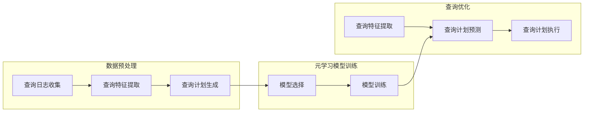

# 一切皆是映射：面向复杂查询的数据库优化通过元学习

作者：禅与计算机程序设计艺术

## 1. 背景介绍

### 1.1 数据库优化的重要性

在信息时代，数据已经成为最重要的资产之一。随着数据量的爆炸式增长，如何高效地存储、管理和查询数据成为了一个巨大的挑战。数据库作为数据的核心存储和管理系统，其性能直接影响着各种应用的效率和用户体验。因此，数据库优化一直是数据库领域研究的热点和难点问题。

### 1.2 复杂查询的挑战

传统的数据库优化技术主要针对简单查询进行优化，例如单表查询、连接查询等。然而，随着应用场景的复杂化，越来越多的应用需要处理复杂的查询，例如多表连接、子查询、聚合函数等。这些复杂查询往往涉及大量的表和数据，执行时间长，对数据库性能提出了更高的要求。

### 1.3 元学习的兴起

近年来，机器学习技术发展迅速，并在各个领域取得了显著成果。其中，元学习作为一种新兴的机器学习方法，旨在从少量数据中快速学习新的知识，并在新的任务上取得良好的泛化性能。元学习的出现为解决复杂查询的数据库优化问题提供了新的思路。

## 2. 核心概念与联系

### 2.1 元学习

元学习，也称为“学习如何学习”，是一种机器学习方法，其目标是训练一个模型，使其能够快速适应新的任务。与传统的机器学习方法不同，元学习不是直接学习从输入到输出的映射关系，而是学习如何学习这种映射关系。换句话说，元学习的目标是学习一个学习算法，而不是学习一个具体的模型。

### 2.2 数据库优化

数据库优化是指通过调整数据库的设计、配置和查询语句等手段，提高数据库系统的性能和效率。数据库优化的目标是减少查询响应时间、提高系统吞吐量、降低资源消耗等。

### 2.3 映射

在数学和计算机科学中，映射是指一种将一个集合中的元素与另一个集合中的元素相关联的关系。在数据库中，查询可以看作是一种从数据库表到结果集的映射。

### 2.4 一切皆是映射

本文提出的“一切皆是映射”的理念，是指将数据库中的各种操作，例如查询、更新、删除等，都看作是一种映射。基于这种理念，可以利用元学习的方法，从历史查询中学习数据库的映射关系，并利用学习到的知识优化新的查询。

## 3. 核心算法原理具体操作步骤

### 3.1 数据预处理

#### 3.1.1 查询日志收集

收集数据库的历史查询日志，作为元学习的训练数据。

#### 3.1.2 查询特征提取

从查询日志中提取查询特征，例如查询语句、涉及的表、查询条件等。

#### 3.1.3 查询计划生成

利用数据库的查询优化器，为每个查询生成相应的查询计划。

### 3.2 元学习模型训练

#### 3.2.1 模型选择

选择合适的元学习模型，例如基于度量的元学习、基于模型的元学习等。

#### 3.2.2 模型训练

利用预处理后的数据，训练元学习模型，使其能够根据查询特征预测查询计划。

### 3.3 查询优化

#### 3.3.1 查询特征提取

对于新的查询，提取其查询特征。

#### 3.3.2 查询计划预测

利用训练好的元学习模型，预测该查询的最佳查询计划。

#### 3.3.3 查询计划执行

执行预测的查询计划，并将结果返回给用户。

## 4. 数学模型和公式详细讲解举例说明

### 4.1 基于度量的元学习

基于度量的元学习方法通过计算查询之间的相似度来预测查询计划。常用的相似度度量方法包括欧氏距离、曼哈顿距离、余弦相似度等。

例如，假设有两个查询 q1 和 q2，其查询特征向量分别为 x1 和 x2，则可以使用欧氏距离计算它们的相似度：

$$
d(q1, q2) = \sqrt{\sum_{i=1}^{n}(x1_i - x2_i)^2}
$$

其中，n 表示查询特征的维度。

### 4.2 基于模型的元学习

基于模型的元学习方法通过训练一个模型来预测查询计划。常用的模型包括神经网络、决策树、支持向量机等。

例如，可以使用一个简单的神经网络来预测查询计划。该神经网络的输入层是查询特征向量，输出层是查询计划的概率分布。

## 5. 项目实践：代码实例和详细解释说明

### 5.1 Python 代码示例

```python
import torch
import torch.nn as nn

# 定义神经网络模型
class QueryPlanPredictor(nn.Module):
    def __init__(self, input_dim, output_dim):
        super(QueryPlanPredictor, self).__init__()
        self.fc1 = nn.Linear(input_dim, 128)
        self.relu = nn.ReLU()
        self.fc2 = nn.Linear(128, output_dim)

    def forward(self, x):
        out = self.fc1(x)
        out = self.relu(out)
        out = self.fc2(out)
        return out

# 初始化模型
model = QueryPlanPredictor(input_dim=10, output_dim=5)

# 定义损失函数和优化器
criterion = nn.CrossEntropyLoss()
optimizer = torch.optim.Adam(model.parameters(), lr=0.001)

# 训练模型
for epoch in range(100):
    # ...
    # 前向传播
    outputs = model(inputs)
    loss = criterion(outputs, labels)

    # 反向传播和优化
    optimizer.zero_grad()
    loss.backward()
    optimizer.step()

    # ...

# 预测查询计划
predictions = model(test_inputs)
```

### 5.2 代码解释

* `QueryPlanPredictor` 类定义了一个简单的神经网络模型，用于预测查询计划。
* `criterion` 和 `optimizer` 分别定义了损失函数和优化器。
* 在训练循环中，模型首先进行前向传播，计算预测结果和损失函数。
* 然后，进行反向传播，计算梯度并更新模型参数。
* 最后，可以使用训练好的模型预测新的查询计划。

## 6. 实际应用场景

### 6.1 数据库管理系统

元学习可以应用于数据库管理系统中，自动优化复杂查询。

### 6.2 数据仓库

元学习可以应用于数据仓库中，优化数据分析查询。

### 6.3 云数据库

元学习可以应用于云数据库中，根据用户的查询模式动态调整数据库配置。

## 7. 总结：未来发展趋势与挑战

### 7.1 未来发展趋势

* 元学习与其他机器学习技术的结合
* 元学习在数据库安全领域的应用
* 元学习在分布式数据库中的应用

### 7.2 挑战

* 元学习模型的可解释性
* 元学习模型的鲁棒性
* 元学习模型的效率

## 8. 附录：常见问题与解答

### 8.1 什么是元学习？

元学习是一种机器学习方法，其目标是训练一个模型，使其能够快速适应新的任务。

### 8.2 元学习如何应用于数据库优化？

元学习可以从历史查询中学习数据库的映射关系，并利用学习到的知识优化新的查询。

### 8.3 元学习的优势是什么？

元学习可以快速适应新的查询，提高数据库的性能和效率。


##  Mermaid流程图


