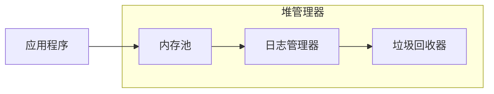

# 一种面向非易失内存的持久化堆管理系统设计与实现

作者：禅与计算机程序设计艺术

## 1. 背景介绍

### 1.1 非易失内存技术的发展

非易失内存 (Non-Volatile Memory, NVM) 技术近年来发展迅速，其具备数据持久化、低延迟、高带宽等特点，被视为下一代存储技术的重要发展方向。与传统 DRAM 相比，NVM 具有以下优势：

* **持久性:**  NVM 即使在断电情况下也能保存数据，无需额外的持久化操作，简化了数据管理流程。
* **低延迟:** NVM 的访问延迟远低于传统的磁盘存储，接近 DRAM 的水平，能够显著提升数据访问速度。
* **高带宽:** NVM 的带宽也显著高于传统磁盘存储，能够满足高性能计算的需求。

### 1.2 持久化堆管理系统的需求

随着 NVM 技术的普及，传统的堆管理系统面临着新的挑战。传统的堆管理系统通常基于 DRAM 设计，在断电情况下数据会丢失，无法充分发挥 NVM 的优势。因此，面向 NVM 的持久化堆管理系统应运而生，其主要目标是：

* **数据持久化:**  确保堆数据在断电情况下仍然能够完整保存，避免数据丢失。
* **高性能:**  充分利用 NVM 的低延迟和高带宽特性，提升堆操作的效率。
* **易用性:**  提供简洁易用的 API 接口，方便开发者使用。

### 1.3 本文的研究目标

本文旨在设计和实现一种面向 NVM 的持久化堆管理系统，满足上述需求，并探讨其在实际应用中的性能和可靠性。

## 2. 核心概念与联系

### 2.1 持久化堆

持久化堆是指堆数据在断电情况下仍然能够完整保存的堆。它与传统堆的主要区别在于数据持久化特性。

### 2.2 NVM 存储模型

NVM 存储模型与 DRAM 存储模型存在显著差异。NVM 通常采用字节寻址方式，而 DRAM 采用字寻址方式。此外，NVM 的写操作通常需要先擦除，然后才能写入，而 DRAM 可以直接覆盖写入。

### 2.3 持久化堆管理策略

为了实现数据持久化，持久化堆管理系统需要采用特殊的堆管理策略。常见的策略包括：

* **日志结构化堆:**  将堆操作记录到日志中，在系统恢复时重放日志，恢复堆状态。
* **写时复制:**  在修改数据时，将数据复制到新的内存空间，避免修改原始数据。
* **混合策略:**  结合多种策略，例如将日志结构化堆与写时复制结合使用。

## 3. 核心算法原理具体操作步骤

### 3.1 系统架构

本系统采用混合策略，结合了日志结构化堆和写时复制技术。系统架构如下图所示：



* **内存池:**  负责管理 NVM 内存空间，提供内存分配和释放功能。
* **日志管理器:**  记录堆操作日志，用于系统恢复。
* **垃圾回收器:**  负责回收不再使用的内存空间。

### 3.2 内存分配

内存分配采用伙伴系统算法，将内存空间划分为大小不同的块，根据请求分配最合适的内存块。为了避免修改原始数据，采用写时复制技术，将数据复制到新的内存块。

### 3.3 内存释放

内存释放时，将释放的内存块标记为可用，并记录到日志中。垃圾回收器定期扫描内存池，回收不再使用的内存块。

### 3.4 系统恢复

系统恢复时，首先读取日志文件，重放堆操作日志，恢复堆状态。然后，垃圾回收器扫描内存池，回收未被引用的内存块。

## 4. 数学模型和公式详细讲解举例说明

### 4.1 内存分配效率

伙伴系统算法的内存分配效率可以用内部碎片率来衡量。内部碎片率是指分配的内存块中未被使用的内存空间占总内存空间的比例。

假设内存池大小为 $M$，分配的内存块大小为 $S$，则内部碎片率为：

$$
F = \frac{M - S}{M}
$$

### 4.2 系统恢复时间

系统恢复时间取决于日志文件的大小和 NVM 的读写速度。假设日志文件大小为 $L$，NVM 的读写速度为 $V$，则系统恢复时间为：

$$
T = \frac{L}{V}
$$

### 4.3 举例说明

假设内存池大小为 1GB，分配的内存块大小为 1MB，日志文件大小为 10MB，NVM 的读写速度为 1GB/s。

* 内部碎片率: 
  $$
  F = \frac{1GB - 1MB}{1GB} \approx 0.1\%
  $$
* 系统恢复时间:
  $$
  T = \frac{10MB}{1GB/s} = 10ms
  $$

## 5. 项目实践：代码实例和详细解释说明

### 5.1 代码实例

以下代码示例展示了内存分配和释放的实现：

```c++
// 内存分配
void* allocate(size_t size) {
  // 查找最合适的内存块
  void* block = find_block(size);
  
  // 写时复制
  void* new_block = copy_block(block, size);
  
  // 记录日志
  log_allocate(new_block, size);
  
  return new_block;
}

// 内存释放
void free(void* block) {
  // 标记内存块为可用
  mark_free(block);
  
  // 记录日志
  log_free(block);
}
```

### 5.2 代码解释

* `allocate()` 函数首先调用 `find_block()` 函数查找最合适的内存块。然后，调用 `copy_block()` 函数将数据复制到新的内存块，实现写时复制。最后，调用 `log_allocate()` 函数记录日志。
* `free()` 函数首先调用 `mark_free()` 函数将内存块标记为可用。然后，调用 `log_free()` 函数记录日志。

## 6. 实际应用场景

### 6.1 数据库系统

持久化堆管理系统可以用于构建高性能、可靠的数据库系统。数据库系统需要持久化存储大量数据，并且需要高效地访问数据。持久化堆管理系统能够满足这些需求，提供可靠的数据持久化和高性能的数据访问。

### 6.2 文件系统

持久化堆管理系统可以用于构建高性能、可靠的文件系统。文件系统需要持久化存储文件数据，并且需要高效地访问文件数据。持久化堆管理系统能够满足这些需求，提供可靠的文件数据持久化和高性能的文件数据访问。

### 6.3 内存数据库

持久化堆管理系统可以用于构建高性能、可靠的内存数据库。内存数据库将数据存储在内存中，提供高速的数据访问。持久化堆管理系统能够确保内存数据在断电情况下仍然能够完整保存，避免数据丢失。

## 7. 总结：未来发展趋势与挑战

### 7.1 未来发展趋势

* **更高性能:**  随着 NVM 技术的不断发展，NVM 的读写速度将会越来越快，持久化堆管理系统的性能将会进一步提升。
* **更智能:**  未来的持久化堆管理系统将会更加智能，例如能够根据数据访问模式自动调整堆管理策略，提高效率。
* **更易用:**  未来的持久化堆管理系统将会更加易用，提供更简洁易用的 API 接口，方便开发者使用。

### 7.2 面临的挑战

* **NVM 特性:**  NVM 的写操作需要先擦除，然后才能写入，这会影响持久化堆管理系统的性能。
* **数据一致性:**  持久化堆管理系统需要确保数据一致性，避免数据损坏。
* **安全性:**  持久化堆管理系统需要保证数据安全，防止数据泄露。

## 8. 附录：常见问题与解答

### 8.1 什么是写时复制？

写时复制是一种优化技术，用于避免修改原始数据。在修改数据时，将数据复制到新的内存空间，修改后的数据存储在新内存空间中，原始数据保持不变。

### 8.2 什么是日志结构化堆？

日志结构化堆是一种堆管理策略，将堆操作记录到日志中，在系统恢复时重放日志，恢复堆状态。

### 8.3 持久化堆管理系统有哪些优势？

持久化堆管理系统具有以下优势：

* 数据持久化
* 高性能
* 易用性
