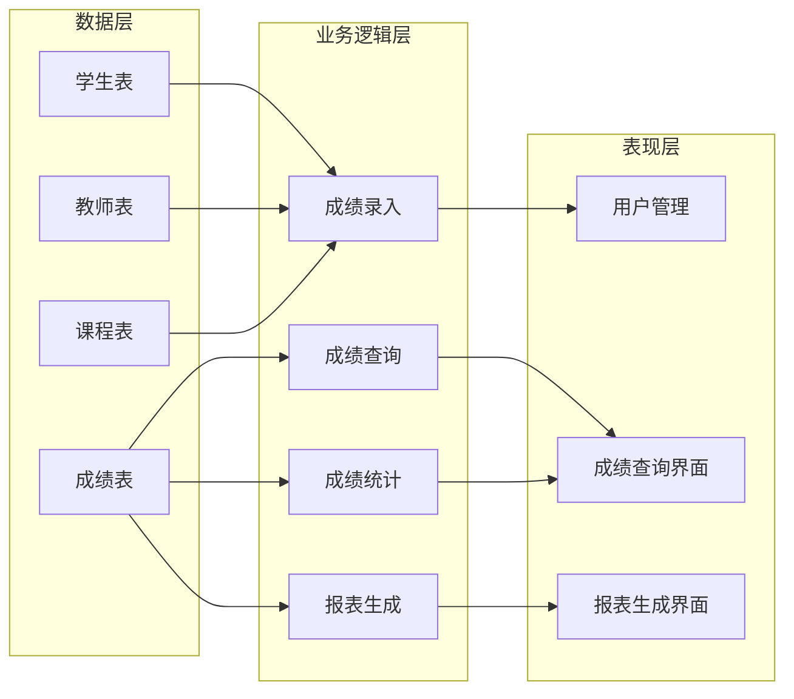

## 1. 背景介绍

### 1.1 中学成绩管理的现状与挑战

随着教育信息化进程的加速，中学教育领域对成绩管理提出了更高的要求。传统的纸质成绩单和手工统计方式已无法满足现代教育管理的需求，中学成绩管理系统应运而生。然而，现有的中学成绩管理系统仍然存在一些问题：

* **功能单一：** 许多系统仅提供简单的成绩录入、查询和统计功能，缺乏对学生综合素质评价、学业发展跟踪等方面的支持。
* **数据分散：** 成绩数据分散在各个学科教师手中，难以进行统一管理和分析，不利于学校宏观决策。
* **用户体验差：** 部分系统界面设计不友好，操作繁琐，用户体验不佳。

### 1.2 中学成绩管理系统的设计目标

为了解决上述问题，我们需要设计一个功能完善、易用高效的中学成绩管理系统。该系统应具备以下目标：

* **全面记录学生成绩信息：**  包括各科考试成绩、平时成绩、综合素质评价等。
* **实现数据集中管理：** 将分散的成绩数据集中存储和管理，方便学校进行统一分析和决策。
* **提供灵活的查询和统计功能：** 支持按班级、年级、学科等多种维度进行成绩查询和统计分析。
* **支持学生个性化发展评价：** 提供学生学业发展跟踪和综合素质评价功能，帮助学生更好地了解自身优势和不足。
* **提升用户体验：**  界面简洁美观，操作便捷高效，提升用户使用满意度。

## 2. 核心概念与联系

### 2.1 系统架构设计

中学成绩管理系统采用B/S架构，主要包括以下模块：

* **数据层：** 负责存储系统数据，包括学生信息、教师信息、课程信息、成绩信息等。
* **业务逻辑层：** 负责处理业务逻辑，包括成绩录入、查询、统计、分析等。
* **表现层：** 负责与用户交互，提供用户界面，包括登录、成绩查询、报表生成等功能。

### 2.2 数据库设计

系统采用关系型数据库，主要包括以下数据表：

* **学生表：** 存储学生基本信息，包括学号、姓名、班级等。
* **教师表：** 存储教师基本信息，包括教师编号、姓名、所教科目等。
* **课程表：** 存储课程信息，包括课程编号、课程名称、学分等。
* **成绩表：** 存储学生成绩信息，包括学号、课程编号、成绩等。

### 2.3 系统功能模块

* **用户管理模块：** 负责用户登录、注册、权限管理等功能。
* **成绩录入模块：** 负责教师录入学生成绩，支持多种成绩类型，如考试成绩、平时成绩等。
* **成绩查询模块：** 提供多种查询方式，如按班级、年级、学科等查询学生成绩。
* **成绩统计模块：** 提供多种统计功能，如班级平均分、年级排名等。
* **报表生成模块：** 支持生成各种报表，如成绩单、成绩分析报告等。
* **系统设置模块：** 负责系统参数设置，如学期设置、考试类型设置等。

### 2.4 核心概念联系图



## 3. 核心算法原理具体操作步骤

### 3.1 成绩录入算法

成绩录入算法主要包括以下步骤：

1. **身份验证：** 教师登录系统，系统验证教师身份。
2. **选择班级和课程：** 教师选择要录入成绩的班级和课程。
3. **录入学生成绩：** 教师输入学生成绩，系统进行数据校验，确保成绩合法有效。
4. **保存成绩数据：** 系统将成绩数据保存到数据库中。

### 3.2 成绩查询算法

成绩查询算法主要包括以下步骤：

1. **选择查询条件：** 用户选择查询条件，如班级、年级、学科等。
2. **查询数据库：** 系统根据查询条件查询数据库，获取符合条件的成绩数据。
3. **展示查询结果：** 系统将查询结果以表格或图表的形式展示给用户。

### 3.3 成绩统计算法

成绩统计算法主要包括以下步骤：

1. **选择统计维度：** 用户选择统计维度，如班级平均分、年级排名等。
2. **统计数据：** 系统根据统计维度对成绩数据进行统计分析。
3. **展示统计结果：** 系统将统计结果以图表或文字的形式展示给用户。

## 4. 数学模型和公式详细讲解举例说明

### 4.1 平均分计算公式

$平均分 = \frac{所有学生成绩总和}{学生人数}$

**举例说明：** 某班有30名学生，他们的数学成绩总和为2700分，则该班数学平均分为：

$平均分 = \frac{2700}{30} = 90分$

### 4.2 年级排名计算公式

年级排名根据学生的总成绩进行排序，总成绩最高的排名第一，以此类推。

**举例说明：** 某年级有100名学生，他们的总成绩如下表所示：

| 学号 | 姓名 | 语文 | 数学 | 英语 | 总成绩 |
|---|---|---|---|---|---|
| 1 | 张三 | 90 | 95 | 92 | 277 |
| 2 | 李四 | 88 | 90 | 85 | 263 |
| 3 | 王五 | 92 | 85 | 90 | 267 |
| ... | ... | ... | ... | ... | ... |

则张三的年级排名为1，李四的年级排名为3，王五的年级排名为2。

## 5. 项目实践：代码实例和详细解释说明

### 5.1 开发环境

* 操作系统：Windows 10
* 开发语言：Python 3.8
* 数据库：MySQL 8.0
* Web框架：Django 3.2

### 5.2 代码实例

#### 5.2.1 学生模型

```python
from django.db import models

class Student(models.Model):
    student_id = models.CharField(max_length=20, primary_key=True)
    name = models.CharField(max_length=50)
    class_name = models.CharField(max_length=50)

    def __str__(self):
        return self.name
```

#### 5.2.2 成绩模型

```python
from django.db import models

class Score(models.Model):
    student = models.ForeignKey(Student, on_delete=models.CASCADE)
    course = models.CharField(max_length=50)
    score = models.IntegerField()

    def __str__(self):
        return f"{self.student.name} {self.course} {self.score}"
```

#### 5.2.3 成绩录入视图

```python
from django.shortcuts import render, redirect
from .models import Student, Score

def score_input(request):
    if request.method == 'POST':
        student_id = request.POST['student_id']
        course = request.POST['course']
        score = request.POST['score']

        student = Student.objects.get(student_id=student_id)
        score = Score(student=student, course=course, score=score)
        score.save()

        return redirect('score_list')

    students = Student.objects.all()
    return render(request, 'score_input.html', {'students': students})
```

### 5.3 代码解释

* `Student` 模型定义了学生的属性，包括学号、姓名、班级。
* `Score` 模型定义了成绩的属性，包括学生、课程、成绩。
* `score_input` 视图负责处理成绩录入功能，包括接收用户输入、数据校验、保存数据等。

## 6. 实际应用场景

### 6.1 学校教学管理

中学成绩管理系统可以帮助学校实现教学管理的信息化，提高教学管理效率。学校可以通过系统了解学生的学习情况，及时发现学生的学习问题，并采取相应的措施进行改进。

### 6.2 学生学习评估

学生可以通过系统查询自己的成绩，了解自己的学习情况，并根据自己的实际情况制定学习计划。

### 6.3 家校沟通

家长可以通过系统了解孩子的学习情况，并与老师进行沟通，共同帮助孩子提高学习成绩。

## 7. 总结：未来发展趋势与挑战

### 7.1 未来发展趋势

* **智能化：** 中学成绩管理系统将更加智能化，例如利用人工智能技术进行成绩分析和预测，为学生提供个性化的学习建议。
* **移动化：** 随着移动互联网的发展，中学成绩管理系统将更加移动化，方便学生、家长、老师随时随地访问系统。
* **数据可视化：** 中学成绩管理系统将更加注重数据可视化，利用图表等形式直观地展示成绩数据，方便用户理解和分析。

### 7.2 面临的挑战

* **数据安全：** 中学成绩管理系统存储了大量的学生信息，如何保障数据安全是一个重要挑战。
* **系统性能：** 随着数据量的不断增加，如何保证系统性能稳定是一个挑战。
* **用户需求：** 学生、家长、老师对中学成绩管理系统的需求不断变化，如何满足用户的个性化需求是一个挑战。

## 8. 附录：常见问题与解答

### 8.1 如何录入学生成绩？

1. 教师登录系统。
2. 选择要录入成绩的班级和课程。
3. 输入学生成绩，系统进行数据校验。
4. 点击“保存”按钮保存成绩数据。

### 8.2 如何查询学生成绩？

1. 学生或家长登录系统。
2. 选择查询条件，如班级、年级、学科等。
3. 点击“查询”按钮，系统展示查询结果。

### 8.3 如何生成成绩单？

1. 教师登录系统。
2. 选择要生成成绩单的班级。
3. 点击“生成成绩单”按钮，系统生成成绩单并提供下载。
