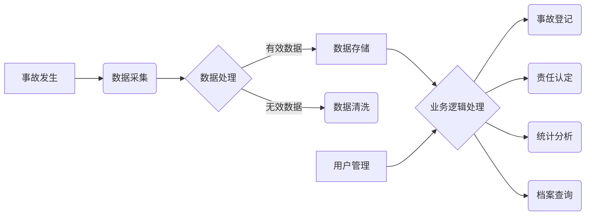

##  交通事故档案管理系统详细设计与具体代码实现

作者：禅与计算机程序设计艺术

## 1. 背景介绍

### 1.1 交通事故档案管理现状与挑战

随着我国经济的快速发展和城市化进程的加快，机动车保有量持续攀升，道路交通安全形势日益严峻，交通事故数量居高不下。如何高效地管理和利用交通事故档案，为事故预防、责任认定、保险理赔等提供数据支撑，成为交通管理部门面临的重要挑战。

传统的交通事故档案管理模式存在诸多弊端：

* **信息孤岛现象严重：** 事故处理涉及公安交警、保险公司、医疗机构等多个部门，信息分散，缺乏有效整合。
* **数据统计分析能力薄弱：**  海量的事故数据难以进行深度挖掘和分析，无法为决策提供有效支持。
* **档案查询效率低下：**  纸质档案存储方式不便于检索和调阅，影响工作效率。

### 1.2 交通事故档案管理系统建设目标

为了解决上述问题，建设一套功能完善、安全可靠、易于维护的交通事故档案管理系统势在必行。该系统应具备以下目标：

* **实现信息共享与协同：** 打破部门壁垒，实现事故信息跨部门共享和业务协同处理。
* **提升数据分析决策能力：**  对事故数据进行多维度统计分析，为交通安全管理提供决策依据。
* **提高档案管理效率：** 实现档案电子化管理，方便快捷地进行档案查询、统计和利用。

## 2. 核心概念与联系

### 2.1 系统架构设计

本系统采用 B/S 架构，主要分为以下几个模块：

* **数据采集模块：** 负责从各个渠道采集事故信息，包括事故现场勘查数据、当事人信息、车辆信息、保险信息等。
* **数据处理模块：** 负责对采集到的数据进行清洗、转换、加载等操作，形成统一的数据格式。
* **数据存储模块：** 负责存储事故档案数据，采用关系型数据库进行管理。
* **业务逻辑模块：** 负责实现系统的核心业务功能，包括事故登记、责任认定、统计分析、档案查询等。
* **用户管理模块：** 负责管理系统用户，包括用户注册、登录、权限控制等。

### 2.2 数据模型设计

系统采用 E-R 图进行数据模型设计，主要实体包括：

* **事故信息：** 包括事故发生时间、地点、经过、原因、人员伤亡情况、财产损失情况等。
* **当事人信息：** 包括姓名、性别、年龄、联系方式、驾驶证信息、车辆信息等。
* **车辆信息：** 包括车牌号、车辆类型、车辆品牌、车架号、发动机号等。
* **保险信息：** 包括保险公司、保险单号、保险期限、保险金额等。

### 2.3 系统流程图



## 3. 核心算法原理具体操作步骤

### 3.1 事故责任认定算法

事故责任认定是交通事故处理的核心环节，本系统采用基于规则的推理算法进行责任认定。

**算法步骤：**

1. **规则库构建：** 收集整理交通法规、相关案例等，形成事故责任认定规则库。
2. **事实提取：** 从事故信息中提取与责任认定相关的关键事实，例如：车辆行驶方向、交通信号灯状态、当事人行为等。
3. **规则匹配：** 将提取的事实与规则库中的规则进行匹配，找到符合条件的规则。
4. **结论推导：** 根据匹配到的规则，推导出事故责任认定结论。

**示例：**

假设发生一起两车碰撞事故，车辆 A 在主干道直行，车辆 B 从支路右转弯，两车在路口发生碰撞。根据《中华人民共和国道路交通安全法实施条例》第五十二条规定：

> 机动车通过没有交通信号灯控制也没有交通警察指挥的交叉路口，除应当遵守本条例第五十一条、第五十三条的规定外，还应当遵守下列规定：
>
> （一）转弯的机动车应当让直行的车辆先行；

因此，可以推导出车辆 B 负事故全部责任。

### 3.2 事故数据统计分析

本系统提供多维度的事故数据统计分析功能，例如：

* **按时间维度统计：** 统计不同时间段（年、月、日、小时）的事故发生数量、死亡人数、受伤人数等。
* **按空间维度统计：** 统计不同地区、不同路段的事故发生情况。
* **按事故类型统计：** 统计不同类型事故（例如：追尾、碰撞、刮擦等）的发生情况。
* **按当事人特征统计：** 统计不同年龄段、不同性别、不同驾驶年限的驾驶人发生事故的情况。

**操作步骤：**

1. **选择统计维度：** 用户选择需要统计的维度。
2. **设置统计条件：** 用户可以设置统计的时间范围、地区范围、事故类型等条件。
3. **系统进行数据统计：** 系统根据用户设置的条件，从数据库中查询相关数据并进行统计。
4. **结果展示：** 系统以图表等形式展示统计结果。

## 4. 数学模型和公式详细讲解举例说明

### 4.1 事故风险评估模型

为了预测未来一段时间内某个地区或路段发生事故的可能性，可以使用事故风险评估模型。常用的模型包括：

* **泊松回归模型：**  适用于描述在一定时间段内，某个地区或路段发生事故次数的概率。
* **负二项回归模型：**  适用于描述在一定时间段内，某个地区或路段发生事故次数的概率，并且事故次数的方差大于均值的情况。

**泊松回归模型公式：**

$$
\ln(E(Y|X)) = \beta_0 + \beta_1X_1 + \beta_2X_2 + ... + \beta_pX_p
$$

其中：

* $Y$ 表示事故次数；
* $X_1, X_2, ..., X_p$ 表示影响事故发生的因素，例如：交通流量、道路状况、天气状况等；
* $\beta_0, \beta_1, \beta_2, ..., \beta_p$ 表示模型参数。

**示例：**

假设要预测未来一个月内，某条道路发生交通事故的次数。可以使用历史事故数据，以及该道路的交通流量、道路状况、天气状况等因素，构建泊松回归模型。通过模型预测，可以得到未来一个月内该道路发生事故次数的概率分布。

## 5. 项目实践：代码实例和详细解释说明

### 5.1 技术选型

* **后端开发语言：** Python
* **Web 框架：** Django
* **数据库：** MySQL
* **前端框架：** Vue.js

### 5.2 代码实例

**事故信息模型：**

```python
from django.db import models

class Accident(models.Model):
    """事故信息模型"""
    accident_time = models.DateTimeField(verbose_name="事故时间")
    location = models.CharField(max_length=255, verbose_name="事故地点")
    description = models.TextField(verbose_name="事故经过")
    # ...其他字段
```

**事故登记接口：**

```python
from rest_framework.views import APIView
from rest_framework.response import Response

class AccidentCreateView(APIView):
    """事故登记接口"""
    def post(self, request):
        # 获取请求数据
        data = request.data
        # 数据校验
        # ...
        # 创建事故信息
        accident = Accident.objects.create(**data)
        # 返回响应
        return Response({"message": "事故登记成功", "accident_id": accident.id})
```

## 6. 实际应用场景

* **公安交警部门：** 用于事故处理、责任认定、统计分析等。
* **保险公司：** 用于保险理赔、风险评估等。
* **交通运输部门：** 用于交通安全管理、事故预防等。
* **科研机构：** 用于交通安全研究、数据分析等。

## 7. 总结：未来发展趋势与挑战

### 7.1 未来发展趋势

* **智能化：**  利用人工智能技术，实现事故责任自动认定、事故风险智能预警等功能。
* **数据融合：**  整合来自不同部门、不同平台的数据，构建更加 comprehensive 的交通安全数据库。
* **可视化：**  利用数据可视化技术，更加直观地展示事故数据和分析结果。

### 7.2 面临的挑战

* **数据安全与隐私保护：**  交通事故数据涉及个人隐私，需要加强数据安全和隐私保护。
* **技术标准规范：**  建立统一的技术标准和规范，促进数据共享和系统互联互通。
* **专业人才队伍建设：**  培养具备交通安全、信息技术等方面知识的复合型人才。

## 8. 附录：常见问题与解答

### 8.1 问：如何保障系统数据的安全？

答：系统采用多重安全措施保障数据安全，包括：

* **数据加密：** 重要数据采用加密算法进行加密存储。
* **访问控制：**  根据用户角色分配不同的访问权限，限制对敏感数据的访问。
* **安全审计：** 记录用户操作日志，便于追溯和审计。

### 8.2 问：系统如何与其他系统进行数据交换？

答：系统提供标准的数据接口，可以与其他系统进行数据交换。例如，可以与公安交警部门的交通违法系统对接，获取当事人的交通违法信息。