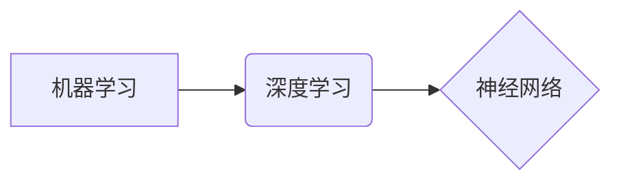

##  1. 背景介绍

### 1.1 人工智能的起源与发展

人工智能(Artificial Intelligence, AI) 的概念最早可以追溯到上世纪50年代，图灵在1950年的论文 "Computing Machinery and Intelligence" 中提出了著名的图灵测试，被认为是人工智能的开山之作。此后，人工智能经历了几次高潮和低谷，直到近年来，随着计算能力的提升、数据的爆炸式增长以及算法的突破，人工智能迎来了第三次发展浪潮，并在各个领域展现出巨大的潜力。

### 1.2 人工智能的定义与分类

人工智能目前还没有一个统一的定义，但普遍认为它是指使机器能够像人一样思考、学习和解决问题的科学和工程领域。根据人工智能的能力强弱，可以将其分为弱人工智能、强人工智能和超人工智能。

* **弱人工智能(Artificial Narrow Intelligence, ANI):**  也被称为狭义人工智能，指的是只能在特定领域或任务中表现出智能的系统，例如图像识别、语音识别等。
* **强人工智能(Artificial General Intelligence, AGI):** 也被称为通用人工智能，指的是能够像人类一样进行思考、学习和解决各种问题的系统，目前还处于研究阶段。
* **超人工智能(Artificial Super Intelligence, ASI):** 指的是在所有方面都超越人类智能的系统，目前还处于科幻阶段。

### 1.3 人工智能的应用领域

人工智能已经渗透到我们生活的方方面面，并在各个领域展现出巨大的应用价值，例如：

* **计算机视觉:** 图像识别、人脸识别、目标检测等。
* **自然语言处理:**  机器翻译、语音识别、文本生成等。
* **数据挖掘与机器学习:**  推荐系统、风险控制、精准营销等。
* **机器人:**  工业机器人、服务机器人、无人驾驶等。

## 2. 核心概念与联系

### 2.1  机器学习

机器学习(Machine Learning, ML)是人工智能的核心领域之一，其主要目标是让机器能够从数据中学习，并自动改进性能。机器学习算法可以根据学习方式的不同分为以下几类:

* **监督学习(Supervised Learning):**  从带有标签的训练数据中学习，并预测未知数据的标签。常见的算法包括线性回归、逻辑回归、支持向量机、决策树等。
* **无监督学习(Unsupervised Learning):** 从没有标签的训练数据中学习，并发现数据中的模式或结构。常见的算法包括聚类算法、降维算法等。
* **强化学习(Reinforcement Learning):**  通过与环境交互学习，并根据环境的反馈调整自身的行为，以获得最大的累积奖励。常见的算法包括Q-learning、SARSA等。

### 2.2 深度学习

深度学习(Deep Learning, DL)是机器学习的一个分支，其核心是使用多层神经网络来学习数据的表示。深度学习在图像识别、语音识别等领域取得了突破性进展，并推动了人工智能的快速发展。

### 2.3 神经网络

神经网络(Neural Network, NN)是一种模拟人脑神经元结构的计算模型，由多个神经元(节点)相互连接组成。每个连接都对应一个权重，表示两个神经元之间连接的强度。神经网络可以通过训练学习到输入数据和输出数据之间的映射关系。

### 2.4  核心概念之间的联系

机器学习、深度学习和神经网络之间存在着密切的联系：

* 深度学习是机器学习的一个分支，其核心是使用多层神经网络来学习数据的表示。
* 神经网络是深度学习的基础，是实现深度学习算法的工具。
* 机器学习为深度学习提供了理论基础和算法框架。

下图展示了机器学习、深度学习和神经网络之间的关系：



## 3. 核心算法原理具体操作步骤

### 3.1 线性回归

#### 3.1.1 原理

线性回归(Linear Regression)是一种用于预测连续目标变量的监督学习算法。它假设目标变量与特征之间存在线性关系，并通过拟合一条直线或超平面来建立模型。

#### 3.1.2 操作步骤

1. **准备数据:** 收集并清洗数据，将特征和目标变量分别存储在矩阵X和向量y中。
2. **初始化模型参数:** 初始化权重向量w和偏置项b。
3. **计算预测值:** 使用模型参数计算预测值:  
   $$
   \hat{y} = Xw + b
   $$
4. **计算损失函数:** 使用均方误差(MSE)计算预测值和真实值之间的差异:
   $$
   J(w,b) = \frac{1}{2m} \sum_{i=1}^{m} (\hat{y}^{(i)} - y^{(i)})^2
   $$
   其中，m表示样本数量。
5. **更新模型参数:** 使用梯度下降算法更新模型参数:
   $$
   w = w - \alpha \frac{\partial J(w,b)}{\partial w}
   $$
   $$
   b = b - \alpha \frac{\partial J(w,b)}{\partial b}
   $$
   其中，α表示学习率。
6. **重复步骤3-5，直到损失函数收敛:**  重复迭代上述步骤，直到损失函数不再显著下降。

#### 3.1.3 代码实例

```python
import numpy as np
from sklearn.linear_model import LinearRegression

# 准备数据
X = np.array([[1, 2], [2, 3], [3, 4], [4, 5]])
y = np.array([3, 5, 7, 9])

# 创建线性回归模型
model = LinearRegression()

# 训练模型
model.fit(X, y)

# 打印模型参数
print("权重:", model.coef_)
print("偏置项:", model.intercept_)

# 预测新数据
X_new = np.array([[5, 6]])
y_pred = model.predict(X_new)

# 打印预测结果
print("预测值:", y_pred)
```

### 3.2 逻辑回归

#### 3.2.1 原理

逻辑回归(Logistic Regression)是一种用于预测离散目标变量的监督学习算法。它使用sigmoid函数将线性回归模型的输出转换为概率值，并通过最大化似然函数来估计模型参数。

#### 3.2.2 操作步骤

1. **准备数据:** 收集并清洗数据，将特征和目标变量分别存储在矩阵X和向量y中。
2. **初始化模型参数:** 初始化权重向量w和偏置项b。
3. **计算预测概率:** 使用sigmoid函数将线性回归模型的输出转换为概率值:
   $$
   P(y=1|x) = \frac{1}{1 + e^{-(w^Tx + b)}}
   $$
4. **计算损失函数:** 使用交叉熵损失函数计算预测概率和真实标签之间的差异:
   $$
   J(w,b) = -\frac{1}{m} \sum_{i=1}^{m} [y^{(i)}log(P(y^{(i)}=1|x^{(i)})) + (1-y^{(i)})log(1-P(y^{(i)}=1|x^{(i)}))]
   $$
5. **更新模型参数:** 使用梯度下降算法更新模型参数:
   $$
   w = w - \alpha \frac{\partial J(w,b)}{\partial w}
   $$
   $$
   b = b - \alpha \frac{\partial J(w,b)}{\partial b}
   $$
6. **重复步骤3-5，直到损失函数收敛:** 重复迭代上述步骤，直到损失函数不再显著下降。

#### 3.2.3 代码实例

```python
import numpy as np
from sklearn.linear_model import LogisticRegression

# 准备数据
X = np.array([[1, 2], [2, 3], [3, 4], [4, 5]])
y = np.array([0, 0, 1, 1])

# 创建逻辑回归模型
model = LogisticRegression()

# 训练模型
model.fit(X, y)

# 打印模型参数
print("权重:", model.coef_)
print("偏置项:", model.intercept_)

# 预测新数据
X_new = np.array([[5, 6]])
y_pred = model.predict(X_new)

# 打印预测结果
print("预测值:", y_pred)
```

## 4. 数学模型和公式详细讲解举例说明

### 4.1  梯度下降算法

梯度下降算法(Gradient Descent)是一种迭代优化算法，用于寻找函数的最小值。其基本思想是沿着函数梯度的反方向不断更新参数，直到找到函数的最小值。

#### 4.1.1  梯度

函数的梯度是一个向量，表示函数在该点变化最快的方向。对于函数 $f(x)$，其在点 $x$ 处的梯度为：

$$
\nabla f(x) = \begin{bmatrix}
\frac{\partial f(x)}{\partial x_1} \\
\frac{\partial f(x)}{\partial x_2} \\
\vdots \\
\frac{\partial f(x)}{\partial x_n}
\end{bmatrix}
$$

#### 4.1.2  梯度下降算法步骤

1. 初始化参数 $x$。
2. 计算函数 $f(x)$ 在点 $x$ 处的梯度 $\nabla f(x)$。
3. 更新参数 $x$:
   $$
   x = x - \alpha \nabla f(x)
   $$
   其中，$\alpha$ 表示学习率，控制每次更新的步长。
4. 重复步骤2-3，直到函数 $f(x)$ 收敛。

#### 4.1.3  举例说明

假设我们要最小化函数 $f(x) = x^2$，其梯度为 $\nabla f(x) = 2x$。

1. 初始化参数 $x = 3$。
2. 计算梯度 $\nabla f(3) = 6$。
3. 更新参数 $x = 3 - 0.1 \times 6 = 2.4$。
4. 重复步骤2-3，直到函数 $f(x)$ 收敛。

### 4.2  交叉熵损失函数

交叉熵损失函数(Cross-Entropy Loss Function)是一种常用的分类问题损失函数。它用于衡量预测概率分布与真实标签分布之间的差异。

#### 4.2.1  定义

对于二分类问题，假设真实标签为 $y \in \{0, 1\}$，预测概率为 $p = P(y=1)$，则交叉熵损失函数为：

$$
L(y, p) = -[y\log(p) + (1-y)\log(1-p)]
$$

#### 4.2.2  性质

* 当预测概率与真实标签一致时，损失函数值为0。
* 当预测概率与真实标签不一致时，损失函数值大于0，且预测概率与真实标签差异越大，损失函数值越大。

#### 4.2.3  举例说明

假设真实标签为 $y=1$，预测概率为 $p=0.8$，则交叉熵损失函数为：

$$
L(1, 0.8) = -[1\log(0.8) + (1-1)\log(1-0.8)] \approx 0.223
$$

## 5. 项目实践：代码实例和详细解释说明

### 5.1  手写数字识别

本节将使用 MNIST 数据集，通过构建一个简单的神经网络来实现手写数字识别。

#### 5.1.1  数据准备

MNIST 数据集包含 60000 张训练图片和 10000 张测试图片，每张图片都是一个 28x28 的灰度图像，代表一个手写数字。

```python
import tensorflow as tf

# 加载 MNIST 数据集
(x_train, y_train), (x_test, y_test) = tf.keras.datasets.mnist.load_data()

# 将像素值归一化到 [0, 1] 区间
x_train = x_train.astype('float32') / 255
x_test = x_test.astype('float32') / 255

# 将标签转换为 one-hot 编码
y_train = tf.keras.utils.to_categorical(y_train, num_classes=10)
y_test = tf.keras.utils.to_categorical(y_test, num_classes=10)
```

#### 5.1.2  构建模型

我们将构建一个包含一个隐藏层的神经网络，隐藏层使用 ReLU 激活函数，输出层使用 softmax 激活函数。

```python
# 创建模型
model = tf.keras.models.Sequential([
  tf.keras.layers.Flatten(input_shape=(28, 28)),
  tf.keras.layers.Dense(128, activation='relu'),
  tf.keras.layers.Dense(10, activation='softmax')
])

# 编译模型
model.compile(optimizer='adam',
              loss='categorical_crossentropy',
              metrics=['accuracy'])
```

#### 5.1.3  训练模型

```python
# 训练模型
model.fit(x_train, y_train, epochs=5)
```

#### 5.1.4  评估模型

```python
# 评估模型
loss, accuracy = model.evaluate(x_test, y_test, verbose=0)
print('Test loss:', loss)
print('Test accuracy:', accuracy)
```

### 5.2  文本情感分类

本节将使用 IMDB 电影评论数据集，通过构建一个循环神经网络(RNN)来实现文本情感分类。

#### 5.2.1  数据准备

IMDB 数据集包含 25000 条训练评论和 25000 条测试评论，每条评论都被标记为正面或负面。

```python
import tensorflow as tf

# 加载 IMDB 数据集
(x_train, y_train), (x_test, y_test) = tf.keras.datasets.imdb.load_data(num_words=10000)

# 将评论填充到相同长度
x_train = tf.keras.preprocessing.sequence.pad_sequences(x_train, maxlen=256)
x_test = tf.keras.preprocessing.sequence.pad_sequences(x_test, maxlen=256)
```

#### 5.2.2  构建模型

我们将构建一个包含一个 LSTM 层的 RNN，输出层使用 sigmoid 激活函数。

```python
# 创建模型
model = tf.keras.models.Sequential([
  tf.keras.layers.Embedding(10000, 128),
  tf.keras.layers.LSTM(128),
  tf.keras.layers.Dense(1, activation='sigmoid')
])

# 编译模型
model.compile(optimizer='adam',
              loss='binary_crossentropy',
              metrics=['accuracy'])
```

#### 5.2.3  训练模型

```python
# 训练模型
model.fit(x_train, y_train, epochs=5)
```

#### 5.2.4  评估模型

```python
# 评估模型
loss, accuracy = model.evaluate(x_test, y_test, verbose=0)
print('Test loss:', loss)
print('Test accuracy:', accuracy)
```

## 6. 实际应用场景

### 6.1  图像识别

* **人脸识别:**  用于身份验证、人脸支付、安防监控等领域。
* **目标检测:**  用于自动驾驶、智能安防、工业自动化等领域。
* **医学影像分析:**  用于辅助诊断、疾病预测、个性化治疗等领域。

### 6.2  自然语言处理

* **机器翻译:**  用于跨语言交流、信息获取、文化传播等领域。
* **语音识别:**  用于智能助手、语音输入、智能家居等领域。
* **文本生成:**  用于自动写作、聊天机器人、智能客服等领域。

### 6.3  数据挖掘与机器学习

* **推荐系统:**  用于电商平台、社交网络、内容平台等领域。
* **风险控制:**  用于金融、保险、安全等领域。
* **精准营销:**  用于广告投放、用户画像、市场分析等领域。

## 7. 工具和资源推荐

### 7.1  编程语言

* **Python:**  Python 拥有丰富的机器学习和深度学习库，例如 NumPy、SciPy、Pandas、Scikit-learn、TensorFlow、PyTorch 等，是人工智能领域最流行的编程语言。

### 7.2  深度学习框架

* **TensorFlow:**  由 Google 开发的开源深度学习框架，支持多种编程语言，拥有丰富的模型库和工具。
* **PyTorch:**  由 Facebook 开发的开源深度学习框架，以其灵活性和易用性著称，受到学术界和工业界的广泛欢迎。

### 7.3  在线课程

* **吴恩达机器学习课程:**  Coursera 上的经典机器学习课程，涵盖了机器学习的基础知识和常用算法。
* **斯坦福 CS231n 卷积神经网络课程:**  斯坦福大学的深度学习课程，重点讲解卷积神经网络的原理和应用。

## 8. 总结：未来发展趋势与挑战

### 8.1  未来发展趋势

* **更强大的计算能力:**  随着硬件技术的不断发展，人工智能将拥有更强大的计算能力，能够处理更大规模的数据和更复杂的模型。
* **更先进的算法:**  研究人员将不断探索新的