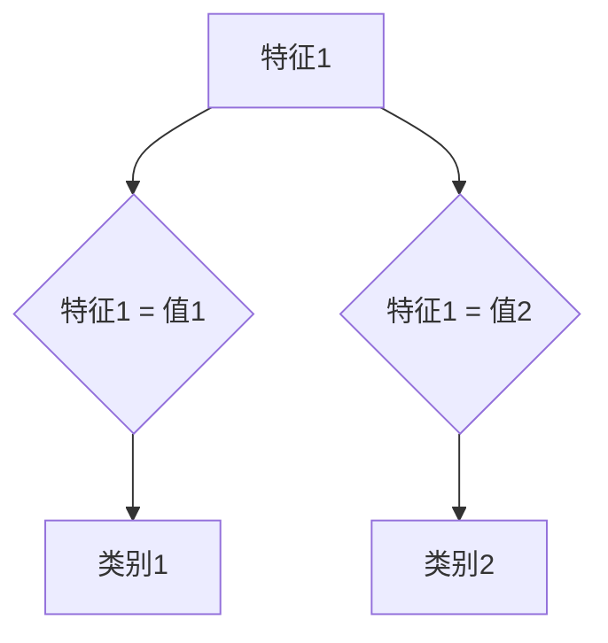

## 1. 背景介绍

### 1.1 机器学习中的分类问题

在机器学习领域，分类问题是最常见的任务之一。其目标是根据一组特征将数据点分配到预定义的类别中。例如，我们可以根据邮件的内容将其分类为垃圾邮件或非垃圾邮件，或者根据患者的症状将其分类为患有某种疾病或未患病。

### 1.2 随机森林算法的优势

随机森林是一种强大的分类算法，它具有以下优点：

* **高准确率:** 随机森林通常能够实现较高的分类准确率。
* **鲁棒性:** 随机森林对噪声和异常值具有较强的鲁棒性。
* **易于使用:** 随机森林算法易于理解和实现。
* **可扩展性:** 随机森林可以轻松地扩展到大型数据集。

### 1.3 本文的结构

本文将深入探讨随机森林算法，并通过一个实例演示如何使用随机森林提高分类准确率。文章结构如下：

* **背景介绍:** 介绍机器学习中的分类问题以及随机森林算法的优势。
* **核心概念与联系:** 解释随机森林算法的核心概念，包括决策树、集成学习和随机性。
* **核心算法原理具体操作步骤:** 详细介绍随机森林算法的训练和预测过程。
* **数学模型和公式详细讲解举例说明:**  使用数学公式和示例解释随机森林算法的原理。
* **项目实践：代码实例和详细解释说明:**  提供 Python 代码示例，演示如何使用随机森林算法进行分类。
* **实际应用场景:**  介绍随机森林算法在实际应用中的案例。
* **工具和资源推荐:**  推荐一些用于实现和应用随机森林算法的工具和资源。
* **总结：未来发展趋势与挑战:**  总结随机森林算法的优势和局限性，并展望其未来发展趋势。
* **附录：常见问题与解答:**  回答一些关于随机森林算法的常见问题。


## 2. 核心概念与联系

### 2.1 决策树

决策树是一种树形结构，它用于对数据进行分类。每个内部节点表示一个特征，每个分支代表该特征的一个可能值，每个叶节点表示一个类别。



### 2.2 集成学习

集成学习是一种机器学习方法，它结合多个弱学习器来构建一个强学习器。随机森林是一种集成学习算法，它使用多个决策树来进行分类。

### 2.3 随机性

随机森林算法引入了两种随机性：

* **特征随机性:** 在构建每个决策树时，随机选择一部分特征进行分割。
* **数据随机性:** 使用bootstrap sampling从原始数据集中随机抽取样本，构建每个决策树。

## 3. 核心算法原理具体操作步骤

### 3.1 训练过程

1. **构建多个决策树:**  使用bootstrap sampling从原始数据集中随机抽取多个样本，并为每个样本构建一个决策树。
2. **特征随机性:**  在构建每个决策树时，随机选择一部分特征进行分割。
3. **树的生长:**  递归地选择最佳特征进行分割，直到满足停止条件。

### 3.2 预测过程

1. **输入数据:**  将待预测的数据输入到每个决策树中。
2. **获取预测结果:**  每个决策树都会输出一个预测结果。
3. **投票机制:**  根据所有决策树的预测结果进行投票，选择票数最多的类别作为最终预测结果。

## 4. 数学模型和公式详细讲解举例说明

### 4.1 基尼不纯度

基尼不纯度用于衡量一个节点的不纯度。假设一个节点包含 $C$ 个类别，每个类别出现的概率为 $p_i$，则该节点的基尼不纯度为：

$$
Gini(p) = 1 - \sum_{i=1}^{C} p_i^2
$$

### 4.2 信息增益

信息增益用于衡量一个特征对分类的贡献程度。假设特征 $A$ 将一个节点分割成 $V$ 个子节点，则该特征的信息增益为：

$$
Gain(A) = Gini(p) - \sum_{v=1}^{V} \frac{|D_v|}{|D|} Gini(p_v)
$$

其中，$|D|$ 表示该节点包含的数据点数量，$|D_v|$ 表示第 $v$ 个子节点包含的数据点数量，$p_v$ 表示第 $v$ 个子节点中每个类别出现的概率。

### 4.3 示例

假设我们有一个数据集，包含三个特征：颜色、形状和大小，以及两个类别：苹果和橘子。

| 颜色 | 形状 | 大小 | 类别 |
|---|---|---|---|
| 红色 | 圆形 | 小 | 苹果 |
| 绿色 | 圆形 | 小 | 橘子 |
| 红色 | 椭圆形 | 大 | 苹果 |
| 绿色 | 椭圆形 | 大 | 橘子 |

我们可以计算每个特征的基尼不纯度和信息增益，并选择信息增益最大的特征作为根节点。

## 5. 项目实践：代码实例和详细解释说明

```python
from sklearn.ensemble import RandomForestClassifier
from sklearn.datasets import load_iris
from sklearn.model_selection import train_test_split

# 加载数据集
iris = load_iris()
X = iris.data
y = iris.target

# 划分训练集和测试集
X_train, X_test, y_train, y_test = train_test_split(X, y, test_size=0.2)

# 创建随机森林模型
rf = RandomForestClassifier(n_estimators=100)

# 训练模型
rf.fit(X_train, y_train)

# 预测测试集
y_pred = rf.predict(X_test)

# 计算准确率
accuracy = rf.score(X_test, y_test)
print("Accuracy:", accuracy)
```

**代码解释:**

* `sklearn.ensemble.RandomForestClassifier`: 随机森林分类器类。
* `sklearn.datasets.load_iris`: 加载鸢尾花数据集。
* `sklearn.model_selection.train_test_split`: 将数据集划分为训练集和测试集。
* `n_estimators`: 决策树的数量。
* `fit`: 训练模型。
* `predict`: 预测测试集。
* `score`: 计算准确率。

## 6. 实际应用场景

随机森林算法广泛应用于各个领域，包括：

* **金融:**  信用评分、欺诈检测
* **医疗:**  疾病诊断、药物研发
* **电商:**  推荐系统、客户细分
* **图像识别:**  目标检测、图像分类

## 7. 工具和资源推荐

* **Scikit-learn:**  Python 机器学习库，提供了随机森林算法的实现。
* **TensorFlow:**  谷歌开源机器学习平台，提供了随机森林算法的实现。
* **XGBoost:**  梯度提升决策树库，提供了随机森林算法的实现。

## 8. 总结：未来发展趋势与挑战

随机森林是一种强大且易于使用的分类算法，它在许多应用中都取得了成功。然而，随机森林也有一些局限性，例如：

* **黑盒模型:**  随机森林是一个黑盒模型，难以解释其预测结果。
* **过拟合:**  如果决策树的数量过多，随机森林可能会过拟合训练数据。

未来，随机森林算法的研究方向包括：

* **可解释性:**  开发更易于解释的随机森林模型。
* **鲁棒性:**  提高随机森林算法对噪声和异常值的鲁棒性。
* **效率:**  提高随机森林算法的训练和预测效率。

## 9. 附录：常见问题与解答

**Q: 随机森林算法如何处理缺失值？**

A: 随机森林算法可以使用代理分割来处理缺失值。代理分割是指使用与缺失特征相关的其他特征来代替缺失特征进行分割。

**Q: 随机森林算法如何防止过拟合？**

A: 可以通过以下方法防止随机森林算法过拟合：

* **减少决策树的数量:**  减少决策树的数量可以降低模型的复杂度。
* **限制树的深度:**  限制树的深度可以防止决策树过度生长。
* **使用正则化:**  使用正则化可以限制模型的复杂度。


## 10. 后记

本文详细介绍了随机森林算法的原理、应用和未来发展趋势。希望本文能够帮助读者更好地理解和应用随机森林算法。
