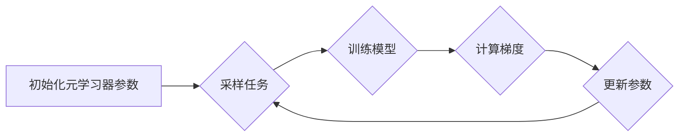

# 元学习 (Meta Learning) 原理与代码实例讲解

作者：禅与计算机程序设计艺术

## 1. 背景介绍

### 1.1 机器学习的局限性

传统的机器学习方法通常需要大量的训练数据才能获得良好的性能。然而，在许多实际应用中，我们可能只有有限的标记数据，或者需要快速适应新的任务。例如，在医疗诊断中，我们可能只有少数患者的样本，而在机器人控制中，机器人需要快速学习新的操作技能。

### 1.2 元学习的引入

元学习旨在解决这些问题，它是一种“学习如何学习”的方法。元学习的目标是训练一个模型，使其能够快速适应新的任务，而无需大量的训练数据。元学习可以被看作是一种更高层次的学习，它学习的是如何学习，而不是学习特定的任务。

## 2. 核心概念与联系

### 2.1 元学习的核心概念

* **任务 (Task)**：机器学习中的一个具体问题，例如图像分类、文本生成等。
* **元学习器 (Meta-learner)**：用于学习如何学习的模型，它接收多个任务作为输入，并输出一个可以快速适应新任务的模型。
* **元训练集 (Meta-training set)**：包含多个任务的训练集，用于训练元学习器。
* **元测试集 (Meta-test set)**：包含一些新的任务，用于评估元学习器的性能。

### 2.2 元学习与传统机器学习的联系

元学习可以被看作是传统机器学习的一种扩展。在传统机器学习中，我们训练一个模型来解决一个特定的任务。而在元学习中，我们训练一个模型来学习如何解决多个任务。

## 3. 核心算法原理具体操作步骤

### 3.1 基于梯度的元学习 (Gradient-based Meta-learning)

基于梯度的元学习是最流行的元学习方法之一。它的核心思想是使用梯度下降来更新元学习器的参数，使其能够快速适应新的任务。

**具体操作步骤：**

1. 初始化元学习器的参数。
2. 从元训练集中采样一个任务。
3. 使用传统的机器学习方法训练一个模型来解决该任务。
4. 计算元学习器的梯度，并更新其参数。
5. 重复步骤 2-4，直到元学习器收敛。

**算法流程图：**



### 3.2 基于度量的元学习 (Metric-based Meta-learning)

基于度量的元学习方法通过学习一个度量空间来区分不同的任务。

**具体操作步骤：**

1. 初始化度量空间。
2. 从元训练集中采样一个任务。
3. 将该任务中的数据映射到度量空间中。
4. 使用基于距离的分类器对数据进行分类。
5. 更新度量空间，使其能够更好地区分不同的任务。
6. 重复步骤 2-5，直到度量空间收敛。

## 4. 数学模型和公式详细讲解举例说明

### 4.1 基于梯度的元学习

假设我们有一个元学习器 $f_{\theta}$，其中 $\theta$ 是元学习器的参数。我们希望训练这个元学习器，使其能够快速适应新的任务。

给定一个任务 $T$，我们可以使用传统的机器学习方法训练一个模型 $g_{\phi}$ 来解决该任务，其中 $\phi$ 是模型的参数。我们可以使用损失函数 $L(g_{\phi}, T)$ 来评估模型的性能。

元学习器的目标是找到一组参数 $\theta$，使得模型 $g_{\phi}$ 能够快速适应新的任务。我们可以使用以下公式来更新元学习器的参数：

$$
\theta \leftarrow \theta - \alpha \nabla_{\theta} L(g_{\phi}, T)
$$

其中 $\alpha$ 是学习率。

**举例说明：**

假设我们有一个图像分类任务，我们希望训练一个元学习器，使其能够快速适应新的图像类别。我们可以使用以下步骤来训练元学习器：

1. 初始化元学习器的参数。
2. 从元训练集中采样一个任务，例如识别猫和狗的图像。
3. 使用传统的机器学习方法训练一个模型来解决该任务。
4. 计算元学习器的梯度，并更新其参数。
5. 重复步骤 2-4，直到元学习器收敛。

### 4.2 基于度量的元学习

在基于度量的元学习中，我们学习一个度量空间 $M$，它可以用来区分不同的任务。我们可以使用以下公式来计算两个数据点 $x$ 和 $y$ 之间的距离：

$$
d_M(x, y) = ||x - y||_M
$$

其中 $||.||_M$ 表示在度量空间 $M$ 中的范数。

**举例说明：**

假设我们有一个少样本学习任务，我们希望训练一个元学习器，使其能够从少数样本中学习新的类别。我们可以使用以下步骤来训练元学习器：

1. 初始化度量空间。
2. 从元训练集中采样一个任务，例如识别新的鸟类类别。
3. 将该任务中的数据映射到度量空间中。
4. 使用基于距离的分类器对数据进行分类。
5. 更新度量空间，使其能够更好地区分不同的鸟类类别。
6. 重复步骤 2-5，直到度量空间收敛。

## 5. 项目实践：代码实例和详细解释说明

### 5.1 基于梯度的元学习：Omniglot 字符识别

**代码实例：**

```python
import torch
import torch.nn as nn
import torch.nn.functional as F
from torch.utils.data import DataLoader
from torchvision import datasets, transforms

# 定义元学习器
class MetaLearner(nn.Module):
    def __init__(self, input_size, hidden_size, output_size):
        super(MetaLearner, self).__init__()
        self.lstm = nn.LSTM(input_size, hidden_size)
        self.fc = nn.Linear(hidden_size, output_size)

    def forward(self, x):
        output, (hidden, cell) = self.lstm(x)
        output = self.fc(hidden[-1])
        return output

# 定义数据集
class OmniglotDataset(torch.utils.data.Dataset):
    def __init__(self, data_dir, transform=None):
        self.data_dir = data_dir
        self.transform = transform
        self.data = []
        self.targets = []

        # 加载数据
        # ...

    def __getitem__(self, index):
        data, target = self.data[index], self.targets[index]
        if self.transform is not None:
            data = self.transform(data)
        return data, target

    def __len__(self):
        return len(self.data)

# 定义训练函数
def train(meta_learner, optimizer, train_loader, device):
    meta_learner.train()
    for batch_idx, (data, target) in enumerate(train_loader):
        data, target = data.to(device), target.to(device)

        # 采样任务
        # ...

        # 训练模型
        # ...

        # 计算元学习器的梯度
        # ...

        # 更新元学习器的参数
        optimizer.step()

# 定义测试函数
def test(meta_learner, test_loader, device):
    meta_learner.eval()
    correct = 0
    total = 0
    with torch.no_grad():
        for batch_idx, (data, target) in enumerate(test_loader):
            data, target = data.to(device), target.to(device)

            # 采样任务
            # ...

            # 预测结果
            output = meta_learner(data)
            pred = output.argmax(dim=1, keepdim=True)

            # 计算准确率
            correct += pred.eq(target.view_as(pred)).sum().item()
            total += target.size(0)

    accuracy = 100. * correct / total
    return accuracy

# 设置参数
input_size = 784
hidden_size = 128
output_size = 20
learning_rate = 0.001
batch_size = 32
epochs = 10

# 初始化元学习器
meta_learner = MetaLearner(input_size, hidden_size, output_size)

# 初始化优化器
optimizer = torch.optim.Adam(meta_learner.parameters(), lr=learning_rate)

# 加载数据集
train_dataset = OmniglotDataset(data_dir='./data', transform=transforms.ToTensor())
train_loader = DataLoader(train_dataset, batch_size=batch_size, shuffle=True)

test_dataset = OmniglotDataset(data_dir='./data', transform=transforms.ToTensor())
test_loader = DataLoader(test_dataset, batch_size=batch_size, shuffle=False)

# 训练元学习器
for epoch in range(epochs):
    train(meta_learner, optimizer, train_loader, device)

# 测试元学习器
accuracy = test(meta_learner, test_loader, device)
print('Accuracy: {:.2f}%'.format(accuracy))
```

**代码解释：**

* `MetaLearner` 类定义了元学习器，它使用 LSTM 网络来学习如何学习。
* `OmniglotDataset` 类定义了 Omniglot 数据集，它包含 1623 个不同的字符，每个字符有 20 个不同的样本。
* `train` 函数用于训练元学习器，它从元训练集中采样任务，训练模型，计算元学习器的梯度，并更新元学习器的参数。
* `test` 函数用于测试元学习器，它从元测试集中采样任务，预测结果，并计算准确率。

### 5.2 基于度量的元学习：MiniImageNet 图像分类

**代码实例：**

```python
import torch
import torch.nn as nn
import torch.nn.functional as F
from torch.utils.data import DataLoader
from torchvision import datasets, transforms

# 定义度量空间
class MetricSpace(nn.Module):
    def __init__(self, input_size, output_size):
        super(MetricSpace, self).__init__()
        self.fc = nn.Linear(input_size, output_size)

    def forward(self, x):
        output = self.fc(x)
        return output

# 定义数据集
class MiniImageNetDataset(torch.utils.data.Dataset):
    def __init__(self, data_dir, transform=None):
        self.data_dir = data_dir
        self.transform = transform
        self.data = []
        self.targets = []

        # 加载数据
        # ...

    def __getitem__(self, index):
        data, target = self.data[index], self.targets[index]
        if self.transform is not None:
            data = self.transform(data)
        return data, target

    def __len__(self):
        return len(self.data)

# 定义训练函数
def train(metric_space, optimizer, train_loader, device):
    metric_space.train()
    for batch_idx, (data, target) in enumerate(train_loader):
        data, target = data.to(device), target.to(device)

        # 采样任务
        # ...

        # 将数据映射到度量空间中
        embeddings = metric_space(data)

        # 使用基于距离的分类器对数据进行分类
        # ...

        # 更新度量空间
        optimizer.step()

# 定义测试函数
def test(metric_space, test_loader, device):
    metric_space.eval()
    correct = 0
    total = 0
    with torch.no_grad():
        for batch_idx, (data, target) in enumerate(test_loader):
            data, target = data.to(device), target.to(device)

            # 采样任务
            # ...

            # 将数据映射到度量空间中
            embeddings = metric_space(data)

            # 使用基于距离的分类器对数据进行分类
            # ...

            # 计算准确率
            correct += pred.eq(target.view_as(pred)).sum().item()
            total += target.size(0)

    accuracy = 100. * correct / total
    return accuracy

# 设置参数
input_size = 128
output_size = 64
learning_rate = 0.001
batch_size = 32
epochs = 10

# 初始化度量空间
metric_space = MetricSpace(input_size, output_size)

# 初始化优化器
optimizer = torch.optim.Adam(metric_space.parameters(), lr=learning_rate)

# 加载数据集
train_dataset = MiniImageNetDataset(data_dir='./data', transform=transforms.ToTensor())
train_loader = DataLoader(train_dataset, batch_size=batch_size, shuffle=True)

test_dataset = MiniImageNetDataset(data_dir='./data', transform=transforms.ToTensor())
test_loader = DataLoader(test_dataset, batch_size=batch_size, shuffle=False)

# 训练度量空间
for epoch in range(epochs):
    train(metric_space, optimizer, train_loader, device)

# 测试度量空间
accuracy = test(metric_space, test_loader, device)
print('Accuracy: {:.2f}%'.format(accuracy))
```

**代码解释：**

* `MetricSpace` 类定义了度量空间，它使用一个线性层将数据映射到一个低维空间中。
* `MiniImageNetDataset` 类定义了 MiniImageNet 数据集，它包含 100 个不同的类别，每个类别有 600 个不同的样本。
* `train` 函数用于训练度量空间，它从元训练集中采样任务，将数据映射到度量空间中，使用基于距离的分类器对数据进行分类，并更新度量空间。
* `test` 函数用于测试度量空间，它从元测试集中采样任务，将数据映射到度量空间中，使用基于距离的分类器对数据进行分类，并计算准确率。

## 6. 实际应用场景

### 6.1 少样本学习 (Few-shot Learning)

少样本学习是指从少量样本中学习新的类别。例如，在图像分类中，我们可能只有少数样本可以用来训练模型识别新的物体类别。元学习可以用来解决少样本学习问题，因为它可以训练一个模型，使其能够快速适应新的类别，而无需大量的训练数据。

### 6.2 领域自适应 (Domain Adaptation)

领域自适应是指将一个模型从一个领域迁移到另一个领域。例如，我们可能有一个在 ImageNet 数据集上训练的图像分类模型，我们希望将其迁移到一个新的数据集上，例如医学图像数据集。元学习可以用来解决领域自适应问题，因为它可以训练一个模型，使其能够快速适应新的领域，而无需大量的训练数据。

### 6.3 强化学习 (Reinforcement Learning)

在强化学习中，智能体通过与环境交互来学习。元学习可以用来训练一个智能体，使其能够快速适应新的环境，而无需大量的训练数据。

## 7. 工具和资源推荐

### 7.1 元学习框架

* **PyTorch**：PyTorch 是一个流行的深度学习框架，它提供了许多用于元学习的工具和库。
* **TensorFlow**：TensorFlow 是另一个流行的深度学习框架，它也提供了许多用于元学习的工具和库。

### 7.2 元学习数据集

* **Omniglot**：Omniglot 数据集是一个流行的少样本学习数据集，它包含 1623 个不同的字符，每个字符有 20 个不同的样本。
* **MiniImageNet**：MiniImageNet 数据集是一个流行的少样本学习数据集，它包含 100 个不同的类别，每个类别有 600 个不同的样本。

### 7.3 元学习论文

* **MAML: Model-Agnostic Meta-Learning for Fast Adaptation of Deep Networks**
* **Matching Networks for One Shot Learning**
* **Prototypical Networks for Few-shot Learning**

## 8. 总结：未来发展趋势与挑战

### 8.1 未来发展趋势

* **更快的适应速度**：元学习的目标是训练一个模型，使其能够快速适应新的任务。未来，我们将看到更快的适应速度，这将使得元学习在更多应用中得到应用。
* **更强的泛化能力**：元学习的目标是训练一个模型，使其能够泛化到新的任务。未来，我们将看到更强的泛化能力，这将使得元学习在更多领域得到应用。
* **更广泛的应用**：元学习已经应用于少样本学习、领域自适应和强化学习等领域。未来，我们将看到元学习在更多领域得到应用，例如自然语言处理、计算机视觉和机器人控制。

### 8.2 挑战

* **数据效率**：元学习通常需要大量的训练数据才能获得良好的性能。提高数据效率是元学习的一个重要挑战。
* **可解释性**：元学习模型通常很复杂，难以解释。提高可解释性是元学习的另一个重要挑战。
* **可扩展性**：元学习模型通常需要大量的计算资源来训练。提高可扩展性是元学习的另一个重要挑战。

## 9. 附录：常见问题与解答

### 9.1 什么是元学习？

元学习是一种“学习如何学习”的方法。元学习的目标是训练一个模型，使其能够快速适应新的任务，而无需大量的训练数据。

### 