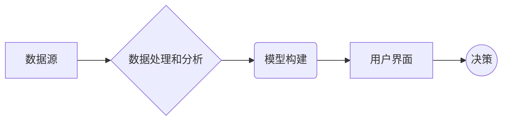

## 1. 背景介绍

### 1.1 决策支持系统的演变

决策支持系统 (DSS) 的概念最早可以追溯到 20 世纪 60 年代，经历了多个发展阶段：

* **早期 DSS (1960s-1970s):** 主要关注于提供数据查询和分析功能，帮助决策者获取信息。
* **模型驱动 DSS (1980s-1990s):** 引入了数学模型和模拟技术，帮助决策者评估不同方案的影响。
* **Web-based DSS (2000s):** 随着互联网技术的普及，DSS 开始采用 Web 技术，提供更便捷的访问和协作功能。
* **智能 DSS (2010s-Present):** 集成了人工智能 (AI) 技术，如机器学习、深度学习和自然语言处理，使 DSS 能够从数据中学习，提供更智能的决策支持。

### 1.2 AI 驱动的决策支持系统

AI 驱动的 DSS 代表了决策支持系统发展的新阶段，其核心在于利用 AI 技术增强 DSS 的能力，使其能够：

* **自动处理和分析大量数据：** AI 算法可以高效地处理和分析海量数据，识别数据中的模式和趋势，为决策提供更深入的洞察。
* **提供预测和建议：** 基于历史数据和预测模型，AI 可以预测未来趋势，并为决策者提供个性化的建议。
* **自动化决策流程：** 在某些场景下，AI 可以根据预设规则和模型自动执行决策，提高效率并减少人为错误。

### 1.3 本文的目标

本文旨在探讨 AI 如何 revolutionize 决策支持系统，从数据中提取洞见，并为决策者提供更有效的支持。文章将涵盖以下主题：

* AI 驱动的 DSS 的核心概念和联系
* 常用的 AI 算法原理及操作步骤
* 相关的数学模型和公式
* 项目实践：代码实例和详细解释说明
* AI 驱动的 DSS 的实际应用场景
* 工具和资源推荐
* 未来发展趋势与挑战
* 常见问题与解答

## 2. 核心概念与联系

### 2.1 数据、信息、知识和洞察

* **数据:**  原始的、未经处理的事实和数字。
* **信息:**  经过处理和组织的数据，赋予了上下文和意义。
* **知识:**  对信息进行解释和理解，形成可用于决策的规则和模式。
* **洞察:**  对知识进行深入分析，发现隐藏的趋势、关系和见解，为决策提供指导。

AI 驱动的 DSS 的目标是从数据中提取洞察，并将其转化为可操作的决策。

### 2.2 AI 驱动的 DSS 的核心组件

* **数据源:**  DSS 依赖于各种数据源，包括内部数据库、外部数据源、传感器数据等。
* **数据处理和分析:**  AI 算法用于处理和分析数据，提取有价值的信息和模式。
* **模型构建:**  基于数据分析结果，构建预测模型，用于预测未来趋势和评估不同方案的影响。
* **用户界面:**  提供用户友好的界面，方便用户与 DSS 交互，获取信息和洞察。

### 2.3 核心概念之间的联系

下图展示了 AI 驱动的 DSS 的核心概念之间的联系：



## 3. 核心算法原理具体操作步骤

### 3.1 机器学习

机器学习 (ML) 是一类 AI 算法，其核心在于从数据中学习，并构建模型用于预测或决策。常用的 ML 算法包括：

* **监督学习:**  使用带有标签的训练数据，学习输入和输出之间的映射关系，用于预测新数据的输出。例如，线性回归、逻辑回归、支持向量机等。
* **无监督学习:**  使用未标记的数据，发现数据中的模式和结构。例如，聚类算法、主成分分析等。
* **强化学习:**  通过试错学习，在与环境交互的过程中优化决策策略。

### 3.2 深度学习

深度学习 (DL) 是一种特殊的 ML 算法，其核心在于使用多层神经网络，学习数据中的复杂特征表示。常用的 DL 算法包括：

* **卷积神经网络 (CNN):** 用于图像识别、目标检测等。
* **循环神经网络 (RNN):** 用于自然语言处理、时间序列预测等。

### 3.3 自然语言处理

自然语言处理 (NLP) 是一类 AI 技术，用于处理和理解人类语言。常用的 NLP 技术包括：

* **文本分类:**  将文本数据分类到预定义的类别中。
* **情感分析:**  分析文本数据中的情感倾向。
* **机器翻译:**  将一种语言的文本翻译成另一种语言。

### 3.4 算法操作步骤

以监督学习为例，其操作步骤如下：

1. **数据准备:**  收集、清洗和预处理数据。
2. **特征工程:**  从数据中提取 relevant 特征，用于模型训练。
3. **模型选择:**  根据数据特点和应用场景，选择合适的 ML 算法。
4. **模型训练:**  使用训练数据训练模型，调整模型参数。
5. **模型评估:**  使用测试数据评估模型性能，例如准确率、召回率等。
6. **模型部署:**  将训练好的模型部署到实际应用中，用于预测或决策。

## 4. 数学模型和公式详细讲解举例说明

### 4.1 线性回归

线性回归是一种常用的监督学习算法，用于预测连续值输出。其数学模型如下：

$$
y = \beta_0 + \beta_1 x_1 + \beta_2 x_2 + ... + \beta_n x_n + \epsilon
$$

其中，$y$ 是预测值，$x_1, x_2, ..., x_n$ 是输入特征，$\beta_0, \beta_1, \beta_2, ..., \beta_n$ 是模型参数，$\epsilon$ 是误差项。

**例子:**  预测房屋价格，输入特征包括房屋面积、卧室数量、地理位置等。

### 4.2 逻辑回归

逻辑回归是一种常用的监督学习算法，用于预测二分类输出。其数学模型如下：

$$
p = \frac{1}{1 + e^{-(\beta_0 + \beta_1 x_1 + \beta_2 x_2 + ... + \beta_n x_n)}}
$$

其中，$p$ 是预测概率，$x_1, x_2, ..., x_n$ 是输入特征，$\beta_0, \beta_1, \beta_2, ..., \beta_n$ 是模型参数。

**例子:**  预测客户是否会购买某个产品，输入特征包括客户年龄、收入、购买历史等。

## 5. 项目实践：代码实例和详细解释说明

### 5.1 Python 代码实例

以下是一个使用 Python 和 scikit-learn 库实现线性回归的代码实例：

```python
import pandas as pd
from sklearn.linear_model import LinearRegression
from sklearn.model_selection import train_test_split
from sklearn.metrics import mean_squared_error

# 读取数据
data = pd.read_csv("housing_data.csv")

# 划分训练集和测试集
X = data.drop("price", axis=1)
y = data["price"]
X_train, X_test, y_train, y_test = train_test_split(X, y, test_size=0.2)

# 创建线性回归模型
model = LinearRegression()

# 训练模型
model.fit(X_train, y_train)

# 预测测试集
y_pred = model.predict(X_test)

# 评估模型性能
mse = mean_squared_error(y_test, y_pred)
print("Mean Squared Error:", mse)
```

### 5.2 代码解释

* **导入库:**  导入 pandas、scikit-learn 和 metrics 库。
* **读取数据:**  使用 pandas 读取 CSV 格式的数据文件。
* **划分训练集和测试集:**  使用 `train_test_split` 函数将数据划分为训练集和测试集。
* **创建模型:**  使用 `LinearRegression()` 创建线性回归模型。
* **训练模型:**  使用 `fit` 方法训练模型，将训练数据传入模型。
* **预测测试集:**  使用 `predict` 方法预测测试集的输出。
* **评估模型性能:**  使用 `mean_squared_error` 函数计算均方误差，评估模型性能。

## 6. 实际应用场景

AI 驱动的 DSS 已经在各个领域得到广泛应用，例如：

* **金融:**  风险评估、欺诈检测、投资决策
* **医疗:**  疾病诊断、治疗方案推荐、药物研发
* **零售:**  需求预测、库存管理、个性化推荐
* **制造:**  生产计划、质量控制、设备维护
* **教育:**  个性化学习、学生评估、课程推荐

## 7. 工具和资源推荐

### 7.1 Python 库

* **scikit-learn:**  用于机器学习的 Python 库，提供了各种 ML 算法和工具。
* **TensorFlow:**  用于深度学习的 Python 库，提供了灵活的框架和丰富的功能。
* **PyTorch:**  用于深度学习的 Python 库，提供了动态计算图和易用性。
* **NLTK:**  用于自然语言处理的 Python 库，提供了各种 NLP 技术和资源。

### 7.2 云平台

* **Amazon Web Services (AWS):**  提供各种 AI/ML 服务，例如 Amazon SageMaker、Amazon Rekognition 等。
* **Microsoft Azure:**  提供各种 AI/ML 服务，例如 Azure Machine Learning、Azure Cognitive Services 等。
* **Google Cloud Platform (GCP):**  提供各种 AI/ML 服务，例如 Google Cloud AI Platform、Google Cloud Vision API 等。

## 8. 总结：未来发展趋势与挑战

### 8.1 未来发展趋势

* **更智能的 DSS:**  随着 AI 技术的不断发展，DSS 将变得更加智能，能够处理更复杂的数据，提供更准确的预测和建议。
* **个性化 DSS:**  DSS 将更加关注用户的个性化需求，提供定制化的决策支持。
* **自动化 DSS:**  DSS 将更加自动化，能够自动执行决策，提高效率并减少人为错误。

### 8.2 面临的挑战

* **数据质量:**  DSS 的性能依赖于数据的质量，数据缺失、错误或不一致都会影响 DSS 的准确性和可靠性。
* **模型解释性:**  AI 模型通常是黑盒模型，难以解释其决策过程，这可能导致用户对 DSS 的信任度降低。
* **伦理问题:**  AI 驱动的 DSS 的应用可能会引发伦理问题，例如算法偏差、数据隐私等。

## 9. 附录：常见问题与解答

### 9.1 AI 驱动的 DSS 与传统 DSS 有什么区别？

AI 驱动的 DSS 利用 AI 技术增强了传统 DSS 的能力，使其能够自动处理和分析大量数据、提供预测和建议、自动化决策流程。

### 9.2 如何选择合适的 AI 算法？

选择 AI 算法需要考虑数据特点、应用场景、算法性能等因素。例如，对于预测连续值输出，可以使用线性回归；对于预测二分类输出，可以使用逻辑回归。

### 9.3 如何评估 AI 驱动的 DSS 的性能？

可以使用各种指标评估 AI 驱动的 DSS 的性能，例如准确率、召回率、F1 值等。

### 9.4 AI 驱动的 DSS 的应用有哪些伦理问题？

AI 驱动的 DSS 的应用可能会引发算法偏差、数据隐私等伦理问题。需要采取措施 mitigate 这些问题，例如使用公平的算法、保护用户隐私等。
