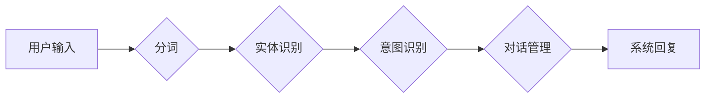

## 分词在智能对话系统中的优化策略

作者：禅与计算机程序设计艺术

## 1. 背景介绍

### 1.1 智能对话系统的兴起与挑战

近年来，随着人工智能技术的快速发展，智能对话系统在各个领域得到了广泛应用，例如智能客服、智能助手、聊天机器人等。对话系统旨在模拟人类的语言交互过程，使用户能够以自然语言的方式与计算机进行交流。然而，构建一个高效、自然、流畅的智能对话系统仍然面临着诸多挑战，其中一个关键问题就是如何准确地理解用户的意图。

### 1.2 分词在自然语言处理中的重要性

自然语言处理（NLP）是人工智能领域的一个重要分支，旨在使计算机能够理解和处理人类语言。分词是 NLP 中的一项基础性任务，它将连续的文本序列分割成一个个独立的词语或语素单元。在中文等没有天然词语边界的语言中，分词尤为重要，因为它直接影响着后续的词性标注、句法分析、语义理解等任务的准确性。

### 1.3 分词对智能对话系统的影响

在智能对话系统中，分词同样扮演着至关重要的角色。准确的分词结果可以帮助系统更好地理解用户的 query，从而提供更精准的答案或服务。反之，错误的分词结果则可能导致系统误解用户的意图，进而给出错误的回复，影响用户体验。

## 2. 核心概念与联系

### 2.1 分词的基本概念

分词即将文本序列分割成词语或语素单元的过程。例如，将句子“我喜欢吃苹果” 分词后，得到的结果是：“我/喜欢/吃/苹果”。

### 2.2 分词方法

常见的分词方法包括：

* **基于词典的方法：**  利用预先构建好的词典，将文本与词典中的词条进行匹配，从而实现分词。
* **基于统计的方法：**  利用统计机器学习算法，根据词语在语料库中的出现频率、上下文信息等特征，对文本进行分词。
* **混合方法：**  结合了词典方法和统计方法的优点，例如利用词典进行初步分词，再利用统计模型进行调整。

### 2.3 分词评价指标

常用的分词评价指标包括：

* **精确率 (Precision)：**  正确切分出的词数占所有切分出的词数的比例。
* **召回率 (Recall)：**  正确切分出的词数占所有应该切分出的词数的比例。
* **F1 值 (F1-score)：**  精确率和召回率的调和平均数，用于综合评估分词模型的性能。

### 2.4 分词与智能对话系统的联系

分词是智能对话系统中自然语言理解模块的重要组成部分，其准确性直接影响着系统对用户 query 的理解和响应。

## 3. 核心算法原理具体操作步骤

### 3.1 基于词典的分词方法

基于词典的分词方法主要包括正向最大匹配法、逆向最大匹配法、双向最大匹配法等。

#### 3.1.1 正向最大匹配法 (Forward Maximum Matching, FMM)

* **算法原理：** 从左到右扫描文本，每次尽可能匹配词典中最长的词，如果匹配成功，则将该词切分出来；否则，将第一个字作为词切分出来。
* **操作步骤：**
    1. 从文本的第一个字开始，向右匹配词典中的词条。
    2. 如果匹配成功，则将该词条切分出来，并将匹配的结束位置作为新的起始位置。
    3. 如果匹配失败，则将当前字作为词条切分出来，并将下一个字作为新的起始位置。
    4. 重复步骤 1-3，直到处理完所有文本。

#### 3.1.2 逆向最大匹配法 (Backward Maximum Matching, BMM)

* **算法原理：** 与正向最大匹配法类似，但是从右到左扫描文本。
* **操作步骤：** 与正向最大匹配法类似，只是扫描方向相反。

#### 3.1.3 双向最大匹配法 (Bidirectional Maximum Matching, BiMM)

* **算法原理：** 结合正向最大匹配法和逆向最大匹配法的结果，选择切分结果更合理的一种。
* **操作步骤：**
    1. 分别使用正向最大匹配法和逆向最大匹配法对文本进行分词。
    2. 比较两种方法的分词结果，选择切分 ambiguity 较少的一种。

### 3.2 基于统计的分词方法

基于统计的分词方法主要包括隐马尔可夫模型 (Hidden Markov Model, HMM)、条件随机场 (Conditional Random Field, CRF) 等。

#### 3.2.1 隐马尔可夫模型 (HMM)

* **算法原理：** 将词语序列看作是由一个隐藏的马尔可夫链生成的观测序列，通过训练语料库，学习状态转移概率和观测概率，然后利用 Viterbi 算法找到最优的状态序列，从而实现分词。
* **操作步骤：**
    1. 定义状态集合：通常将词语的开始、中间、结束作为状态。
    2. 定义观测集合：即词语本身。
    3. 训练 HMM 模型：利用语料库，学习状态转移概率和观测概率。
    4. 利用 Viterbi 算法解码：找到最优的状态序列，从而实现分词。

#### 3.2.2 条件随机场 (CRF)

* **算法原理：**  CRF 是一种判别式概率图模型，它可以考虑全局的信息来进行序列标注，从而实现分词。
* **操作步骤：**
    1. 定义特征函数：用于描述词语和标签之间的关系。
    2. 训练 CRF 模型：利用语料库，学习特征函数的权重。
    3. 利用训练好的模型进行解码：找到最优的标签序列，从而实现分词。

### 3.3 混合分词方法

混合分词方法通常将词典方法和统计方法结合起来，例如：

* **基于词典的初步分词 + 基于统计模型的调整**
* **基于统计模型的分词 + 基于规则的后处理**

## 4. 数学模型和公式详细讲解举例说明

### 4.1 隐马尔可夫模型 (HMM)

#### 4.1.1 模型定义

HMM 可以用一个五元组 $(S, O, \pi, A, B)$ 来表示，其中：

* $S$ 是状态集合，表示词语的开始、中间、结束等状态。
* $O$ 是观测集合，表示词语本身。
* $\pi$ 是初始状态概率分布，表示每个状态在句子开头的概率。
* $A$ 是状态转移概率矩阵，表示从一个状态转移到另一个状态的概率。
* $B$ 是观测概率矩阵，表示在某个状态下观测到某个词语的概率。

#### 4.1.2  举例说明

假设我们要对句子 “我喜欢吃苹果” 进行分词，可以使用 HMM 模型来进行建模。

* **状态集合：**  $S = \{B, M, E\}$，其中 $B$ 表示词语的开始，$M$ 表示词语的中间，$E$ 表示词语的结束。
* **观测集合：**  $O = \{我, 喜, 欢, 吃, 苹, 果\}$。

假设我们已经通过训练语料库得到了 HMM 模型的参数：

* **初始状态概率分布：**
  $$
  \pi = [P(B), P(M), P(E)] = [0.8, 0.1, 0.1]
  $$
* **状态转移概率矩阵：**
  $$
  A = 
  \begin{bmatrix}
  P(B|B) & P(M|B) & P(E|B) \\
  P(B|M) & P(M|M) & P(E|M) \\
  P(B|E) & P(M|E) & P(E|E)
  \end{bmatrix} =
  \begin{bmatrix}
  0.1 & 0.7 & 0.2 \\
  0.2 & 0.6 & 0.2 \\
  0.7 & 0.1 & 0.2
  \end{bmatrix}
  $$
* **观测概率矩阵：**
  $$
  B = 
  \begin{bmatrix}
  P(我|B) & P(喜|B) & P(欢|B) & P(吃|B) & P(苹|B) & P(果|B) \\
  P(我|M) & P(喜|M) & P(欢|M) & P(吃|M) & P(苹|M) & P(果|M) \\
  P(我|E) & P(喜|E) & P(欢|E) & P(吃|E) & P(苹|E) & P(果|E) 
  \end{bmatrix} =
  \begin{bmatrix}
  0.6 & 0.1 & 0.1 & 0.1 & 0.05 & 0.05 \\
  0.1 & 0.2 & 0.3 & 0.2 & 0.1 & 0.1 \\
  0.1 & 0.1 & 0.1 & 0.1 & 0.3 & 0.3
  \end{bmatrix}
  $$

#### 4.1.3  Viterbi 算法解码

利用 Viterbi 算法可以找到最优的状态序列，从而实现分词。Viterbi 算法的递推公式如下：

$$
\begin{aligned}
\delta_{t}(i) &= \max_{1 \le j \le N} \{\delta_{t-1}(j) * a_{ji} * b_{i}(o_t)\} \\
\psi_{t}(i) &= \argmax_{1 \le j \le N} \{\delta_{t-1}(j) * a_{ji} * b_{i}(o_t)\}
\end{aligned}
$$

其中：

* $\delta_{t}(i)$ 表示在时刻 $t$，状态为 $i$ 时，观测序列为 $o_1, o_2, ..., o_t$ 的最大概率。
* $\psi_{t}(i)$ 表示在时刻 $t$，状态为 $i$ 时，取得最大概率的前一个状态。

根据 Viterbi 算法的递推公式，可以计算出每个时刻每个状态的 $\delta_{t}(i)$ 和 $\psi_{t}(i)$，然后回溯得到最优的状态序列，从而实现分词。

### 4.2 条件随机场 (CRF)

#### 4.2.1 模型定义

CRF 模型可以看作是 HMM 模型的扩展，它可以考虑全局的信息来进行序列标注。CRF 模型定义了一个条件概率分布 $P(y|x)$，其中 $x$ 是观测序列，$y$ 是标签序列。

#### 4.2.2  特征函数

CRF 模型使用特征函数来描述观测序列和标签序列之间的关系。特征函数通常定义为一个二值函数，当满足某个条件时取值为 1，否则取值为 0。

#### 4.2.3  参数估计

CRF 模型的参数估计通常使用最大似然估计方法。

#### 4.2.4  解码

CRF 模型的解码可以使用 Viterbi 算法。

## 5. 项目实践：代码实例和详细解释说明

```python
import jieba

# 使用 jieba 分词
text = "我喜欢吃苹果"
seg_list = jieba.cut(text)
print(" ".join(seg_list))  # 输出：我 喜欢 吃 苹果

# 调整词典
jieba.add_word("苹果手机")

# 使用自定义词典
seg_list = jieba.cut(text, use_paddle=True)  # 使用 paddle 模式
print(" ".join(seg_list))  # 输出：我 喜欢 吃 苹果
```

## 6. 实际应用场景

### 6.1 智能客服

在智能客服系统中，分词可以用于：

* **用户 query 理解：** 将用户输入的文本进行分词，理解用户的意图，例如识别用户咨询的产品、问题类型等。
* **答案检索：** 将用户 query 分词后，在知识库中检索相关的答案。
* **对话管理：** 根据分词结果，判断用户的对话意图，例如询问、确认、结束等，从而更好地管理对话流程。

### 6.2 智能助手

在智能助手系统中，分词可以用于：

* **语音识别：** 将语音识别结果进行分词，提高语音识别的准确率。
* **语义理解：** 将用户的指令进行分词，理解用户的意图，例如设置闹钟、播放音乐等。
* **信息提取：** 从文本中提取关键信息，例如时间、地点、人物等。

### 6.3 聊天机器人

在聊天机器人中，分词可以用于：

* **情感分析：** 分析用户 query 的情感倾向，例如正面、负面、中性等。
* **主题识别：** 识别用户 query 的主题，例如体育、娱乐、科技等。
* **生成回复：** 根据分词结果，生成更自然、流畅的回复。

## 7. 工具和资源推荐

* **jieba 分词：**  一款优秀的中文分词工具，简单易用，性能优良。
* **SnowNLP：**  一款 Python 编写的中文自然语言处理库，包含分词、词性标注、情感分析等功能.
* **LTP：**  哈工大社会计算与信息检索研究中心研发的语言技术平台，提供中文分词、词性标注、命名实体识别、依存句法分析、语义角色标注等功能。
* **Stanford CoreNLP：**  斯坦福大学自然语言处理组开发的一套自然语言处理工具，支持多种语言，提供分词、词性标注、命名实体识别、句法分析、共指消解等功能。

## 8. 总结：未来发展趋势与挑战

### 8.1 未来发展趋势

* **深度学习与分词的结合：**  将深度学习技术应用于分词任务，可以进一步提高分词的准确率。
* **跨语言分词：**  随着全球化的发展，跨语言分词的需求越来越强烈。
* **领域自适应分词：**  针对不同领域的特点，进行领域自适应分词，可以提高分词的准确率。

### 8.2 面临的挑战

* **歧义消解：**  中文中存在大量的歧义现象，如何准确地进行歧义消解是分词面临的一大挑战。
* **新词识别：**  随着互联网的发展，新词层出不穷，如何快速有效地识别新词是分词面临的另一大挑战。

## 9. 附录：常见问题与解答

### 9.1  问：jieba 分词有哪些模式？

**答：** jieba 分词有三种模式：

* **默认模式：**  采用 HMM 模型，速度较快，但准确率相对较低。
* **精确模式：**  采用全切分算法，速度较慢，但准确率较高。
* **搜索引擎模式：**  在精确模式的基础上，对长词进行切分，适合用于搜索引擎。

### 9.2  问：如何评估分词模型的性能？

**答：** 可以使用精确率、召回率、F1 值等指标来评估分词模型的性能。

### 9.3  问：如何处理分词中的歧义现象？

**答：** 可以采用基于规则的方法、基于统计的方法、基于深度学习的方法等来处理分词中的歧义现象。


## 10. Mermaid 流程图


