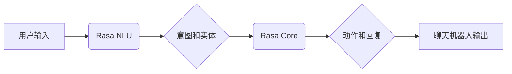

## 1. 背景介绍

### 1.1 聊天机器人的兴起

近年来，随着人工智能技术的飞速发展，聊天机器人（Chatbot）作为人工智能技术的典型应用，正逐渐改变着我们与机器的交互方式。从简单的问答系统到复杂的对话式AI，聊天机器人的应用场景日益广泛，涵盖了客户服务、教育、医疗、娱乐等各个领域。

### 1.2 Rasa的优势

Rasa是一个开源的对话式AI框架，它为开发者提供了构建上下文感知的聊天机器人的强大工具。相比于其他聊天机器人框架，Rasa具有以下优势：

* **高度可定制化**: Rasa允许开发者自由地定制对话流程、意图识别、实体提取以及响应生成等各个环节，以满足不同场景的需求。
* **开源和活跃的社区**: Rasa拥有庞大的开源社区，开发者可以方便地获取学习资源、寻求帮助以及贡献代码。
* **支持多种消息平台**: Rasa可以轻松地集成到各种消息平台，例如Facebook Messenger、Slack、Telegram等。
* **强大的自然语言理解能力**: Rasa集成了先进的自然语言理解（NLU）技术，能够准确地识别用户意图和提取关键信息。

### 1.3 本文目标

本文旨在为读者提供一个全面且深入的指南，介绍如何利用Rasa框架构建一个功能完善的聊天机器人。我们将从基础概念入手，逐步深入到核心算法原理、代码实践以及实际应用场景，帮助读者掌握Rasa的核心技术和应用技巧。


## 2. 核心概念与联系

### 2.1 NLU（自然语言理解）

NLU是聊天机器人的核心组件之一，它负责将用户输入的自然语言文本转换为机器可理解的结构化数据。Rasa的NLU模块主要包含以下几个部分：

* **Tokenizer**: 将文本分割成单词或词组。
* **Featuriser**: 将文本转换为数值向量表示，以便机器学习模型进行处理。
* **Intent Classifier**: 识别用户意图，例如询问天气、预订酒店等。
* **Entity Extractor**: 从文本中提取关键信息，例如日期、地点、人物等。

### 2.2 Dialogue Management（对话管理）

对话管理模块负责控制聊天机器人的对话流程，根据用户输入和当前对话状态，选择合适的动作并生成相应的回复。Rasa的对话管理模块主要基于两个核心概念：

* **Stories**: 描述用户与聊天机器人之间可能的对话流程。
* **Domain**: 定义聊天机器人的意图、实体、动作以及回复模板等。

### 2.3 Rasa Core与Rasa NLU的关系

Rasa Core和Rasa NLU是Rasa框架的两个核心组件，它们协同工作以实现完整的聊天机器人功能。Rasa NLU负责理解用户输入，而Rasa Core则负责管理对话流程和生成回复。



## 3. 核心算法原理具体操作步骤

### 3.1 意图识别

Rasa使用机器学习算法来识别用户意图。常用的算法包括：

* **支持向量机（SVM）**
* **朴素贝叶斯（Naive Bayes）**
* **逻辑回归（Logistic Regression）**

Rasa NLU支持多种特征提取方法，例如词袋模型（Bag-of-Words）、TF-IDF以及预训练的词嵌入模型（Word Embeddings）。

### 3.2 实体提取

Rasa使用条件随机场（CRF）算法来提取实体。CRF是一种概率图模型，它能够捕捉到文本中单词之间的依赖关系，从而更准确地识别实体。

### 3.3 对话管理

Rasa Core使用强化学习算法来训练对话管理模型。强化学习是一种机器学习方法，它通过试错来学习最佳策略。在Rasa Core中，对话管理模型通过与用户模拟对话来学习如何选择最佳动作并生成最佳回复。


## 4. 数学模型和公式详细讲解举例说明

### 4.1 TF-IDF

TF-IDF（Term Frequency-Inverse Document Frequency）是一种常用的文本特征提取方法。它基于以下两个指标：

* **词频（TF）**: 指某个词在文档中出现的频率。
* **逆文档频率（IDF）**: 指包含某个词的文档数量的倒数的对数。

TF-IDF公式如下：

$$
TF-IDF(t, d) = TF(t, d) \times IDF(t)
$$

其中：

* $t$ 表示某个词
* $d$ 表示某个文档
* $TF(t, d)$ 表示词 $t$ 在文档 $d$ 中出现的频率
* $IDF(t)$ 表示包含词 $t$ 的文档数量的倒数的对数

**举例说明**

假设有两个文档：

* 文档1: "Rasa是一个开源的对话式AI框架"
* 文档2: "聊天机器人正逐渐改变着我们与机器的交互方式"

计算词 "Rasa" 在文档1中的TF-IDF值：

1. 计算词频 $TF("Rasa", 文档1) = 1/7$
2. 计算逆文档频率 $IDF("Rasa") = log(2/1) = 0.693$
3. 计算TF-IDF $TF-IDF("Rasa", 文档1) = (1/7) \times 0.693 = 0.099$

### 4.2 条件随机场（CRF）

CRF是一种概率图模型，它能够捕捉到文本中单词之间的依赖关系，从而更准确地识别实体。CRF模型定义了一个条件概率分布，用于预测给定输入序列的标签序列。

**举例说明**

假设要识别句子 "Rasa是一个开源的对话式AI框架" 中的实体。

1. 定义标签集：{B-ORG, I-ORG, O}，其中 B-ORG 表示组织机构的开头，I-ORG 表示组织机构的中间，O 表示其他。
2. 定义特征函数：例如，词性、词形、上下文等。
3. 使用训练数据训练CRF模型，学习特征函数的权重。
4. 使用训练好的CRF模型预测句子中每个单词的标签，例如："Rasa/B-ORG 是/O 一个/O 开源/O 的/O 对话式/O AI/O 框架/O"。


## 5. 项目实践：代码实例和详细解释说明

### 5.1 安装Rasa

```bash
pip install rasa
```

### 5.2 创建Rasa项目

```bash
rasa init
```

### 5.3 定义NLU训练数据

在 `data/nlu.yml` 文件中定义NLU训练数据，例如：

```yaml
version: "3.1"

nlu:
- intent: greet
  examples: |
    - hey
    - hello
    - hi
    - good morning
    - good evening
    - hey there

- intent: goodbye
  examples: |
    - bye
    - goodbye
    - see you later
    - have a nice day

- intent: order_pizza
  examples: |
    - I want to order a pizza
    - Can I order a pizza?
    - I'd like to order a pizza please
    - I'm hungry, I want pizza
    - Can I get a pizza delivered?
```

### 5.4 定义Domain文件

在 `domain.yml` 文件中定义聊天机器人的意图、实体、动作以及回复模板等，例如：

```yaml
version: "3.1"

intents:
  - greet
  - goodbye
  - order_pizza

entities:
  - pizza_type
  - pizza_size

slots:
  pizza_type:
    type: text
  pizza_size:
    type: text

actions:
  - utter_greet
  - utter_goodbye
  - utter_ask_pizza_type
  - utter_ask_pizza_size
  - action_order_pizza

responses:
  utter_greet:
  - text: "Hello! How can I help you?"
  utter_goodbye:
  - text: "Goodbye! Have a nice day."
  utter_ask_pizza_type:
  - text: "What type of pizza would you like?"
  utter_ask_pizza_size:
  - text: "What size pizza would you like?"
```

### 5.5 定义Stories

在 `data/stories.yml` 文件中定义用户与聊天机器人之间可能的对话流程，例如：

```yaml
version: "3.1"

stories:

- story: happy path
  steps:
  - intent: greet
  - action: utter_greet
  - intent: order_pizza
  - action: utter_ask_pizza_type
  - intent: inform
  - entity: pizza_type: pepperoni
  - action: utter_ask_pizza_size
  - intent: inform
  - entity: pizza_size: large
  - action: action_order_pizza
  - action: utter_goodbye
```

### 5.6 训练模型

```bash
rasa train
```

### 5.7 运行聊天机器人

```bash
rasa shell
```

## 6. 实际应用场景

### 6.1 客户服务

聊天机器人可以用于自动化客户服务流程，例如回答常见问题、处理订单查询以及提供技术支持。

### 6.2 教育

聊天机器人可以用于创建交互式学习体验，例如提供个性化学习内容、回答学生问题以及评估学生理解程度。

### 6.3 医疗

聊天机器人可以用于提供医疗咨询、预约医生以及收集患者信息。

### 6.4 娱乐

聊天机器人可以用于创建游戏、提供娱乐内容以及与用户进行闲聊。


## 7. 工具和资源推荐

### 7.1 Rasa官方文档

https://rasa.com/docs/

### 7.2 Rasa社区论坛

https://forum.rasa.com/

### 7.3 Rasa博客

https://blog.rasa.com/

### 7.4 Rasa Github仓库

https://github.com/RasaHQ/rasa


## 8. 总结：未来发展趋势与挑战

### 8.1 未来发展趋势

* **更加个性化的对话体验**: 随着自然语言处理技术的不断进步，聊天机器人将能够提供更加个性化的对话体验，例如记住用户的偏好、理解用户的语气以及根据用户的情绪调整对话风格。
* **多模态交互**: 未来的聊天机器人将能够处理多种类型的输入，例如文本、语音、图像以及视频，从而提供更加丰富和自然的交互方式。
* **与其他AI技术的融合**: 聊天机器人将与其他AI技术，例如机器学习、计算机视觉以及机器人技术相融合，从而实现更加智能化的应用。

### 8.2 挑战

* **数据安全和隐私**: 聊天机器人需要处理大量的用户数据，因此数据安全和隐私是一个重要挑战。
* **伦理和社会影响**: 聊天机器人的应用可能会带来伦理和社会影响，例如就业问题、算法偏差以及信息传播的控制。
* **技术局限性**: 现有的自然语言处理技术仍然存在局限性，例如理解复杂语义、处理歧义以及进行情感分析等。


## 9. 附录：常见问题与解答

### 9.1 如何提高聊天机器人的准确率？

* **提供高质量的训练数据**: 训练数据的质量直接影响着聊天机器人的准确率。
* **选择合适的算法**: 不同的算法适用于不同的场景，需要根据具体情况选择合适的算法。
* **优化模型参数**: 模型参数对聊天机器人的性能有很大影响，需要进行参数优化以获得最佳性能。

### 9.2 如何处理聊天机器人无法理解的问题？

* **提供默认回复**: 当聊天机器人无法理解问题时，可以提供默认回复，例如 "我不理解你的问题，请换一种说法"。
* **转人工客服**: 对于复杂问题，可以将用户转接到人工客服进行处理。

### 9.3 如何评估聊天机器人的性能？

* **准确率**: 衡量聊天机器人正确理解用户意图和提取实体的比例。
* **召回率**: 衡量聊天机器人能够识别出的相关意图和实体的比例。
* **F1值**: 综合考虑准确率和召回率的指标。
* **用户满意度**: 通过用户调查等方式评估用户对聊天机器人的满意程度. 
