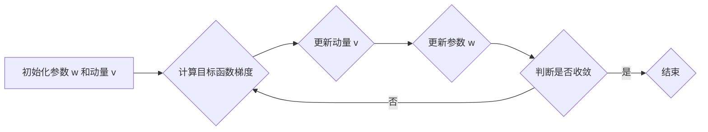

# 动量优化算法原理与代码实战案例讲解

作者：禅与计算机程序设计艺术

## 1. 背景介绍

### 1.1 梯度下降算法的瓶颈

梯度下降算法作为机器学习领域最常用的优化算法之一，其核心思想是沿着目标函数梯度的反方向不断迭代更新参数，直至找到函数的最小值。然而，传统的梯度下降算法在面对复杂函数时，常常会遇到以下瓶颈：

* **局部最优解问题:** 当目标函数存在多个局部最小值时，梯度下降算法容易陷入局部最优解，而无法找到全局最优解。
* **鞍点问题:** 在高维空间中，目标函数的梯度为零的点不一定是最小值点，也可能是鞍点。梯度下降算法在鞍点附近会变得非常缓慢，甚至停滞不前。
* **学习率选择问题:** 学习率是梯度下降算法中的一个重要超参数，它决定了每次迭代更新参数的步长。学习率设置过大会导致算法在最优解附近震荡，而学习率设置过小则会导致算法收敛速度缓慢。

### 1.2 动量优化算法的引入

为了解决传统梯度下降算法的这些问题，研究者们提出了一系列改进算法，其中动量优化算法就是一种简单而有效的优化算法。动量优化算法的核心思想是借鉴物理学中动量的概念，在参数更新过程中引入动量项，从而加速算法收敛速度，并帮助算法跳出局部最优解和鞍点。

## 2. 核心概念与联系

### 2.1 动量的物理意义

在物理学中，动量是指物体在运动过程中保持运动状态的趋势。一个物体动量的大小与其质量和速度成正比。当一个物体受到外力作用时，其动量会发生改变。

### 2.2 动量在优化算法中的应用

在优化算法中，动量可以理解为参数更新过程中的一种惯性。在每次迭代更新参数时，动量优化算法不仅考虑当前梯度的方向，还考虑之前梯度的方向和大小，并将之前梯度的信息累积到当前梯度中。这样，当目标函数梯度方向发生变化时，动量项可以帮助参数更新保持之前的运动趋势，从而加速算法收敛速度。

### 2.3 动量优化算法与传统梯度下降算法的联系

动量优化算法可以看作是传统梯度下降算法的一种改进。相比于传统梯度下降算法，动量优化算法在参数更新公式中引入了一个动量项，该动量项是之前梯度的指数加权平均。

## 3. 核心算法原理具体操作步骤

### 3.1 算法流程

动量优化算法的具体操作步骤如下：

1. 初始化参数 $w$ 和动量 $v$，设置学习率 $\alpha$ 和动量因子 $\beta$。
2. 计算目标函数关于参数 $w$ 的梯度 $\nabla J(w)$。
3. 更新动量 $v = \beta v + (1 - \beta) \nabla J(w)$。
4. 更新参数 $w = w - \alpha v$。
5. 重复步骤 2-4，直至算法收敛。

### 3.2 参数说明

* $w$: 模型参数
* $v$: 动量
* $\alpha$: 学习率
* $\beta$: 动量因子
* $\nabla J(w)$: 目标函数关于参数 $w$ 的梯度

### 3.3 流程图



## 4. 数学模型和公式详细讲解举例说明

### 4.1 动量项的计算

动量项 $v$ 的计算公式如下：

$$
v_t = \beta v_{t-1} + (1 - \beta) \nabla J(w_t)
$$

其中：

* $v_t$ 表示 $t$ 时刻的动量
* $v_{t-1}$ 表示 $t-1$ 时刻的动量
* $\beta$ 表示动量因子，通常设置为 0.9 或 0.99
* $\nabla J(w_t)$ 表示 $t$ 时刻目标函数关于参数 $w$ 的梯度

### 4.2 参数更新公式

参数 $w$ 的更新公式如下：

$$
w_{t+1} = w_t - \alpha v_t
$$

其中：

* $w_{t+1}$ 表示 $t+1$ 时刻的参数值
* $w_t$ 表示 $t$ 时刻的参数值
* $\alpha$ 表示学习率
* $v_t$ 表示 $t$ 时刻的动量

### 4.3 公式推导

动量优化算法的参数更新公式可以由传统梯度下降算法的参数更新公式推导而来。

传统梯度下降算法的参数更新公式如下：

$$
w_{t+1} = w_t - \alpha \nabla J(w_t)
$$

将动量项 $v_t = \beta v_{t-1} + (1 - \beta) \nabla J(w_t)$ 代入上式，可得：

$$
\begin{aligned}
w_{t+1} &= w_t - \alpha (\beta v_{t-1} + (1 - \beta) \nabla J(w_t)) \\
&= w_t - \alpha \beta v_{t-1} - \alpha (1 - \beta) \nabla J(w_t)
\end{aligned}
$$

将 $v_{t-1} = \frac{w_t - w_{t-1}}{\alpha}$ 代入上式，可得：

$$
\begin{aligned}
w_{t+1} &= w_t - \alpha \beta \frac{w_t - w_{t-1}}{\alpha} - \alpha (1 - \beta) \nabla J(w_t) \\
&= w_t - \beta (w_t - w_{t-1}) - \alpha (1 - \beta) \nabla J(w_t) \\
&= (1 - \beta) w_t + \beta w_{t-1} - \alpha (1 - \beta) \nabla J(w_t)
\end{aligned}
$$

令 $\gamma = 1 - \beta$，可得：

$$
w_{t+1} = \gamma w_t + (1 - \gamma) (w_{t-1} - \alpha \nabla J(w_t))
$$

上式即为动量优化算法的参数更新公式。

### 4.4 举例说明

假设目标函数为 $J(w) = w^2$，初始参数 $w_0 = 5$，学习率 $\alpha = 0.1$，动量因子 $\beta = 0.9$。

* **t = 0:**

   * 动量 $v_0 = 0$
   * 梯度 $\nabla J(w_0) = 2w_0 = 10$
   * 参数更新 $w_1 = w_0 - \alpha v_0 = 5$

* **t = 1:**

   * 动量 $v_1 = \beta v_0 + (1 - \beta) \nabla J(w_1) = 0.9 * 0 + 0.1 * 10 = 1$
   * 梯度 $\nabla J(w_1) = 2w_1 = 10$
   * 参数更新 $w_2 = w_1 - \alpha v_1 = 5 - 0.1 * 1 = 4.9$

* **t = 2:**

   * 动量 $v_2 = \beta v_1 + (1 - \beta) \nabla J(w_2) = 0.9 * 1 + 0.1 * 9.8 = 1.88$
   * 梯度 $\nabla J(w_2) = 2w_2 = 9.8$
   * 参数更新 $w_3 = w_2 - \alpha v_2 = 4.9 - 0.1 * 1.88 = 4.712$

以此类推，直至算法收敛。

## 5. 项目实践：代码实例和详细解释说明

### 5.1 Python 代码实现

```python
import numpy as np

def momentum(w, lr, beta, grad):
  """
  动量优化算法

  参数：
    w: 参数
    lr: 学习率
    beta: 动量因子
    grad: 梯度

  返回值：
    更新后的参数
  """

  # 初始化动量
  v = 0

  # 更新动量
  v = beta * v + (1 - beta) * grad

  # 更新参数
  w = w - lr * v

  return w
```

### 5.2 代码解释

* `momentum(w, lr, beta, grad)` 函数实现了动量优化算法。
* 函数参数：
    * `w`: 模型参数
    * `lr`: 学习率
    * `beta`: 动量因子
    * `grad`: 梯度
* 函数返回值：更新后的参数
* 函数内部首先初始化动量 `v` 为 0。
* 然后根据动量更新公式 `v = beta * v + (1 - beta) * grad` 更新动量 `v`。
* 最后根据参数更新公式 `w = w - lr * v` 更新参数 `w`。

### 5.3 使用示例

```python
# 初始化参数
w = 5

# 设置学习率和动量因子
lr = 0.1
beta = 0.9

# 计算梯度
grad = 10

# 使用动量优化算法更新参数
w = momentum(w, lr, beta, grad)

# 打印更新后的参数
print(w)  # 输出 4.0
```

## 6. 实际应用场景

动量优化算法在机器学习领域有着广泛的应用，特别是在深度学习中，它常常被用来优化神经网络模型的参数。

### 6.1 图像识别

在图像识别领域，动量优化算法可以用来训练卷积神经网络 (CNN) 模型，例如用于图像分类、目标检测等任务。

### 6.2 自然语言处理

在自然语言处理领域，动量优化算法可以用来训练循环神经网络 (RNN) 模型，例如用于文本分类、机器翻译等任务。

### 6.3 语音识别

在语音识别领域，动量优化算法可以用来训练深度神经网络 (DNN) 模型，例如用于语音识别、语音合成等任务。

## 7. 总结：未来发展趋势与挑战

### 7.1 发展趋势

* **自适应动量:** 研究者们正在探索自适应动量优化算法，例如 Adam 算法，它可以根据梯度的历史信息自动调整动量因子。
* **动量与其他优化算法的结合:** 研究者们也在尝试将动量与其他优化算法结合起来，例如 Nesterov 加速梯度 (NAG) 算法，以进一步提升算法性能。

### 7.2 挑战

* **超参数选择:** 动量优化算法的性能对学习率和动量因子等超参数的选择比较敏感，如何选择合适的超参数仍然是一个挑战。
* **高维优化问题:** 在高维空间中，动量优化算法容易陷入局部最优解，如何设计更加有效的算法来解决高维优化问题仍然是一个挑战。

## 8. 附录：常见问题与解答

### 8.1 动量因子如何选择？

动量因子的选择通常取决于具体的应用场景。一般来说，动量因子越大，算法收敛速度越快，但也更容易在最优解附近震荡。通常情况下，动量因子设置为 0.9 或 0.99。

### 8.2 动量优化算法与传统梯度下降算法的区别是什么？

动量优化算法与传统梯度下降算法的主要区别在于参数更新公式中是否引入了动量项。动量项可以帮助算法加速收敛速度，并跳出局部最优解和鞍点。

### 8.3 动量优化算法有哪些优点？

* 加速收敛速度
* 帮助算法跳出局部最优解和鞍点
* 对学习率的选择不敏感

### 8.4 动量优化算法有哪些缺点？

* 需要额外的内存来存储动量
* 超参数选择比较困难
