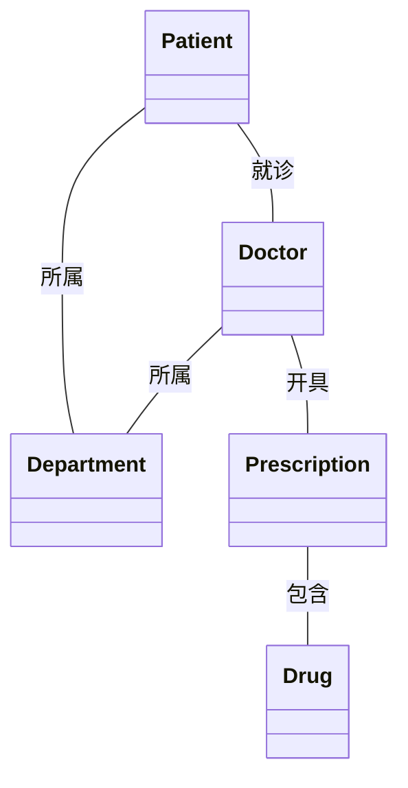
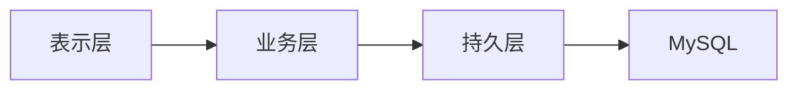

# 医院管理系统详细设计与具体代码实现

作者：禅与计算机程序设计艺术

## 1. 背景介绍

### 1.1 医院管理系统的重要性

在现代医疗体系中,医院管理系统扮演着至关重要的角色。高效的医院管理系统不仅能优化医院的日常运营,提高医疗服务质量,还能为患者提供更好的就医体验。随着信息技术的飞速发展,传统的人工管理模式已经难以满足现代化医院管理的需求,因此开发一套功能完善、易于操作的医院管理系统势在必行。

### 1.2 医院管理系统的主要功能

一个完整的医院管理系统通常包括以下几个主要功能模块:

1. 患者管理:包括患者信息登记、查询、修改等功能。
2. 医生管理:医生信息管理,排班安排,诊疗记录管理等。  
3. 药品管理:药品信息登记、库存管理、出入库管理等。
4. 收费管理:门诊收费、住院收费、费用统计等。
5. 病床管理:病床分配、使用情况查询等。
6. 统计报表:各类数据的统计分析和报表生成。

### 1.3 系统开发技术选型

为了开发一个高质量的医院管理系统,我们需要选择合适的技术栈。本项目采用前后端分离的架构,具体技术选型如下:

- 前端:Vue.js + Element UI
- 后端:Spring Boot + MyBatis
- 数据库:MySQL
- 版本控制:Git
- 项目管理:Maven

## 2. 核心概念与联系

### 2.1 领域模型设计

领域模型是对问题域中的概念以及它们之间关系的抽象。在医院管理系统中,主要的领域概念包括:

- Patient(患者):就诊的对象,具有姓名、性别、年龄等基本信息。
- Doctor(医生):提供诊疗服务,有姓名、职称等属性。
- Department(科室):医院的组织单位,如内科、外科等。
- Drug(药品):治疗用的药物,有名称、编码、库存等信息。  
- Prescription(处方):医生开具的药品清单。

下面是这些概念之间的关系图:



### 2.2 系统架构设计

医院管理系统采用分层架构,主要分为表示层、业务层和持久层三个部分。

- 表示层:用户界面,负责与用户交互,显示数据。
- 业务层:业务逻辑,负责处理具体的业务流程。 
- 持久层:数据访问,负责与数据库交互,执行数据的增删改查。

整个系统的架构如下图所示:



## 3. 核心算法原理与具体操作步骤

### 3.1 住院费用统计算法

住院费用统计是医院管理系统的一项重要功能,其核心是根据患者的住院天数和相关费用项目计算出总费用。具体算法步骤如下:

1. 查询患者的入院时间和出院时间,计算住院天数。
2. 获取患者的日均床位费,乘以住院天数得到床位费小计。
3. 查询患者的医药费、检查费、手术费等其他费用项目。
4. 将床位费与其他费用项目相加得到总费用。
5. 保存总费用并生成费用清单。

### 3.2 药品库存预警算法

为了避免药品积压或脱销,需要对药品库存进行实时监控。当库存量低于预设的安全库存时,系统自动发出预警提示。具体算法步骤如下:

1. 设定每种药品的安全库存量,如30天用量。
2. 每天定时查询药品的当前库存量。
3. 计算药品的日均用量,预估可用天数。
4. 判断可用天数是否低于安全库存天数:
   - 如是,发出库存预警提示。
   - 如否,不做处理。
5. 对于需要预警的药品,通知相关人员及时补货。

## 4. 数学模型和公式详细讲解举例说明

### 4.1 药品日均用量的计算

药品日均用量是指某药品在单位时间(通常为1天)内的平均使用量。其计算公式为:

$$ 日均用量 = \frac{一段时间内的使用总量}{时间段的天数} $$

举例说明:某药品1月份的使用总量为3000支,那么它的日均用量为:

$$ 日均用量 = \frac{3000}{31} \approx 96.77(支/天) $$

### 4.2 病床周转率的计算

病床周转率是反映医院病床利用效率的重要指标,计算公式为:

$$ 病床周转率 = \frac{一段时间内的出院人数}{病床数} $$

举例说明:某医院1月份出院患者500人,共有病床200张,则病床周转率为:

$$ 病床周转率 = \frac{500}{200} = 2.5(人/床) $$

## 5. 项目实践：代码实例与详细解释说明 

本节主要展示医院管理系统的部分核心代码实例,并对其进行详细的解释说明。

### 5.1 患者信息管理模块

患者信息管理是系统的基础模块,下面是使用MyBatis实现的患者Mapper接口的代码:

```java
public interface PatientMapper {
    @Select("SELECT * FROM patient WHERE id = #{id}")
    Patient selectById(Integer id);
    
    @Select("SELECT * FROM patient")
    List<Patient> selectAll();
    
    @Insert("INSERT INTO patient(name, gender, age) VALUES(#{name}, #{gender}, #{age})")
    void insert(Patient patient);
    
    @Update("UPDATE patient SET name = #{name}, gender = #{gender}, age = #{age} WHERE id = #{id}")
    void updateById(Patient patient); 
    
    @Delete("DELETE FROM patient WHERE id = #{id}")
    void deleteById(Integer id);
}
```

这里定义了对患者表的基本CRUD操作,包括根据ID查询、查询全部、新增、修改和删除。其中用到了MyBatis的注解方式来配置SQL语句。

### 5.2 药品出入库管理模块

药品出入库管理是医院药房的重要功能。下面是药品Service实现类的部分代码:

```java
@Service
public class DrugServiceImpl implements DrugService {
    
    @Autowired
    private DrugMapper drugMapper; 
    
    @Override
    public void addStock(Integer drugId, Integer num) {
        Drug drug = drugMapper.selectById(drugId);
        drug.setStock(drug.getStock() + num);
        drugMapper.updateById(drug);
    }
    
    @Override  
    public void subStock(Integer drugId, Integer num) {
        Drug drug = drugMapper.selectById(drugId); 
        if (drug.getStock() < num) {
            throw new IllegalArgumentException("库存不足");
        }
        drug.setStock(drug.getStock() - num);
        drugMapper.updateById(drug);
    }
}
```

这里实现了两个方法:药品入库(addStock)和药品出库(subStock)。入库时将药品的库存量增加,出库时先判断库存是否充足,然后再减少库存量。其中用到了MyBatis的Mapper接口来访问数据库。

## 6. 实际应用场景

医院管理系统在实际应用中有着广泛的需求,下面列举几个常见的应用场景:

1. 门诊患者就诊流程:患者挂号、问诊、开药、缴费、取药。
2. 住院患者管理:入院登记、分配病床、医嘱管理、费用管理。
3. 医生排班:科室医生的排班安排与调整。
4. 药品管理:药品信息录入、库存盘点、出入库登记。
5. 财务管理:收支统计、资产管理、财务报表。

通过信息化手段将这些业务流程系统化、规范化,能有效提升医院的管理水平,改善患者就医体验。

## 7. 工具与资源推荐

在开发医院管理系统的过程中,我们可以利用一些开源的工具和资源来提高效率,下面推荐几个常用的工具:

1. IDEA:功能强大的Java IDE,提供了代码自动完成、重构、调试等功能。  
2. Postman:API测试工具,用于测试系统的各种接口。
3. Navicat:数据库管理工具,支持多种数据库,操作方便。 
4. Apache POI:用于操作Microsoft Office文件,比如导出数据到Excel。  
5. Lombok:Java代码简化工具,通过注解自动生成getter、setter等方法。  
6. MyBatis Generator:代码生成工具,可根据数据库表结构生成对应的Java代码。

此外还有一些在线资源也非常有帮助:

- Spring官方文档:https://spring.io/projects/spring-boot  
- MyBatis官方文档:https://mybatis.org/mybatis-3/
- Vue.js官方文档:https://vuejs.org/
- Element UI官网:https://element.eleme.io/
- Stack Overflow:IT技术问答网站,遇到问题可以来这里搜索。

## 8. 总结：未来发展趋势与挑战

随着人工智能、大数据、云计算等新兴技术的发展,医院信息化正面临新的机遇和挑战。未来医院管理系统的发展趋势主要有以下几个方面:

1. 智能化:利用人工智能技术,实现智能导诊、智能医疗决策支持等功能。
2. 移动化:基于移动互联网,提供移动端的医疗服务,方便患者随时随地就医。
3. 平台化:打通医院内部各系统,实现数据共享与业务协同。
4. 互联网化:通过互联网连接医院与患者、医保、供应商等,构建医疗服务生态圈。

同时,医院管理系统的发展也面临一些挑战,例如:

- 数据安全与隐私保护
- 系统的可靠性与可用性
- 业务流程的标准化与规范化
- 新技术的应用与集成  

如何应对这些挑战,需要技术团队、业务部门、管理层等多方合作,在保证系统稳定运行的同时不断创新。总之,医院管理系统还有很大的发展空间,未来值得期待。

## 9. 附录：常见问题与解答

1. 问:医院管理系统需要哪些硬件设备?
   答:服务器、电脑、打印机、扫描仪等,根据医院规模配备。

2. 问:系统需要多久才能上线使用?  
   答:开发周期一般在3-6月,取决于需求的复杂程度。

3. 问:系统可以定制开发吗?
   答:可以根据医院的实际情况提供定制化的开发服务。

4. 问:系统如何确保数据安全? 
   答:采用严格的权限控制、数据加密、异地备份等措施。

5. 问:系统出现故障如何处理?
   答:提供7x24小时技术支持服务,及时响应并解决问题。

如果您还有其他问题,欢迎随时联系我们的客服人员。