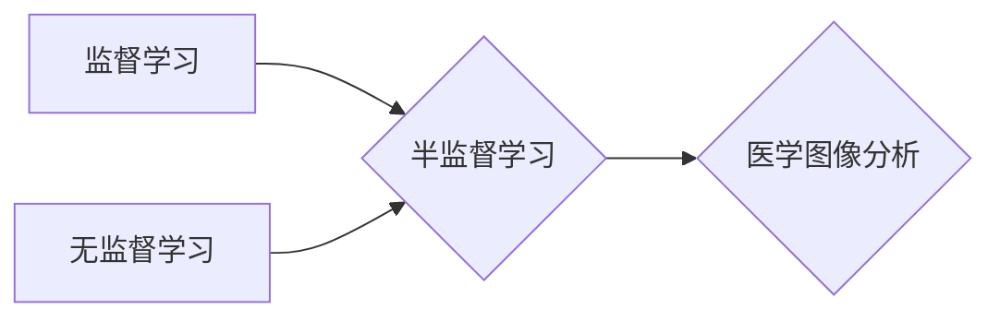

# 半监督学习在医学图像分析中的应用

作者：禅与计算机程序设计艺术

## 1. 背景介绍

### 1.1 医学图像分析的挑战与机遇

医学图像分析是利用计算机技术对医学图像进行处理、分析和解释，以辅助医生进行疾病诊断、治疗方案制定和预后评估的关键技术。近年来，随着深度学习技术的飞速发展，医学图像分析领域取得了突破性进展，涌现出许多基于深度学习的医学图像分析算法，并在疾病诊断、治疗方案制定和预后评估等方面展现出巨大潜力。

然而，医学图像分析仍然面临着诸多挑战：

* **数据标注成本高**: 医学图像标注需要专业的医生参与，成本高昂且耗时。
* **数据异质性**: 不同医院、不同设备采集的医学图像存在较大差异，导致模型泛化能力受限。
* **数据隐私**: 医学图像包含敏感的患者隐私信息，数据安全和隐私保护至关重要。

为了应对这些挑战，半监督学习应运而生。半监督学习作为一种介于监督学习和无监督学习之间的学习范式，能够有效利用少量标注数据和大量未标注数据进行模型训练，在医学图像分析领域具有巨大应用潜力。

### 1.2 半监督学习概述

半监督学习的核心思想是利用少量标注数据和大量未标注数据来训练模型，以提高模型的泛化能力和鲁棒性。其主要方法包括：

* **一致性正则化**:  鼓励模型对输入数据的微小扰动输出一致的预测结果。
* **伪标签**: 利用模型对未标注数据进行预测，并将高置信度的预测结果作为伪标签加入训练集。
* **图神经网络**: 利用图结构刻画数据之间的关系，将标注信息从已标注样本传播到未标注样本。

## 2. 核心概念与联系

### 2.1 半监督学习基本概念

* **监督学习**: 利用完全标注的数据集训练模型，学习输入数据到输出标签的映射关系。
* **无监督学习**: 利用无标签的数据集训练模型，学习数据的内在结构和特征表示。
* **半监督学习**: 利用少量标注数据和大量未标注数据训练模型，结合监督学习和无监督学习的优势。

### 2.2 半监督学习与医学图像分析

半监督学习在医学图像分析中的优势：

* **缓解数据标注压力**: 利用未标注数据提高模型性能，减少对标注数据的依赖。
* **提升模型泛化能力**: 利用未标注数据学习更鲁棒的特征表示，提高模型对不同数据分布的适应性。
* **保护数据隐私**:  减少对敏感数据的依赖，降低数据泄露风险。

### 2.3 核心概念联系图



## 3. 核心算法原理具体操作步骤

### 3.1 一致性正则化

#### 3.1.1 原理

一致性正则化假设，对于一个训练良好的模型，对输入数据的微小扰动应该输出一致的预测结果。通过添加一致性正则化项到损失函数中，可以鼓励模型学习更平滑的决策边界，提高模型的泛化能力和鲁棒性。

#### 3.1.2 具体操作步骤

1. 对输入数据进行随机扰动，例如添加噪声、进行数据增强等。
2. 将原始数据和扰动后的数据输入模型，得到两个预测结果。
3. 计算两个预测结果之间的一致性损失，例如均方误差(MSE)。
4. 将一致性损失添加到模型的原始损失函数中，进行联合优化。

#### 3.1.3 常见算法

* **Π-Model**: 对同一张图像进行两次随机数据增强，最小化两次预测结果之间的差异。
* **Temporal Ensembling**: 在训练过程中，将模型对同一张图像在不同 epoch 的预测结果进行平均，作为更稳定的预测目标。
* **Mean Teacher**:  使用一个教师模型对未标注数据进行预测，并将教师模型的预测结果作为学生模型的训练目标。

### 3.2 伪标签

#### 3.2.1 原理

伪标签方法利用模型对未标注数据进行预测，并将高置信度的预测结果作为伪标签加入训练集，以扩大训练集规模，提高模型性能。

#### 3.2.2 具体操作步骤

1. 利用训练好的模型对未标注数据进行预测。
2. 选择预测置信度超过预设阈值的样本。
3. 将这些样本的预测结果作为伪标签加入训练集。
4. 使用更新后的训练集重新训练模型。

#### 3.2.3 常见算法

* **Self-Training**: 最简单的伪标签方法，直接将模型预测结果作为伪标签。
* **Label Propagation**: 利用图结构将标签信息从已标注样本传播到未标注样本。

### 3.3 图神经网络

#### 3.3.1 原理

图神经网络(GNN)是一种专门处理图结构数据的深度学习模型，能够有效捕捉节点之间的关系信息。在半监督学习中，可以利用图结构刻画数据之间的关系，将标注信息从已标注样本传播到未标注样本，提高模型性能。

#### 3.3.2 具体操作步骤

1. 将数据集构建成图结构，节点代表样本，边代表样本之间的关系。
2. 利用图神经网络学习节点的特征表示。
3. 利用已标注样本的标签信息监督训练图神经网络。
4. 利用训练好的图神经网络对未标注样本进行预测。

#### 3.3.3 常见算法

* **Graph Convolutional Networks (GCN)**: 利用图卷积操作学习节点的特征表示。
* **Graph Attention Networks (GAT)**: 利用注意力机制学习节点之间的关系权重。

## 4. 数学模型和公式详细讲解举例说明

### 4.1 一致性正则化

以 Π-Model 为例，其损失函数可以表示为：

$$
\mathcal{L} = \mathcal{L}_s + \lambda \mathcal{L}_u
$$

其中，$\mathcal{L}_s$ 是监督学习损失函数，$\mathcal{L}_u$ 是一致性正则化损失函数，$\lambda$ 是平衡系数。

一致性正则化损失函数可以表示为：

$$
\mathcal{L}_u = \frac{1}{N} \sum_{i=1}^N || f(x_i) - f(\tilde{x}_i) ||^2
$$

其中，$f(x_i)$ 和 $f(\tilde{x}_i)$ 分别表示模型对原始数据 $x_i$ 和扰动后的数据 $\tilde{x}_i$ 的预测结果，$N$ 是未标注样本数量。

### 4.2 伪标签

以 Self-Training 为例，其算法流程如下：

1. 利用标注数据训练模型 $f(x)$。
2. 利用模型 $f(x)$ 对未标注数据 $x_u$ 进行预测，得到预测结果 $\hat{y}_u$。
3. 选择预测置信度超过预设阈值 $\tau$ 的样本，将其加入训练集：

$$
\mathcal{D}_{train} = \mathcal{D}_{train} \cup \{(x_u, \hat{y}_u) | \max p(y|x_u) > \tau \}
$$

4. 使用更新后的训练集重新训练模型 $f(x)$。

### 4.3 图神经网络

以 GCN 为例，其节点特征更新公式可以表示为：

$$
H^{(l+1)} = \sigma (\tilde{D}^{-\frac{1}{2}} \tilde{A} \tilde{D}^{-\frac{1}{2}} H^{(l)} W^{(l)})
$$

其中，$H^{(l)}$ 表示第 $l$ 层的节点特征矩阵，$\tilde{A} = A + I$ 是添加自连接后的邻接矩阵，$\tilde{D}$ 是 $\tilde{A}$ 的度矩阵，$W^{(l)}$ 是第 $l$ 层的可学习参数矩阵，$\sigma$ 是激活函数。

## 5. 项目实践：代码实例和详细解释说明

### 5.1 基于 PyTorch 的医学图像半监督学习框架

```python
import torch
import torch.nn as nn
import torch.optim as optim

class SemiSupervisedModel(nn.Module):
    def __init__(self, encoder, classifier):
        super(SemiSupervisedModel, self).__init__()
        self.encoder = encoder
        self.classifier = classifier

    def forward(self, x):
        features = self.encoder(x)
        logits = self.classifier(features)
        return logits

# 定义编码器网络
encoder = ...

# 定义分类器网络
classifier = ...

# 创建半监督学习模型
model = SemiSupervisedModel(encoder, classifier)

# 定义优化器
optimizer = optim.Adam(model.parameters())

# 定义损失函数
criterion = nn.CrossEntropyLoss()

# 定义一致性正则化损失函数
consistency_criterion = nn.MSELoss()

# 设置超参数
lambda_u = 0.5
tau = 0.9

# 训练循环
for epoch in range(num_epochs):
    # 训练阶段
    model.train()
    for batch_idx, (data, target) in enumerate(train_loader):
        # 对输入数据进行随机扰动
        data_aug = ...

        # 前向传播
        logits = model(data)
        logits_aug = model(data_aug)

        # 计算损失函数
        loss_s = criterion(logits, target)
        loss_u = consistency_criterion(logits, logits_aug)
        loss = loss_s + lambda_u * loss_u

        # 反向传播和参数更新
        optimizer.zero_grad()
        loss.backward()
        optimizer.step()

    # 验证阶段
    model.eval()
    ...

    # 伪标签阶段
    if epoch % 10 == 0:
        # 利用模型对未标注数据进行预测
        with torch.no_grad():
            logits_unlabeled = model(unlabeled_data)

        # 选择预测置信度超过预设阈值的样本
        pseudo_labels = torch.argmax(logits_unlabeled, dim=1)
        mask = torch.max(torch.softmax(logits_unlabeled, dim=1), dim=1)[0] > tau

        # 将伪标签加入训练集
        train_data = torch.cat([train_data, unlabeled_data[mask]], dim=0)
        train_targets = torch.cat([train_targets, pseudo_labels[mask]], dim=0)
```

### 5.2 代码解释

* `SemiSupervisedModel` 类定义了半监督学习模型，包含编码器和分类器两个部分。
* `consistency_criterion` 定义了一致性正则化损失函数，这里使用均方误差(MSE)。
* `lambda_u` 是平衡系数，控制一致性正则化损失的权重。
* `tau` 是伪标签的置信度阈值。
* 在训练循环中，每次迭代都会计算监督学习损失和一致性正则化损失，并将两者加权求和作为总损失函数进行优化。
* 每隔 10 个 epoch，利用模型对未标注数据进行预测，并将高置信度的预测结果作为伪标签加入训练集，以提高模型性能。

## 6. 实际应用场景

### 6.1 医学影像分割

* **任务**:  将医学图像中的目标区域(例如肿瘤、器官等)分割出来。
* **挑战**:  医学图像分割需要像素级别的标注，标注成本高。
* **半监督学习方法**:  利用少量标注数据和大量未标注数据训练模型，例如使用一致性正则化或伪标签方法。

### 6.2 医学影像分类

* **任务**:  对医学图像进行分类，例如判断图像是否包含病变组织。
* **挑战**:  医学图像分类需要大量的标注数据，而标注成本高。
* **半监督学习方法**:  利用少量标注数据和大量未标注数据训练模型，例如使用伪标签方法或图神经网络。

### 6.3 医学影像配准

* **任务**:  将不同时间、不同设备或不同视角采集的医学图像进行对齐。
* **挑战**:  医学图像配准需要找到图像之间的对应关系，而人工标注对应关系非常困难。
* **半监督学习方法**:  利用少量标注数据和大量未标注数据训练模型，例如使用弱监督学习或对抗学习方法。

## 7. 工具和资源推荐

### 7.1 深度学习框架

* **PyTorch**:  开源的深度学习框架，易于使用且灵活。
* **TensorFlow**:  由 Google 开发的开源深度学习框架，功能强大且生态系统完善。

### 7.2 医学图像处理库

* **SimpleITK**:  开源的医学图像处理库，提供丰富的图像读取、处理和可视化功能。
* **NiBabel**:  Python 库，用于读取和写入各种神经影像文件格式。

### 7.3 半监督学习库

* **PyTorch Lightning**:  基于 PyTorch 的高级框架，简化模型训练和实验管理。
* **Catalyst**:  灵活的深度学习框架，支持多种半监督学习算法。

## 8. 总结：未来发展趋势与挑战

### 8.1 未来发展趋势

* **更强大的半监督学习算法**:  随着研究的深入，将会涌现出更多更强大的半监督学习算法，进一步提高模型性能。
* **与其他技术的融合**:  半监督学习将与其他技术(例如联邦学习、强化学习等)相结合，解决更复杂的医学图像分析问题。
* **应用场景不断扩展**:  半监督学习将在更多医学图像分析领域得到应用，例如疾病预测、个性化治疗等。

### 8.2 面临的挑战

* **模型可解释性**:  半监督学习模型通常比较复杂，其决策过程难以解释，这在医学领域是一个重要问题。
* **数据偏差**:  如果未标注数据存在偏差，可能会影响模型的性能和泛化能力。
* **计算资源需求**:  训练大型半监督学习模型需要大量的计算资源，这对于一些研究机构和企业来说是一个挑战。

## 9. 附录：常见问题与解答

### 9.1 什么是半监督学习？

半监督学习是一种介于监督学习和无监督学习之间的学习范式，它利用少量标注数据和大量未标注数据来训练模型，以提高模型的泛化能力和鲁棒性。

### 9.2 半监督学习在医学图像分析中有哪些优势？

半监督学习在医学图像分析中的优势包括：

* 缓解数据标注压力
* 提升模型泛化能力
* 保护数据隐私

### 9.3 半监督学习在医学图像分析中有哪些应用场景？

半监督学习在医学图像分析中的应用场景包括：

* 医学影像分割
* 医学影像分类
* 医学影像配准

### 9.4 半监督学习未来发展趋势和挑战是什么？

未来发展趋势：

* 更强大的半监督学习算法
* 与其他技术的融合
* 应用场景不断扩展

面临的挑战：

* 模型可解释性
* 数据偏差
* 计算资源需求
