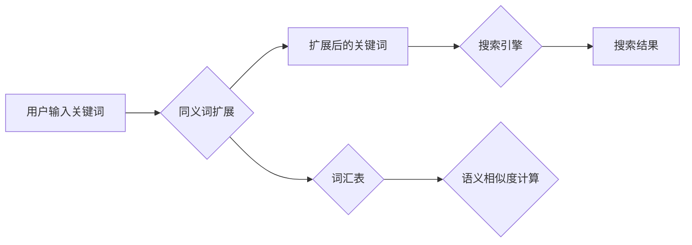

##  同义词搜索：扩展搜索范围

作者：禅与计算机程序设计艺术

## 1. 背景介绍

在信息爆炸的时代，人们获取信息的途径越来越多，搜索引擎成为了人们快速获取信息的重要工具。传统的搜索引擎基于关键词匹配技术，用户输入关键词，搜索引擎返回包含关键词的网页。然而，这种方式存在一定的局限性：

* **词汇鸿沟**: 用户使用的关键词和网页中出现的词语可能存在差异，导致搜索结果不准确。
* **语义理解**:  传统的搜索引擎无法理解用户的搜索意图，只能进行简单的关键词匹配。

为了解决上述问题，同义词搜索应运而生。同义词搜索是指利用语言知识库，将用户输入的关键词扩展为与其语义相关的词语，然后利用扩展后的关键词进行搜索，从而提高搜索结果的覆盖率和准确率。

### 1.1 同义词搜索的意义

同义词搜索具有以下意义：

* **提高搜索效率**:  帮助用户更快地找到所需信息，节省时间和精力。
* **提升用户体验**:  提供更精准的搜索结果，满足用户的个性化需求。
* **扩展搜索范围**:  将用户的搜索范围从单个关键词扩展到与其语义相关的多个关键词，提高搜索结果的覆盖率。
* **促进知识发现**:  帮助用户发现新的知识和信息，拓宽视野。

### 1.2 同义词搜索的应用场景

同义词搜索在很多领域都有着广泛的应用，例如：

* **电商搜索**:  帮助用户找到与搜索词语义相关的商品，例如搜索“手机”，可以返回“智能手机”、“移动电话”等相关商品。
* **新闻资讯**:  帮助用户找到与搜索词语义相关的新闻报道，例如搜索“新冠肺炎”，可以返回“新型冠状病毒肺炎”、“COVID-19”等相关新闻。
* **学术搜索**:  帮助用户找到与搜索词语义相关的学术论文，例如搜索“人工智能”，可以返回“机器学习”、“深度学习”等相关论文。
* **医疗健康**:  帮助用户找到与搜索词语义相关的医疗信息，例如搜索“感冒”，可以返回“流感”、“上呼吸道感染”等相关信息。

## 2. 核心概念与联系

### 2.1 同义词

同义词是指具有相同或相近含义的不同词语。例如，“手机”和“移动电话”是同义词，“开心”和“高兴”是同义词。

### 2.2 词汇表

词汇表是指包含一组词语及其相关信息的集合。在同义词搜索中，词汇表通常包含词语、词性、同义词、反义词等信息。

### 2.3 语义相似度

语义相似度是指两个词语或句子之间含义的相似程度。例如，“手机”和“移动电话”的语义相似度很高，“开心”和“悲伤”的语义相似度很低。

### 2.4  概念之间的联系

下图展示了同义词搜索中各个概念之间的联系：



## 3. 核心算法原理具体操作步骤

同义词搜索的核心算法主要包括以下步骤：

1. **构建词汇表**:  收集整理相关领域的词语，构建词汇表，并标注词语之间的同义关系。
2. **同义词扩展**:  将用户输入的关键词在词汇表中进行匹配，找到与其语义相关的同义词，并将这些同义词添加到搜索关键词列表中。
3. **搜索引擎查询**:  使用扩展后的关键词列表查询搜索引擎，获取搜索结果。
4. **结果排序**:  对搜索结果进行排序，将与用户搜索意图最相关的结果排在前面。

### 3.1 构建词汇表

构建词汇表是同义词搜索的基础，词汇表的质量直接影响到搜索结果的准确率。构建词汇表的方法主要有以下几种：

* **人工整理**:  由语言学家或领域专家人工整理词汇表，标注词语之间的同义关系。这种方法准确率高，但效率低，成本高。
* **自动构建**:  利用自然语言处理技术，从大量的文本数据中自动提取词语之间的同义关系，构建词汇表。这种方法效率高，成本低，但准确率相对较低。
* **混合构建**:  结合人工整理和自动构建的方法，先利用自动构建的方法构建初步的词汇表，然后由人工进行审核和修正，提高词汇表的准确率。


### 3.2 同义词扩展

同义词扩展是同义词搜索的核心步骤，其目的是将用户输入的关键词扩展为与其语义相关的多个关键词，从而提高搜索结果的覆盖率。常用的同义词扩展方法包括：

* **基于规则的方法**:  根据预先定义的规则，将用户输入的关键词进行扩展。例如，可以定义规则将所有名词的复数形式扩展为单数形式，将所有动词的不同时态形式扩展为原形。
* **基于统计的方法**:  利用统计信息，计算词语之间的语义相似度，将语义相似度高的词语视为同义词进行扩展。
* **基于深度学习的方法**:  利用深度学习模型，学习词语之间的语义关系，将语义相关的词语视为同义词进行扩展。

### 3.3 搜索引擎查询

同义词扩展完成后，可以使用扩展后的关键词列表查询搜索引擎。查询搜索引擎的方法主要有以下几种：

* **布尔查询**:  使用布尔运算符（AND、OR、NOT）连接多个关键词进行查询。例如，查询“手机 AND 苹果”，可以返回同时包含“手机”和“苹果”的网页。
* **向量空间模型**:  将文档和查询表示为向量，计算向量之间的相似度，返回相似度高的文档。
* **概率模型**:  计算文档与查询相关的概率，返回概率高的文档。

### 3.4 结果排序

搜索引擎返回搜索结果后，需要对结果进行排序，将与用户搜索意图最相关的结果排在前面。常用的结果排序方法包括：

* **基于链接分析的方法**:  例如，PageRank算法根据网页之间的链接关系，计算网页的重要性，将重要性高的网页排在前面。
* **基于点击模型的方法**:  根据用户历史点击数据，预测用户对搜索结果的点击概率，将点击概率高的结果排在前面。
* **基于机器学习的方法**:  利用机器学习模型，学习用户搜索行为和搜索结果之间的关系，对搜索结果进行排序。


## 4. 数学模型和公式详细讲解举例说明

### 4.1  TF-IDF算法

TF-IDF（Term Frequency-Inverse Document Frequency）是一种常用的文本关键词提取算法，可以用来计算词语在文档中的重要程度。TF-IDF算法的公式如下：

$$
TF-IDF(t,d) = TF(t,d) * IDF(t)
$$

其中：

*  $TF(t,d)$ 表示词语 $t$ 在文档 $d$ 中出现的频率。
*  $IDF(t)$  表示词语 $t$ 的逆文档频率，用于衡量词语在文档集合中的重要程度。

**TF** 的计算公式如下：

$$
TF(t,d) = \frac{词语 t 在文档 d 中出现的次数}{文档 d 中所有词语的总数}
$$

**IDF** 的计算公式如下：

$$
IDF(t) = log(\frac{文档总数}{包含词语 t 的文档数 + 1})
$$


**举例说明**

假设我们有一个包含以下三篇文档的文档集合：

* 文档1:  "我喜欢吃苹果"
* 文档2:  "我喜欢吃香蕉"
* 文档3:  "我喜欢吃苹果和香蕉"

现在要计算词语“苹果”在文档1中的 TF-IDF 值。

首先计算 **TF**：

$$
TF(苹果,文档1) = \frac{1}{4} = 0.25
$$


然后计算 **IDF**:

$$
IDF(苹果) = log(\frac{3}{2 + 1}) = 0.405
$$


最后计算 **TF-IDF**:

$$
TF-IDF(苹果,文档1) = 0.25 * 0.405 = 0.101
$$


### 4.2  余弦相似度

余弦相似度是一种常用的计算两个向量之间相似度的方法，可以用来计算词语之间的语义相似度。余弦相似度的计算公式如下：

$$
similarity(A,B) = \frac{A \cdot B}{||A|| ||B||} = \frac{\sum_{i=1}^{n}A_iB_i}{\sqrt{\sum_{i=1}^{n}A_i^2}\sqrt{\sum_{i=1}^{n}B_i^2}}
$$

其中：

* $A$ 和 $B$ 分别表示两个向量。
* $A_i$ 和 $B_i$ 分别表示向量 $A$ 和 $B$ 的第 $i$ 个元素。
* $n$ 表示向量的维度。


**举例说明**


假设有两个词语向量：

*  $A = (1, 0, 1)$
*  $B = (0, 1, 1)$

计算这两个词语向量的余弦相似度。

$$
similarity(A,B) = \frac{1 * 0 + 0 * 1 + 1 * 1}{\sqrt{1^2 + 0^2 + 1^2}\sqrt{0^2 + 1^2 + 1^2}} = \frac{1}{\sqrt{2} * \sqrt{2}} = 0.5
$$


## 5. 项目实践：代码实例和详细解释说明

### 5.1 Python 代码实例

以下是一个使用 Python 实现同义词搜索的简单例子：

```python
import nltk
from nltk.corpus import wordnet

# 下载 WordNet 数据集
nltk.download('wordnet')

def get_synonyms(word):
    """
    获取词语的同义词
    """
    synonyms = []
    for syn in wordnet.synsets(word):
        for lemma in syn.lemmas():
            synonyms.append(lemma.name())
    return synonyms

def synonym_search(query):
    """
    同义词搜索
    """
    # 获取查询词语的同义词
    synonyms = get_synonyms(query)

    # 将同义词添加到查询列表中
    query_list = [query] + synonyms

    # 使用扩展后的查询列表进行搜索
    # ...

if __name__ == '__main__':
    # 用户输入查询词语
    query = "手机"

    # 进行同义词搜索
    synonym_search(query)
```

### 5.2 代码解释

*  `nltk.download('wordnet')`:  下载 WordNet 数据集，WordNet 是一个大型的英语词汇数据库。
*  `get_synonyms(word)`:  获取词语的同义词，使用 WordNet 的 `synsets()` 方法获取词语的所有义项，然后遍历每个义项的所有词元，将词元添加到同义词列表中。
*  `synonym_search(query)`:  进行同义词搜索，首先调用 `get_synonyms()` 方法获取查询词语的同义词，然后将同义词添加到查询列表中，最后使用扩展后的查询列表进行搜索。


## 6. 实际应用场景

### 6.1 电商搜索

在电商搜索中，可以使用同义词搜索帮助用户找到与搜索词语义相关的商品。例如，用户搜索“手机”，可以使用同义词扩展将查询扩展为“手机、智能手机、移动电话”，然后使用扩展后的查询列表搜索商品，这样可以返回更多与用户搜索意图相关的商品。

### 6.2 新闻资讯

在新闻资讯网站中，可以使用同义词搜索帮助用户找到与搜索词语义相关的新闻报道。例如，用户搜索“新冠肺炎”，可以使用同义词扩展将查询扩展为“新冠肺炎、新型冠状病毒肺炎、COVID-19”，然后使用扩展后的查询列表搜索新闻报道，这样可以返回更多与用户搜索意图相关的新闻报道。

### 6.3 学术搜索

在学术搜索引擎中，可以使用同义词搜索帮助用户找到与搜索词语义相关的学术论文。例如，用户搜索“人工智能”，可以使用同义词扩展将查询扩展为“人工智能、机器学习、深度学习”，然后使用扩展后的查询列表搜索学术论文，这样可以返回更多与用户搜索意图相关的学术论文。

## 7. 总结：未来发展趋势与挑战

### 7.1 未来发展趋势

* **多语言支持**:  目前的同义词搜索主要集中在英语等少数几种语言上，未来需要开发支持更多语言的同义词搜索技术。
* **跨语言搜索**:  随着全球化的发展，跨语言搜索的需求越来越大，未来需要开发能够进行跨语言同义词搜索的技术。
* **个性化搜索**:  不同用户对同义词的理解可能不同，未来需要开发能够根据用户的搜索历史和偏好进行个性化同义词扩展的技术。
* **语义理解**:  目前的同义词搜索主要基于词语之间的语义相似度，未来需要开发能够理解用户搜索意图的语义搜索技术。

### 7.2 面临的挑战

* **数据稀疏问题**:  对于一些专业领域的词语，可能很难找到足够的语料库来构建高质量的词汇表。
* **语义漂移问题**:  词语的含义会随着时间的推移而发生变化，这会导致同义词搜索的结果不准确。
* **计算复杂度**:  同义词搜索需要进行大量的计算，尤其是在处理大规模数据集时，计算复杂度会很高。

## 8. 附录：常见问题与解答

### 8.1  什么是 WordNet？

WordNet 是一个大型的英语词汇数据库，它将英语单词组织成同义词集合（synsets），每个 synset 表示一个不同的概念。WordNet 提供了词语之间的各种语义关系，例如同义词、反义词、上下位词等。

### 8.2  如何评估同义词搜索的性能？

评估同义词搜索的性能常用的指标包括：

* **查准率（Precision）**:  指检索到的相关文档数与检索到的文档总数的比率，反映了检索结果的准确程度。
* **查全率（Recall）**:  指检索到的相关文档数与数据库中所有相关文档总数的比率，反映了检索结果的全面程度。
* **F1 值**:  是查准率和查全率的调和平均值，综合考虑了检索结果的准确性和全面性。


### 8.3 如何解决数据稀疏问题？

解决数据稀疏问题的方法主要有以下几种：

* **数据增强**:  利用现有的数据，生成新的数据，例如可以使用机器翻译技术将英文语料库翻译成其他语言的语料库。
* **迁移学习**:  利用其他领域或任务的知识，来提高目标领域或任务的性能。
* **半监督学习**:  利用少量的标注数据和大量的未标注数据进行学习。

### 8.4 如何解决语义漂移问题？

解决语义漂移问题的方法主要有以下几种：

* **动态更新词汇表**:  定期更新词汇表，将新出现的词语和新的语义关系添加到词汇表中。
* **使用上下文信息**:  在进行同义词扩展时，考虑词语的上下文信息，例如可以使用词嵌入技术将词语表示为向量，然后计算词向量之间的相似度。
* **使用用户反馈**:  利用用户的搜索点击数据，来修正同义词扩展的结果。
