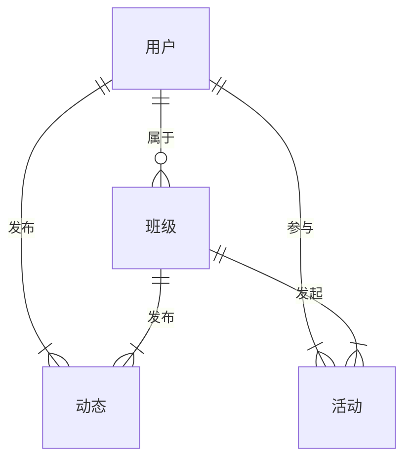
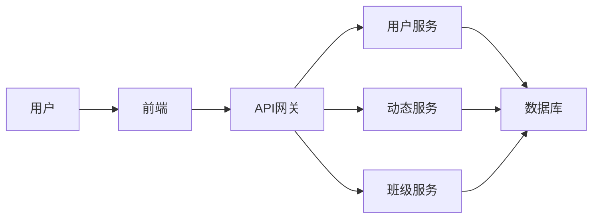

# 同学录校友录系统详细设计与具体代码实现

作者：禅与计算机程序设计艺术

## 1. 背景介绍

### 1.1. 社会需求与技术发展趋势

随着互联网和移动互联网的快速发展，社交网络已经成为人们生活中不可或缺的一部分。而同学录作为连接同窗情谊的重要纽带，也逐渐从传统的纸质形式向数字化、网络化转型。与此同时，大数据、云计算、人工智能等新一代信息技术的兴起，为构建功能更丰富、体验更优越的同学录校友录系统提供了强大的技术支撑。

### 1.2. 系统目标与功能定位

本系统旨在设计和实现一个功能完善、性能优良、安全可靠的同学录校友录平台，满足广大用户以下需求：

* **信息管理:** 提供便捷的个人信息管理功能，方便用户创建和维护个人资料、上传照片、记录学习和工作经历等。
* **班级管理:** 支持创建和管理不同届次、不同班级的同学录，方便用户查找和联系同班同学。
* **校友互动:**  提供丰富的校友互动功能，例如论坛、活动、投票等，增强校友之间的联系和交流。
* **数据分析:**  基于用户数据进行分析，为用户提供个性化的服务和推荐。

### 1.3.  系统设计原则

* **用户至上:**  系统设计以用户需求为导向，注重用户体验，力求简洁易用、功能强大。
* **技术先进:**  采用先进的技术架构和开发模式，保证系统的性能、安全性和可扩展性。
* **数据安全:**  高度重视用户数据的安全和隐私保护，采取多重措施保障数据安全。
* **持续迭代:**  根据用户反馈和技术发展趋势，不断优化和完善系统功能。

## 2. 核心概念与联系

### 2.1.  用户

* **定义:** 使用同学录校友录系统的个人，包括学生、教师、校友等。
* **属性:**  用户ID、用户名、密码、姓名、性别、出生日期、联系方式、班级、入学年份、毕业年份、照片、个人简介、学习经历、工作经历等。
* **操作:**  注册、登录、修改个人信息、上传照片、发布动态、加入班级、参与活动、发表评论、查看消息等。

### 2.2.  班级

* **定义:**  由同一届次、同一专业或同一班级的用户组成的群体。
* **属性:**  班级ID、班级名称、入学年份、毕业年份、班级描述、班级成员列表、班级相册、班级活动等。
* **操作:**  创建班级、加入班级、退出班级、修改班级信息、上传班级照片、发布班级活动、管理班级成员等。

### 2.3.  动态

* **定义:**  用户发布的文字、图片、视频等信息流。
* **属性:**  动态ID、发布时间、发布用户、动态内容、点赞数、评论数等。
* **操作:**  发布动态、删除动态、点赞、评论、转发等。

### 2.4.  活动

* **定义:**  由用户或班级发起的线上或线下活动。
* **属性:**  活动ID、活动名称、活动时间、活动地点、活动内容、参与人数、活动状态等。
* **操作:**  创建活动、报名参加活动、取消报名、查看活动详情等。

### 2.5.  关系图



## 3. 核心算法原理具体操作步骤

### 3.1. 用户注册与登录

* **注册:** 
    1. 用户填写注册信息，包括用户名、密码、邮箱等。
    2. 系统验证用户信息是否合法，例如用户名是否已存在、密码是否符合安全规则等。
    3. 如果验证通过，则创建新的用户账号，并将用户信息存储到数据库中。
    4. 系统向用户邮箱发送激活邮件，用户点击激活链接后才能登录系统。
* **登录:** 
    1. 用户输入用户名和密码。
    2. 系统验证用户名和密码是否匹配。
    3. 如果验证通过，则生成用户登录凭证（例如 Token），并将凭证返回给用户。
    4. 用户在后续请求中携带登录凭证，系统验证凭证有效性后才允许用户访问受保护资源。

### 3.2.  好友关系建立与维护

* **添加好友:**
    1. 用户 A 向用户 B 发起好友请求。
    2. 用户 B 收到好友请求后，可以选择同意或拒绝。
    3. 如果用户 B 同意好友请求，则系统建立用户 A 和用户 B 之间的好友关系。
* **删除好友:**
    1. 用户 A 或用户 B 可以单方面解除好友关系。
    2. 系统删除用户 A 和用户 B 之间的好友关系记录。

### 3.3. 动态发布与传播

* **发布动态:**
    1. 用户编辑动态内容，包括文字、图片、视频等。
    2. 用户选择发布范围，例如公开、好友可见、仅自己可见等。
    3. 系统将动态内容存储到数据库中，并根据发布范围将动态推送给相关用户。
* **查看动态:**
    1. 用户登录系统后，可以查看自己关注的用户或好友发布的动态。
    2. 系统根据用户的关注关系和动态的发布范围，筛选出用户可以查看的动态列表。
* **点赞和评论:**
    1. 用户可以对感兴趣的动态进行点赞和评论。
    2. 系统记录点赞和评论信息，并更新动态的点赞数和评论数。
* **转发动态:**
    1. 用户可以将感兴趣的动态转发到自己的主页。
    2. 系统将转发信息存储到数据库中，并将转发动态推送给相关用户。

### 3.4.  搜索算法

* **用户搜索:**
    1. 用户输入关键词，例如用户名、姓名、班级等。
    2. 系统根据关键词检索用户数据库，返回匹配的用户列表。
* **动态搜索:**
    1. 用户输入关键词，例如动态内容、发布时间、发布用户等。
    2. 系统根据关键词检索动态数据库，返回匹配的动态列表。

## 4. 数学模型和公式详细讲解举例说明

### 4.1.  推荐算法

* **协同过滤算法:**  
    * 原理：根据用户的历史行为数据，例如点赞、评论、转发等，计算用户之间的相似度，然后将相似用户喜欢的动态推荐给目标用户。
    * 公式：
        $ sim(u,v) = \frac{\sum_{i \in I}(r_{ui} - \bar{r_u})(r_{vi} - \bar{r_v})}{\sqrt{\sum_{i \in I}(r_{ui} - \bar{r_u})^2} \sqrt{\sum_{i \in I}(r_{vi} - \bar{r_v})^2}} $
    * 其中：
        * $sim(u,v)$ 表示用户 u 和用户 v 之间的相似度。
        * $r_{ui}$ 表示用户 u 对物品 i 的评分。
        * $\bar{r_u}$ 表示用户 u 的平均评分。
* **内容推荐算法:**  
    * 原理：根据用户的历史行为数据，例如浏览过的动态、关注的用户等，分析用户的兴趣偏好，然后将符合用户兴趣的动态推荐给目标用户。
    * 公式：
        $ p(i|u) = \frac{n(i,u)}{n(u)} $
    * 其中：
        * $p(i|u)$ 表示用户 u 对物品 i 的兴趣概率。
        * $n(i,u)$ 表示用户 u 购买过物品 i 的次数。
        * $n(u)$ 表示用户 u 购买过的所有物品的次数。

### 4.2.  数据分析

* **用户活跃度分析:**
    * 指标：日活跃用户数（DAU）、月活跃用户数（MAU）、用户留存率等。
    * 作用：评估系统的用户规模和用户粘性。
* **内容热度分析:**
    * 指标：点赞数、评论数、转发数等。
    * 作用：评估动态的受欢迎程度。

## 5. 项目实践：代码实例和详细解释说明

### 5.1.  技术架构

本系统采用前后端分离的架构设计，前端使用 Vue.js 框架开发，后端使用 Spring Boot 框架开发，数据库使用 MySQL。



### 5.2.  代码示例

#### 5.2.1.  用户注册接口

```java
@RestController
@RequestMapping("/users")
public class UserController {

    @Autowired
    private UserService userService;

    @PostMapping("/register")
    public Result register(@RequestBody User user) {
        // 校验用户信息
        if (StringUtils.isBlank(user.getUsername()) || StringUtils.isBlank(user.getPassword())) {
            return Result.error("用户名或密码不能为空");
        }
        if (userService.findByUsername(user.getUsername()) != null) {
            return Result.error("用户名已存在");
        }
        // 保存用户信息
        userService.save(user);
        return Result.success("注册成功");
    }
}
```

#### 5.2.2.  发布动态接口

```java
@RestController
@RequestMapping("/posts")
public class PostController {

    @Autowired
    private PostService postService;

    @PostMapping("/create")
    public Result create(@RequestBody Post post) {
        // 校验动态内容
        if (StringUtils.isBlank(post.getContent())) {
            return Result.error("动态内容不能为空");
        }
        // 保存动态信息
        postService.save(post);
        return Result.success("发布成功");
    }
}
```

## 6. 实际应用场景

### 6.1.  学校校友会

* 建立学校官方的同学录校友录平台，方便校友之间联系和交流。
* 发布校友活动信息，组织校友聚会等。
* 为校友提供求职招聘、创业服务等。

### 6.2.  班级同学录

* 创建班级同学录，方便同班同学之间联系和交流。
* 上传班级照片、视频等，记录班级生活点滴。
* 组织班级活动，例如聚餐、旅游等。

### 6.3.  企业内部员工平台

* 建立企业内部员工平台，方便员工之间联系和交流。
* 发布公司新闻、公告等信息。
* 为员工提供培训学习、职业发展等服务。

## 7. 总结：未来发展趋势与挑战

### 7.1.  发展趋势

* **个性化推荐:**  随着人工智能技术的不断发展，同学录校友录系统将更加注重个性化推荐，为用户提供更加精准的服务。
* **社交娱乐化:**  同学录校友录系统将更加注重社交娱乐功能，例如直播、短视频等，增强用户粘性。
* **数据安全与隐私保护:**  随着用户数据安全意识的不断提高，同学录校友录系统将更加注重数据安全和隐私保护。

### 7.2.  挑战

* **用户规模增长带来的技术挑战:**  如何应对用户规模增长带来的海量数据存储、高并发访问等技术挑战。
* **用户隐私保护的挑战:**  如何在保障用户数据安全的同时，为用户提供个性化的服务。
* **盈利模式的探索:**  如何探索可持续的盈利模式，保证系统的长期发展。


## 8. 附录：常见问题与解答

### 8.1.  如何修改个人信息？

登录系统后，点击个人头像进入个人主页，然后点击“编辑资料”按钮即可修改个人信息。

### 8.2.  如何加入班级？

在班级列表页面，找到想要加入的班级，然后点击“申请加入”按钮即可。班级管理员审核通过后，您就可以成为班级成员了。

### 8.3.  如何发布活动？

点击“发布活动”按钮，填写活动信息，然后点击“发布”按钮即可。

### 8.4.  如何联系客服？

如果您在使用过程中遇到任何问题，可以通过以下方式联系客服：

* 客服电话：XXXXXXXXXXX
* 客服邮箱：XXXXXXXXXXX