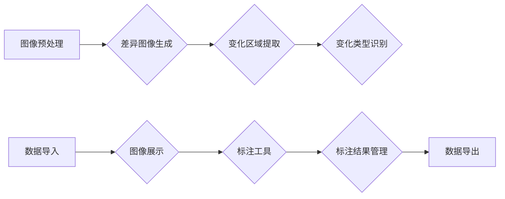

## 1. 背景介绍

### 1.1 图像变化检测的意义

图像变化检测，顾名思义，是指利用计算机视觉技术识别图像序列中发生的变化。这项技术在许多领域都有着广泛的应用，包括：

* **遥感影像分析:** 检测土地利用变化、城市扩张、自然灾害评估等。
* **医学影像诊断:** 识别肿瘤生长、病灶变化、器官损伤等。
* **视频监控:** 检测异常事件、目标跟踪、安全防范等。
* **机器人导航:** 环境感知、路径规划、障碍物识别等。

### 1.2 图像变化检测标注系统的必要性

为了训练高精度的图像变化检测模型，我们需要大量的标注数据。人工标注费时费力，效率低下，而且容易出错。因此，开发一套自动化程度高、操作简便、标注准确的图像变化检测标注系统就显得尤为重要。

## 2. 核心概念与联系

### 2.1 变化检测流程

图像变化检测一般包括以下步骤：

1. **图像预处理:** 对输入图像进行去噪、配准、增强等操作，提高图像质量。
2. **差异图像生成:** 利用图像差分、特征提取、深度学习等方法，生成反映变化区域的差异图像。
3. **变化区域提取:** 对差异图像进行阈值分割、形态学处理、区域生长等操作，提取变化区域。
4. **变化类型识别:** 对提取的变化区域进行分类，识别变化类型，如新增建筑物、道路拓宽、植被减少等。

### 2.2 标注系统功能模块

图像变化检测标注系统应具备以下功能模块：

1. **数据导入:** 支持多种格式的图像数据导入，如单张图像、图像序列、视频等。
2. **图像展示:** 提供友好的图像展示界面，支持缩放、平移、旋转等操作，方便用户查看图像细节。
3. **标注工具:** 提供多种标注工具，如矩形框、多边形、点、线等，方便用户对变化区域进行精细标注。
4. **标注结果管理:** 支持标注结果的保存、加载、修改、删除等操作，方便用户管理标注数据。
5. **数据导出:** 支持将标注结果导出为多种格式，如XML、JSON、CSV等，方便用户进行后续分析和模型训练。

### 2.3 核心概念联系图



## 3. 核心算法原理具体操作步骤

### 3.1 差异图像生成

#### 3.1.1 图像差分法

图像差分法是最简单的差异图像生成方法，它直接计算两幅图像对应像素值的差值，得到差异图像。

**操作步骤:**

1. 将两幅图像对齐。
2. 计算对应像素值的差值。
3. 对差值进行阈值处理，得到二值化差异图像。

**优点:** 简单易行，计算速度快。

**缺点:** 对噪声敏感，容易受到光照变化的影响。

#### 3.1.2 特征提取法

特征提取法先提取两幅图像的特征，然后计算特征之间的差异，得到差异图像。常用的特征包括颜色特征、纹理特征、形状特征等。

**操作步骤:**

1. 提取两幅图像的特征。
2. 计算特征之间的差异。
3. 对差异进行阈值处理，得到二值化差异图像。

**优点:** 对噪声和光照变化不敏感，能够提取更精细的变化信息。

**缺点:** 计算速度较慢，特征选择对结果影响较大。

#### 3.1.3 深度学习法

深度学习法利用深度神经网络学习图像特征，并直接输出差异图像。

**操作步骤:**

1. 构建深度神经网络模型。
2. 利用大量标注数据训练模型。
3. 输入两幅图像，得到差异图像。

**优点:** 能够自动学习图像特征，提取更抽象的变化信息，精度较高。

**缺点:** 需要大量标注数据进行训练，计算量较大。

### 3.2 变化区域提取

#### 3.2.1 阈值分割法

阈值分割法根据差异图像的灰度值，将图像分割成变化区域和非变化区域。

**操作步骤:**

1. 选择合适的阈值。
2. 将灰度值大于阈值的像素点标记为变化区域。

**优点:** 简单易行，计算速度快。

**缺点:** 对阈值选择敏感，容易出现误分割。

#### 3.2.2 形态学处理法

形态学处理法利用形态学算子对差异图像进行处理，消除噪声，连接断裂的区域，提取完整的变化区域。

**操作步骤:**

1. 对差异图像进行腐蚀操作，消除噪声。
2. 对腐蚀后的图像进行膨胀操作，连接断裂的区域。

**优点:** 能够有效消除噪声，提取完整的变化区域。

**缺点:** 对形态学算子选择敏感，容易出现过度分割或欠分割。

#### 3.2.3 区域生长法

区域生长法从差异图像中选取种子点，然后根据相似性准则，将相邻的像素点合并到种子点所在的区域，最终得到完整的变化区域。

**操作步骤:**

1. 选择种子点。
2. 根据相似性准则，将相邻的像素点合并到种子点所在的区域。
3. 重复步骤2，直到所有变化区域都被提取出来。

**优点:** 能够提取形状复杂的變化區域。

**缺点:** 对种子点选择敏感，容易出现误分割。

## 4. 数学模型和公式详细讲解举例说明

### 4.1 图像差分法

图像差分法的数学模型非常简单，可以直接用公式表示：

$$
D(x,y) = |I_1(x,y) - I_2(x,y)|
$$

其中，$D(x,y)$ 表示差异图像在 $(x,y)$ 坐标处的像素值，$I_1(x,y)$ 和 $I_2(x,y)$ 分别表示两幅输入图像在 $(x,y)$ 坐标处的像素值。

**举例说明:**

假设有两幅图像，像素值分别为：

```
I_1 = [[1, 2, 3],
      [4, 5, 6],
      [7, 8, 9]]

I_2 = [[2, 3, 4],
      [5, 6, 7],
      [8, 9, 10]]
```

则差异图像为：

```
D = [[1, 1, 1],
     [1, 1, 1],
     [1, 1, 1]]
```

### 4.2 特征提取法

特征提取法的数学模型取决于所选择的特征。以颜色特征为例，我们可以使用颜色直方图来表示图像的颜色分布，然后计算两个颜色直方图之间的距离，作为差异图像的像素值。常用的颜色直方图距离度量方法包括欧氏距离、曼哈顿距离、切比雪夫距离等。

**举例说明:**

假设有两幅图像，颜色直方图分别为：

```
hist_1 = [0.1, 0.2, 0.3, 0.4]
hist_2 = [0.2, 0.3, 0.4, 0.1]
```

则欧氏距离为：

```
dist = sqrt(sum((hist_1 - hist_2) ** 2)) = 0.424
```

我们可以将欧氏距离作为差异图像的像素值。

### 4.3 深度学习法

深度学习法的数学模型由所选择的深度神经网络模型决定。以卷积神经网络为例，我们可以使用两个卷积神经网络分别提取两幅图像的特征，然后计算特征之间的差异，作为差异图像的像素值。

**举例说明:**

假设我们使用两个卷积神经网络分别提取两幅图像的特征，得到特征向量分别为：

```
feature_1 = [0.1, 0.2, 0.3, 0.4]
feature_2 = [0.2, 0.3, 0.4, 0.1]
```

我们可以计算特征向量之间的欧氏距离，作为差异图像的像素值。

## 5. 项目实践：代码实例和详细解释说明

### 5.1 Python代码实现

```python
import cv2
import numpy as np

# 读取两幅图像
img1 = cv2.imread("image1.jpg")
img2 = cv2.imread("image2.jpg")

# 图像差分法
diff = cv2.absdiff(img1, img2)
gray = cv2.cvtColor(diff, cv2.COLOR_BGR2GRAY)
thresh = cv2.threshold(gray, 10, 255, cv2.THRESH_BINARY)[1]

# 形态学处理
kernel = cv2.getStructuringElement(cv2.MORPH_ELLIPSE, (5, 5))
opening = cv2.morphologyEx(thresh, cv2.MORPH_OPEN, kernel, iterations=2)

# 查找轮廓
cnts = cv2.findContours(opening.copy(), cv2.RETR_EXTERNAL, cv2.CHAIN_APPROX_SIMPLE)
cnts = cnts[0] if len(cnts) == 2 else cnts[1]

# 绘制变化区域
for c in cnts:
    area = cv2.contourArea(c)
    if area > 100:
        x, y, w, h = cv2.boundingRect(c)
        cv2.rectangle(img1, (x, y), (x + w, y + h), (0, 0, 255), 2)

# 显示结果
cv2.imshow("Image1", img1)
cv2.imshow("Image2", img2)
cv2.imshow("Difference", diff)
cv2.imshow("Threshold", thresh)
cv2.imshow("Opening", opening)
cv2.waitKey(0)
```

### 5.2 代码解释

1. **读取两幅图像:** 使用 `cv2.imread()` 函数读取两幅图像。
2. **图像差分法:** 使用 `cv2.absdiff()` 函数计算两幅图像的差值，得到差异图像。
3. **阈值分割:** 使用 `cv2.threshold()` 函数对差异图像进行阈值分割，得到二值化差异图像。
4. **形态学处理:** 使用 `cv2.morphologyEx()` 函数对二值化差异图像进行形态学处理，消除噪声，连接断裂的区域。
5. **查找轮廓:** 使用 `cv2.findContours()` 函数查找二值化差异图像中的轮廓。
6. **绘制变化区域:** 遍历所有轮廓，计算轮廓面积，如果面积大于阈值，则绘制矩形框，标记变化区域。
7. **显示结果:** 使用 `cv2.imshow()` 函数显示结果图像。

## 6. 实际应用场景

### 6.1 遥感影像分析

图像变化检测技术可以用于分析遥感影像，检测土地利用变化、城市扩张、自然灾害评估等。例如，可以通过对比不同时期的遥感影像，识别新增建筑物、道路拓宽、植被减少等变化，从而分析城市发展状况、评估自然灾害的影响。

### 6.2 医学影像诊断

图像变化检测技术可以用于分析医学影像，识别肿瘤生长、病灶变化、器官损伤等。例如，可以通过对比不同时期的医学影像，识别肿瘤的大小、形状、位置变化，从而辅助医生进行诊断和治疗。

### 6.3 视频监控

图像变化检测技术可以用于分析视频监控数据，检测异常事件、目标跟踪、安全防范等。例如，可以通过分析视频监控画面，识别人员入侵、车辆违停、火灾等异常事件，从而及时采取措施，保障安全。

### 6.4 机器人导航

图像变化检测技术可以用于机器人导航，帮助机器人感知环境变化、规划路径、识别障碍物等。例如，可以通过分析机器人摄像头采集的图像，识别环境中的新增障碍物、道路变化等，从而调整路径规划，避免碰撞。

## 7. 工具和资源推荐

### 7.1 OpenCV

OpenCV (Open Source Computer Vision Library) 是一个开源的计算机视觉库，提供了丰富的图像处理和分析功能，包括图像差分、特征提取、形态学处理等，可以用于实现图像变化检测。

### 7.2 scikit-image

scikit-image 是一个基于 Python 的图像处理库，提供了丰富的图像处理和分析功能，包括图像分割、特征提取、形态学处理等，可以用于实现图像变化检测。

### 7.3 TensorFlow

TensorFlow 是一个开源的机器学习平台，提供了丰富的深度学习模型和工具，可以用于训练高精度的图像变化检测模型。

## 8. 总结：未来发展趋势与挑战

### 8.1 未来发展趋势

* **深度学习技术的进一步发展:** 深度学习技术在图像变化检测领域取得了显著成果，未来将会继续发展，提高检测精度和效率。
* **多源数据融合:** 将图像数据与其他数据源（如雷达数据、气象数据等）融合，可以提高变化检测的准确性和可靠性。
* **实时变化检测:** 随着传感器技术和计算能力的提升，实时变化检测将会成为可能，为安全防范、灾害预警等提供更及时的信息。

### 8.2 挑战

* **复杂场景下的变化检测:** 现实场景中存在各种干扰因素，如光照变化、遮挡、阴影等，给变化检测带来了挑战。
* **高精度变化检测:** 某些应用场景需要高精度的变化检测结果，例如医学影像诊断，这对算法和模型提出了更高的要求。
* **数据标注成本:** 深度学习模型需要大量的标注数据进行训练，数据标注成本高昂，限制了技术的应用范围。

## 9. 附录：常见问题与解答

### 9.1 如何选择合适的差异图像生成方法？

选择差异图像生成方法需要考虑以下因素：

* **图像质量:** 如果图像质量较好，噪声较少，可以选择简单的图像差分法。
* **变化类型:** 如果变化类型比较复杂，需要提取更精细的变化信息，可以选择特征提取法或深度学习法。
* **计算效率:** 如果对计算效率要求较高，可以选择图像差分法或特征提取法，避免使用计算量较大的深度学习法。

### 9.2 如何选择合适的阈值？

阈值的选择取决于差异图像的灰度值分布。一般情况下，可以选择差异图像灰度值的均值或中位数作为阈值。也可以使用 Otsu 算法自动选择最佳阈值。

### 9.3 如何评估变化检测结果？

可以使用以下指标评估变化检测结果：

* **准确率:** 正确检测到的变化区域占所有变化区域的比例。
* **召回率:** 正确检测到的变化区域占所有真实变化区域的比例。
* **F1 值:** 综合考虑准确率和召回率的指标。


### 9.4 如何提高变化检测精度？

可以通过以下方法提高变化检测精度：

* **优化图像预处理:** 对输入图像进行去噪、配准、增强等操作，提高图像质量。
* **选择合适的差异图像生成方法:** 根据图像质量、变化类型、计算效率等因素选择合适的差异图像生成方法。
* **优化阈值选择:** 选择合适的阈值，避免出现误分割。
* **使用形态学处理:** 使用形态学算子对差异图像进行处理，消除噪声，连接断裂的区域，提取完整的变化区域。
* **使用深度学习模型:** 利用深度神经网络学习图像特征，并直接输出差异图像，提高检测精度。

### 9.5 如何降低数据标注成本？

可以通过以下方法降低数据标注成本：

* **使用半监督学习:** 利用少量标注数据和大量未标注数据进行模型训练，减少标注数据的需求量。
* **使用弱监督学习:** 利用粗粒度的标注数据进行模型训练，例如图像级别的标注，而不是像素级别的标注。
* **使用主动学习:** 主动选择最有价值的样本进行标注，提高标注效率。