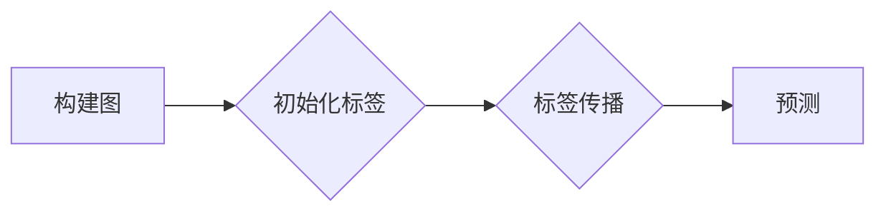

##  图半监督学习:利用数据结构提升性能的新思路

作者：禅与计算机程序设计艺术

## 1. 背景介绍

### 1.1 机器学习的新挑战：数据标注困境

近年来，机器学习，尤其是深度学习，在众多领域取得了突破性进展。然而，这些成功的背后往往依赖于海量的、高质量的标注数据。获取这些标注数据通常需要耗费巨大的人力、物力和时间成本，这成为了制约机器学习进一步发展和应用的瓶颈。

### 1.2 半监督学习：挖掘未标注数据的潜力

为了应对数据标注困境，半监督学习应运而生。它旨在利用少量标注数据和大量未标注数据来训练模型，从而降低对标注数据的依赖，提升模型的性能。

### 1.3 图数据：现实世界关系的抽象表示

现实世界中，很多数据都具有图结构，例如社交网络、引用网络、交通网络等等。图数据能够有效地表达数据之间的关系信息，而这些关系信息往往蕴含着重要的模式和规律。

### 1.4 图半监督学习：融合图结构与半监督学习

图半监督学习将图数据和半监督学习结合起来，利用图结构信息来辅助半监督学习过程，从而更有效地利用未标注数据，提升模型性能。

## 2. 核心概念与联系

### 2.1 图的基本概念

* **节点（Node）**:  图的基本单元，代表实体或对象。
* **边（Edge）**:  连接两个节点，代表它们之间的关系。
* **邻接矩阵（Adjacency Matrix）**:  用于表示图结构的矩阵，其中元素  $A_{ij}$  表示节点  $i$  和节点  $j$  之间是否存在边。

### 2.2 半监督学习的基本概念

* **标注数据**:  具有标签的数据，用于训练模型。
* **未标注数据**:  没有标签的数据，可以用于辅助模型训练。
* **标签传播**:  利用已知标签的数据，将标签信息传播到未标注数据，从而实现对未标注数据的预测。

### 2.3 图半监督学习的核心思想

图半监督学习的核心思想是利用图结构信息来指导标签传播过程，使得标签信息能够更准确地传播到未标注数据。

## 3. 核心算法原理具体操作步骤

图半监督学习算法种类繁多，以下介绍一种经典的基于图的标签传播算法——**标签传播算法（Label Propagation Algorithm，LPA）**:

### 3.1 算法步骤

1. **构建图:**  将数据表示为图的形式，其中节点代表数据样本，边代表样本之间的相似度。
2. **初始化标签:**  将已知标签的样本的标签设置为其真实标签，将未标注样本的标签初始化为未知。
3. **标签传播:**  迭代地进行标签传播，直到所有样本的标签都收敛。在每次迭代中，每个节点将其标签更新为其邻居节点标签的加权平均值，其中权重由节点之间的相似度决定。
4. **预测:**  最终，所有样本的标签都将收敛到一个稳定的状态，可以将该状态作为样本的预测标签。

### 3.2 算法流程图



## 4. 数学模型和公式详细讲解举例说明

### 4.1 图的表示

假设我们有  $n$  个样本，可以用一个  $n \times n$  的邻接矩阵  $A$  来表示它们之间的关系，其中  $A_{ij}$  表示样本  $i$  和样本  $j$  之间的相似度。

### 4.2 标签传播公式

在每次迭代中，节点  $i$  的标签  $y_i$  更新为：

$$
y_i^{(t+1)} = \sum_{j=1}^{n} W_{ij} y_j^{(t)}
$$

其中：

* $y_i^{(t)}$  表示节点  $i$  在第  $t$  次迭代时的标签。
* $W_{ij}$  表示节点  $i$  和节点  $j$  之间的权重，通常由相似度度量方法计算得到，例如高斯核函数：

$$
W_{ij} = \exp\left(-\frac{||x_i - x_j||^2}{2\sigma^2}\right)
$$

其中  $x_i$  和  $x_j$  分别表示节点  $i$  和节点  $j$  的特征向量，$\sigma$  是高斯核函数的带宽参数。

### 4.3 举例说明

假设我们有 5 个样本，其邻接矩阵和初始标签如下：

$$
A = 
\begin{bmatrix}
0 & 1 & 1 & 0 & 0 \\
1 & 0 & 1 & 0 & 0 \\
1 & 1 & 0 & 1 & 0 \\
0 & 0 & 1 & 0 & 1 \\
0 & 0 & 0 & 1 & 0
\end{bmatrix}
\quad
y^{(0)} = 
\begin{bmatrix}
1 \\
0 \\
? \\
? \\
1
\end{bmatrix}
$$

其中，"?" 表示未标注样本。

假设我们使用高斯核函数计算权重，带宽参数  $\sigma = 1$，则第一次迭代后，各样本的标签为：

$$
y^{(1)} = 
\begin{bmatrix}
1 \\
0.5 \\
0.5 \\
0.5 \\
1
\end{bmatrix}
$$

可以看出，标签信息已经开始从已标注样本传播到未标注样本。经过多次迭代后，所有样本的标签都将收敛到一个稳定的状态。


## 5. 项目实践：代码实例和详细解释说明

### 5.1 Python 代码实现

```python
import numpy as np

def label_propagation(A, y, max_iter=100, tol=1e-4):
    """
    标签传播算法

    参数：
        A: 邻接矩阵
        y: 初始标签
        max_iter: 最大迭代次数
        tol: 收敛阈值

    返回值：
        y: 预测标签
    """

    n = A.shape[0]  # 样本数量
    y = y.copy()  # 复制初始标签
    y[np.isnan(y)] = 0  # 将未标注样本的标签初始化为 0

    for _ in range(max_iter):
        y_prev = y.copy()  # 保存上一次迭代的标签

        # 标签传播
        for i in range(n):
            neighbors = np.where(A[i] > 0)[0]  # 找到节点 i 的邻居节点
            y[i] = np.sum(A[i, neighbors] * y[neighbors]) / np.sum(A[i, neighbors])

        # 判断是否收敛
        if np.sum(np.abs(y - y_prev)) < tol:
            break

    return y
```

### 5.2 代码解释

* `label_propagation()` 函数实现了标签传播算法。
* `A` 是邻接矩阵，`y` 是初始标签，`max_iter` 是最大迭代次数，`tol` 是收敛阈值。
* 函数首先将未标注样本的标签初始化为 0。
* 然后，进行迭代，直到达到最大迭代次数或标签收敛。
* 在每次迭代中，函数遍历所有样本，并更新其标签为其邻居节点标签的加权平均值。
* 最后，函数返回预测标签。

## 6. 实际应用场景

图半监督学习在很多领域都有广泛的应用，例如：

* **社交网络分析**:  利用用户之间的关系信息来预测用户的兴趣、职业等属性。
* **推荐系统**:  利用用户和商品之间的交互关系信息来推荐用户可能感兴趣的商品。
* **图像分类**:  利用图像之间的相似度关系信息来辅助图像分类。
* **文本分类**:  利用文档之间的引用关系信息来辅助文本分类。

## 7. 工具和资源推荐

* **NetworkX**:  一个用于创建、操作和研究复杂网络的 Python 包。
* **Scikit-learn**:  一个包含各种机器学习算法的 Python 包，其中也包含一些图半监督学习算法的实现。
* **Deep Graph Library (DGL)**:  一个用于图神经网络的 Python 包，可以用于实现更复杂的图半监督学习模型。

## 8. 总结：未来发展趋势与挑战

图半监督学习是一个充满活力的研究领域，未来发展趋势包括：

* **更深层次的图神经网络**:  将更深层次的图神经网络应用于图半监督学习，以学习更复杂的图结构信息。
* **异构图半监督学习**:  研究如何将图半监督学习应用于异构图，即节点和边具有不同类型的图。
* **动态图半监督学习**:  研究如何将图半监督学习应用于动态图，即图结构随时间变化的图。

## 9. 附录：常见问题与解答

### 9.1 如何选择合适的图半监督学习算法？

选择合适的图半监督学习算法取决于具体的应用场景和数据特点。例如，如果数据量较小，可以选择基于标签传播的算法；如果数据量较大，可以选择基于图神经网络的算法。

### 9.2 如何评估图半监督学习模型的性能？

评估图半监督学习模型的性能通常使用与监督学习相同的指标，例如准确率、召回率、F1 值等。

### 9.3 如何处理图数据中的噪声？

图数据中 often 存在噪声，例如错误的边或缺失的边。处理噪声的方法包括：
* **数据清洗**:  对数据进行预处理，去除或修正错误的数据。
* **鲁棒性算法**:  使用对噪声鲁棒的算法，例如基于正则化的算法。