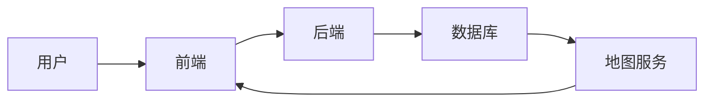

# 土地整理项目库建设系统详细设计与具体代码实现

作者：禅与计算机程序设计艺术

## 1. 背景介绍

### 1.1 土地资源管理现状与挑战

土地是人类赖以生存和发展的基础性资源，有效的土地资源管理对促进经济社会可持续发展具有重要意义。近年来，随着我国城镇化进程的加速推进和经济社会的快速发展，土地资源供需矛盾日益突出，土地闲置浪费、利用粗放等问题依然存在。为了加强土地资源的集约节约利用，提高土地利用效率，迫切需要建立健全土地整理项目库，为科学、规范、高效地开展土地整理工作提供支撑。

### 1.2 土地整理项目库建设的意义

土地整理项目库是土地整理工作的基础性平台，其建设目标是实现土地整理项目信息的集中管理、动态更新和共享利用，为政府部门、企事业单位和社会公众提供全方位、多层次的土地整理信息服务。

建设土地整理项目库具有以下重要意义：

* **提高土地整理工作效率：** 通过建立统一的项目库，可以避免信息孤岛和重复建设，提高项目申报、审批、实施和监管效率。
* **促进土地资源节约集约利用：** 通过对土地整理项目的科学规划和合理布局，可以有效提高土地利用率，促进土地资源的节约集约利用。
* **提升土地整理决策科学化水平：** 通过对项目库中数据的分析和挖掘，可以为政府部门制定土地整理政策提供科学依据。
* **保障土地整理工作顺利开展：** 项目库的建设可以为土地整理项目的资金筹措、技术支持和人才培养提供保障。

## 2. 核心概念与联系

### 2.1 土地整理项目

土地整理项目是指对一定区域内的土地进行综合整治，以改善土地利用条件、提高土地生产力、优化土地利用结构为目标的工程建设活动。

### 2.2 项目库

项目库是指以数据库技术为基础，对特定领域内的项目信息进行集中存储、管理和应用的系统。

### 2.3 土地整理项目库

土地整理项目库是专门用于存储、管理和应用土地整理项目信息的数据库系统。

### 2.4 核心概念之间的联系

土地整理项目是土地整理项目库的核心对象，项目库是土地整理项目信息的载体，土地整理项目库是土地整理工作的信息化平台。

## 3. 核心算法原理具体操作步骤

### 3.1 数据采集与录入

#### 3.1.1 数据来源

* 土地利用总体规划
* 土地年度计划
* 土地整理专项规划
* 项目建议书
* 可行性研究报告
* 初步设计文件
* 施工图设计文件
* 竣工验收资料

#### 3.1.2 数据录入方式

* 手动录入
* Excel表格导入
* 数据接口对接

### 3.2 数据处理与分析

#### 3.2.1 数据清洗

* 去除重复数据
* 纠正错误数据
* 补充缺失数据

#### 3.2.2 数据转换

* 坐标转换
* 数据格式转换
* 数据标准化

#### 3.2.3 数据分析

* 项目统计分析
* 空间分析
* 时间序列分析

### 3.3 数据查询与展示

#### 3.3.1 查询方式

* 条件查询
* 空间查询
* 图形化查询

#### 3.3.2 展示方式

* 列表展示
* 地图展示
* 报表展示
* 图表展示

## 4. 数学模型和公式详细讲解举例说明

### 4.1 土地整理潜力评价模型

$$
P = \sum_{i=1}^{n} W_i * S_i
$$

其中：

* $P$ 为土地整理潜力
* $W_i$ 为第 $i$ 个评价指标的权重
* $S_i$ 为第 $i$ 个评价指标的得分
* $n$ 为评价指标的个数

**举例说明：**

假设某地区的土地整理潜力评价指标体系包括以下指标：

| 评价指标 | 权重 |
|---|---|
| 土地利用率 | 0.4 |
| 土地生产力 | 0.3 |
| 生态环境效益 | 0.2 |
| 社会经济效益 | 0.1 |

某一区域的各项指标得分如下：

| 评价指标 | 得分 |
|---|---|
| 土地利用率 | 80 |
| 土地生产力 | 70 |
| 生态环境效益 | 90 |
| 社会经济效益 | 60 |

则该区域的土地整理潜力为：

$$
P = 0.4 * 80 + 0.3 * 70 + 0.2 * 90 + 0.1 * 60 = 77
$$

### 4.2 土地整理项目效益评价模型

$$
E = B - C
$$

其中：

* $E$ 为土地整理项目效益
* $B$ 为土地整理项目收益
* $C$ 为土地整理项目成本

**举例说明：**

某土地整理项目的总投资为 1000 万元，项目实施后新增耕地 1000 亩，新增粮食产量 500 吨，粮食价格为 2 元/公斤。则该项目的效益为：

$$
E = 500 * 1000 * 2 - 1000 = 0 万元
$$

## 5. 项目实践：代码实例和详细解释说明

### 5.1 系统架构



### 5.2 代码实例

#### 5.2.1 项目信息录入接口

```python
from flask import Flask, request, jsonify

app = Flask(__name__)

@app.route('/projects', methods=['POST'])
def create_project():
  """
  创建项目信息
  """
  # 获取请求参数
  project_name = request.json.get('project_name')
  project_location = request.json.get('project_location')
  # ...

  # 数据校验
  if not project_name or not project_location:
    return jsonify({'error': '项目名称和项目位置不能为空'}), 400

  # 保存项目信息到数据库
  # ...

  return jsonify({'message': '项目信息创建成功'}), 201

if __name__ == '__main__':
  app.run(debug=True)
```

#### 5.2.2 项目信息查询接口

```python
from flask import Flask, request, jsonify

app = Flask(__name__)

@app.route('/projects', methods=['GET'])
def get_projects():
  """
  查询项目信息
  """
  # 获取查询参数
  project_name = request.args.get('project_name')
  project_location = request.args.get('project_location')
  # ...

  # 查询数据库
  # ...

  return jsonify({'projects': projects}), 200

if __name__ == '__main__':
  app.run(debug=True)
```

### 5.3 代码解释

* 使用 Flask 框架构建 RESTful API 接口
* 使用 JSON 格式进行数据传输
* 使用 SQLAlchemy 库操作数据库
* 使用 GeoJSON 格式存储地理空间数据

## 6. 实际应用场景

* 政府部门：用于土地整理项目的规划、审批、监管和统计分析。
* 企事业单位：用于土地整理项目的申报、实施和效益评估。
* 科研机构：用于土地整理领域的研究和分析。

## 7. 总结：未来发展趋势与挑战

### 7.1 未来发展趋势

* 智能化：利用人工智能技术实现项目信息的自动采集、处理和分析。
* 可视化：利用三维建模、虚拟现实等技术实现项目信息的直观展示。
* 移动化：开发移动端应用，方便用户随时随地查询和管理项目信息。

### 7.2 面临的挑战

* 数据共享与安全：如何保障项目信息的共享和安全。
* 技术标准规范：制定统一的技术标准规范，促进项目信息的互联互通。
* 应用推广：如何推广项目库的应用，提高其使用效益。

## 8. 附录：常见问题与解答

### 8.1 如何保证数据安全？

* 采用数据库加密技术，对敏感数据进行加密存储。
* 设置用户权限，控制不同用户对数据的访问权限。
* 定期进行数据备份，防止数据丢失。

### 8.2 如何解决数据孤岛问题？

* 制定统一的数据标准规范，促进不同系统之间的数据交换。
* 建立数据共享平台，实现项目信息的集中管理和共享利用。
* 采用数据接口对接方式，实现不同系统之间的数据实时同步。